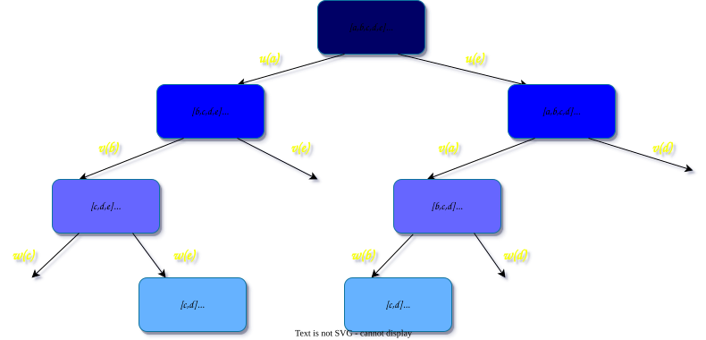
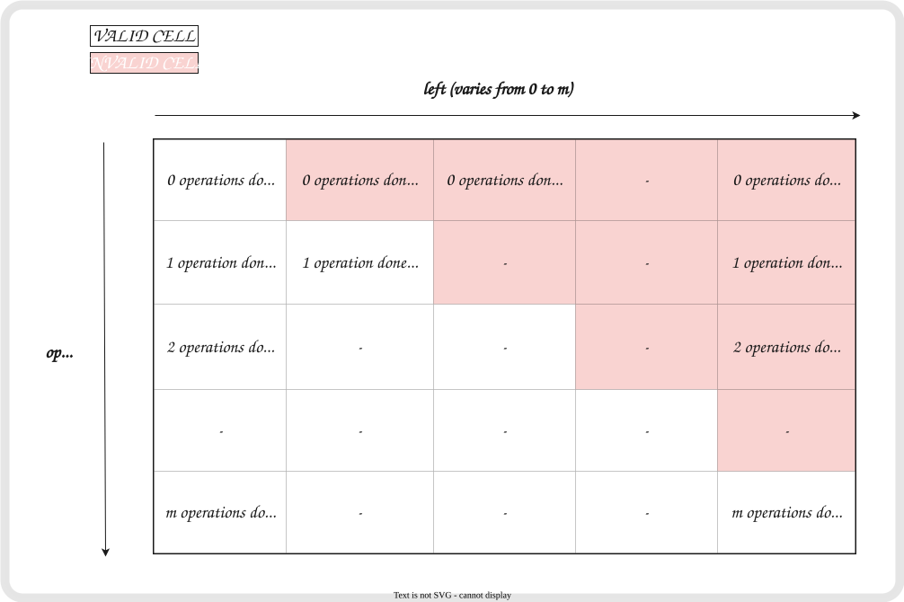

[TOC]

## Solution

---

### Overview

As per the problem description, we have to do `m` operations (where `m` is the size of the `multipliers` array) and find the maximum score. At every operation, we have to select $i^{th}$ integer from `multipliers` and multiply it with an integer `x` from `nums`. The integer `x` can be chosen from either the start or the end of the `nums`. And then we have to remove that integer from `nums`.

At first glance, a greedy approach looks promising. In step `i`, out of $\text{nums}[start]$ and $\text{nums}[end]$, we can pick the integer `x` that maximizes $x * \text{multipliers}[i]$.

This greedy approach works well for one of the given examples.

<pre>
<b>nums = [1,2,3], multipliers = [3,2,1]</b>

<b>Taking Decision</b>
‣ From multipliers, we have <b>3</b>, nums is [1, 2, 3], from <b>3</b> * 1 and <b>3</b> * 3, pick 3, add 3 * 3 = <u>9</u>.
‣ From multipliers, we have <b>2</b>, nums is [1, 2], from <b>2</b> * 1 and <b>2</b> * 2, pick 2, add 2 * 2 = <u>4</u>.
‣ From multipliers, we have <b>1</b>, nums is [1], add 1 * 1 = <u>1</u>.

Total Score is <u>9+4+1</u>=<b>14</b>, which is correct
</pre>

However, it fails for the second example.

<pre>
<b>nums = [-5,-3,-3,-2,7,1], multipliers = [-10,-5,3,4,6]</b>

<b>Taking Decision</b>
‣ From multipliers, we have <b>10</b>, nums is [-5,-3,-3,-2,7,1], from <b>(-10)</b> * (-5) and <b>(-10)</b> * 1, pick -5, add (-10) * (-5) = <u>50</u>.
‣ From multipliers, we have <b>-5</b>, nums is [-3,-3,-2,7,1], from <b>(-5)</b> * (-3) and <b>(-5)</b> * 1, pick -3, add (-5) * (-3) = <u>15</u>.
‣ From multipliers, we have <b>3</b>, nums is [-3,-2,7,1], from <b>3</b> * (-3) and <b>3</b> * 1, pick 1, add 3 * 1 = <u>3</u>.
‣ From multipliers, we have <b>4</b>, nums is [-3,-2,7], from <b>4</b> * (-3) and <b>4</b> * 7, pick 7, add 4 * 7 = <u>28</u>.
‣ From multipliers, we have <b>6</b>, nums is [-3,-2], from <b>6</b> * (-3) and <b>6</b> * (-2), pick -2, add 6 * (-2) = <u>-12</u>.

Total Score is <u>50+15+3+28+(-12)</u>=<b>84</b> which isn't optimal.
102 is <u>Optimal Solution</u> as given in Problem Example.
</pre>

The logical intuition of **why it is not optimal** can be deduced from the following two cases:

1. Greedy is short-sighted. For the global optimum, we pick the local optimum. But picking this Local Optimum *may*  restrict greater positive product afterward.
    ```
    nums = [-10,1,1000,1,1,100], multipliers = [1,1,1]
    ```
    If we pick 100 over -10, we would never ever be able to collect 1000. There are only three elements in `multipliers`, and we can collect 1000 by taking the left integers only. But selecting 100 at the first point restricts it.

2. Moreover, what if both ends of `nums` are identical? We don't know which one to favor. One may yield another score, another may yield a very different score.
    ```
    nums = [2, 1000, -1, 2], multipliers = [1, 1]
    ```
- if we select Left 2 first, then at the next step, there would be a contest between Left 1000 and Right 2. As per the approach we now would select left 1000, obtaining <u>1002</u> as the answer.
- if we select Right 2 first, then at the next step, there would be a contest between Left 2 and Right -1. As per the approach we now would select left 2, obtaining <u>4</u> as the answer.

Thus, these examples suggest that we have to **look for all two possible combinations** at each step:

1. Select $\text{nums}[start]$, now problem reduces to another subproblem with `nums` being `nums[start+1]` to $\text{nums}[end]$ and `multipliers` being `multipliers[i+1]` to `multipliers[m-1]`. Moreover, the number of operations is lessened by one.

2. Select $\text{nums}[end]$, now problem reduces to another subproblem with `nums` being $\text{nums}[start]$ to `nums[end-1]` and `multipliers` being `multipliers[i+1]` to `multipliers[m-1]`. Moreover, the number of operations is lessened by one.

We then have to solve these subproblems successively and at each step return the maximum of two possible answers. When all operations are done, we can return 0.

---

### Approach 1: Brute Force

#### Intuition

As explained above, at each step we have to reduce the problem to two subproblems, with one less operation. And then we have to repeatedly solve these subproblems. This hints at recursion. Now, for solving each subproblem, we essentially need three things

- `nums`: the remaining integers to be considered

- `multipliers`: the remaining multipliers to be considered

- `op`: number of operations done.

**Minute Improvement:** We need not pass `multipliers`. We are only interested in its `i`$^{th}$ element. And this `i` is closely related to `op`. If we have done `0` operations, this implies we have to do the next operation from $\text{multipliers}[0]$. If we have done `1` operation, this implies we have to do the next operation from $\text{multipliers}[1]$. And so on.

> **Note:** There are two possible definitions of `op`. However, logically they are equivalent.
>
> - One is to define `op` as the number of operations done. If we have done `0` operation, this implies we have to do the next operation from $\text{multipliers}[0]$. If we have done `1` operation, this implies we have to do the next operation from $\text{multipliers}[1]$. And so on. In this case, the terminating condition is $op = m$, when all operations are done.
>
> - Another is to define `op` as the number of operations remaining, then the indexing of `multipliers` and base condition will change. If we have `m-0` operations remaining, this implies we have to do next operation from $\text{multipliers}[0]$. If we have `m-1` operation remaining, this implies we have to do next operation from $\text{multipliers}[1]$. And so on. In this case, terminating condition is $op = 0$, when no operation is remaining.
>
> We have defined `op` as the number of operations done.

#### Algorithm

1. Define a `helper` function that takes two arguments `nums`, and `op`.

2. If we are done with all operations, `op`, return 0.

3. Otherwise,

3.1  One time multiply $\text{multipliers}[op]$ with $\text{nums}[0]$. Now, solve the subproblem with `nums[1:]` and `op+1`. Add the result of the subproblem to the product.

3.2 Another time multiply $\text{multipliers}[op]$ with `nums[-1]`. Now, solve the subproblem with `nums[:-1]` and `op+1`. Add the result of the subproblem to the product.

4. Return the maximum of two results.

5. Call the `helper` function with `nums` and `op=0` as parameters indicating we have done zero operations so far!

#### Implementation

```python
class Solution:
    def maximumScore(self, nums, multipliers):

        # Number of Operations
        m = len(multipliers)

        def helper(nums, op):
            if op == m:
                return 0

            # Returning Maximum of Two
            # In first parameter we have chosen nums[start], thus subproblem will be nums excluding nums[start]
            # In second parameter we have chosen nums[end], thus subproblem will be nums excluding nums[end]
            return max(nums[0] * multipliers[op] + helper(nums[1:], op+1),
                       nums[-1] * multipliers[op] + helper(nums[:-1], op+1))

        return helper(nums, 0)
```

**Note:** It is likely to give TLE since the time complexity is too high.

Note that in `python` string slicing creates another copy. This consumes a lot of memory. We can reduce it too likewise we removed the passing copy of the `multipliers` array.
> In the` multipliers` array, we were interested in the left pointer, we obtained it very easily with the `op` parameter.
>
> In the `nums` array, we were interested in both `left` and  `right` pointers. Thus, instead of passing the entire `nums`, we can pass these pointers.

```python
class Solution:
    def maximumScore(self, nums: List[int], multipliers: List[int]) -> int:

        # Number of Operations
        m = len(multipliers)

        def helper(left, right, op):
            if op == m:
                return 0

            return max(nums[left] * multipliers[op] + helper(left+1, right, op+1),
                       nums[right] * multipliers[op] + helper(left, right-1, op+1))

        return helper(0, len(nums)-1, 0)
```

**Note:** It is likely to give TLE because the algorithm is not efficient.

#### Complexity Analysis

Let $M$ be the size of `multipliers`, the same as the number of operations.

* Time complexity: $O(2^M)$.

    This can be calculated using the fact that at every step we are reducing the problem of size $M$ to two subproblems of size $M-1$, for doing so we are doing constant time operations (increasing/decreasing `left`, `right`, and `op`, and multiplying with $\text{multipliers}[op]$ are constant time operations). Thus, the recurrence relation is $T(M)=2T(M-1)+O(1)$, which can be solved using Master Theorem and the result is $O(2^M)$.

    Another way of analyzing is that at each step, we branch two sub-tree. The height of the recursion tree will be $M$. Thus, there will be $O(2^M)$ nodes in the recursion tree.

* Space complexity: $O(M)$, the recursion stack will take $O(M)$ space.

---

### Approach 2: Top-Down Dynamic Programming

#### Intuition

We can notice that we may need to solve for a particular (`left`, `right`, `op`) state multiple times.
**Example:** `nums = [a, b, c, d, e]` and $multipliers = [u, v, w, x, y]$



The tree indicates that from two different paths, we have reached a common state/sub-problem `x` with `c vs d`. Thus, we have repeated states. Hence, we can solve this once and can use its result.

Thus, **Dynamic Programming**. Select the best from all possible states and instead of computing again and again, save what you have already computed. Memoizing the pre-visited states while trying all the possible scenarios will reduce the complexity.

To determine a **state**, we essentially need 3 things

- `left`: specify we have used `left` integers from the left side of `nums` so far. Next, we may use $\text{nums}[left]$

- `right`: specify we have used `right` integers from the right side of `nums` so far. Next, we may use $\text{nums}[right]$

- `op`: number of operations done.

Hence, there are 3 state variables, `left`, `right`, and `op`.  Thus, it's a 3D Dynamic Programming problem. And to memoize it, we may need a 3D array.
> If there are `n` state variables, then we need an array of <u>at most</u> `n` dimensions.

However, with mathematics, we can reduce these 3 state variables to 2. Can you think of how to do that?
*(Note that `len(nums)` will be constant in this approach, since we are not modifying `nums` and passing indices instead)*

The `right` is related to `op`, `left` and `len(nums)`. Which of the following can be substituted for `right`?

1. `len(nums)` -1 - `left`
2. `len(nums)` -1 - (`op` - `left`)
3. `len(nums)` -1 - `op`
4. `op` - (`left` - `len(nums)`)

<details>
<summary>Click to reveal answer with explanation</summary>

<p>

There are <code>len(nums)</code> elements in <code>nums</code>. If we have accomplished <code>op</code> operations, and the left-pointer is <i>ahead</i> by <code>left</code>, means there are <code>op - left</code> operations from the right side. Thus, <code>right</code> should be <i>behind</i> <code>n-1</code> by <code>op-left</code>. Thus, this formula is that <code>right = len(nums)-1-(op-left)</code>.

</p>
</details>

</br>

Therefore, we can define a state with only two state variables `op` and `left`. We will use `dp` to denote the state in the following.

> $\text{dp}[op][left]$ stores the **maximum possible score** after we have done `op` total operations and used `left` numbers from the left/start side.

From this state, we have two options

- **Select Left:** Number of operations will advance by one. And, so does the left pointer. Thus, we will multiply $\text{mulitpliers}[op]$ and $\text{nums}[left]$ (since we have selected from left), and add this product to (optimal) result of state `dp[op+1][left+1]`.

- **Select Right:** Then also the number of operations will advance by one. Then, we will multiply $\text{mulitpliers}[op]$ with `nums[n-1-(op-left)]` (since we have selected from right), and add this product to (optimal) result of state `dp[op+1][left]` (Now, `left` will not increment since number has not been chosen from left).

Select **maximum** of results obtained by selecting from Left, and Right.
If $op = m$, means we have performed `m` operations, add 0. The base Condition of Recursion.

Let $\text{mul}$ represent `multipliers`, and $\text{nums}$ represent `nums`. Then we can have the following equation!

$$
\text{dp}[op][left] =
\begin{cases}
\text{max}\bigg((\text{mul}[op]\cdot \text{nums}[left]) + \text{dp}[op+1][left+1],\\\quad\quad\quad(\text{mul}[op]\cdot \text{nums}[n-1-(op-left)]) + \text{dp}[op+1][left]\bigg),  & \text{if $op \neq m$ } \\[2ex]
0, & \text{if $op=m$}
\end{cases}
$$

#### Algorithm

1. Initialize variable `m` as the size of `multipliers` and `n` as the size of `nums`. Now, `m` will help us in determining the number of operations, and with help of `n`, we can calculate the `right` pointer.

2. Create a dictionary `memo` to memoize states.

3. Define a `dp` function that takes two arguments `op`, and `left`.

4. If we are done with all operations,  i.e. $op = m$, return 0.

5. If we have already computed and memoized the state, return the value from the dictionary.

6. Otherwise,

6.1.  One time multiply $\text{multipliers}[op]$ with $\text{nums}[left]$. Now, solve the subproblem with `left+1` and `op+1` as parameters. Add the result of the subproblem to the product.

6.2.  Another time multiply $\text{multipliers}[op]$ with `nums[(n-1)-(op-left)]`. The index points to the right pointer. Now, solve the subproblem with `left` and `op+1` as parameters. Add the result of the subproblem to the product.

7. Memoize the maximum of 6.1 and 6.2 as the result of state `(op, left)`.

8. Return the memoized result of state `op, left`.

9. Call the `dp` function with $op = 0$ and $left = 0$.

#### Implementation

```python
class Solution:
    def maximumScore(self, nums: List[int], multipliers: List[int]) -> int:

        # Number of Operations
        m = len(multipliers)

        # For Right Pointer
        n = len(nums)

        memo = {}

        def dp(op, left):
            if op == m:
                return 0

            # If already computed, return
            if (op, left) in memo:
                return memo[(op, left)]

            l = nums[left] * multipliers[op] + dp(op+1, left+1)
            r = nums[(n-1)-(op-left)] * multipliers[op] + dp(op+1, left)

            memo[(op, left)] = max(l, r)

            return memo[(op, left)]

        # Zero operation done in the beginning
        return dp(0, 0)

```

**Note:** It _may_ give Time Limit Exceeded/Memory Limit Exceeded because of

- large constant factor associated with the asymptotic complexity of the algorithm
- large auxiliary stack space required for recursion
- slow internal functions

Moreover, don't initialize the `memo` array with `-1` because `-1` could be an answer, and we will never be able to distinguish between the case when the state is not computed, and the case when the state is computed and the answer is `-1`.

#### Complexity Analysis

Let $M$ be the size of `multipliers`, the same as the number of operations.

* Time complexity: $O(M^2)$.

    `op` can vary from `0` to `M-1`. Now, in two recursive calls that we are making, one time we are incrementing `left`, along with `op`. Other time, we are not incrementing `left`, but incrementing `op`. So, `left` is at most `op`. Thus, `left` also varies from `0` to `M-1`. So, there are $O(M^2)$ such pairs for computing.

* Space complexity: $O(M^2)$, the `memo` will store at most $M^2$ such pairs!

---

### Approach 3: Bottom-Up Dynamic Programming

#### Intuition

Using the same equation, we can solve this problem using bottom-up dynamic programming. We will start from the base condition, and then we will compute the optimal result for each state.

We need to convert function `dp(operation, left)` to $\text{dp}[op][left]$. Hence, we need to use a 2D array. But, we only need those cells where $op \ge left$. Hence, we only need the bottom-right triangle, where `left` will always be less than or equal to `op`. As you can see in the diagram, red cells are invalid.



Since we know the base condition, we can start from $op = m$ and fill it up. Moreover, since the number of operations at any stage is greater than or equal to the integer chosen from left ($op \ge left$), the `left` will drop from `op` to `0`.

#### Algorithm

1. Create a 2D array `dp` of size `m+1` by `m+1`. Reason being `op` can vary from `0` to `m`, and so does `left`.

2. Initialized all elements to `0`. By this initialization, we have filled the base condition, that when we have done `m` operations, and this operation will add nothing to the result.

3. Iterate over `op` from `m-1` to `0`.

4. For each `op`, iterate over `left` from `op` to `0`.

5. Using the equation, compute the optimal result for state $\text{dp}[op][left]$.

6. We have formulated the problem in such a way that $\text{dp}[0][0]$ will force us to do `m` operations in a row. In other words, $\text{dp}[0][0]$ stores the optimal answer. Hence, we can return $\text{dp}[0][0]$ at the end.

#### Implementation

```python
class Solution:
    def maximumScore(self, nums: List[int], multipliers: List[int]) -> int:

        # Number of Operations
        m = len(multipliers)

        # For Right Pointer
        n = len(nums)

        dp = [[0] * (m + 1) for _ in range(m + 1)]

        for op in range(m - 1, -1, -1):
            for left in range(op, -1, -1):

                dp[op][left] = max(multipliers[op] * nums[left] + dp[op + 1][left + 1],
                                   multipliers[op] * nums[n - 1 - (op - left)] + dp[op + 1][left])

        return dp[0][0]

```

#### Complexity Analysis

Let $M$ be the size of `multipliers`, the same as the number of operations.

* Time complexity: $O(M^2)$

    `op` varies from `M-1` to `0`, and `left` varies from `op` to `0`. This is equivalent to iterating half matrix of order $M\times M$. So, we are computing $O(\frac{M^2}{2})$ states.

* Space complexity: $O(M^2)$, as evident from the `dp` array.

---

### Approach 4: Space-Optimized Dynamic Programming

#### Intuition

On carefully eyeing mathematical formula and iterative (bottom-up) code, we can say that for computing present row $\text{dp}[op]$, we need the next row $\text{dp}[op+1]$ **only**. Therefore, for memoizing, a 1D array is sufficient.

Moreover, $\text{dp}[op][left]$ depends on $\text{dp}[op+1][left]$ and $\text{dp}[op+1][left+1]$ only.
Let $\text{dp}[op]$ be $\text{currentRow}$ and $\text{dp}[op+1]$ be $\text{nextRow}$. Then, $\text{currentRow}[left]$ depends on $\text{nextRow}[left]$ and $\text{nextRow}[left+1]$.

Now if we want a single array to represent $\text{currentRow}$ and $\text{nextRow}$, we must ensure that we don't overwrite the elements of $\text{nextRow}$ which are needed to compute $\text{currentRow}$. We can overwrite the leftmost element of $\text{nextRow}$, i.e., $\text{nextRow}[0]$, as it is needed to compute $\text{currentRow}[0]$ only and is not needed anymore. Thus, we can have an order of traversal from $left = 0$ to $left = op$ with a single array.

We will fill the `dp` array from bottom to top, and then compute the present row from left to right.

> **Interview Tip:** Always spend time on **forming** and **analyzing** Dynamic Programming Equation. For Dynamic Programming, forming an equation requires time. Writing code isn't tough in most cases. Moreover, by analyzing the equation, quite a few times, we can solve the problem using less space.

#### Algorithm

1. Create a 1D array `dp` of size `m+1`. Initialize all elements to `0`.

2. Iterate over `op` from `m-1` to `0`.

3. For each `op`, iterate over `left` from `0` to `op`.

4. Using the equation, compute the optimal result for state $\text{dp}[left]$. It will be maximum of $\text{dp}[left]$ and `dp[left+1]`. Store that value in $\text{dp}[left]$. Note that before storing/over-writing, `dp` was representing `dp[op+1]` of 2D `dp`, i. e. $\text{nextRow}$. Now, it will represent $\text{dp}[op]$ i. e. $\text{currentRow}$.

5. Return $\text{dp}[0]$ at the end.

#### Implementation

```python
class Solution:
    def maximumScore(self, nums: List[int], multipliers: List[int]) -> int:

        m = len(multipliers)
        n = len(nums)

        dp = [0] * (m + 1)

        for op in range(m - 1, -1, -1):
            for left in range(0, op+1, 1):
                dp[left] = max(multipliers[op] * nums[left] + dp[left + 1],
                               multipliers[op] * nums[n - 1 - (op - left)] + dp[left])

        return dp[0]
```

#### Complexity Analysis

Let $M$ be the size of `multipliers`, the same as the number of operations.

* Time complexity: $O(M^2)$

    `op` varies from `M-1` to `0`, and `left` varies from `0` to `op`. This is equivalent to iterating half matrix of order $M\times M$. So, we are computing $O(\frac{M^2}{2})$ states.

* Space complexity: $O(M)$, since we have used `dp` array of size `M`.

---