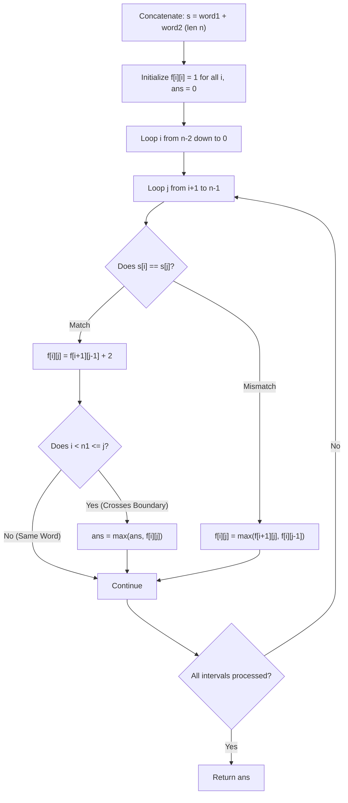

# Guided Example: Maximize Palindrome Length From Subsequences

We trace the step-by-step execution of the interval dynamic programming approach with boundary-crossing constraints on a representative problem instance:

- **Input:** `word1 = "cacb"`, `word2 = "cbba"`
- **Required Output:** `5`

This instance features multiple candidate matching characters across strings of length $4$, illustrating how interval Longest Palindromic Subsequence (LPS) dynamic programming enforces the strictly non-empty subsequence condition from both source strings.

---

## 1. Instance & Teaching Goal

Given two strings `word1` of length $n_1$ and `word2` of length $n_2$, we construct a string by choosing a non-empty subsequence from `word1` and a non-empty subsequence from `word2` and concatenating them. We seek the maximum length of a palindrome formed this way. If no valid palindrome can be constructed, we return $0$.

Consider the combined string:
$$s = \text{word1} + \text{word2}, \quad n = n_1 + n_2$$
A naive search over all $2^{n_1} - 1$ and $2^{n_2} - 1$ non-empty subsequences would require exponential time.
Instead, we recognize this as a constrained **Longest Palindromic Subsequence (LPS)** problem on $s$.

### The Boundary-Crossing Requirement
A palindrome formed by $subseq_1 + subseq_2$ is valid if and only if both subsequences are **non-empty**.
In any non-trivial palindrome, its outermost matching characters:
$$s[i] = s[j] \quad (\text{the first character of } subseq_1 \text{ and the last character of } subseq_2)$$
must originate from different words:
- The left character $s[i]$ must belong to `word1` ($i < n_1$).
- The right character $s[j]$ must belong to `word2` ($j \ge n_1$).

Once such an outermost boundary pair $(i, j)$ with $s[i] == s[j]$ is anchored, all interior characters in the range $[i + 1 \dots j - 1]$ can be freely chosen from anywhere in $s$ to maximize the internal palindromic subsequence.
Thus, whenever $s[i] == s[j]$ crosses the boundary ($i < n_1 \le j$), the maximum palindrome anchored at $(i, j)$ is:
$$\text{length} = f[i+1][j-1] + 2$$
where $f[a][b]$ is the standard unconstrained LPS of substring $s[a \dots b]$.

---

## 2. Conceptual Foundation & Invariants

### State Representation

| Component | Mathematical Definition | Role |
|---|---|---|
| Combined String $s$ | $\text{word1} + \text{word2}$ of length $n = n_1 + n_2$ | Unified index space $0 \le i \le j < n$ |
| Boundary Partition $n_1$ | $\text{length}(\text{word1})$ | Threshold dividing `word1` ($< n_1$) from `word2` ($\ge n_1$) |
| DP Table $f[i][j]$ | Length of LPS within interval $s[i \dots j]$ | Computed bottom-up for all $0 \le i \le j < n$ |
| Global Answer $\text{ans}$ | $\max_{i < n_1 \le j, s[i] == s[j]} f[i][j]$ | Maximum valid boundary-crossing palindrome length |

### Mathematical Invariants

> **Interval LPS Recurrence & Cross-Boundary Anchor Theorem.**
> 1. **Interval LPS Recurrence:** For any indices $0 \le i \le j < n$:
>    $$f[i][j] = \begin{cases}
>    1 & \text{if } i = j \\
>    f[i+1][j-1] + 2 & \text{if } s[i] = s[j] \text{ and } i < j \\
>    \max(f[i+1][j], f[i][j-1]) & \text{if } s[i] \ne s[j]
>    \end{cases}$$
> 2. **Cross-Boundary Validity:** Any palindrome contributing to the final answer must contain at least one element from $\text{word1}$ and at least one from $\text{word2}$. The outermost matching pair $(i, j)$ of such a palindrome satisfies:
>    $$i < n_1 \le j \quad \text{and} \quad s[i] = s[j]$$
>    Checking candidate lengths only at these anchor points guarantees that neither subsequence is empty.

---

## 3. Step-by-Step Worked Execution

We trace `word1 = "cacb"` ($n_1 = 4$) and `word2 = "cbba"` ($n_2 = 4$).
Combined string:
$$s = \text{"cacbcbba"}$$
Length $n = 8$. Boundary is between index $3$ (`word1` ends) and index $4$ (`word2` begins).

Character Index Mapping:
- `word1`: $s[0]=\text{'c'}, s[1]=\text{'a'}, s[2]=\text{'c'}, s[3]=\text{'b'}$
- `word2`: $s[4]=\text{'c'}, s[5]=\text{'b'}, s[6]=\text{'b'}, s[7]=\text{'a'}$

---

### Step 1: Base Table Initialization
All single characters have LPS length $1$:
$$f[i][i] = 1 \quad \text{for all } 0 \le i \le 7$$
Initial answer: $\text{ans} = 0$.

---

### Step 2: Key Substring Evaluations Inside `word2` ($s[4 \dots 7] = \text{"cbba"}$)
- For $s[5 \dots 6] = \text{"bb"}$: $s[5] = s[6] = \text{'b'} \implies f[5][6] = 0 + 2 = 2$.
- For $s[4 \dots 6] = \text{"cbb"}$: $s[4] \ne s[6] \implies f[4][6] = \max(f[5][6], f[4][5]) = \max(2, 1) = 2$.
- For $s[4 \dots 7] = \text{"cbba"}$: $s[4] \ne s[7] \implies f[4][7] = 2$.

---

### Step 3: Key Boundary Crossings

#### Case 1: Match $s[3] = \text{'b'}$ with $s[5] = \text{'b'}$
- Index check: $i = 3 < 4 \le 5 = j$ (Crosses boundary!).
- Interior substring: $s[4 \dots 4] = \text{"c"}$, with $f[4][4] = 1$.
- $$f[3][5] = f[4][4] + 2 = 1 + 2 = 3$$
- Palindrome formed: `"bcb"` (using $s[3], s[4], s[5]$).
  - Subsequence from `word1`: `"b"` (non-empty).
  - Subsequence from `word2`: `"cb"` (non-empty).
- Update answer: $\text{ans} \leftarrow \max(0, 3) = 3$.

#### Case 2: Match $s[3] = \text{'b'}$ with $s[6] = \text{'b'}$
- Index check: $i = 3 < 4 \le 6 = j$ (Crosses boundary!).
- Interior substring: $s[4 \dots 5] = \text{"cb"}$, with $f[4][5] = 1$.
- $$f[3][6] = f[4][5] + 2 = 1 + 2 = 3$$
- Palindrome formed: `"bcb"` or `"bbb"`. Length is $3 \le \text{ans}$.

#### Case 3: Match $s[2] = \text{'c'}$ with $s[4] = \text{'c'}$
- Index check: $i = 2 < 4 \le 4 = j$ (Crosses boundary!).
- Interior substring: $s[3 \dots 3] = \text{"b"}$, with $f[3][3] = 1$.
- $$f[2][4] = f[3][3] + 2 = 1 + 2 = 3$$
- Palindrome formed: `"cbc"`. Length is $3 \le \text{ans}$.

#### Case 4: Match $s[0] = \text{'c'}$ with $s[4] = \text{'c'}$
- Index check: $i = 0 < 4 \le 4 = j$ (Crosses boundary!).
- Interior substring: $s[1 \dots 3] = \text{"acb"}$, with $f[1][3] = 1$.
- $$f[0][4] = f[1][3] + 2 = 1 + 2 = 3$$
- Length is $3 \le \text{ans}$.

#### Case 5: Match $s[1] = \text{'a'}$ with $s[7] = \text{'a'}$ (Optimal Anchor)
- Index check: $i = 1 < 4 \le 7 = j$ (Crosses boundary!).
- Interior interval: $s[2 \dots 6] = \text{"cbcbb"}$.
- Let us evaluate the unconstrained LPS of $s[2 \dots 6]$:
  - Inside $s[2 \dots 6]$, the subsequence `"bcb"` (using $s[2]=\text{'c'}, s[3]=\text{'b'}, s[4]=\text{'c'}$) has length $3$.
  - Alternatively, the subsequence `"bbb"` (using $s[3]=\text{'b'}, s[5]=\text{'b'}, s[6]=\text{'b'}$) has length $3$.
  - Therefore, $f[2][6] = 3$.
- Evaluating $f[1][7]$:
  $$f[1][7] = f[2][6] + 2 = 3 + 2 = 5$$
- Palindrome formed: `"abcba"` or `"abbba"`.
  - Non-empty from `word1`: `"ab"` (indices $1, 3$).
  - Non-empty from `word2`: `"bba"` (indices $5, 6, 7$).
  - Concatenation: `"ab"` + `"bba"` = `"abbba"`, which is a valid palindrome of length $5$.
- Update answer:
  $$\text{ans} \leftarrow \max(3, 5) = 5$$

---

## 4. Complete Execution Trace

| Step | Pair $(i, j)$ | $s[i]$ | $s[j]$ | Cross Boundary? ($i < 4 \le j$) | Inner Substring LPS $f[i+1][j-1]$ | $f[i][j]$ | Candidate Valid? | Running `ans` |
|---|---|---|---|---|---|---|---|---|
| $1$ | $(3, 5)$ | `'b'` | `'b'` | Yes ($3 < 4 \le 5$) | $f[4][4] = 1$ | $1 + 2 = 3$ | Yes (Palindrome `"bcb"`) | $3$ |
| $2$ | $(3, 6)$ | `'b'` | `'b'` | Yes ($3 < 4 \le 6$) | $f[4][5] = 1$ | $1 + 2 = 3$ | Yes (Palindrome `"bbb"`) | $3$ |
| $3$ | $(2, 4)$ | `'c'` | `'c'` | Yes ($2 < 4 \le 4$) | $f[3][3] = 1$ | $1 + 2 = 3$ | Yes (Palindrome `"cbc"`) | $3$ |
| $4$ | $(0, 4)$ | `'c'` | `'c'` | Yes ($0 < 4 \le 4$) | $f[1][3] = 1$ | $1 + 2 = 3$ | Yes (Palindrome `"cac"`) | $3$ |
| **$5$** | **$(1, 7)$** | **`'a'`** | **`'a'`** | **Yes ($1 < 4 \le 7$)** | **$f[2][6] = 3$** | **$3 + 2 = 5$** | **Yes (Palindrome `"abbba"`)** | **$5$** |

Final Answer:
$$\text{ans} = 5$$

---

## 5. Algorithmic Correctness

### Key Invariants and Correctness Argument

1. **Non-Empty Subsequence Guarantee:**
   Because the update $\text{ans} \leftarrow \max(\text{ans}, f[i][j])$ occurs strictly when $s[i] == s[j]$ with $i < n_1 \le j$:
   - The palindrome explicitly incorporates $s[i]$ from `word1` (length $\ge 1$).
   - The palindrome explicitly incorporates $s[j]$ from `word2` (length $\ge 1$).
   Thus, neither subsequence can ever be empty.
2. **Global Maximality:**
   Any valid palindrome constructed from non-empty subsequences of `word1` and `word2` must have its first character in `word1` and its last character in `word2`. These two characters must match ($s[i] == s[j]$ with $i < n_1 \le j$). Since the DP explores all interval pairs $(i, j)$ and computes the optimal interior LPS $f[i+1][j-1]$, the globally optimal palindrome is guaranteed to be examined.

### Boundary and Edge Cases

| Scenario | Input Configuration | Expected Output | Strategic Handling |
|---|---|---|---|
| Disjoint Character Sets | `word1 = "aa"`, `word2 = "bb"` | $0$ | No pair $(i, j)$ satisfies $s[i] == s[j]$ across the boundary; returns $0$. |
| Single Matching Pair | `word1 = "a"`, `word2 = "a"` | $2$ | Anchor $s[0] == s[1]$ yields $f[0][1] = 0 + 2 = 2$. |
| Shared Center Palindrome | `word1 = "ab"`, `word2 = "ab"` | $3$ | Outermost `'a'`s match ($f = 2$), inner `'b'` adds $1 \implies 3$. |
| Internal Palindrome in `word1` Alone | `word1 = "racecar"`, `word2 = "z"` | $0$ | Large palindrome in `word1` cannot be used because `word2` provides no matching anchor. |

---

## 6. Complexity Derivation

- **Time Complexity:** $\mathcal{O}((n_1 + n_2)^2)$ where $n_1 = |\text{word1}|$ and $n_2 = |\text{word2}|$.
  - Total length $n = n_1 + n_2 \le 2000$.
  - The DP table contains $\frac{n(n+1)}{2} \approx 2 \times 10^6$ states.
  - Each cell performs an $\mathcal{O}(1)$ transition and comparison.
  - For $n \le 2000$, total runtime is well under $0.2\text{ s}$.
- **Space Complexity:** $\mathcal{O}((n_1 + n_2)^2)$ auxiliary space to store the $n \times n$ table of integers.