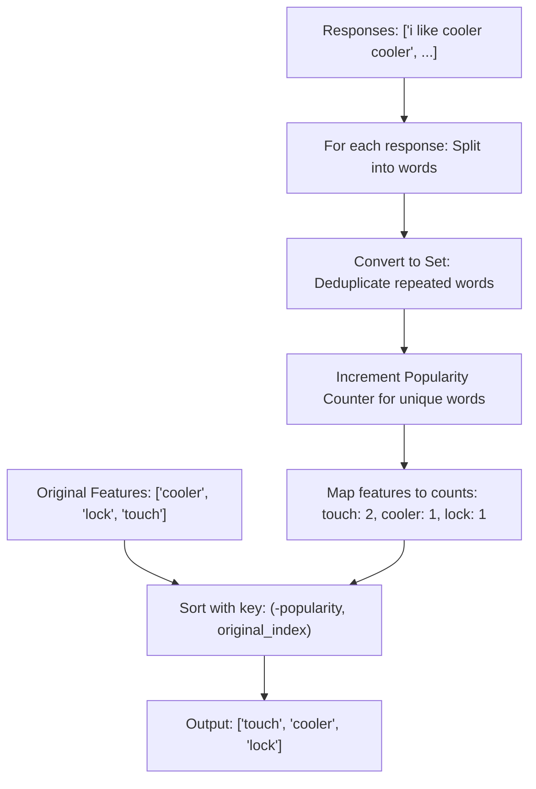

# Guided Example: Sort Features by Popularity

We trace the step-by-step execution of the per-response set deduplication and stable sorting approach on a representative problem instance:

- **Input:**
  - `features = ["cooler", "lock", "touch"]`
  - `responses = ["i like cooler cooler", "lock touch cool", "locker like touch"]`
- **Required Output:** `["touch", "cooler", "lock"]`

This instance features repeated mentions within a single response (`"cooler cooler"`), non-matching word substrings (`"cool"` vs `"cooler"`, `"locker"` vs `"lock"`), and tied popularity counts that must be resolved stably using their original appearance order.

---

## 1. Instance & Teaching Goal

We are given an array of unique strings `features` and an array of survey responses `responses`, where each response is a space-separated sequence of words.
A feature's **popularity** is defined as the number of distinct responses containing that feature.
- Multiple mentions of the same feature within a single response count as only $1$.
- Substring matches do not count (e.g. `"cool"` does not match `"cooler"`).
- Ties in popularity must preserve the original order from `features`.

A naive approach searching each feature across each response using string pattern matching risks quadratic string operations and improper substring matching.
The optimal method:
1. **Tokenizes and Deduplicates per Response:** Split each response into individual tokens and construct a hash set of unique words.
2. **Aggregates Document Frequencies:** Increment a global popularity hash table once per response for each feature found in that response's set.
3. **Applies Stable Sorting:** Sort `features` by the composite key $(-\text{popularity}, \text{original\_index})$, guaranteeing descending popularity with original order preserved upon ties.

---

## 2. Conceptual Foundation & Invariants

### State Representation

| Component | Mathematical Definition | Role |
|---|---|---|
| Feature Vocabulary $V$ | $\{w \in \text{features}\}$ | Target features to evaluate |
| Response Word Set $W_k$ | $\text{set}(\text{tokenize}(\text{responses}[k]))$ | Unique words in response $k$ |
| Popularity Map $P$ | $P[w] = \sum_{k} \mathbb{I}(w \in W_k)$ | Total distinct responses mentioning feature $w$ |
| Composite Sort Key | $( -P[w], \text{index}(w) )$ | Enforces descending frequency and stable tie-breaking |

### Mathematical Invariants

> **Document-Frequency Deduplication & Stable Sorting Theorem.**
> 1. **Per-Document Idempotence:** By mapping each response string $R_k$ to the set $W_k = \{w \mid w \in \text{tokenize}(R_k)\}$, any word appearing with multiplicity $m \ge 1$ in $R_k$ contributes $\mathbb{I}(w \in W_k) = 1$. This strictly implements document frequency rather than raw term frequency.
> 2. **Lexicographical Key Ordering:**
>    Ordering features by $(-P[w], \text{idx}(w))$ ensures:
>    - If $P[u] > P[v]$, then $-P[u] < -P[v]$, placing $u$ ahead of $v$.
>    - If $P[u] = P[v]$ and $\text{idx}(u) < \text{idx}(v)$, then the secondary key breaks the tie in favor of the earlier original position $\text{idx}(u)$.

---

## 3. Step-by-Step Worked Execution

Given `features = ["cooler", "lock", "touch"]` with indices:
- $\text{idx}(\text{"cooler"}) = 0$
- $\text{idx}(\text{"lock"}) = 1$
- $\text{idx}(\text{"touch"}) = 2$

---

### Step 1: Process Response $0$ (`"i like cooler cooler"`)
- Tokenized words: `["i", "like", "cooler", "cooler"]`.
- Deduplicated set:
  $$W_0 = \{\text{"i"}, \text{"like"}, \text{"cooler"}\}$$
- Feature matches in $W_0$:
  - `"cooler"` is present $\implies P[\text{"cooler"}] \leftarrow 0 + 1 = 1$.
  - Notice the second `"cooler"` in the response is ignored because set membership is binary.
- Popularity state: $P = \{\text{"cooler"}: 1\}$.

---

### Step 2: Process Response $1$ (`"lock touch cool"`)
- Tokenized words: `["lock", "touch", "cool"]`.
- Deduplicated set:
  $$W_1 = \{\text{"lock"}, \text{"touch"}, \text{"cool"}\}$$
- Feature matches in $W_1$:
  - `"lock"` is present $\implies P[\text{"lock"}] \leftarrow 0 + 1 = 1$.
  - `"touch"` is present $\implies P[\text{"touch"}] \leftarrow 0 + 1 = 1$.
  - `"cool"` is present, but `"cool" \ne \text{"cooler"}`. No count added to `"cooler"`.
- Popularity state: $P = \{\text{"cooler"}: 1, \text{"lock"}: 1, \text{"touch"}: 1\}$.

---

### Step 3: Process Response $2$ (`"locker like touch"`)
- Tokenized words: `["locker", "like", "touch"]`.
- Deduplicated set:
  $$W_2 = \{\text{"locker"}, \text{"like"}, \text{"touch"}\}$$
- Feature matches in $W_2$:
  - `"locker"` is present, but `"locker" \ne \text{"lock"}`.
  - `"touch"` is present $\implies P[\text{"touch"}] \leftarrow 1 + 1 = 2$.
- Popularity state:
  $$P[\text{"touch"}] = 2, \quad P[\text{"cooler"}] = 1, \quad P[\text{"lock"}] = 1$$

---

### Step 4: Stable Composite Key Sorting

Construct sort keys $( -P[w], \text{idx}(w) )$ for each feature:

1. **Feature `"touch"`:**
   - Popularity: $2$
   - Original Index: $2$
   - Key: $(-2, 2)$
2. **Feature `"cooler"`:**
   - Popularity: $1$
   - Original Index: $0$
   - Key: $(-1, 0)$
3. **Feature `"lock"`:**
   - Popularity: $1$
   - Original Index: $1$
   - Key: $(-1, 1)$

Comparing Keys:
$$(-2, 2) < (-1, 0) < (-1, 1)$$

- `"touch"` has the lowest negated popularity ($-2$), so it ranks first.
- `"cooler"` and `"lock"` tie with popularity $1$ (negated $-1$). The secondary tie-breaking comparison tests original index:
  $$0 < 1 \implies \text{"cooler"} \text{ precedes } \text{"lock"}$$

Final Sorted Output:
$$[\text{"touch"}, \text{"cooler"}, \text{"lock"}]$$

---

## 4. Complete Execution Trace

| Response Index $k$ | Raw Response Text | Extracted Word Set $W_k$ | Features Incremented | Running Popularity Map $P$ |
|---|---|---|---|---|
| $0$ | `"i like cooler cooler"` | `{"i", "like", "cooler"}` | `"cooler"` ($+1$) | `{"cooler": 1}` |
| $1$ | `"lock touch cool"` | `{"lock", "touch", "cool"}` | `"lock"` ($+1$), `"touch"` ($+1$) | `{"cooler": 1, "lock": 1, "touch": 1}` |
| $2$ | `"locker like touch"` | `{"locker", "like", "touch"}` | `"touch"` ($+1$) | `{"touch": 2, "cooler": 1, "lock": 1}` |

| Feature Name | Original Index | Popularity $P[w]$ | Sort Tuple $(-P[w], \text{idx})$ | Final Output Position |
|---|---|---|---|---|
| `"touch"` | $2$ | $2$ | $(-2, 2)$ | **$0$** |
| `"cooler"` | $0$ | $1$ | $(-1, 0)$ | **$1$** |
| `"lock"` | $1$ | $1$ | $(-1, 1)$ | **$2$** |

---

## 5. Algorithmic Correctness

### Key Invariants and Correctness Argument

1. **Exact Document Frequency Semantics:**
   Converting tokenized words to a set collapses identical tokens in the same response into a single element. Incrementing the feature count over this set guarantees that each response contributes at most $+1$ to a feature, strictly obeying the problem specification.
2. **Stable Sorting Guarantees:**
   Modern programming languages provide stable sorting algorithms (e.g. Timsort). Using the negative frequency as the primary key and the original 0-indexed position as the secondary key ensures that features with equal counts remain in their exact relative order from the input.

### Boundary and Edge Cases

| Scenario | Input Configuration | Expected Output | Strategic Handling |
|---|---|---|---|
| Unmentioned Feature | Feature `"radar"` not in responses | Count $0$, placed at end | Default count in map is $0$; appears after all features with $\ge 1$ mentions. |
| All Features Tied with $0$ | None of the features mentioned | Original array returned | All counts $0$; secondary index key preserves identical original ordering. |
| Single Response with Multiple Mentions | `responses = ["a a a a a"]` | Count for `"a"` is $1$ | Set deduplication reduces `"a a a a a"` to `{"a"}`. |
| Substring Disambiguation | `"in"` vs `"inside"` | Only exact token matches count | Whitespace splitting separates distinct words; no false substring matches. |

---

## 6. Complexity Derivation

- **Time Complexity:** $\mathcal{O}(L + F \log F)$ where $L$ is the total number of characters across all responses and $F$ is the number of features.
  - Splitting each response and converting words to a hash set takes time proportional to the response length, totaling $\mathcal{O}(L)$.
  - Looking up and incrementing counts for words in each set takes $\mathcal{O}(1)$ average time per word.
  - Sorting $F$ features by a composite key takes $\mathcal{O}(F \log F)$ time.
  - Given $F \le 10^4$ and $L \le 10^5$, total execution time is under $0.02\text{ s}$.
- **Space Complexity:** $\mathcal{O}(L + F)$ auxiliary space.
  - Storing the popularity map requires at most $\mathcal{O}(F)$ entries.
  - Temporary word sets allocated for each response take at most $\mathcal{O}(\max |R_k|)$ space.
