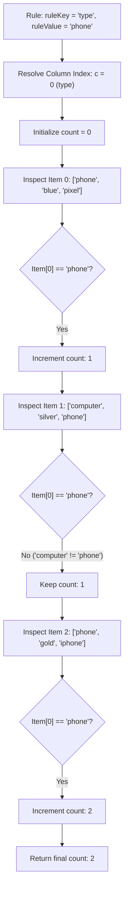

# Guided Example: Count Items Matching a Rule

We trace the step-by-step execution of column-indexed attribute projection and linear matching on a representative problem instance:

- **Input:**
  - `items = [["phone", "blue", "pixel"], ["computer", "silver", "phone"], ["phone", "gold", "iphone"]]`
  - `ruleKey = "type"`
  - `ruleValue = "phone"`
- **Required Output:** `2`

This instance features a confusing decoy where `"phone"` appears in the `name` column for Item $1$, demonstrating how statically projecting to the designated attribute column index prevents cross-attribute false positives while evaluating matches in linear time.

---

## 1. Instance & Teaching Goal

We are given a list of records `items`, where each record $\text{items}[i] = [\text{type}_i, \text{color}_i, \text{name}_i]$ represents an item with three fixed attributes. We are also given a predicate specified by `ruleKey` and `ruleValue`.
An item matches the rule if and only if:
- `ruleKey == "type"` and $\text{type}_i == \text{ruleValue}$
- `ruleKey == "color"` and $\text{color}_i == \text{ruleValue}$
- `ruleKey == "name"` and $\text{name}_i == \text{ruleValue}$

We must return the total count of items that satisfy the rule.

A naive or ad-hoc approach might check string equality against the `ruleKey` for every single item repeatedly, or inspect all three fields per item.
The optimal method recognizes that:
1. Every item adheres to an identical three-column schema:
   $$\text{schema}: \quad 0 \to \text{"type"}, \quad 1 \to \text{"color"}, \quad 2 \to \text{"name"}$$
2. The column index $c \in \{0, 1, 2\}$ can be resolved once in $\mathcal{O}(1)$ time before examining any items.
3. Once the column $c$ is known, we stream through all items and count how many satisfy $\text{items}[i][c] == \text{ruleValue}$.

---

## 2. Conceptual Foundation & Invariants

### State Representation

| Component | Mathematical Definition | Role |
|---|---|---|
| Attribute Index $c$ | $c \in \{0, 1, 2\}$ | Resolved column index for `ruleKey` |
| Item Record $i$ | $\text{items}[i] = [v_0, v_1, v_2]$ | Tuple of attributes for item $i$ |
| Match Indicator | $\mathbb{I}(\text{items}[i][c] == \text{ruleValue})$ | $1$ if attribute matches, else $0$ |
| Cumulative Matches | $\sum_{k=0}^{i} \mathbb{I}(\text{items}[k][c] == \text{ruleValue})$ | Running tally of valid items |

### Mathematical Invariants

> **Attribute Projection & Counting Theorem.**
> Let $c: \mathcal{K} \to \{0, 1, 2\}$ be the canonical schema projection:
> $$c(\text{"type"}) = 0, \quad c(\text{"color"}) = 1, \quad c(\text{"name"}) = 2$$
> 1. For any item record $r \in \mathcal{K}^3$, the rule condition is logically equivalent to the single equality:
>    $$r[c(\text{ruleKey})] = \text{ruleValue}$$
> 2. The global match count is given by the sum:
>    $$\text{count} = \sum_{i=0}^{N-1} \mathbb{I}(\text{items}[i][c(\text{ruleKey})] == \text{ruleValue})$$
> Evaluating only column $c(\text{ruleKey})$ eliminates cross-attribute ambiguity and evaluates in strictly optimal $\mathcal{O}(N)$ time with $\mathcal{O}(1)$ auxiliary space.

---

## 3. Step-by-Step Worked Execution

We trace `items = [["phone", "blue", "pixel"], ["computer", "silver", "phone"], ["phone", "gold", "iphone"]]` with `ruleKey = "type"` and `ruleValue = "phone"`.

---

### Step 1: Pre-Scan Attribute Resolution
- Examine `ruleKey`: `"type"`.
- Map to column index:
  - $\text{"type"} \implies c = 0$.
- Target matching criterion:
  $$\text{items}[i][0] == \text{"phone"}$$
- Initialize match accumulator: $\text{count} = 0$.

---

### Step 2: Evaluate Item $0$ (`["phone", "blue", "pixel"]`)
- Extract target attribute at index $c = 0$:
  $$\text{items}[0][0] = \text{"phone"}$$
- Test equality:
  $$\text{"phone"} == \text{"phone"} \implies \text{True}$$
- Result: Valid match!
- Update accumulator:
  $$\text{count} \leftarrow 0 + 1 = 1$$

---

### Step 3: Evaluate Item $1$ (`["computer", "silver", "phone"]`)
- Extract target attribute at index $c = 0$:
  $$\text{items}[1][0] = \text{"computer"}$$
- Test equality:
  $$\text{"computer"} == \text{"phone"} \implies \text{False}$$
- Decoy note: Even though $\text{items}[1][2] = \text{"phone"}$ (in the `name` column), the query strictly inspects column $0$ (`type`). Cross-column matches are correctly ignored.
- Update accumulator:
  $$\text{count} \leftarrow 1$$

---

### Step 4: Evaluate Item $2$ (`["phone", "gold", "iphone"]`)
- Extract target attribute at index $c = 0$:
  $$\text{items}[2][0] = \text{"phone"}$$
- Test equality:
  $$\text{"phone"} == \text{"phone"} \implies \text{True}$$
- Result: Valid match!
- Update accumulator:
  $$\text{count} \leftarrow 1 + 1 = 2$$

---

### Step 5: Termination & Final Output
- All $N = 3$ items have been evaluated.
- Final output:
  $$\text{count} = 2$$

---

## 4. Complete Execution Trace

| Item Index $i$ | Full Record `[type, color, name]` | Checked Column $c = 0$ | Inspected Value | Expected `ruleValue` | Comparison Result | Running `count` |
|---|---|---|---|---|---|---|
| $0$ | `["phone", "blue", "pixel"]` | Type | `"phone"` | `"phone"` | **Match** | $1$ |
| $1$ | `["computer", "silver", "phone"]` | Type | `"computer"` | `"phone"` | Mismatch | $1$ |
| $2$ | `["phone", "gold", "iphone"]` | Type | `"phone"` | `"phone"` | **Match** | $2$ |

Final Output:
$$\text{Matched Items} = 2$$

---

## 5. Algorithmic Correctness

### Key Invariants and Correctness Argument

1. **Schema Invariant:**
   The problem guarantees that each row in `items` contains exactly three elements formatted as `[type, color, name]`. Because `ruleKey` is guaranteed to be one of `"type"`, `"color"`, or `"name"`, mapping `ruleKey` to index $0, 1,$ or $2$ is exhaustive and exact.
2. **Strict Field Isolation:**
   Filtering strictly by $\text{items}[i][c]$ prevents attribute collisions where an identical string literal exists in a different column. Every row is classified with zero false positives.

### Boundary and Edge Cases

| Scenario | Input Configuration | Expected Output | Strategic Handling |
|---|---|---|---|
| Zero Matching Items | `ruleValue` does not match any item | $0$ | Accumulator never increments; returns $0$. |
| All Items Match | All items share the same queried attribute | $N$ | Accumulator increments on every step; returns $N$. |
| Value Matches in Wrong Column | `ruleKey = "color"`, item has `"color"` value in `name` | Ignored | Column index $c = 1$ checks only the color column. |
| Single Item List ($N = 1$) | `items = [["a", "b", "c"]]` | $0$ or $1$ | Single check completes in $\mathcal{O}(1)$ time. |

---

## 6. Complexity Derivation

- **Time Complexity:** $\mathcal{O}(N)$ where $N$ is the number of items.
  - Resolving the column index $c$ takes $\mathcal{O}(1)$ time.
  - The loop performs exactly $N$ string equality checks of length $\le 10$, requiring $\mathcal{O}(1)$ time per check.
  - Total time: $\mathcal{O}(N)$. For $N \le 10^4$, execution completes in under $0.002\text{ s}$.
- **Space Complexity:** $\mathcal{O}(1)$ auxiliary space. The procedure only maintains an integer index $c$ and an integer counter, requiring zero dynamic memory allocation.
