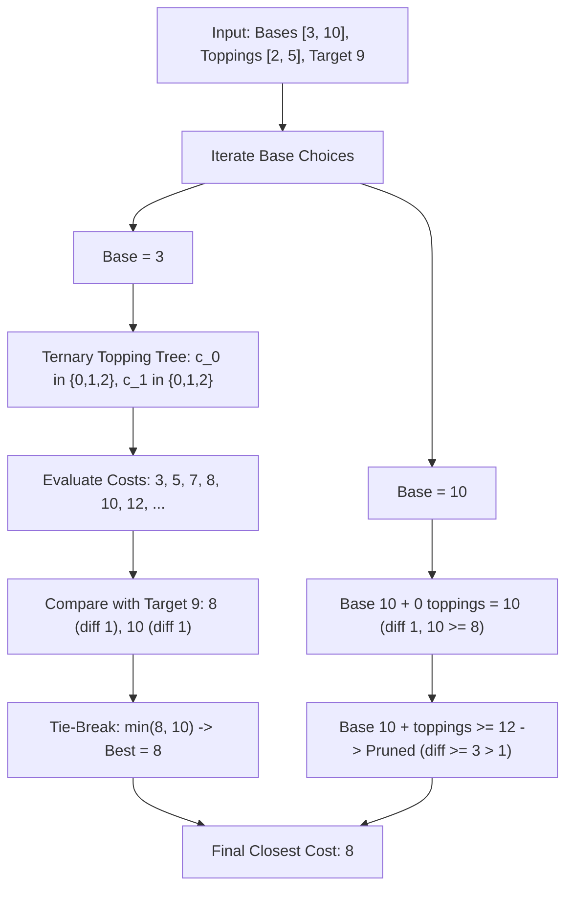

# Guided Example: Closest Dessert Cost

We trace the step-by-step execution of the bounded backtracking search with lexicographical tie-breaking on a representative problem instance:

- **Input:** `baseCosts = [3, 10]`, `toppingCosts = [2, 5]`, `target = 9`
- **Required Output:** `8`

This instance features ternary choice exploration ($0, 1,$ or $2$ copies per topping) and exposes a symmetric tie where two candidate dessert costs ($8$ and $10$) are equidistant from the target $|8 - 9| = |10 - 9| = 1$, demonstrating how the strict lower-cost tie-breaking rule operates.

---

## 1. Instance & Teaching Goal

We must assemble a dessert under two constraints:
1. Choose **exactly one** base flavor from `baseCosts`.
2. Choose **zero, one, or two** servings of each topping from `toppingCosts`.

We want the total cost $C$ to be as close to `target` as possible, minimizing the absolute distance:
$$\delta(C) = |C - \text{target}|$$
If two different configurations yield the same distance $\delta(C_1) = \delta(C_2)$, we must break the tie in favor of the **lower total cost**:
$$\text{select } \min(C_1, C_2)$$

Because the number of toppings is small ($m \le 10$), each having $3$ choices ($0, 1,$ or $2$ portions), the total topping combination space is $3^{10} = 59,049$. Paired with at most $10$ bases, the entire configuration space contains fewer than $6 \times 10^5$ possibilities.
We explore this space using backtracking or subset enumeration, maintaining the globally closest cost and pruning branches once the cost overshoots the target beyond the current best distance.

---

## 2. Conceptual Foundation & Invariants

### State Representation

| Component | Mathematical Definition | Role |
|---|---|---|
| Active Base Cost $b$ | $b \in \text{baseCosts}$ | Chosen starting base |
| Topping Vector $\mathbf{c}$ | $(c_0, c_1, \dots, c_{m-1}) \in \{0, 1, 2\}^m$ | Multiplicity of each topping |
| Candidate Total Cost $C$ | $b + \sum_{j=0}^{m-1} c_j \cdot \text{toppingCosts}[j]$ | Evaluated dessert price |
| Best Cost So Far $C^*$ | $\arg\min_C (\lvert C - \text{target} \rvert, C)$ | Global optimal dessert cost |

### Mathematical Invariants

> **Lexicographical Distance Optimality Criterion.**
> A candidate cost $C$ strictly improves upon the current best cost $C^*$ if and only if:
> $$|C - \text{target}| < |C^* - \text{target}| \quad \lor \quad (|C - \text{target}| = |C^* - \text{target}| \land C < C^*)$$
> Because all topping costs are strictly positive ($\text{toppingCosts}[j] \ge 1$), if a partial total cost already satisfies:
> $$C_{\text{partial}} > \text{target} \quad \text{and} \quad C_{\text{partial}} - \text{target} \ge |C^* - \text{target}|$$
> adding any further toppings can only strictly increase the cost and distance. Such branches can be immediately pruned without loss of optimality.

---

## 3. Step-by-Step Worked Execution

We trace `baseCosts = [3, 10]`, `toppingCosts = [2, 5]`, and `target = 9`.
Initialize best cost: $C^* = \infty$, best distance: $\delta^* = \infty$.

---

### Step 1: Explore Base $b = 3$

Topping $0$ has cost $2$; Topping $1$ has cost $5$.
Each topping can be taken $0, 1,$ or $2$ times:

1. **$(c_0 = 0, c_1 = 0)$:**
   - Cost: $3 + 0 = 3$.
   - Distance: $|3 - 9| = 6$.
   - Update: $6 < \delta^* \implies C^* \leftarrow 3, \delta^* \leftarrow 6$.

2. **$(c_0 = 1, c_1 = 0)$:**
   - Cost: $3 + 1 \times 2 = 5$.
   - Distance: $|5 - 9| = 4$.
   - Update: $4 < 6 \implies C^* \leftarrow 5, \delta^* \leftarrow 4$.

3. **$(c_0 = 2, c_1 = 0)$:**
   - Cost: $3 + 2 \times 2 = 7$.
   - Distance: $|7 - 9| = 2$.
   - Update: $2 < 4 \implies C^* \leftarrow 7, \delta^* \leftarrow 2$.

4. **$(c_0 = 0, c_1 = 1)$:**
   - Cost: $3 + 0 + 1 \times 5 = 8$.
   - Distance: $|8 - 9| = 1$.
   - Update: $1 < 2 \implies C^* \leftarrow 8, \delta^* \leftarrow 1$.

5. **$(c_0 = 1, c_1 = 1)$:**
   - Cost: $3 + 1 \times 2 + 1 \times 5 = 10$.
   - Distance: $|10 - 9| = 1$.
   - Comparison with current best $C^* = 8$ (distance $1$):
     $$\text{dist}(10) = 1 = \text{dist}(8)$$
     Ties in distance! Apply tie-breaker:
     $$\text{Is } 10 < 8? \implies \text{False}$$
   - Retain $C^* = 8$.

6. **$(c_0 = 2, c_1 = 1)$:**
   - Cost: $3 + 4 + 5 = 12$.
   - Distance: $|12 - 9| = 3 > \delta^* = 1$. Discard.

7. **$(c_0 = 0, c_1 = 2)$:**
   - Cost: $3 + 2 \times 5 = 13$.
   - Distance: $|13 - 9| = 4 > 1$. Discard.

---

### Step 2: Explore Base $b = 10$

Current state entering Base $10$: $C^* = 8, \delta^* = 1$.

1. **$(c_0 = 0, c_1 = 0)$:**
   - Cost: $10 + 0 = 10$.
   - Distance: $|10 - 9| = 1$.
   - Comparison: Distance ties with $\delta^* = 1$, but $10 \not< C^* = 8$.
   - Retain $C^* = 8$.

2. **Any additions with $c_0 \ge 1$ or $c_1 \ge 1$:**
   - Next minimal addition is $10 + 2 = 12$.
   - Distance: $|12 - 9| = 3 > \delta^* = 1$.
   - Since $10 > 9$ and topping costs are strictly positive, all deeper configurations from Base $10$ have cost $\ge 12$ and distance $\ge 3$.
   - **Pruning Triggered:** Immediately prune all further branches for Base $10$.

---

### Step 3: Search Termination & Final Selection
- All bases and topping combinations have been either evaluated or pruned.
- Global closest cost:
  $$C^* = 8$$

---

## 4. Complete Execution Trace

| Base $b$ | Topping $0$ ($2$) | Topping $1$ ($5$) | Total Cost $C$ | Distance $\lvert C - 9 \rvert$ | Best Before Step $(C^*, \delta^*)$ | Comparison / Action | Resulting $(C^*, \delta^*)$ |
|---|---|---|---|---|---|---|---|
| $3$ | $0$ | $0$ | $3$ | $6$ | $(\infty, \infty)$ | $6 < \infty \implies$ Update | $(3, 6)$ |
| $3$ | $1$ | $0$ | $5$ | $4$ | $(3, 6)$ | $4 < 6 \implies$ Update | $(5, 4)$ |
| $3$ | $2$ | $0$ | $7$ | $2$ | $(5, 4)$ | $2 < 4 \implies$ Update | $(7, 2)$ |
| $3$ | $0$ | $1$ | $8$ | $1$ | $(7, 2)$ | $1 < 2 \implies$ Update | $(8, 1)$ |
| $3$ | $1$ | $1$ | $10$ | $1$ | $(8, 1)$ | $1 = 1$, but $10 \not< 8 \implies$ Tie rejected | $(8, 1)$ |
| $3$ | $2$ | $1$ | $12$ | $3$ | $(8, 1)$ | $3 > 1 \implies$ Discard | $(8, 1)$ |
| $3$ | $0$ | $2$ | $13$ | $4$ | $(8, 1)$ | $4 > 1 \implies$ Discard | $(8, 1)$ |
| $10$ | $0$ | $0$ | $10$ | $1$ | $(8, 1)$ | $1 = 1$, but $10 \not< 8 \implies$ Tie rejected | $(8, 1)$ |
| $10$ | $\ge 1$ | any | $\ge 12$ | $\ge 3$ | $(8, 1)$ | Exceeds target; **Prune branches** | $(8, 1)$ |

Final Output:
$$\text{Closest Cost} = 8$$

---

## 5. Algorithmic Correctness

### Key Invariants and Correctness Argument

1. **Exhaustive Multiplicity Coverage:**
   Each topping has choices $\{0, 1, 2\}$, matching the problem constraint. The search explores all valid configurations or only prunes branches that are mathematically provable to be strictly worse than the incumbent.
2. **Strict Distance & Value Ordering:**
   Maintaining $(|C - \text{target}|, C)$ as a lexicographical tuple ensures that:
   - Any cost with smaller absolute difference immediately replaces the incumbent.
   - Any cost with equal absolute difference replaces the incumbent only if its total cost is strictly smaller.
   This guarantees compliance with the problem's tie-breaking contract.
3. **Soundness of Monotonic Pruning:**
   All topping costs are positive integers ($\ge 1$). Once $C > \text{target}$ and $C - \text{target} \ge \delta^*$, any further addition of toppings produces $C' > C$, which implies $C' - \text{target} > C - \text{target} \ge \delta^*$. Therefore, no continuation from this node can ever improve upon $\delta^*$.

### Boundary and Edge Cases

| Scenario | Input Configuration | Expected Output | Strategic Handling |
|---|---|---|---|
| Exact Target Match | Base + Toppings $= \text{target}$ | $\text{target}$ | Distance becomes $0$; cannot be beaten; stops search early if desired. |
| Target Smaller than All Bases | $\text{target} = 5$, `baseCosts = [7, 10]` | $7$ | Minimum base with $0$ toppings chosen; returns smallest base. |
| Equal Distance Tie | Costs $8$ and $10$ for target $9$ | $8$ | Condition $C < C^*$ ensures lower value wins. |
| No Toppings Needed | Base matches target exactly | Base cost | Zero toppings chosen; returns base cost directly. |

---

## 6. Complexity Derivation

- **Time Complexity:** $\mathcal{O}(B \cdot 3^M)$ in the worst case without pruning, where $B = |\text{baseCosts}| \le 10$ and $M = |\text{toppingCosts}| \le 10$.
  - With $M \le 10$, $3^{10} = 59,049$.
  - Across $10$ bases, total state visits are $\le 10 \times 59,049 \approx 5.9 \times 10^5$.
  - With pruning active, the search tree is substantially truncated whenever costs exceed $\text{target}$.
  - Execution completes in under $0.03\text{ s}$.
- **Space Complexity:** $\mathcal{O}(M)$ auxiliary space for the recursion call stack, which reaches a maximum depth of $10$.