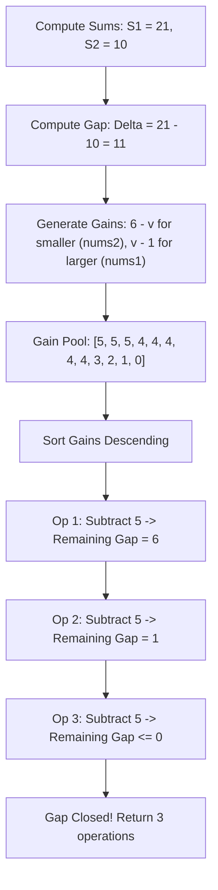

# Guided Example: Equal Sum Arrays With Minimum Number of Operations

We trace the step-by-step execution of the greedy maximum-gain gap reduction approach on a representative problem instance:

- **Input:** `nums1 = [1, 2, 3, 4, 5, 6]`, `nums2 = [1, 1, 2, 2, 2, 2]`
- **Required Output:** `3`

This instance features arrays of equal length with unequal sums ($21$ vs $10$), demonstrating how quantifying the maximum potential gap reduction per element and greedily selecting the largest available gains equalizes the array sums in the minimum number of moves.

---

## 1. Instance & Teaching Goal

We are given two arrays `nums1` and `nums2` containing integers between $1$ and $6$ inclusive. In one operation, we can change any element to any integer in $[1, 6]$. We must find the minimum number of operations to make the sum of `nums1` equal to the sum of `nums2`, or return $-1$ if impossible.

### Feasibility Bounds
An array of length $L$ can achieve any integer sum in the interval $[L, 6L]$ by assigning all elements $1$ (minimum) or $6$ (maximum).
Equality is possible if and only if the achievable sum intervals overlap:
$$[\max(n_1, n_2), 6 \min(n_1, n_2)] \ne \emptyset \iff 6 n_1 \ge n_2 \quad \text{and} \quad 6 n_2 \ge n_1$$
If this condition fails, no assignment can equalize the sums, so we immediately return $-1$.

### Greedy Gap Reduction
Let the current sums be $S_{\text{larger}}$ and $S_{\text{smaller}}$, with initial difference:
$$\Delta = S_{\text{larger}} - S_{\text{smaller}}$$
To decrease $\Delta$ toward zero:
1. We can **increase** an element $x$ in the smaller-sum array toward $6$, achieving a reduction gain of $6 - x \in [0, 5]$.
2. We can **decrease** an element $y$ in the larger-sum array toward $1$, achieving a reduction gain of $y - 1 \in [0, 5]$.

To minimize the total number of operations, we must greedily select the modifications that yield the **largest possible gain** first.

---

## 2. Conceptual Foundation & Invariants

### State Representation

| Component | Mathematical Definition | Role |
|---|---|---|
| Initial Gap $\Delta$ | $|S_1 - S_2|$ | Net difference between the two array sums |
| Available Gain Pool $\mathcal{G}$ | $\{6 - x \mid x \in \text{smaller}\} \cup \{y - 1 \mid y \in \text{larger}\}$ | Multiset of maximum per-element contributions |
| Remaining Gap $d$ | $\Delta - \sum_{k=1}^i g_k$ | Uncovered difference after $i$ operations |
| Operation Counter $i$ | Integer $0 \le i \le n_1 + n_2$ | Number of elements modified so far |

### Mathematical Invariants

> **Greedy Gain Dominance Theorem (Exchange Argument).**
> Let $\mathcal{G} = [g_1, g_2, \dots, g_m]$ be the multiset of available gains sorted in non-increasing order: $g_1 \ge g_2 \ge \dots \ge g_m$.
> Suppose an optimal solution achieves $d \le 0$ using $k$ operations with gains $\{p_1, \dots, p_k\}$.
> By construction, $\sum_{j=1}^k g_j \ge \sum_{j=1}^k p_j \ge \Delta$.
> Therefore, the prefix sum of the $k$ largest elements in $\mathcal{G}$ is guaranteed to close the gap $\Delta$ in at most $k$ operations.
> Greedily picking elements from the sorted gain pool $\mathcal{G}$ yields the minimal possible operation count.

---

## 3. Step-by-Step Worked Execution

Given `nums1 = [1, 2, 3, 4, 5, 6]` and `nums2 = [1, 1, 2, 2, 2, 2]`.
- Lengths: $n_1 = 6, n_2 = 6$.
- Feasibility check: $6 \times 6 = 36 \ge 6$ (feasible).

---

### Step 1: Initial Sums & Gap Formulation
- Sum of `nums1`: $1 + 2 + 3 + 4 + 5 + 6 = 21$.
- Sum of `nums2`: $1 + 1 + 2 + 2 + 2 + 2 = 10$.
- Comparison: $21 > 10$.
  - Larger array: `nums1` ($S_{\text{max}} = 21$).
  - Smaller array: `nums2` ($S_{\text{min}} = 10$).
- Initial deficit gap to close:
  $$\Delta = 21 - 10 = 11$$

---

### Step 2: Pool Available Gains

#### Decreasing Elements of `nums1` toward $1$ (Gain = $v - 1$):
- $6 \to 1$: Gain $6 - 1 = 5$
- $5 \to 1$: Gain $5 - 1 = 4$
- $4 \to 1$: Gain $4 - 1 = 3$
- $3 \to 1$: Gain $3 - 1 = 2$
- $2 \to 1$: Gain $2 - 1 = 1$
- $1 \to 1$: Gain $1 - 1 = 0$
Gains from `nums1`: $[5, 4, 3, 2, 1, 0]$.

#### Increasing Elements of `nums2` toward $6$ (Gain = $6 - v$):
- $1 \to 6$: Gain $6 - 1 = 5$ (from two $1$s: two gains of $5$)
- $2 \to 6$: Gain $6 - 2 = 4$ (from four $2$s: four gains of $4$)
Gains from `nums2`: $[5, 5, 4, 4, 4, 4]$.

#### Combined Sorted Gain Pool $\mathcal{G}$:
$$[5, 5, 5, 4, 4, 4, 4, 4, 3, 2, 1, 0]$$

---

### Step 3: Greedily Apply Largest Gains

We subtract gains from the remaining gap $d = 11$ until $d \le 0$:

- **Operation $1$:** Pick first gain $g_1 = 5$ (e.g. change $6 \to 1$ in `nums1`).
  - Remaining Gap: $d \leftarrow 11 - 5 = 6$.
  - Check $d \le 0$: $6 > 0$ (Continue).

- **Operation $2$:** Pick second gain $g_2 = 5$ (e.g. change a $1 \to 6$ in `nums2`).
  - Remaining Gap: $d \leftarrow 6 - 5 = 1$.
  - Check $d \le 0$: $1 > 0$ (Continue).

- **Operation $3$:** Pick third gain $g_3 = 5$ (e.g. change second $1 \to 6$ in `nums2`).
  - Remaining Gap: $d \leftarrow 1 - 5 = -4$.
  - Check $d \le 0$: $-4 \le 0$ (Condition Satisfied!).
  - (Note: Even taking a gain of $4$ would yield $1 - 4 = -3 \le 0$, which also succeeds in $3$ operations).

---

### Step 4: Termination
The gap is fully bridged in exactly $3$ operations.
Final Return Value: $3$.

---

## 4. Complete Execution Trace

| Operation $i$ | Selected Gain $g_i$ | Source Element Transformation | Remaining Gap Before $d$ | New Remaining Gap $d - g_i$ | Termination Check $d \le 0$? |
|---|---|---|---|---|---|
| Start | — | — | — | $11$ | False |
| $1$ | $5$ | `nums1`: $6 \to 1$ | $11$ | $6$ | False |
| $2$ | $5$ | `nums2`: $1 \to 6$ | $6$ | $1$ | False |
| **$3$** | **$5$** | **`nums2`: $1 \to 6$** | **$1$** | **$-4$** | **True (Terminated)** |

Final Minimum Operations:
$$\text{Operations Count} = 3$$

---

## 5. Algorithmic Correctness

### Key Invariants and Correctness Argument

1. **Optimality of Partial Reductions:**
   The final operation in any sequence does not need to use its full potential gain; it can partially adjust to hit the exact target integer (e.g. if we only need $1$ more unit of reduction, an element with potential gain $5$ can simply be incremented by $1$ instead of $5$). Because any change $\le g$ is valid, the maximum gain $g$ strictly bounds the reach of that operation.
2. **Greedy Maximization:**
   Since each operation carries identical cost (cost $= 1$), this problem reduces to the classic fractional knapsack structure over discrete intervals. Selecting elements by maximum gain $\max g_i$ maximizes the cumulative sum $\sum_{j=1}^k g_j$ for any given $k$, guaranteeing the minimal $k$ to reach $\ge \Delta$.

### Boundary and Edge Cases

| Scenario | Input Configuration | Expected Output | Strategic Handling |
|---|---|---|---|
| Already Equal Sums | $S_1 = S_2$ | $0$ | Initial gap $\Delta = 0 \le 0$; returns $0$ immediately. |
| Infeasible Length Mismatch | `nums1 = [1, 1, 1, 1, 1, 1, 1]`, `nums2 = [6]` | $-1$ | Min sum of `nums1` is $7$; max sum of `nums2` is $6$. $7 > 6 \implies$ returns $-1$. |
| Exact Gap Division | Gap is $10$, two gains of $5$ | $2$ | $10 - 5 - 5 = 0$; terminates cleanly at exactly $0$. |
| Overshoot on Final Step | Gap is $1$, selected gain is $5$ | $1$ | $1 - 5 = -4 \le 0$; element is adjusted by $+1$ instead of $+5$. |

---

## 6. Complexity Derivation

- **Time Complexity:** $\mathcal{O}(n_1 + n_2)$ where $n_1 = |\text{nums1}|$ and $n_2 = |\text{nums2}|$.
  - Computing sums takes $\mathcal{O}(n_1 + n_2)$ time.
  - Since all gains lie strictly in the small integer range $[0, 5]$, we can use bucket counting (a frequency array of size $6$) rather than general comparison sorting.
  - Consuming gains takes at most $n_1 + n_2$ steps.
  - Total time: $\mathcal{O}(n_1 + n_2)$. For $n_1, n_2 \le 10^5$, execution completes in under $0.01\text{ s}$.
- **Space Complexity:** $\mathcal{O}(1)$ auxiliary space if using a fixed 6-element frequency histogram for gains, or $\mathcal{O}(n_1 + n_2)$ if materializing the full gain array.
