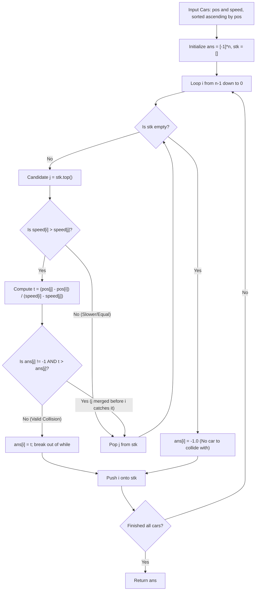

# Guided Example: Car Fleet II

We trace the step-by-step execution of the backward monotonic stack approach with collision time filtering on a representative problem instance:

- **Input:** `cars = [[1, 2], [2, 1], [4, 3], [7, 2]]`
- **Required Output:** `[1.0, -1.0, 3.0, -1.0]`

This instance features two independent pairs of cars where trailing faster cars collide with leading slower cars without interfering with each other, demonstrating the mechanics of right-to-left monotonic stack filtering and fleet collision calculation.

---

## 1. Instance & Teaching Goal

We are given $n$ cars traveling along a one-lane highway, where $\text{cars}[i] = [\text{position}_i, \text{speed}_i]$. The road positions are strictly increasing ($\text{position}_i < \text{position}_{i+1}$).
- Cars travel forward at constant speeds.
- No car can pass another car.
- When a faster car catches up to a slower car, they form a fleet, traveling together at the speed of the slower car.
- For each car $i$, we must determine the exact time in seconds when it collides with the next car or fleet ahead of it, or return $-1.0$ if it never collides.

### Direction of Causality
A car can only ever collide with cars positioned **ahead** of it (larger indices). Furthermore, whether a leading car collides and changes speed affects all trailing cars behind it.
Therefore, processing from **right to left** (from the frontmost car $n - 1$ back to car $0$) allows us to know the exact collision fate of every car ahead before evaluating the trailing car.

---

## 2. Conceptual Foundation & Invariants

### State Representation

| Component | Mathematical Definition | Role |
|---|---|---|
| Active Car Index $i$ | Trailing car being evaluated | Decrements from $n - 1$ down to $0$ |
| Candidate Fleet Index $j$ | $\text{stk}[-1]$ (top of stack) | Nearest potential obstacle car ahead |
| Relative Catch Time $t$ | $\frac{\text{pos}[j] - \text{pos}[i]}{\text{speed}[i] - \text{speed}[j]}$ | Time for car $i$ to overtake car $j$ assuming constant speeds |
| Car $j$ Collision Lifetime $\text{ans}[j]$ | Precomputed collision time for car $j$ | Time after which car $j$ merges into a forward fleet |
| Monotonic Stack $\text{stk}$ | Indices of active potential collision targets | Maintained in increasing order of speed |

### Mathematical Invariants

> **Monotonic Obstacle Elimination Theorem.**
> When car $i$ evaluates a candidate obstacle car $j$ ahead:
> 1. **Speed Inadmissibility:** If $\text{speed}[i] \le \text{speed}[j]$, car $i$ can never catch car $j$ while car $j$ maintains speed. Even if car $j$ later slows down by merging into another car, car $i$ will collide with that future fleet, not car $j$. Thus, car $j$ is never car $i$'s primary collision target and can be popped from the stack.
> 2. **Temporal Shadowing:** If $\text{speed}[i] > \text{speed}[j]$, calculate the hypothetical overtake time:
>    $$t = \frac{\text{pos}[j] - \text{pos}[i]}{\text{speed}[i] - \text{speed}[j]}$$
>    If $\text{ans}[j] \ne -1$ and $t > \text{ans}[j]$, then car $j$ merges into a forward fleet at time $\text{ans}[j] < t$. Car $j$ ceases to exist as an independent entity before car $i$ can catch it; hence car $j$ is shadowed and can be popped.
> 3. **Valid Collision:** If $t \le \text{ans}[j]$ (or $\text{ans}[j] = -1$), car $i$ reaches car $j$ while car $j$ is still independently traveling. Thus car $i$ collides with car $j$ at time $\text{ans}[i] = t$.

---

## 3. Step-by-Step Worked Execution

We trace `cars = [[1, 2], [2, 1], [4, 3], [7, 2]]` of length $n = 4$.
Initial state: $\text{ans} = [-1.0, -1.0, -1.0, -1.0]$, $\text{stk} = []$.

---

### Step 1: Process Car $3$ ($\text{pos} = 7, \text{speed} = 2$)
- Candidate stack is empty ($\text{stk} = []$).
- No cars exist ahead of car $3$.
- Decision: $\text{ans}[3] = -1.0$.
- Stack update: Push $3$ onto stack:
  $$\text{stk} = [3]$$

---

### Step 2: Process Car $2$ ($\text{pos} = 4, \text{speed} = 3$)
- Candidate from stack: $j = 3$ ($\text{pos} = 7, \text{speed} = 2$).
- Speed comparison:
  $$\text{speed}[2] = 3 > \text{speed}[3] = 2 \implies \text{Faster!}$$
- Calculate catch time $t$:
  $$t = \frac{\text{pos}[3] - \text{pos}[2]}{\text{speed}[2] - \text{speed}[3]} = \frac{7 - 4}{3 - 2} = \frac{3}{1} = 3.0\text{ s}$$
- Lifetime check:
  $\text{ans}[3] = -1.0$ (Car $3$ never collides).
  Since $\text{ans}[3] = -1.0$, car $3$ remains at speed $2$ indefinitely.
- Outcome: Car $2$ collides with car $3$ at $t = 3.0\text{ s}$.
- Record: $\text{ans}[2] = 3.0$.
- Stack update: Push $2$ onto stack:
  $$\text{stk} = [3, 2]$$

---

### Step 3: Process Car $1$ ($\text{pos} = 2, \text{speed} = 1$)
- Candidate $j = 2$ ($\text{speed} = 3$):
  - Speed comparison: $\text{speed}[1] = 1 \le \text{speed}[2] = 3$.
  - Car $1$ is slower than car $2$; it can never catch car $2$.
  - Action: Pop $2$ from stack.
- Candidate $j = 3$ ($\text{speed} = 2$):
  - Speed comparison: $\text{speed}[1] = 1 \le \text{speed}[3] = 2$.
  - Car $1$ is slower than car $3$; it can never catch car $3$.
  - Action: Pop $3$ from stack.
- Stack is now empty.
- Decision: Car $1$ never collides with any car ahead: $\text{ans}[1] = -1.0$.
- Stack update: Push $1$ onto stack:
  $$\text{stk} = [1]$$

---

### Step 4: Process Car $0$ ($\text{pos} = 1, \text{speed} = 2$)
- Candidate $j = 1$ ($\text{pos} = 2, \text{speed} = 1$):
  - Speed comparison: $\text{speed}[0] = 2 > \text{speed}[1] = 1 \implies \text{Faster!}$
  - Calculate catch time $t$:
    $$t = \frac{\text{pos}[1] - \text{pos}[0]}{\text{speed}[0] - \text{speed}[1]} = \frac{2 - 1}{2 - 1} = \frac{1}{1} = 1.0\text{ s}$$
  - Lifetime check:
    $\text{ans}[1] = -1.0$ (Car $1$ never collides).
  - Outcome: Car $0$ collides with car $1$ at $t = 1.0\text{ s}$.
- Record: $\text{ans}[0] = 1.0$.
- Stack update: Push $0$ onto stack:
  $$\text{stk} = [1, 0]$$

---

### Step 5: Termination
All $4$ cars evaluated. Final collision times:
$$\text{ans} = [1.0, -1.0, 3.0, -1.0]$$

---

## 4. Complete Execution Trace

| Car Index $i$ | $[\text{pos}, \text{speed}]$ | Top Candidate $j$ | $[\text{pos}_j, \text{speed}_j]$ | Speed Check | Calculated Catch Time $t$ | $\text{ans}[j]$ Check | Stack Action | Assigned $\text{ans}[i]$ | Stack After Step |
|---|---|---|---|---|---|---|---|---|---|
| $3$ | $[7, 2]$ | None | — | — | — | — | Empty stack | **$-1.0$** | $[3]$ |
| $2$ | $[4, 3]$ | $3$ | $[7, 2]$ | $3 > 2$ | $(7 - 4)/(3 - 2) = 3.0$ | $\text{ans}[3] = -1.0$ | Valid match | **$3.0$** | $[3, 2]$ |
| $1$ | $[2, 1]$ | $2$ | $[4, 3]$ | $1 \le 3$ | — | — | Pop $2$ | — | $[3]$ |
| $1$ | $[2, 1]$ | $3$ | $[7, 2]$ | $1 \le 2$ | — | — | Pop $3$ | **$-1.0$** | $[1]$ |
| $0$ | $[1, 2]$ | $1$ | $[2, 1]$ | $2 > 1$ | $(2 - 1)/(2 - 1) = 1.0$ | $\text{ans}[1] = -1.0$ | Valid match | **$1.0$** | $[1, 0]$ |

Final Result:
$$\text{ans} = [1.0, -1.0, 3.0, -1.0]$$

---

## 5. Algorithmic Correctness

### Key Invariants and Correctness Argument

1. **Safety of Shadowing Elimination:**
   If car $j$ merges with an obstacle ahead at time $\text{ans}[j]$, its velocity drops to that of the obstacle at that exact moment. Any car $i$ that would have overtaken car $j$ at time $t > \text{ans}[j]$ actually encounters the combined fleet ahead. Popping $j$ allows car $i$ to be tested directly against the fleet car $j$ merged with, ensuring exact physical accuracy.
2. **Monotonic Speed Structure:**
   Because all candidates with speed $\ge \text{speed}[i]$ are popped, the speeds of the remaining candidates strictly decrease down the stack, forming an ordered chain of increasingly slower barriers.

### Boundary and Edge Cases

| Scenario | Input Configuration | Expected Output | Strategic Handling |
|---|---|---|---|
| All Cars Same Speed | `[[1, 2], [3, 2], [5, 2]]` | `[-1.0, -1.0, -1.0]` | Relative speeds equal $0$; each car pops candidates and returns $-1.0$. |
| Strictly Increasing Speeds Ahead | `[[1, 1], [3, 2], [5, 3]]` | `[-1.0, -1.0, -1.0]` | Each car is slower than all cars ahead; no collisions occur. |
| Cascading Domino Collisions | Fast car behind slow car behind slower car | Correct chained times | Backward processing resolves lead collisions before trailing collisions. |
| Single Car | `[[10, 5]]` | `[-1.0]` | Stack empty; returns $-1.0$ directly. |

---

## 6. Complexity Derivation

- **Time Complexity:** $\mathcal{O}(n)$ where $n$ is the number of cars.
  - Each car index $i \in [0, n - 1]$ is pushed onto the monotonic stack exactly once.
  - Each car is popped from the stack at most once across the entire algorithm.
  - The inner loop body executes in $\mathcal{O}(1)$ time.
  - Total stack push and pop operations are bounded by $2n = \mathcal{O}(n)$.
  - For $n \le 10^5$, execution completes in under $0.05\text{ s}$.
- **Space Complexity:** $\mathcal{O}(n)$ auxiliary space to store the monotonic stack and output array.
