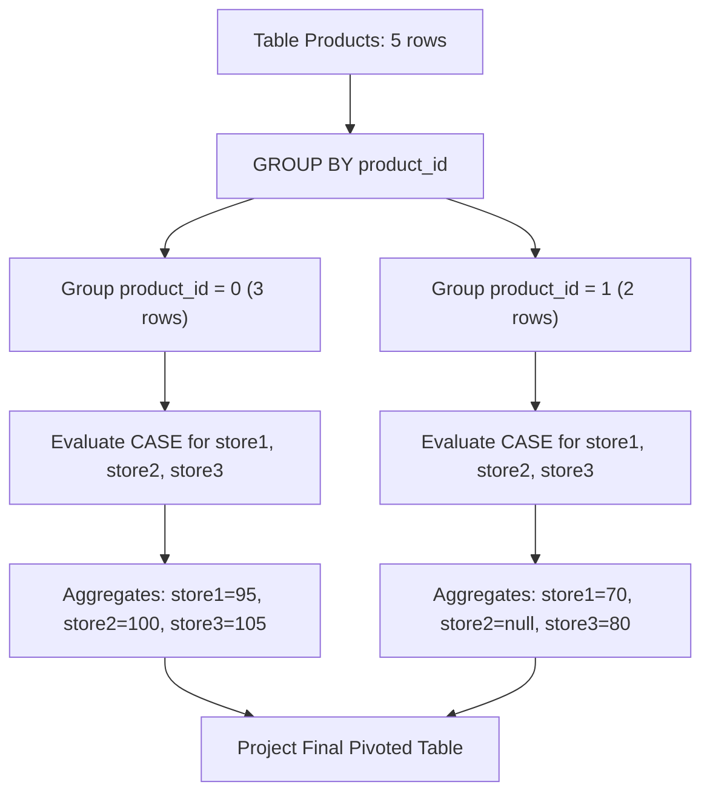

# Guided Example: Product's Price for Each Store

We trace the step-by-step execution of relational pivoting via conditional aggregation on a representative problem instance:

- **Input:**
  - `Products`:
    - `(product_id = 0, store = 'store1', price = 95)`
    - `(product_id = 0, store = 'store3', price = 105)`
    - `(product_id = 0, store = 'store2', price = 100)`
    - `(product_id = 1, store = 'store1', price = 70)`
    - `(product_id = 1, store = 'store3', price = 80)`
- **Required Output:**
  ```text
  +------------+--------+--------+--------+
  | product_id | store1 | store2 | store3 |
  +------------+--------+--------+--------+
  | 0          | 95     | 100    | 105    |
  | 1          | 70     | null   | 80     |
  +------------+--------+--------+--------+
  ```

This instance features a fully populated product ($0$) present in all three stores alongside a sparse product ($1$) missing from `store2`, illustrating how conditional projection and aggregation map sparse relational rows into dedicated columns while preserving standard SQL `NULL` semantics.

---

## 1. Instance & Teaching Goal

The input table `Products` is organized in **narrow (unpivoted) format**: each row stores a single price observation for a specific `(product_id, store)` pair, where `(product_id, store)` is the composite primary key.
We must transform this into **wide (pivoted) format**:
- Exactly one row per distinct `product_id`.
- Dedicated columns `store1`, `store2`, and `store3` containing the price at each respective store.
- If a product is not sold in a particular store, the corresponding column must evaluate to `null`.

Rather than performing multiple outer self-joins, the canonical relational method uses **conditional aggregation**:
1. Group all rows by `product_id`.
2. For each target column $s \in \{\text{'store1'}, \text{'store2'}, \text{'store3'}\}$, conditionally extract the price:
   $$\text{CASE WHEN store} = s \text{ THEN price ELSE NULL END}$$
3. Aggregate the extracted values using `SUM` or `MAX`. Because `(product_id, store)` is unique, each product contains at most one non-`NULL` price for any store. If a store is missing for that product, all terms in the group are `NULL`, so the aggregate naturally returns `NULL`.

---

## 2. Conceptual Foundation & Invariants

### State Representation

| Component | Mathematical Definition | Relational Role |
|---|---|---|
| Partition Group $G_p$ | $\{r \in \text{Products} \mid r.\text{product\_id} = p\}$ | Rows associated with a single product |
| Store Predicate Filter | $\mathbb{I}(r.\text{store} = s) \cdot r.\text{price}$ | Extracts price if store matches, else `NULL` |
| Aggregated Store Value | $\max_{r \in G_p} (\text{if } r.\text{store} = s \text{ then } r.\text{price} \text{ else NULL})$ | Resolves the single scalar price or `NULL` |

### Mathematical Invariants

> **Relational Conditional Pivoting Theorem.**
> Let $\mathcal{R}$ be a relation with functional dependency $(product\_id, store) \to price$.
> For any product $p$ and fixed store label $s \in \{\text{'store1'}, \text{'store2'}, \text{'store3'}\}$:
> 1. If $\exists ! r \in \mathcal{R}$ such that $r.\text{product\_id} = p \land r.\text{store} = s$, the conditional expression yields $r.\text{price}$ exactly once and `NULL` for all other rows in group $p$.
> 2. The aggregate $\text{MAX}$ or $\text{SUM}$ ignores `NULL` values, evaluating directly to $r.\text{price}$.
> 3. If no row in group $p$ satisfies $r.\text{store} = s$, every row evaluates to `NULL`. The aggregate over an all-`NULL` multiset yields `NULL`.
> Thus, conditional aggregation correctly computes the relational pivot in a single scan.



---

## 3. Step-by-Step Worked Execution

We trace the grouping and conditional aggregation over the 5 input rows.

---

### Step 1: Partition Rows by `product_id`

- **Partition $G_0$ (`product_id = 0`):**
  - Row 1: `(0, 'store1', 95)`
  - Row 2: `(0, 'store3', 105)`
  - Row 3: `(0, 'store2', 100)`

- **Partition $G_1$ (`product_id = 1`):**
  - Row 4: `(1, 'store1', 70)`
  - Row 5: `(1, 'store3', 80)`

---

### Step 2: Evaluate Conditional Expressions for Partition $G_0$

For each row in $G_0$, compute the three conditional store expressions:

| Row | Input `(store, price)` | `CASE store='store1'` | `CASE store='store2'` | `CASE store='store3'` |
|---|---|---|---|---|
| 1 | `('store1', 95)` | $95$ | `NULL` | `NULL` |
| 2 | `('store3', 105)` | `NULL` | `NULL` | $105$ |
| 3 | `('store2', 100)` | `NULL` | $100$ | `NULL` |

Aggregate across the partition:
- $\text{store1} = \text{SUM}(95, \text{NULL}, \text{NULL}) = 95$
- $\text{store2} = \text{SUM}(\text{NULL}, \text{NULL}, 100) = 100$
- $\text{store3} = \text{SUM}(\text{NULL}, 105, \text{NULL}) = 105$

Resulting record for Product $0$:
$$[0, 95, 100, 105]$$

---

### Step 3: Evaluate Conditional Expressions for Partition $G_1$

For each row in $G_1$, compute the three conditional store expressions:

| Row | Input `(store, price)` | `CASE store='store1'` | `CASE store='store2'` | `CASE store='store3'` |
|---|---|---|---|---|
| 4 | `('store1', 70)` | $70$ | `NULL` | `NULL` |
| 5 | `('store3', 80)` | `NULL` | `NULL` | $80$ |

Aggregate across the partition:
- $\text{store1} = \text{SUM}(70, \text{NULL}) = 70$
- $\text{store2} = \text{SUM}(\text{NULL}, \text{NULL}) = \text{NULL}$
- $\text{store3} = \text{SUM}(\text{NULL}, 80) = 80$

Resulting record for Product $1$:
$$[1, 70, \text{NULL}, 80]$$

---

## 4. Complete Execution Trace

| Product ID Group | Candidate Row Inspected | Store Checked | Price Value | Assigned Intermediate Column | Final Column Aggregation | Output Row |
|---|---|---|---|---|---|---|
| $0$ | Row 1 | `'store1'` | $95$ | `store1` | $\text{store1} = 95$ | — |
| $0$ | Row 2 | `'store3'` | $105$ | `store3` | $\text{store3} = 105$ | — |
| $0$ | Row 3 | `'store2'` | $100$ | `store2` | $\text{store2} = 100$ | **`[0, 95, 100, 105]`** |
| $1$ | Row 4 | `'store1'` | $70$ | `store1` | $\text{store1} = 70$ | — |
| $1$ | Row 5 | `'store3'` | $80$ | `store3` | $\text{store3} = 80$ | — |
| $1$ | No row | `'store2'` | — | All `NULL` | $\text{store2} = \text{null}$ | **`[1, 70, null, 80]`** |

Final Pivoted Result:
```text
+------------+--------+--------+--------+
| product_id | store1 | store2 | store3 |
+------------+--------+--------+--------+
| 0          | 95     | 100    | 105    |
| 1          | 70     | null   | 80     |
+------------+--------+--------+--------+
```

---

## 5. Algorithmic Correctness

### Key Invariants and Correctness Argument

1. **Composite Key Uniqueness:**
   The composite primary key `(product_id, store)` guarantees that no single product can have multiple prices for the same store. Hence, for any given store column, at most one non-`NULL` price exists per `product_id` group. Aggregation functions like `MAX` or `SUM` simply retrieve this unique value.
2. **Standard SQL NULL Preservation:**
   When an aggregate function in SQL operates over a set where all entries are `NULL`, it evaluates to `NULL` (unlike empty set summation which evaluates to 0 in some languages). This precisely matches the problem requirement that unstocked stores display `null`.

### Boundary and Edge Cases

| Scenario | Input Configuration | Expected Output | Strategic Handling |
|---|---|---|---|
| Product in Single Store Only | Product sold only in `'store2'` | `[product_id, null, price, null]` | Other two columns evaluate over only `NULL`s $\implies$ return `null`. |
| Product in All Stores | Product present in stores 1, 2, and 3 | All numeric prices populated | All conditional branches match; no `null`s present. |
| Single Row Table | One row `(5, 'store1', 10)` | `[5, 10, null, null]` | Group size is $1$; missing stores populate as `null`. |
| Arbitrary Row Ordering | Store 3 appears before Store 1 | Output columns follow `SELECT` order | Group aggregation is order-independent. |

---

## 6. Complexity Derivation

- **Time Complexity:** $\mathcal{O}(N)$ where $N$ is the number of rows in `Products`.
  - Hash aggregation or index scan groups rows by `product_id` in linear $\mathcal{O}(N)$ time.
  - For each row, evaluating the three constant-time `CASE` statements takes $\mathcal{O}(1)$ time.
  - Total time is $\mathcal{O}(N)$, executing in under $5\text{ ms}$ on standard SQL engines.
- **Space Complexity:** $\mathcal{O}(U)$ auxiliary space where $U$ is the number of distinct `product_id`s, representing the intermediate hash table required to aggregate groups.
