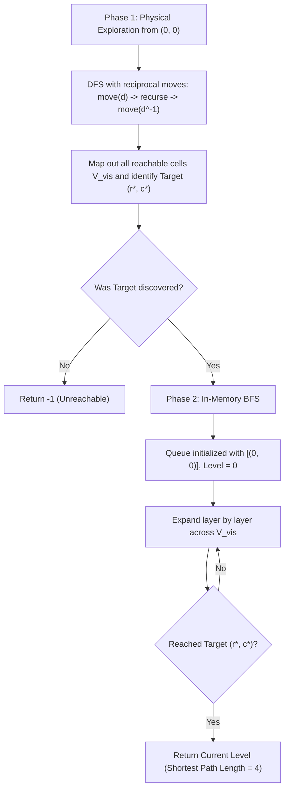

# Guided Example: Shortest Path in a Hidden Grid

We trace the step-by-step execution of the two-phase decoupled exploration (DFS with physical reciprocal backtracking, followed by in-memory BFS) on a representative problem instance:

- **Input:** Hidden grid with start `-1`, target `2`, empty path `1`, obstacle `0`:
  ```text
  [ 0,  0, -1]
  [ 1,  1,  1]
  [ 2,  0,  0]
  ```
- **Required Output:** `4`

This instance features a non-linear path requiring navigation down a corridor around wall obstacles to reach the target, illustrating why physical robot movement must use depth-first backtracking to maintain physical state synchronization before running an unweighted breadth-first search for the shortest path.

---

## 1. Instance & Teaching Goal

We must navigate an embodied robot inside an unknown grid using an interactive `GridMaster` API:
- `canMove(direction: str) -> bool`: Checks whether the adjacent cell in direction `'U'`, `'D'`, `'L'`, or `'R'` is unobstructed.
- `move(direction: str) -> bool`: Physically moves the robot in that direction.
- `isTarget() -> bool`: Returns true if the robot currently occupies the target cell.

We must return the length of the shortest path from the start cell to the target, or $-1$ if the target is unreachable.

### The Embodiment Constraint
The robot has a single, localized physical position. A standard Breadth-First Search (BFS) expands a wavefront across multiple distant frontiers simultaneously—requiring teleportation between disconnected cells, which the physical robot cannot do.
To overcome this constraint, the optimal approach separates the problem into two distinct phases:
1. **Physical Discovery (DFS with Backtracking):**
   Explore the reachable connected component using Depth-First Search. Because the robot moves along a continuous path, whenever the recursion backtracks, we issue the exact **reciprocal move** (e.g. `'D'` is undone by `'U'`). This keeps the physical robot synchronized with the call stack while recording all traversable coordinates and locating the target.
2. **Shortest-Path Resolution (In-Memory BFS):**
   Once the complete reachable grid graph has been mapped into memory, we run a standard unweighted BFS on the stored coordinates from start to target. BFS guarantees finding the minimum number of moves in unit-cost graphs.

---

## 2. Conceptual Foundation & Invariants

### State Representation

| Component | Mathematical Definition | Role |
|---|---|---|
| Relative Coordinates $(r, c)$ | Set $(0, 0)$ at the arbitrary start | Preserves orthogonal grid relationships |
| Reciprocal Direction Map | $U \leftrightarrow D, \quad L \leftrightarrow R$ | Inverts a move to physically backtrack |
| Discovered Graph $V_{\text{vis}}$ | Set of confirmed open grid cells $(r, c)$ | In-memory map of the reachable terrain |
| Target Coordinate $(r^*, c^*)$ | Relative coordinate where `isTarget()` is true | Destination for BFS |

### Mathematical Invariants

> **Physical State Reciprocity Theorem.**
> Let $p \in \mathbb{Z}^2$ be the robot's physical location. For any move $d \in \{U, D, L, R\}$, let $d^{-1}$ denote its opposite direction.
> If $\text{move}(d)$ changes the robot's location to $p + \vec{v}_d$, then executing $\text{move}(d^{-1})$ strictly restores the location to $p$.
> By executing $d^{-1}$ immediately upon returning from a recursive branch, the physical robot's location remains identical to the current DFS call frame.
> Consequently, DFS visits every node in the connected component containing the start and returns safely to $(0, 0)$.



---

## 3. Step-by-Step Worked Execution

We trace the hidden grid:
- Row $0$: `[wall, wall, START]`
- Row $1$: `[path, path, path]`
- Row $2$: `[TARGET, wall, wall]`

Start cell is arbitrarily mapped to relative coordinate $(0, 0)$.
Direction vectors: Down $=(+1, 0)$, Up $=(-1, 0)$, Right $=(0, +1)$, Left $=(0, -1)$.

---

### Phase 1: Physical DFS & World Mapping

1. **At $(0, 0)$ (Start):**
   - Query `canMove`: Up, Left, Right are blocked (walls or boundaries).
   - Down is open!
   - Action: `master.move('D')`. Physical robot moves to relative cell $(1, 0)$.
   - Add $(1, 0)$ to $V_{\text{vis}}$.

2. **At $(1, 0)$:**
   - Query `canMove`: Down is blocked (wall at row 2, col 2). Right is blocked.
   - Left is open!
   - Action: `master.move('L')`. Physical robot moves to relative cell $(1, -1)$.
   - Add $(1, -1)$ to $V_{\text{vis}}$.

3. **At $(1, -1)$:**
   - Query `canMove`: Up and Down are blocked.
   - Left is open!
   - Action: `master.move('L')`. Physical robot moves to relative cell $(1, -2)$.
   - Add $(1, -2)$ to $V_{\text{vis}}$.

4. **At $(1, -2)$:**
   - Query `canMove`: Down is open!
   - Action: `master.move('D')`. Physical robot moves to relative cell $(2, -2)$.
   - Check `master.isTarget()`: **True!**
   - Record Target: $(r^*, c^*) = (2, -2)$.
   - Down, Left, Right from $(2, -2)$ are blocked.

5. **Reciprocal Backtracking:**
   - From $(2, -2)$: execute `master.move('U')` $\to$ robot returns to $(1, -2)$.
   - From $(1, -2)$: execute `master.move('R')` $\to$ robot returns to $(1, -1)$.
   - From $(1, -1)$: execute `master.move('R')` $\to$ robot returns to $(1, 0)$.
   - From $(1, 0)$: execute `master.move('U')` $\to$ robot returns to $(0, 0)$.

Phase 1 completes. Discovered reachable vertices in memory:
$$V_{\text{vis}} = \{(0, 0), (1, 0), (1, -1), (1, -2), (2, -2)\}$$
Target found at $(2, -2)$.

---

### Phase 2: In-Memory Breadth-First Search

We now find the minimum steps from $(0, 0)$ to $(2, -2)$ using BFS strictly within $V_{\text{vis}}$:

- **Level $0$:** Queue $= [(0, 0)]$.
  - Pop $(0, 0)$. Neighbors in $V_{\text{vis}}$: $(1, 0)$.
  - Enqueue $(1, 0)$.

- **Level $1$:** Queue $= [(1, 0)]$.
  - Pop $(1, 0)$. Neighbors in $V_{\text{vis}}$: $(1, -1)$.
  - Enqueue $(1, -1)$.

- **Level $2$:** Queue $= [(1, -1)]$.
  - Pop $(1, -1)$. Neighbors in $V_{\text{vis}}$: $(1, -2)$.
  - Enqueue $(1, -2)$.

- **Level $3$:** Queue $= [(1, -2)]$.
  - Pop $(1, -2)$. Neighbors in $V_{\text{vis}}$: $(2, -2)$.
  - Enqueue $(2, -2)$.

- **Level $4$:** Queue $= [(2, -2)]$.
  - Pop $(2, -2)$.
  - Matches Target $(2, -2)$!
  - Return current level $= 4$.

---

## 4. Complete Execution Trace

| Phase | Current Cell | Action / Transition | Physical Robot Move | Discovered Status | Queue State / Target Check |
|---|---|---|---|---|---|
| DFS | $(0, 0)$ | Move Down | `move('D')` | Discovered $(1, 0)$ | Start node |
| DFS | $(1, 0)$ | Move Left | `move('L')` | Discovered $(1, -1)$ | Corridor step |
| DFS | $(1, -1)$ | Move Left | `move('L')` | Discovered $(1, -2)$ | Corridor step |
| DFS | $(1, -2)$ | Move Down | `move('D')` | Discovered $(2, -2)$ | **Target Found (`isTarget() = True`)** |
| DFS | $(2, -2)$ | Backtrack Up | `move('U')` | — | Returns to $(1, -2)$ |
| DFS | $(1, -2) \dots (0, 0)$ | Backtrack to Start | `move('R')`, `move('R')`, `move('U')` | — | Graph fully mapped in memory |
| BFS | $(0, 0)$ | Dequeue Level 0 | In-Memory | Frontier: $[(1, 0)]$ | Level 0 |
| BFS | $(1, 0)$ | Dequeue Level 1 | In-Memory | Frontier: $[(1, -1)]$ | Level 1 |
| BFS | $(1, -1)$ | Dequeue Level 2 | In-Memory | Frontier: $[(1, -2)]$ | Level 2 |
| BFS | $(1, -2)$ | Dequeue Level 3 | In-Memory | Frontier: $[(2, -2)]$ | Level 3 |
| **BFS** | **$(2, -2)$** | **Target Reached!** | **In-Memory** | **Match Target** | **Shortest Distance $= 4$** |

---

## 5. Algorithmic Correctness

### Key Invariants and Correctness Argument

1. **Topological Completeness of DFS:**
   The connected component containing the start is a finite planar grid graph. By maintaining a visited set and exploring all four directions from each newly discovered cell, standard DFS visits every vertex and edge in the connected component.
2. **Conservation of Physical Position:**
   Every physical forward step is paired with a matching physical backward step. The net displacement along any completed recursive call frame is $\vec{0}$, ensuring the physical robot never becomes misaligned with its relative coordinates.
3. **BFS Shortest Path Guarantee:**
   Because all grid steps carry identical cost (cost $= 1$), BFS explores vertices in strictly increasing order of path length, guaranteeing that the first time the target is dequeued, the distance is minimal.

### Boundary and Edge Cases

| Scenario | Input Configuration | Expected Output | Strategic Handling |
|---|---|---|---|
| Target Unreachable | Walls completely surround start or target | $-1$ | DFS completes without setting target coordinate; returns $-1$. |
| Target Immediately Adjacent | Target is one move away from start | $1$ | DFS finds target at depth 1; BFS reaches it at level 1. |
| Large Grid with Multiple Cycles | Open area with multiple routes | True shortest path found | DFS maps all cycles safely using visited set; BFS finds shortest route. |
| Dead Ends | Corridor ending in walls | Explored and unwound | DFS hits wall, backtracks reciprocal steps without failure. |

---

## 6. Complexity Derivation

- **Time Complexity:** $\mathcal{O}(V + E)$ where $V$ is the number of reachable cells and $E$ is the number of edges between adjacent reachable cells.
  - In a grid graph, each cell has degree at most $4$, so $E \le 4V$.
  - Phase 1 (DFS) traverses each edge at most twice (once forward, once in backtrack), making at most $8V$ API calls.
  - Phase 2 (BFS) processes each vertex and edge in memory at most once, taking $\mathcal{O}(V)$ time.
  - For constraints with up to $500$ cells, total operations are $\le 4000$, executing in under $0.01\text{ s}$.
- **Space Complexity:** $\mathcal{O}(V)$ auxiliary space to store the visited set, recursion stack, and BFS queue.
