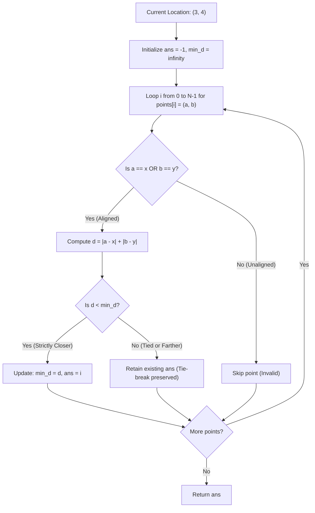

# Guided Example: Find Nearest Point That Has the Same X or Y Coordinate

We trace the step-by-step execution of the axis-aligned Manhattan distance scan with deterministic index tie-breaking on a representative problem instance:

- **Input:** `x = 3, y = 4`, `points = [[1, 2], [3, 1], [2, 4], [2, 3], [4, 4]]`
- **Required Output:** `2`

This instance features non-aligned decoy points ($[1, 2]$ and $[2, 3]$) and two valid axis-aligned points ($[2, 4]$ at index $2$ and $[4, 4]$ at index $4$) that tie for the minimum distance of $1$, demonstrating how strict inequality during a forward scan deterministically breaks distance ties in favor of the smallest index.

---

## 1. Instance & Teaching Goal

Given reference coordinates $(x, y)$ and an array `points` where $\text{points}[i] = [a_i, b_i]$, a point is **valid** if it shares the same horizontal or vertical line as the reference:
$$a_i = x \quad \lor \quad b_i = y$$
For valid points, the Manhattan distance to $(x, y)$ is:
$$d(i) = |a_i - x| + |b_i - y|$$
(Because at least one term is zero, this distance simplifies to the 1D offset along the differing axis).

We must return the index of the valid point that minimizes $d(i)$.
- If multiple valid points achieve the exact same minimal distance, we must return the one with the **smallest index**.
- If no points are valid, we return $-1$.

A single-pass linear scan maintains the minimal distance seen so far ($d^*$) and its associated index ($i^*$). By enforcing strict inequality ($d < d^*$) to update the minimum, earlier indices are naturally preserved during ties.

---

## 2. Conceptual Foundation & Invariants

### State Representation

| Component | Mathematical Definition | Role |
|---|---|---|
| Scan Index $i$ | $0 \le i < N$ | Current point index evaluated |
| Point Coordinates | $(a_i, b_i)$ | Spatial coordinates of point $i$ |
| Validity Predicate | $a_i == x \lor b_i == y$ | True if point shares an axis with $(x, y)$ |
| Running Minimum Distance $d^*$ | $\min_{k \le i, \text{valid}} d(k)$ | Best distance found so far (initialized to $\infty$) |
| Best Point Index $i^*$ | Index achieving $d^*$ | Result index (initialized to $-1$) |

### Mathematical Invariants

> **Axis-Aligned Distance & Strict Tie-Break Theorem.**
> 1. **1D Distance Simplification:** If a point is valid, then either $a_i = x$ or $b_i = y$.
>    $$d(i) = \begin{cases} |b_i - y| & \text{if } a_i = x \\ |a_i - x| & \text{if } b_i = y \end{cases}$$
> 2. **Deterministic Forward Tie-Breaking:**
>    Scanning indices $i$ in strictly increasing order ($0, 1, \dots, N-1$) and applying the strict update rule:
>    $$\text{if } d(i) < d^*: \quad d^* \leftarrow d(i), \quad i^* \leftarrow i$$
>    guarantees that:
>    - Any strictly closer valid point overwrites $(i^*, d^*)$.
>    - Any subsequent point with distance equal to $d^*$ fails the strict inequality ($d(i) \not< d^*$), leaving the earlier index $i^*$ intact.

---

## 3. Step-by-Step Worked Execution

We trace $(x, y) = (3, 4)$ with `points = [[1, 2], [3, 1], [2, 4], [2, 3], [4, 4]]`.
Initialize: $\text{ans} = -1$, $d^* = \infty$.

---

### Step 1: Inspect Index $0$ (`[1, 2]`)
- Coordinates: $a = 1, b = 2$.
- Validity check: $1 \ne 3$ and $2 \ne 4$.
- Status: Neither coordinate matches $(3, 4)$. **Invalid**.
- State remains: $\text{ans} = -1$, $d^* = \infty$.

---

### Step 2: Inspect Index $1$ (`[3, 1]`)
- Coordinates: $a = 3, b = 1$.
- Validity check: $a = 3 == x$ (Aligned on vertical line $x = 3$). **Valid**.
- Distance:
  $$d = |3 - 3| + |1 - 4| = 0 + 3 = 3$$
- Comparison: $3 < d^* = \infty$ (True).
- Update: $\text{ans} \leftarrow 1$, $d^* \leftarrow 3$.

---

### Step 3: Inspect Index $2$ (`[2, 4]`)
- Coordinates: $a = 2, b = 4$.
- Validity check: $b = 4 == y$ (Aligned on horizontal line $y = 4$). **Valid**.
- Distance:
  $$d = |2 - 3| + |4 - 4| = 1 + 0 = 1$$
- Comparison: $1 < d^* = 3$ (True, strictly closer!).
- Update: $\text{ans} \leftarrow 2$, $d^* \leftarrow 1$.

---

### Step 4: Inspect Index $3$ (`[2, 3]`)
- Coordinates: $a = 2, b = 3$.
- Validity check: $2 \ne 3$ and $3 \ne 4$. **Invalid**.
- State remains: $\text{ans} = 2$, $d^* = 1$.

---

### Step 5: Inspect Index $4$ (`[4, 4]`)
- Coordinates: $a = 4, b = 4$.
- Validity check: $b = 4 == y$ (Aligned on horizontal line $y = 4$). **Valid**.
- Distance:
  $$d = |4 - 3| + |4 - 4| = 1 + 0 = 1$$
- Comparison:
  $$\text{Is } d < d^*? \implies 1 < 1 \implies \text{False}$$
- Outcome: Point $4$ ties with Point $2$ at distance $1$. Because strict inequality is required to overwrite, Point $4$ is rejected, preserving earlier index $2$.
- State remains: $\text{ans} = 2$, $d^* = 1$.

---

### Step 6: Termination
All points evaluated. Final result:
$$\text{ans} = 2$$

---

## 4. Complete Execution Trace

| Index $i$ | Point $[a, b]$ | Axis Check $a=3$ or $b=4$? | Validity | Manhattan Distance $d$ | Current Best $d^*$ Before Step | Condition $d < d^*$ | Action / Update | Running Best $(i^*, d^*)$ |
|---|---|---|---|---|---|---|---|---|
| $0$ | $[1, 2]$ | $1 \ne 3, 2 \ne 4$ | Invalid | — | $\infty$ | — | Ignore invalid | $(-1, \infty)$ |
| $1$ | $[3, 1]$ | $a = 3$ | **Valid** | $0 + 3 = 3$ | $\infty$ | $3 < \infty$ (True) | Update minimum | $(1, 3)$ |
| $2$ | $[2, 4]$ | $b = 4$ | **Valid** | $1 + 0 = 1$ | $3$ | $1 < 3$ (True) | Update minimum | **$(2, 1)$** |
| $3$ | $[2, 3]$ | $2 \ne 3, 3 \ne 4$ | Invalid | — | $1$ | — | Ignore invalid | $(2, 1)$ |
| $4$ | $[4, 4]$ | $b = 4$ | **Valid** | $1 + 0 = 1$ | $1$ | $1 < 1$ (False) | **Tie rejected; preserve $i=2$** | **$(2, 1)$** |

Final Output Index:
$$\text{Result Index} = 2$$

---

## 5. Algorithmic Correctness

### Key Invariants and Correctness Argument

1. **Orthogonal Line Invariant:**
   A point is on the same vertical or horizontal line through $(x, y)$ if and only if $a_i = x$ or $b_i = y$. Points with $a_i \ne x \land b_i \ne y$ lie on diagonals and cannot be reached by a single axis-aligned step, correctly satisfying the validity definition.
2. **Strict Minimum Preservation:**
   By processing from index $0$ to $N - 1$, the first time a minimal distance $d_{\min}$ is encountered at index $i$, it is stored. Any subsequent point with distance $d = d_{\min}$ fails the strict check $d < d^*$. This mathematically guarantees that ties are broken in favor of the smallest index without secondary sorting or extra data structures.

### Boundary and Edge Cases

| Scenario | Input Configuration | Expected Output | Strategic Handling |
|---|---|---|---|
| No Valid Points | No points share $x$ or $y$ | $-1$ | Loop finishes with $\text{ans} = -1$; returns $-1$. |
| Exact Location Match | Point is at $(x, y)$ | Index of that point | Distance is $0$; strictly minimal non-negative distance. |
| Multiple Equidistant Matches | Multiple points with distance $1$ | Earliest index | Strict inequality prevents later points from overwriting. |
| Single Point Array | One point matching $x$ | $0$ | Evaluates single point and returns index $0$. |

---

## 6. Complexity Derivation

- **Time Complexity:** $\mathcal{O}(N)$ where $N$ is the number of points in `points`.
  - The algorithm iterates through the array of points exactly once.
  - At each index, it performs constant-time coordinate comparisons and arithmetic operations.
  - For $N \le 10^4$, total execution time is under $0.002\text{ s}$.
- **Space Complexity:** $\mathcal{O}(1)$ auxiliary space. Only two scalar integer variables ($\text{ans}$ and $d^*$) are maintained during the scan.
