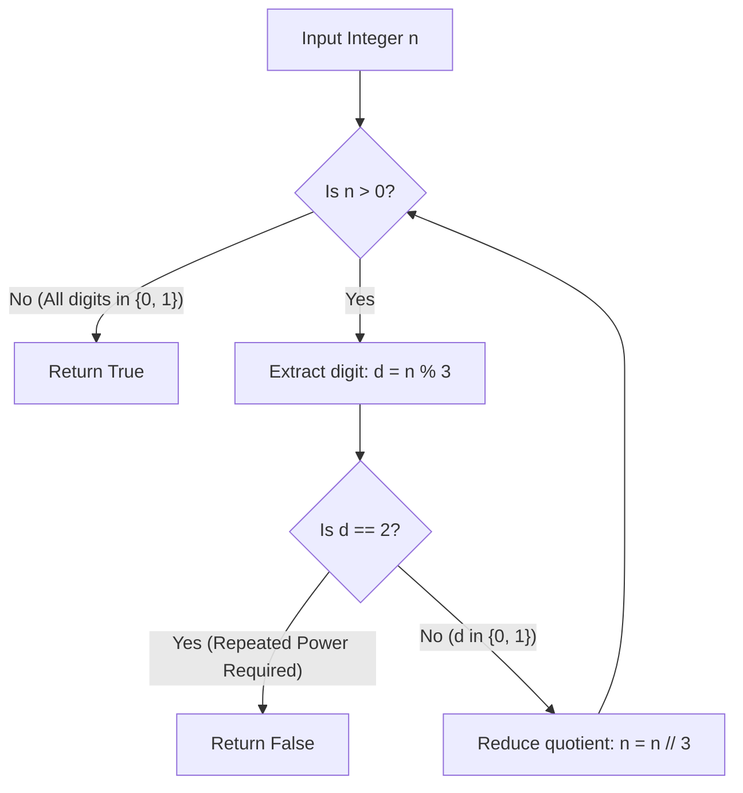

# Guided Example: Check if Number is a Sum of Powers of Three

We trace the step-by-step execution of the ternary radix decomposition approach on a representative problem instance:

- **Input:** `n = 91`
- **Required Output:** `true`

This instance features non-consecutive powers of three ($91 = 3^4 + 3^2 + 3^0 = 81 + 9 + 1$), clearly demonstrating how base-$3$ digit extraction verifies whether an integer can be formed using distinct powers without reusing any power.

---

## 1. Instance & Teaching Goal

Given an integer $n$, we must determine whether $n$ can be represented as the sum of **distinct powers of three**:
$$n = \sum_{k \in S} 3^k \quad \text{where } S \subset \{0, 1, 2, \dots\} \text{ is a set of distinct non-negative integers}$$

Every positive integer $n$ has a unique representation in base $3$ (ternary):
$$n = \sum_{k=0}^m d_k \cdot 3^k, \quad \text{where } d_k \in \{0, 1, 2\}$$
- If a power $3^k$ is not used, its coefficient is $d_k = 0$.
- If a power $3^k$ is used once, its coefficient is $d_k = 1$.
- If a power $3^k$ is required twice, its coefficient is $d_k = 2$.

Because the base-$3$ representation is strictly unique for every integer, $n$ can be expressed as a sum of **distinct** powers of three if and only if **no digit in its ternary expansion equals $2$**:
$$d_k \in \{0, 1\} \quad \text{for all } k$$
We extract each ternary digit from least significant to most significant via repeated division by $3$. If any remainder equals $2$, we immediately conclude `false`. If the quotient reaches $0$ without encountering a $2$, we return `true`.

---

## 2. Conceptual Foundation & Invariants

### State Representation

| Component | Mathematical Definition | Role |
|---|---|---|
| Active Quotient $n$ | $\lfloor n / 3^k \rfloor$ | Remaining magnitude to be decomposed |
| Current Digit $d_k$ | $n \pmod 3$ | Multiplicity of the $k$-th power of three |
| Exponent Index $k$ | Integer $k \ge 0$ | Current power $3^k$ under evaluation |

### Mathematical Invariants

> **Ternary Coefficient Uniqueness Invariant.**
> By the fundamental theorem of radix representations, for any integer $n \ge 0$, there exists a unique sequence of digits $d_k \in \{0, 1, 2\}$ such that $n = \sum_{k=0}^\infty d_k 3^k$.
> 1. If $\exists k$ such that $d_k = 2$, representing $n$ requires $2 \times 3^k$. Since $2 \times 3^k$ cannot be synthesized by any combination of smaller distinct powers (as $\sum_{j=0}^{k-1} 3^j = \frac{3^k - 1}{2} < 3^k < 2 \times 3^k$), no distinct power subset exists.
> 2. Conversely, if $d_k \in \{0, 1\}$ for all $k$, the set $S = \{k \mid d_k = 1\}$ provides the exact distinct power subset.

---

## 3. Step-by-Step Worked Execution

We trace $n = 91$:

---

### Step 1: Extract Power $3^0$ ($k = 0$)
- Active value: $n = 91$.
- Compute remainder:
  $$d_0 = 91 \pmod 3 = 1$$
- Digit Check: $1 \ne 2$ (Valid, power $3^0 = 1$ is included).
- Update quotient:
  $$n \leftarrow \lfloor 91 / 3 \rfloor = 30$$

---

### Step 2: Extract Power $3^1$ ($k = 1$)
- Active value: $n = 30$.
- Compute remainder:
  $$d_1 = 30 \pmod 3 = 0$$
- Digit Check: $0 \ne 2$ (Valid, power $3^1 = 3$ is not used).
- Update quotient:
  $$n \leftarrow \lfloor 30 / 3 \rfloor = 10$$

---

### Step 3: Extract Power $3^2$ ($k = 2$)
- Active value: $n = 10$.
- Compute remainder:
  $$d_2 = 10 \pmod 3 = 1$$
- Digit Check: $1 \ne 2$ (Valid, power $3^2 = 9$ is included).
- Update quotient:
  $$n \leftarrow \lfloor 10 / 3 \rfloor = 3$$

---

### Step 4: Extract Power $3^3$ ($k = 3$)
- Active value: $n = 3$.
- Compute remainder:
  $$d_3 = 3 \pmod 3 = 0$$
- Digit Check: $0 \ne 2$ (Valid, power $3^3 = 27$ is not used).
- Update quotient:
  $$n \leftarrow \lfloor 3 / 3 \rfloor = 1$$

---

### Step 5: Extract Power $3^4$ ($k = 4$)
- Active value: $n = 1$.
- Compute remainder:
  $$d_4 = 1 \pmod 3 = 1$$
- Digit Check: $1 \ne 2$ (Valid, power $3^4 = 81$ is included).
- Update quotient:
  $$n \leftarrow \lfloor 1 / 3 \rfloor = 0$$

---

### Step 6: Loop Termination & Verification
- Quotient has reached $0$.
- Zero digits equaled $2$.
- Derived base-$3$ expansion:
  $$91_{10} = 10101_3$$
- Mathematical reconstruction:
  $$1 \cdot 3^4 + 0 \cdot 3^3 + 1 \cdot 3^2 + 0 \cdot 3^1 + 1 \cdot 3^0 = 81 + 0 + 9 + 0 + 1 = 91$$
- Return `true`.

---

## 4. Complete Execution Trace

| Step $k$ | Active Quotient $n$ | Remainder $d_k = n \pmod 3$ | Condition $d_k == 2$? | Power Value $3^k$ | Inclusion Status | Next Quotient $\lfloor n / 3 \rfloor$ |
|---|---|---|---|---|---|---|
| $0$ | $91$ | $1$ | False | $3^0 = 1$ | **Included ($+1$)** | $30$ |
| $1$ | $30$ | $0$ | False | $3^1 = 3$ | Skipped | $10$ |
| $2$ | $10$ | $1$ | False | $3^2 = 9$ | **Included ($+9$)** | $3$ |
| $3$ | $3$ | $0$ | False | $3^3 = 27$ | Skipped | $1$ |
| $4$ | $1$ | $1$ | False | $3^4 = 81$ | **Included ($+81$)** | $0$ |
| Term | $0$ | — | — | — | All digits verified | **`true`** |

### Counter-Example Demonstration: $n = 21$
- Step 0: $21 \pmod 3 = 0, n \leftarrow 7$.
- Step 1: $7 \pmod 3 = 1, n \leftarrow 2$.
- Step 2: $2 \pmod 3 = \mathbf{2}$! Condition $d == 2$ met $\implies$ **Immediately returns `false`**.
- Reason: $21 = 2 \cdot 3^2 + 1 \cdot 3^1 = 18 + 3$. The power $3^2 = 9$ would have to be used twice.

---

## 5. Algorithmic Correctness

### Key Invariants and Correctness Argument

1. **Sufficiency and Necessity:**
   An integer is representable as a sum of distinct powers of three if and only if its expansion in base 3 uses only digits $\{0, 1\}$. Modulo arithmetic extracts these digits deterministically.
2. **Strict Bound on Smaller Powers:**
   The maximum sum achievable using one copy each of powers strictly less than $3^k$ is:
   $$\sum_{j=0}^{k-1} 3^j = \frac{3^k - 1}{2} < 3^k$$
   Therefore, if a number requires $2 \times 3^k$, it cannot be decomposed into smaller distinct powers, proving that no alternate distinct-power decomposition exists.

### Boundary and Edge Cases

| Scenario | Input | Expected Output | Strategic Handling |
|---|---|---|---|
| Minimum Input ($n = 1$) | $n = 1$ | `true` | $1 \pmod 3 = 1, n \leftarrow 0$; returns `true` ($3^0$). |
| Pure Power of Three | $n = 27$ | `true` | $27_{10} = 1000_3$; three zeros followed by single $1$. |
| Number Requiring Two of a Power | $n = 2$ | `false` | $2 \pmod 3 = 2$; immediately returns `false`. |
| Maximum Constraint ($n = 10^7$) | $n = 10^7$ | `false` | $10^7$ terminates in at most $15$ divisions. |

---

## 6. Complexity Derivation

- **Time Complexity:** $\mathcal{O}(\log_3 n)$ divisions.
  - The quotient $n$ decreases by a factor of $3$ on each iteration.
  - For $n \le 10^7$, $\log_3(10^7) \approx 14.6$, requiring at most $15$ loop iterations.
  - Total time is $\mathcal{O}(\log_3 n) \approx 0.0001\text{ ms}$.
- **Space Complexity:** $\mathcal{O}(1)$ auxiliary space. Only scalar integer variables are used.
