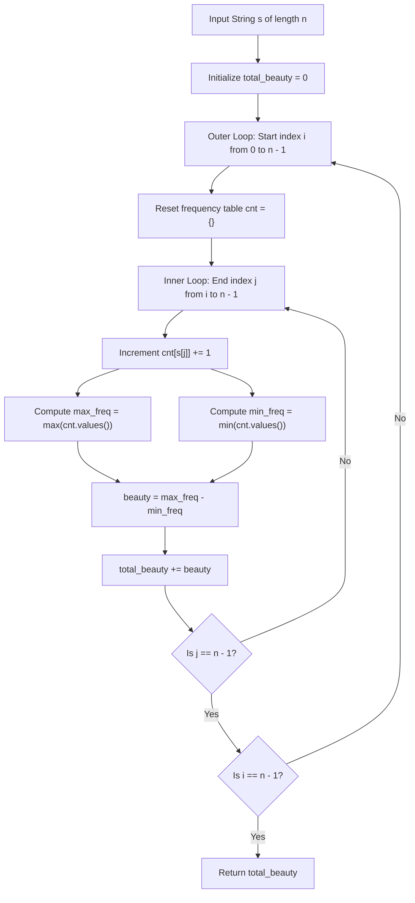

# Guided Example: Sum of Beauty of All Substrings

We trace the step-by-step execution of the incremental frequency tracking approach on a representative problem instance:

- **Input:** `s = "aabcb"`
- **Required Output:** `5`

This instance features alternating frequencies across substrings of varying lengths, demonstrating how incremental character histogram updates compute the difference between maximum and minimum non-zero character counts in polynomial time.

---

## 1. Instance & Teaching Goal

Given a string `s` of length $n$, the **beauty** of a substring is defined as the difference in frequency between its most frequent and least frequent characters:
$$\text{beauty}(sub) = \max_{c \in sub} \text{freq}(c) - \min_{c \in sub} \text{freq}(c)$$
Note that the minimum is taken strictly over characters that **actually appear** in the substring ($\text{freq}(c) \ge 1$). Absent alphabet characters ($\text{freq} = 0$) are strictly excluded.
We must compute the sum of beauty across all $\frac{n(n+1)}{2}$ contiguous substrings of `s`.

A naive approach that recalculates frequencies from scratch for every substring takes $\mathcal{O}(n^3)$ time.
By fixing the starting index $i$ and expanding the ending index $j$ from $i$ to $n - 1$:
- We maintain a single running character count vector $\text{cnt}$ of length $26$.
- Adding $s[j]$ updates $\text{cnt}[s[j]]$ in $\mathcal{O}(1)$ time.
- The maximum and non-zero minimum frequencies of the current substring $s[i \dots j]$ are evaluated in $\mathcal{O}(|\Sigma|) = \mathcal{O}(26)$ checks.
- This reduces total execution to $\mathcal{O}(n^2 \cdot |\Sigma|)$ operations.

---

## 2. Conceptual Foundation & Invariants

### State Representation

| Component | Mathematical Definition | Role |
|---|---|---|
| Window Start $i$ | $0 \le i < n$ | Anchor of the active substring |
| Window End $j$ | $i \le j < n$ | Current expansion boundary |
| Frequency Vector $\text{cnt}$ | $\text{cnt}[c] = |\{k \in [i, j] \mid s[k] = c\}|$ | Multiplicity of each letter in $s[i \dots j]$ |
| Substring Beauty $B(i, j)$ | $\max_{c: \text{cnt}[c] > 0} \text{cnt}[c] - \min_{c: \text{cnt}[c] > 0} \text{cnt}[c]$ | Beauty value for slice $s[i \dots j]$ |
| Global Sum Accumulator | $\sum_{0 \le i \le j < n} B(i, j)$ | Cumulative beauty of all substrings |

### Mathematical Invariants

> **Incremental Histogram Invariant.**
> For any fixed starting index $i$:
> 1. $\text{cnt}_{i, i}[s[i]] = 1$ and $\text{cnt}_{i, i}[c] = 0$ for all $c \ne s[i]$.
> 2. For any $j > i$, the frequency vector satisfies:
>    $$\text{cnt}_{i, j}[c] = \text{cnt}_{i, j-1}[c] + \mathbb{I}(s[j] = c)$$
> 3. The beauty $B(i, j) = \max_{v > 0} v - \min_{v > 0} v$ depends exclusively on the non-zero entries of $\text{cnt}_{i, j}$.
> Preserving the vector between steps avoids re-scanning $s[i \dots j-1]$, evaluating all substrings anchored at $i$ in $\mathcal{O}(n \cdot |\Sigma|)$ time.

---

## 3. Step-by-Step Worked Execution

We trace `s = "aabcb"` of length $n = 5$. Total substrings: $\frac{5 \times 6}{2} = 15$.
Initial total: $\text{ans} = 0$.

---

### Outer Iteration $i = 0$ (Starting at $s[0] = \text{'a'}$)
Initialize $\text{cnt} = \{\}$.

1. **$j = 0$ (`"a"`):**
   - $\text{cnt} = \{\text{'a'}: 1\}$.
   - $\max = 1, \min = 1 \implies B(0, 0) = 1 - 1 = 0$.
   - $\text{ans} \leftarrow 0$.

2. **$j = 1$ (`"aa"`):**
   - Add $s[1] = \text{'a'} \implies \text{cnt} = \{\text{'a'}: 2\}$.
   - $\max = 2, \min = 2 \implies B(0, 1) = 2 - 2 = 0$.
   - $\text{ans} \leftarrow 0$.

3. **$j = 2$ (`"aab"`):**
   - Add $s[2] = \text{'b'} \implies \text{cnt} = \{\text{'a'}: 2, \text{'b'}: 1\}$.
   - $\max = 2, \min = 1 \implies B(0, 2) = 2 - 1 = \mathbf{1}$.
   - $\text{ans} \leftarrow 0 + 1 = 1$.

4. **$j = 3$ (`"aabc"`):**
   - Add $s[3] = \text{'c'} \implies \text{cnt} = \{\text{'a'}: 2, \text{'b'}: 1, \text{'c'}: 1\}$.
   - $\max = 2, \min = 1 \implies B(0, 3) = 2 - 1 = \mathbf{1}$.
   - $\text{ans} \leftarrow 1 + 1 = 2$.

5. **$j = 4$ (`"aabcb"`):**
   - Add $s[4] = \text{'b'} \implies \text{cnt} = \{\text{'a'}: 2, \text{'b'}: 2, \text{'c'}: 1\}$.
   - $\max = 2, \min = 1 \implies B(0, 4) = 2 - 1 = \mathbf{1}$.
   - $\text{ans} \leftarrow 2 + 1 = 3$.

---

### Outer Iteration $i = 1$ (Starting at $s[1] = \text{'a'}$)
Reset $\text{cnt} = \{\}$.

1. **$j = 1$ (`"a"`):** $\text{cnt} = \{\text{'a'}: 1\} \implies 1 - 1 = 0$.
2. **$j = 2$ (`"ab"`):** $\text{cnt} = \{\text{'a'}: 1, \text{'b'}: 1\} \implies 1 - 1 = 0$.
3. **$j = 3$ (`"abc"`):** $\text{cnt} = \{\text{'a'}: 1, \text{'b'}: 1, \text{'c'}: 1\} \implies 1 - 1 = 0$.
4. **$j = 4$ (`"abcb"`):**
   - Add $s[4] = \text{'b'} \implies \text{cnt} = \{\text{'a'}: 1, \text{'b'}: 2, \text{'c'}: 1\}$.
   - $\max = 2$ (`'b'`), $\min = 1$ (`'a'`, `'c'`) $\implies B(1, 4) = 2 - 1 = \mathbf{1}$.
   - $\text{ans} \leftarrow 3 + 1 = 4$.

---

### Outer Iteration $i = 2$ (Starting at $s[2] = \text{'b'}$)
Reset $\text{cnt} = \{\}$.

1. **$j = 2$ (`"b"`):** $\text{cnt} = \{\text{'b'}: 1\} \implies 0$.
2. **$j = 3$ (`"bc"`):** $\text{cnt} = \{\text{'b'}: 1, \text{'c'}: 1\} \implies 0$.
3. **$j = 4$ (`"bcb"`):**
   - Add $s[4] = \text{'b'} \implies \text{cnt} = \{\text{'b'}: 2, \text{'c'}: 1\}$.
   - $\max = 2$ (`'b'`), $\min = 1$ (`'c'`) $\implies B(2, 4) = 2 - 1 = \mathbf{1}$.
   - $\text{ans} \leftarrow 4 + 1 = 5$.

---

### Outer Iterations $i = 3$ and $i = 4$
- $i = 3$:
  - `"c"` $\implies 0$
  - `"cb"` $\implies 0$
- $i = 4$:
  - `"b"` $\implies 0$

No further positive beauty values are found.
Final total beauty:
$$\text{ans} = 5$$

---

## 4. Complete Execution Trace

| Start $i$ | End $j$ | Substring $s[i \dots j]$ | Character Frequencies | Max Freq | Min Freq | Substring Beauty | Running Total Beauty |
|---|---|---|---|---|---|---|---|
| $0$ | $0$ | `"a"` | $\{a: 1\}$ | $1$ | $1$ | $0$ | $0$ |
| $0$ | $1$ | `"aa"` | $\{a: 2\}$ | $2$ | $2$ | $0$ | $0$ |
| $0$ | $2$ | `"aab"` | $\{a: 2, b: 1\}$ | $2$ | $1$ | **$1$** | **$1$** |
| $0$ | $3$ | `"aabc"` | $\{a: 2, b: 1, c: 1\}$ | $2$ | $1$ | **$1$** | **$2$** |
| $0$ | $4$ | `"aabcb"` | $\{a: 2, b: 2, c: 1\}$ | $2$ | $1$ | **$1$** | **$3$** |
| $1$ | $1$ | `"a"` | $\{a: 1\}$ | $1$ | $1$ | $0$ | $3$ |
| $1$ | $2$ | `"ab"` | $\{a: 1, b: 1\}$ | $1$ | $1$ | $0$ | $3$ |
| $1$ | $3$ | `"abc"` | $\{a: 1, b: 1, c: 1\}$ | $1$ | $1$ | $0$ | $3$ |
| $1$ | $4$ | `"abcb"` | $\{a: 1, b: 2, c: 1\}$ | $2$ | $1$ | **$1$** | **$4$** |
| $2$ | $2$ | `"b"` | $\{b: 1\}$ | $1$ | $1$ | $0$ | $4$ |
| $2$ | $3$ | `"bc"` | $\{b: 1, c: 1\}$ | $1$ | $1$ | $0$ | $4$ |
| $2$ | $4$ | `"bcb"` | $\{b: 2, c: 1\}$ | $2$ | $1$ | **$1$** | **$5$** |
| $3$ | $3$ | `"c"` | $\{c: 1\}$ | $1$ | $1$ | $0$ | $5$ |
| $3$ | $4$ | `"cb"` | $\{c: 1, b: 1\}$ | $1$ | $1$ | $0$ | $5$ |
| $4$ | $4$ | `"b"` | $\{b: 1\}$ | $1$ | $1$ | $0$ | $5$ |

Final Sum of Beauty:
$$\text{Total Beauty} = 5$$

---

## 5. Algorithmic Correctness

### Key Invariants and Correctness Argument

1. **Strict Non-Zero Minimum Rule:**
   Characters not appearing in the substring have frequency $0$. If $0$ were counted as the minimum, the beauty of any string with fewer than $26$ distinct letters would simply be the maximum frequency, violating the problem definition. Taking the minimum strictly over characters with $\text{freq} \ge 1$ ensures mathematical conformity with the problem contract.
2. **Exhaustive Substring Enumeration:**
   Every pair $(i, j)$ with $0 \le i \le j < n$ is visited exactly once. The frequency distribution for each slice is maintained without loss or duplication.

### Boundary and Edge Cases

| Scenario | Input | Expected Output | Strategic Handling |
|---|---|---|---|
| Homogeneous String | `s = "aaaa"` | $0$ | Only one character present; $\max = \min$ for every substring $\implies$ beauty is $0$. |
| All Distinct Characters | `s = "abcdef"` | $0$ | Every character in any substring has count $1$; $1 - 1 = 0$. |
| Alternating Characters | `s = "aba"` | $1$ | Substring `"aba"` has counts $\{a: 2, b: 1\}$; beauty $2 - 1 = 1$. |
| Single Character | `s = "z"` | $0$ | Only substring is `"z"`, beauty $1 - 1 = 0$. |

---

## 6. Complexity Derivation

- **Time Complexity:** $\mathcal{O}(n^2 \cdot |\Sigma|)$ where $n = |s|$ and $|\Sigma| \le 26$.
  - The nested loops evaluate exactly $\frac{n(n+1)}{2}$ substring windows.
  - At each window expansion, updating the count takes $\mathcal{O}(1)$ time.
  - Finding the maximum and minimum among non-zero entries takes at most $|\Sigma| \le 26$ checks.
  - Total operations: $\frac{n(n+1)}{2} \times 26 \approx 13 n^2$. For $n \le 500$, total operations are $\approx 3.25 \times 10^6$, executing in under $0.04\text{ s}$.
- **Space Complexity:** $\mathcal{O}(|\Sigma|) = \mathcal{O}(1)$ auxiliary space to store the frequency map of at most $26$ unique lowercase English characters.
