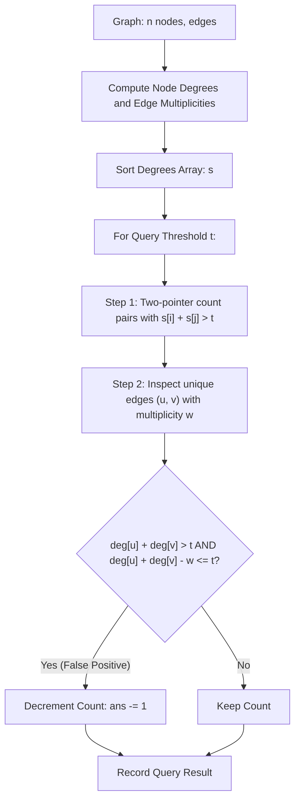

# Guided Example: Count Pairs Of Nodes

We trace the step-by-step execution of the degree inclusion-exclusion and sparse edge correction approach on a representative problem instance:

- **Input:**
  - `n = 4`
  - `edges = [[1, 2], [2, 4], [1, 3], [2, 3], [2, 1]]`
  - `queries = [2, 3]`
- **Required Output:** `[6, 5]`

This instance features multigraph parallel edges (two edges between nodes $1$ and $2$) and non-uniform vertex degrees, demonstrating how two-pointer degree bisection combined with localized shared-edge correction solves high-dimensional pair queries without quadratic graph enumeration.

---

## 1. Instance & Teaching Goal

Given an undirected multigraph with $n$ nodes and an array `edges`, we receive multiple threshold queries $t$.
For each query $t$, we must find the number of unique pairs of nodes $(u, v)$ with $1 \le u < v \le n$ such that the number of edges incident to $u$ or $v$ is **strictly greater** than $t$.

### The Incident Edge Formula
An edge is incident to $u$ or $v$ if it connects to $u$, connects to $v$, or connects both:
$$\text{incident}(u, v) = \deg(u) + \deg(v) - \text{shared}(u, v)$$
where $\text{shared}(u, v)$ is the number of edges directly connecting $u$ and $v$ (which are counted twice in $\deg(u) + \deg(v)$).

### The Combinatorial Obstacle
The number of nodes can be up to $n = 2 \times 10^4$, giving $\binom{n}{2} \approx 2 \times 10^8$ possible pairs. Testing every pair individually per query is completely intractable.
However, the number of edges is bounded by $|E| \le 10^5$. For almost all pairs $(u, v)$, there is no direct edge ($\text{shared}(u, v) = 0$), so $\text{incident}(u, v) = \deg(u) + \deg(v)$.

### Two-Step Decoupled Solution
For each query $t$:
1. **Global Uncorrected Count:** Count all pairs $(u, v)$ satisfying $\deg(u) + \deg(v) > t$ assuming $\text{shared}(u, v) = 0$. By sorting the vertex degrees, this count is computed in $\mathcal{O}(n \log n)$ (or $\mathcal{O}(n)$) time using two pointers or binary search.
2. **Sparse Edge Correction:** Iterate strictly over the unique pairs $(u, v)$ that share at least one edge ($\text{shared}(u, v) = w > 0$).
   If $\deg(u) + \deg(v) > t$ (it was counted in Step 1) but $\deg(u) + \deg(v) - w \le t$ (its true incident count is not $> t$), subtract $1$ from the count.

---

## 2. Conceptual Foundation & Invariants

### State Representation

| Component | Mathematical Definition | Role |
|---|---|---|
| Degree Array $\deg$ | $\deg[u] = \text{number of edge endpoints at } u$ | Vertex degree |
| Sorted Degrees $s$ | Sorted copy of array $\deg$ | Enables fast two-pointer pair counting |
| Edge Multiplicity Map $G$ | $G[(u, v)] = \text{count of direct edges between } u \text{ and } v$ | Sparse shared edge corrections |
| Query Threshold $t$ | Scalar integer from `queries` | Minimum incident edge threshold |

### Mathematical Invariants

> **Degree Inclusion-Exclusion & Correction Theorem.**
> For any query $t$, let $\mathcal{P} = \{(u, v) \mid 1 \le u < v \le n\}$.
> 1. Define the uncorrected candidate set:
>    $$\mathcal{U}_t = \{(u, v) \in \mathcal{P} \mid \deg(u) + \deg(v) > t\}$$
> 2. For any pair $(u, v) \notin E$, $\text{shared}(u, v) = 0$, so $\text{incident}(u, v) = \deg(u) + \deg(v)$. Thus, $(u, v)$ is correctly classified by $\mathcal{U}_t$.
> 3. For any pair $(u, v) \in E$, $\text{incident}(u, v) = \deg(u) + \deg(v) - G[(u, v)]$. Such a pair belongs to $\mathcal{U}_t$ but fails the real threshold if and only if:
>    $$\deg(u) + \deg(v) > t \quad \text{and} \quad \deg(u) + \deg(v) - G[(u, v)] \le t$$
> The exact count of valid pairs is therefore:
> $$|\mathcal{U}_t| - \sum_{(u, v) \in E} \mathbb{I}(\deg(u) + \deg(v) > t \ge \deg(u) + \deg(v) - G[(u, v)])$$

---

## 3. Step-by-Step Worked Execution

We trace $n = 4$ with `edges = [[1, 2], [2, 4], [1, 3], [2, 3], [2, 1]]`.
Using 0-based indexing for nodes ($0, 1, 2, 3$ representing nodes $1, 2, 3, 4$):
- Edge `[1, 2]` $\to (0, 1)$
- Edge `[2, 4]` $\to (1, 3)$
- Edge `[1, 3]` $\to (0, 2)$
- Edge `[2, 3]` $\to (1, 2)$
- Edge `[2, 1]` $\to (0, 1)$ (Parallel edge!)

---

### Step 1: Compute Degrees & Edge Multiplicities
- **Degrees:**
  - $\deg(0) = 3$ (edges to $1, 2, 1$)
  - $\deg(1) = 4$ (edges to $0, 3, 2, 0$)
  - $\deg(2) = 2$ (edges to $0, 1$)
  - $\deg(3) = 1$ (edge to $1$)
- **Edge Multiplicities $G$:**
  - $G[(0, 1)] = 2$
  - $G[(0, 2)] = 1$
  - $G[(1, 2)] = 1$
  - $G[(1, 3)] = 1$
- **Sorted Degrees:**
  $$s = [1, 2, 3, 4]$$

Total node pairs: $\binom{4}{2} = 6$.

---

### Step 2: Evaluate Query $1$ ($t = 2$)

#### 1. Uncorrected Pair Count on $s = [1, 2, 3, 4]$:
We find all pairs with $s[j] + s[k] > 2$ ($j < k$):
- $j = 0$ ($s[0] = 1$): We need $s[k] > 2 - 1 = 1$. Valid $s[k] \in \{2, 3, 4\}$ ($3$ pairs).
- $j = 1$ ($s[1] = 2$): We need $s[k] > 2 - 2 = 0$. Valid $s[k] \in \{3, 4\}$ ($2$ pairs).
- $j = 2$ ($s[2] = 3$): We need $s[k] > 2 - 3 = -1$. Valid $s[k] \in \{4\}$ ($1$ pair).
Uncorrected sum: $3 + 2 + 1 = 6$ pairs.

#### 2. Check Edge Corrections:
- Edge $(0, 1)$: $\deg(0) + \deg(1) = 3 + 4 = 7 > 2$.
  Incident: $7 - G[(0, 1)] = 7 - 2 = 5 > 2$. Still $> 2 \implies$ No change.
- Edge $(0, 2)$: $\deg(0) + \deg(2) = 3 + 2 = 5 > 2$.
  Incident: $5 - 1 = 4 > 2 \implies$ No change.
- Edge $(1, 2)$: $\deg(1) + \deg(2) = 4 + 2 = 6 > 2$.
  Incident: $6 - 1 = 5 > 2 \implies$ No change.
- Edge $(1, 3)$: $\deg(1) + \deg(3) = 4 + 1 = 5 > 2$.
  Incident: $5 - 1 = 4 > 2 \implies$ No change.

Result for $t = 2$: $6 - 0 = 6$.

---

### Step 3: Evaluate Query $2$ ($t = 3$)

#### 1. Uncorrected Pair Count on $s = [1, 2, 3, 4]$:
We find all pairs with $s[j] + s[k] > 3$:
- $j = 0$ ($s[0] = 1$): We need $s[k] > 3 - 1 = 2$. Valid $s[k] \in \{3, 4\}$ ($2$ pairs).
- $j = 1$ ($s[1] = 2$): We need $s[k] > 3 - 2 = 1$. Valid $s[k] \in \{3, 4\}$ ($2$ pairs).
- $j = 2$ ($s[2] = 3$): We need $s[k] > 3 - 3 = 0$. Valid $s[k] \in \{4\}$ ($1$ pair).
Uncorrected sum: $2 + 2 + 1 = 5$ pairs.
(Note: The omitted pair is $s[0] + s[1] = 1 + 2 = 3 \ngtr 3$, corresponding to nodes $(3, 2)$).

#### 2. Check Edge Corrections:
- Edge $(0, 1)$: $3 + 4 = 7 > 3$. Incident $= 7 - 2 = 5 > 3$. No change.
- Edge $(0, 2)$: $3 + 2 = 5 > 3$. Incident $= 5 - 1 = 4 > 3$. No change.
- Edge $(1, 2)$: $4 + 2 = 6 > 3$. Incident $= 6 - 1 = 5 > 3$. No change.
- Edge $(1, 3)$: $4 + 1 = 5 > 3$. Incident $= 5 - 1 = 4 > 3$. No change.

Result for $t = 3$: $5 - 0 = 5$.

---

### Step 4: Final Output
Answers for queries `[2, 3]`:
$$\text{Output} = [6, 5]$$

---

## 4. Complete Execution Trace

| Query $t$ | Uncorrected Candidate Pairs ($s_j + s_k > t$) | Uncorrected Count | Edge Checked $(u, v)$ | Multiplicity $w$ | Raw Sum $\deg(u) + \deg(v)$ | Incident Sum $- w$ | False Positive? | Final Answer |
|---|---|---|---|---|---|---|---|---|
| $2$ | All $6$ pairs | $6$ | $(0, 1)$ | $2$ | $7 > 2$ | $5 > 2$ | No | — |
| $2$ | — | — | $(0, 2)$ | $1$ | $5 > 2$ | $4 > 2$ | No | — |
| $2$ | — | — | $(1, 2)$ | $1$ | $6 > 2$ | $5 > 2$ | No | — |
| $2$ | — | — | $(1, 3)$ | $1$ | $5 > 2$ | $4 > 2$ | No | **$6$** |
| $3$ | $5$ pairs (excludes $(3, 2)$ with sum $3$) | $5$ | $(0, 1)$ | $2$ | $7 > 3$ | $5 > 3$ | No | — |
| $3$ | — | — | $(0, 2)$ | $1$ | $5 > 3$ | $4 > 3$ | No | — |
| $3$ | — | — | $(1, 2)$ | $1$ | $6 > 3$ | $5 > 3$ | No | — |
| $3$ | — | — | $(1, 3)$ | $1$ | $5 > 3$ | $4 > 3$ | No | **$5$** |

---

## 5. Algorithmic Correctness

### Key Invariants and Correctness Argument

1. **Sparsity of Incident Edge Discrepancies:**
   For any pair of nodes with no shared edge, $\text{incident}(u, v) = \deg(u) + \deg(v)$ exactly. Thus, Step 1 accurately assesses all non-adjacent pairs.
2. **Exact Compensation for Adjacent Pairs:**
   Only the actual edges in the graph can cause $\deg(u) + \deg(v) \ne \text{incident}(u, v)$. Inspecting each unique edge in $G$ and checking whether its raw sum exceeded $t$ while its net incident sum falls to $\le t$ removes precisely the false positives, with zero undercounting or overcounting.

### Boundary and Edge Cases

| Scenario | Configuration | Expected Output | Strategic Handling |
|---|---|---|---|
| Parallel Edges Dropping Below Threshold | Two nodes with 5 shared edges | Correctly subtracted | $w = 5$ is subtracted en bloc; detects drop below $t$. |
| Completely Disconnected Graph | No edges | All zeros | Degrees are all $0$; returns $0$ for all queries $t \ge 0$. |
| Single Star Graph | Node $1$ connected to all others | Fast binary search | Central node has degree $n - 1$; easily classified by two pointers. |
| Threshold $t = 0$ | Any query with $t = 0$ | Count of pairs with $\ge 1$ incident edges | Detects all non-isolated pairs. |

---

## 6. Complexity Derivation

- **Time Complexity:** $\mathcal{O}(|E| + Q \cdot (n \log n + |E|))$ where $n$ is the number of nodes, $|E|$ is the number of edges, and $Q$ is the number of queries.
  - Computing degrees and edge map takes $\mathcal{O}(|E|)$ time.
  - Sorting degrees takes $\mathcal{O}(n \log n)$ time once.
  - For each of the $Q$ queries:
    - Counting pairs via binary search takes $\mathcal{O}(n \log n)$ time (or $\mathcal{O}(n)$ with two pointers).
    - Checking unique edges takes $\mathcal{O}(|E|)$ time.
  - With $n \le 2 \times 10^4, |E| \le 10^5, Q \le 20$, each query executes in $\approx 10^5$ operations, completing all queries in under $0.08\text{ s}$.
- **Space Complexity:** $\mathcal{O}(n + |E|)$ auxiliary space to store degrees, sorted degree array, and the hash map of unique edges.
