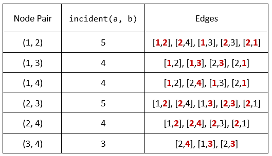

### 1. Description

You are given an undirected graph defined by an integer `n`, the number of nodes, and a 2D integer array `edges`, the edges in the graph, where $\text{edges}[i] = [u_{i}, v_{i}]$ indicates that there is an **undirected** edge between $u_{i}$ and $v_{i}$. You are also given an integer array `queries`.

Let `incident(a, b)` be defined as the **number of edges** that are connected to **either** node `a` or `b`.

The answer to the $$j^{\text{th}}$$ query is the **number of pairs** of nodes `(a, b)` that satisfy **both** of the following conditions:

- `a < b`

- $incident(a, b) > \text{queries}[j]$

Return *an array *`answers`* such that *$\text{answers.length} = \text{queries.length}$* and *$\text{answers}[j]$* is the answer of the *$$j^{\text{th}}$$* query*.

Note that there can be **multiple edges** between the same two nodes.

### 2. Function Contract

- `n`: Input parameter.
- Returns expected result.

### 3. Examples

#### Example 1

- **Input:** $n = 4, edges = [[1,2],[2,4],[1,3],[2,3],[2,1]], queries = [2,3]$
- **Output:** `[6,5]`
- **Explanation:** The calculations for incident(a, b) are shown in the table above.
The answers for each of the queries are as follows:
- answers[0] = 6. All the pairs have an incident(a, b) value greater than 2.
- answers[1] = 5. All the pairs except (3, 4) have an incident(a, b) value greater than 3.
#### Example 2

- **Input:** $n = 5, edges = [[1,5],[1,5],[3,4],[2,5],[1,3],[5,1],[2,3],[2,5]], queries = [1,2,3,4,5]$
- **Output:** `[10,10,9,8,6]`

### 4. Constraints

- $2 \le n \le 2 * 10^{4}$

- $1 \le \text{edges.length} \le 10^{5}$

- $1 \le u_{i}, v_{i} \le n$

- $u_{i} \neq v_{i}$

- $1 \le \text{queries.length} \le 20$

- $0 \le \text{queries}[j] < \text{edges.length}$