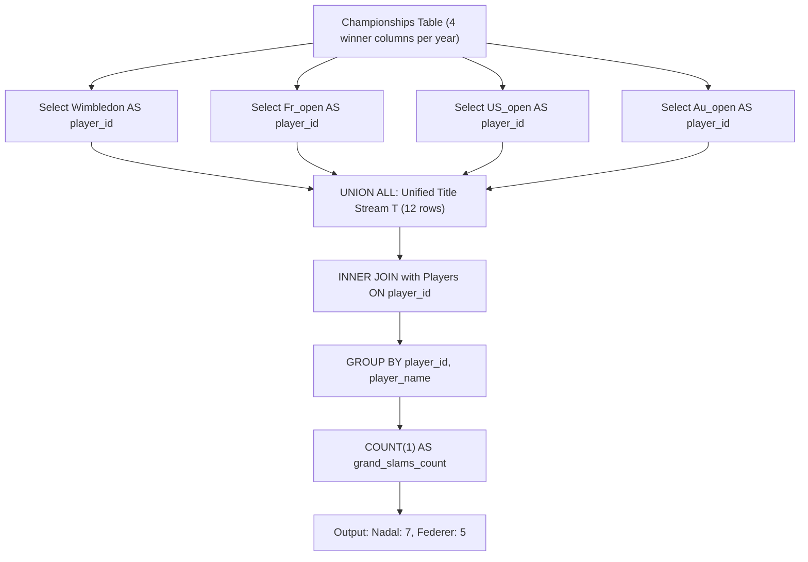

# Guided Example: Grand Slam Titles

We trace the step-by-step execution of the relational column unpivoting and group aggregation approach on a representative problem instance:

- **Input:**
  - `Players`:
    - `(player_id = 1, player_name = "Nadal")`
    - `(player_id = 2, player_name = "Federer")`
    - `(player_id = 3, player_name = "Novak")`
  - `Championships`:
    - `(year = 2018, Wimbledon = 1, Fr_open = 1, US_open = 1, Au_open = 1)`
    - `(year = 2019, Wimbledon = 1, Fr_open = 1, US_open = 2, Au_open = 2)`
    - `(year = 2020, Wimbledon = 2, Fr_open = 1, US_open = 2, Au_open = 2)`
- **Required Output:**
  ```text
  +-----------+-------------+-------------------+
  | player_id | player_name | grand_slams_count |
  +-----------+-------------+-------------------+
  | 1         | Nadal       | 7                 |
  | 2         | Federer     | 5                 |
  +-----------+-------------+-------------------+
  ```

This instance features a player who sweeps all four titles in a single year (Nadal in $2018$), split tournament years, and an inactive player without titles (Novak), demonstrating how `UNION ALL` unpivoting converts wide tournament tables into a vertical title stream before aggregating player career totals.

---

## 1. Instance & Teaching Goal

We are given two relational tables:
1. `Players(player_id, player_name)`: Unique player identities.
2. `Championships(year, Wimbledon, Fr_open, US_open, Au_open)`: Annual Grand Slam winners stored across four separate columns.

We must compute the number of Grand Slam championships won by each player who has won **at least one** title.

### The Wide-to-Long Normalization Problem
In `Championships`, the entity being counted (a tournament championship) is spread horizontally across four columns: `Wimbledon`, `Fr_open`, `US_open`, and `Au_open`. Standard SQL grouping operates on rows, not columns.
The canonical relational approach:
1. **Unpivoting with `UNION ALL`:** Transform the four columns into a single unified row stream of won titles.
   - Using `UNION ALL` rather than `UNION` is critical: a player can win multiple tournaments in the same year or repeat across years. Plain `UNION` would deduplicate identical IDs, destroying title multiplicity.
2. **Entity Join:** Inner join the unpivoted title stream with `Players` on `player_id`. Players with zero titles never appear in the title stream and are excluded.
3. **Group Aggregation:** Group by `player_id, player_name` and count rows to produce `grand_slams_count`.

---

## 2. Conceptual Foundation & Invariants

### State Representation

| Component | Mathematical Definition | Relational Role |
|---|---|---|
| Unpivoted Title Stream $T$ | $\bigcup_{col \in \{\text{Slams}\}}^{\text{ALL}} \pi_{col \to player\_id}(\text{Championships})$ | Multiset of individual tournament victories |
| Dimension Table `Players` | Relation $(player\_id, player\_name)$ | Canonical names and identifiers |
| Grouping Key | $player\_id$ | Aggregation boundary |
| Title Tally | $\text{COUNT}(1)$ per player | Final career championship total |

### Mathematical Invariants

> **Unpivoted Multiplicity Invariant.**
> Let $C$ be the number of rows in `Championships`. Because each row records exactly $4$ tournament winners:
> 1. The multiset union $\bigcup_{col}^{\text{ALL}} \pi_{col \to player\_id}$ contains exactly $4 \times C$ entries.
> 2. For any player $p$, the multiplicity of $p$ in $T$ equals:
>    $$\text{count}(p) = \sum_{r \in \text{Championships}} \sum_{col \in \{\text{Wim, Fr, US, Au}\}} \mathbb{I}(r[col] = p)$$
> 3. An inner join with `Players` preserves every championship event for confirmed players and eliminates non-winners ($count = 0$).



---

## 3. Step-by-Step Worked Execution

We trace the input tables across $2018, 2019, 2020$.

---

### Step 1: Unpivot Championships via `UNION ALL`

Extract the winning `player_id` from each tournament:

#### 1. Branch `Wimbledon`:
- $2018 \to 1$
- $2019 \to 1$
- $2020 \to 2$

#### 2. Branch `Fr_open`:
- $2018 \to 1$
- $2019 \to 1$
- $2020 \to 1$

#### 3. Branch `US_open`:
- $2018 \to 1$
- $2019 \to 2$
- $2020 \to 2$

#### 4. Branch `Au_open`:
- $2018 \to 1$
- $2019 \to 2$
- $2020 \to 2$

Total entries in Title Stream $T$: $4 \times 3 = 12$ rows.

---

### Step 2: Tabulate Titles in Stream $T$

Collecting the 12 events by `player_id`:

- **Player $1$ (Nadal):**
  - $2018$: $4$ titles (Wim, Fr, US, Au)
  - $2019$: $2$ titles (Wim, Fr)
  - $2020$: $1$ title (Fr)
  - Total titles: $4 + 2 + 1 = 7$.

- **Player $2$ (Federer):**
  - $2018$: $0$ titles
  - $2019$: $2$ titles (US, Au)
  - $2020$: $3$ titles (Wim, US, Au)
  - Total titles: $0 + 2 + 3 = 5$.

- **Player $3$ (Novak):**
  - Never appears in the unpivoted stream $T$.
  - Total titles: $0$.

---

### Step 3: Inner Join with `Players` & Final Projection

Join each aggregated ID with `Players` to obtain `player_name`:
- $1 \to \text{"Nadal"}, \text{grand\_slams\_count} = 7$.
- $2 \to \text{"Federer"}, \text{grand\_slams\_count} = 5$.
- Player $3$ has no rows in $T$, so the inner join excludes player $3$.

Final Output Table:
```text
+-----------+-------------+-------------------+
| player_id | player_name | grand_slams_count |
+-----------+-------------+-------------------+
| 1         | Nadal       | 7                 |
| 2         | Federer     | 5                 |
+-----------+-------------+-------------------+
```

---

## 4. Complete Execution Trace

| Year | Tournament | Winner ID | Mapped Title Row in $T$ | Running Tally for Player 1 | Running Tally for Player 2 |
|---|---|---|---|---|---|
| $2018$ | Wimbledon | $1$ | `player_id = 1` | $1$ | $0$ |
| $2018$ | Fr_open | $1$ | `player_id = 1` | $2$ | $0$ |
| $2018$ | US_open | $1$ | `player_id = 1` | $3$ | $0$ |
| $2018$ | Au_open | $1$ | `player_id = 1` | $4$ | $0$ |
| $2019$ | Wimbledon | $1$ | `player_id = 1` | $5$ | $0$ |
| $2019$ | Fr_open | $1$ | `player_id = 1` | $6$ | $0$ |
| $2019$ | US_open | $2$ | `player_id = 2` | $6$ | $1$ |
| $2019$ | Au_open | $2$ | `player_id = 2` | $6$ | $2$ |
| $2020$ | Wimbledon | $2$ | `player_id = 2` | $6$ | $3$ |
| $2020$ | Fr_open | $1$ | `player_id = 1` | $7$ | $3$ |
| $2020$ | US_open | $2$ | `player_id = 2` | $7$ | $4$ |
| $2020$ | Au_open | $2$ | `player_id = 2` | $7$ | $5$ |

Final Group Aggregation:
- `(1, "Nadal", 7)`
- `(2, "Federer", 5)`

---

## 5. Algorithmic Correctness

### Key Invariants and Correctness Argument

1. **Multiplicity Preservation via `UNION ALL`:**
   Using `UNION ALL` ensures that duplicate winner IDs (whether across tournaments in the same year or across different years) are retained as distinct rows. A plain `UNION` would collapse multiple wins by the same player into a single row, erroneously reporting at most $1$ win per tournament type.
2. **Automatic Non-Winner Exclusion:**
   Because grouping and counting take place over the unpivoted title stream $T$ joined with `Players`, any player with zero tournament wins has zero rows in $T$. An inner join guarantees that players with zero titles are excluded from the output without requiring an explicit `HAVING COUNT(1) > 0` clause.

### Boundary and Edge Cases

| Scenario | Input Configuration | Expected Output | Strategic Handling |
|---|---|---|---|
| Calendar Grand Slam (All 4 in One Year) | Player wins all 4 slams in a single year | Count increments by 4 | `UNION ALL` handles 4 rows from the same year without collision. |
| Player with Zero Titles | Player in `Players` with no wins | Excluded from output | Inner join filters out players not in $T$. |
| Single Year of Championships | 1 year with 4 distinct winners | 4 players each with count 1 | Each winner receives a count of 1. |
| Single Player Wins Everything | One player wins every tournament | Single row with total count | Grouping aggregates all rows under single player ID. |

---

## 6. Complexity Derivation

- **Time Complexity:** $\mathcal{O}(|\text{Championships}| + |\text{Players}|)$
  - Generating the unpivoted stream performs 4 table scans of `Championships`, emitting $4 \times |\text{Championships}|$ rows.
  - The inner join with `Players` (indexed by primary key `player_id`) and hash aggregation runs in $\mathcal{O}(|\text{Championships}|)$ time.
  - For typical historical sports datasets with hundreds of rows, execution completes in under $5\text{ ms}$.
- **Space Complexity:** $\mathcal{O}(|\text{Championships}|)$ intermediate memory to hold the unpivoted stream $T$ in the database engine.
