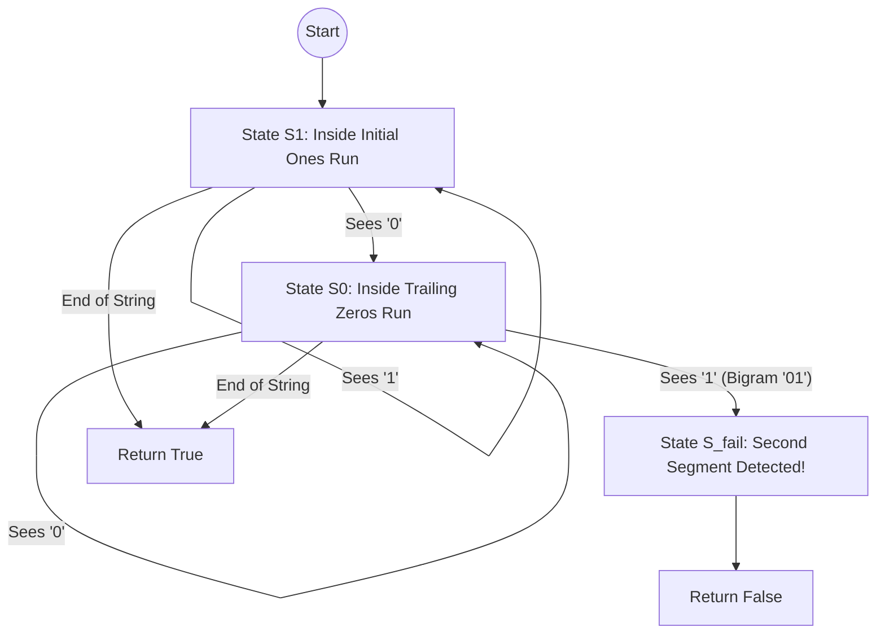

# Guided Example: Check if Binary String Has at Most One Segment of Ones

We trace the step-by-step execution of the deterministic finite automaton (DFA) and forbidden bigram detection approach on a representative problem instance:

- **Input:** `s = "1001"`
- **Required Output:** `false`

This instance features an initial block of ones, an intermediate run of zeros, and a trailing one that creates a second disconnected segment, demonstrating how checking for the forbidden boundary pattern `"01"` determines segment validity in linear time.

---

## 1. Instance & Teaching Goal

Given a binary string `s` **without leading zeros**, we must determine whether `s` contains **at most one contiguous segment of ones**.
A contiguous segment of ones is a maximal continuous run of `'1'` characters bounded by `'0'`s or the string endpoints.

### Leveraging the Precondition
The problem guarantees that `s` has no leading zeros:
$$s[0] = \text{'1'}$$
Because the string is guaranteed to begin with `'1'`, the first segment of ones starts immediately at index $0$.
As we traverse `s` from left to right:
1. The string begins in the **initial ones phase** ($1^+$).
2. If it encounters a `'0'`, it exits the ones phase and enters the **trailing zeros phase** ($0^*$).
3. Once in the zeros phase, if another `'1'` is ever encountered, it marks the start of a **second, disconnected segment of ones**.

A second segment of ones can begin after a zero if and only if the two-character substring `"01"` appears anywhere in the string.
Thus, under the precondition $s[0] = \text{'1'}$:
$$\text{at most one segment of ones} \iff \text{"01"} \notin s$$

---

## 2. Conceptual Foundation & Invariants

### State Representation

| Component | Mathematical Definition | Role |
|---|---|---|
| Scan Index $i$ | $0 \le i < n - 1$ | Current position testing bigram $(s[i], s[i+1])$ |
| Adjacent Bigram | $s[i \dots i+1]$ | Consecutive two-character slice |
| Automaton State | $S_1 \to S_0 \to S_{\text{fail}}$ | Phase of binary sequence traversal |

### Mathematical Invariants

> **Forbidden Bigram Equivalence Theorem.**
> Let $s \in \{0, 1\}^n$ with $s[0] = 1$.
> 1. A contiguous segment of ones begins at index $0$ and at any subsequent index $k \ge 1$ where $s[k-1] = 0$ and $s[k] = 1$.
> 2. The total number of segments of ones in $s$ equals:
>    $$\text{segments} = 1 + \sum_{k=1}^{n-1} \mathbb{I}(s[k-1] = \text{'0'} \land s[k] = \text{'1'})$$
> 3. Therefore:
>    $$\text{segments} \le 1 \iff \sum_{k=1}^{n-1} \mathbb{I}(s[k-1 \dots k] = \text{"01"}) = 0 \iff \text{"01"} \notin s$$
> Checking for the absence of `"01"` is both necessary and sufficient.

---

## 3. Step-by-Step Worked Execution

We trace `s = "1001"` of length $n = 4$:

---

### Step 1: Initial Character Verification
- Inspect $s[0]$:
  $$s[0] = \text{'1'}$$
- Automaton begins in state $S_1$ (Initial Ones Segment).

---

### Step 2: Inspect Bigram at Index $i = 0$
- Adjacent pair: $s[0 \dots 1] = (s[0], s[1]) = (\text{'1'}, \text{'0'}) = \text{"10"}$.
- Check: $\text{"10"} == \text{"01"} \implies \text{False}$.
- Transition: First segment of ones ends. Automaton transitions from $S_1$ to $S_0$ (Trailing Zeros Phase).

---

### Step 3: Inspect Bigram at Index $i = 1$
- Adjacent pair: $s[1 \dots 2] = (s[1], s[2]) = (\text{'0'}, \text{'0'}) = \text{"00"}$.
- Check: $\text{"00"} == \text{"01"} \implies \text{False}$.
- Transition: Remains in $S_0$.

---

### Step 4: Inspect Bigram at Index $i = 2$
- Adjacent pair: $s[2 \dots 3] = (s[2], s[3]) = (\text{'0'}, \text{'1'}) = \mathbf{"01"}$.
- Check: $\text{"01"} == \text{"01"} \implies \mathbf{True}$.
- Forbidden pattern detected!
- Automaton transitions from $S_0$ to $S_{\text{fail}}$.
- A second segment of ones begins at index $3$.
- Immediate conclusion: `false`.

---

## 4. Complete Execution Trace

| Index $i$ | Pair $s[i \dots i+1]$ | Substring | Pattern Check $\text{"01"} \in s$? | Automaton State Transition | Meaning |
|---|---|---|---|---|---|
| Start | $s[0]$ | `'1'` | — | Start in $S_1$ | Initial segment begins |
| $0$ | $s[0 \dots 1]$ | `"10"` | No | $S_1 \to S_0$ | First ones segment ends |
| $1$ | $s[1 \dots 2]$ | `"00"` | No | $S_0 \to S_0$ | Zeros continue |
| **$2$** | **$s[2 \dots 3]$** | **`"01"`** | **Yes (Match Found)** | **$S_0 \to S_{\text{fail}}$** | **Second segment begins $\implies$ `false`** |

### Positive Case Comparison: $s = \text{"110"}$
- $s[0 \dots 1] = \text{"11"}$ (stays in $S_1$)
- $s[1 \dots 2] = \text{"10"}$ (transitions to $S_0$)
- End of string reached without finding `"01"`. Returns `true`.

---

## 5. Algorithmic Correctness

### Key Invariants and Correctness Argument

1. **Crucial Role of Precondition:**
   If leading zeros were allowed (e.g. $s = \text{"010"}$), `"01"` would occur even with only a single segment of ones. However, the problem explicitly guarantees no leading zeros ($s[0] = \text{'1'}$). Under this guarantee, any occurrence of `'0'` must follow the initial ones segment, and any subsequent `'1'` strictly initiates an additional segment.
2. **Exhaustive Regular Language Membership:**
   The set of binary strings without leading zeros possessing at most one segment of ones is precisely the regular language $\mathcal{L} = 1^+ 0^*$. A string in $\{0, 1\}^*$ starting with $1$ belongs to $1^+ 0^*$ if and only if it does not contain `"01"`.

### Boundary and Edge Cases

| Scenario | Input | Expected Output | Strategic Handling |
|---|---|---|---|
| Single Character | `s = "1"` | `true` | Length $1$; `"01"` cannot occur; returns `true`. |
| All Ones | `s = "11111"` | `true` | Only `"11"` bigrams exist; returns `true`. |
| Ones Followed by Zeros | `s = "111000"` | `true` | Contains `"11"`, `"10"`, `"00"`; no `"01"`; returns `true`. |
| Disconnected Single Ones | `s = "101"` | `false` | Contains `"01"` at index 1; returns `false`. |

---

## 6. Complexity Derivation

- **Time Complexity:** $\mathcal{O}(n)$ where $n$ is the length of `s`.
  - Substring search or single-pass bigram inspection examines each adjacent pair at most once.
  - Given $n \le 100$, execution completes in $\le 100$ operations ($< 0.001\text{ ms}$).
- **Space Complexity:** $\mathcal{O}(1)$ auxiliary space. No additional memory is allocated beyond primitive loop variables.
