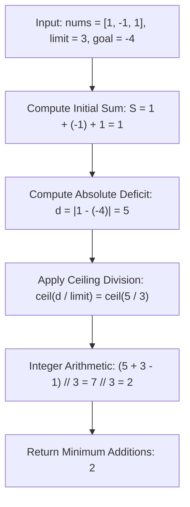

# Guided Example: Minimum Elements to Add to Form a Given Sum

We trace the step-by-step execution of the absolute difference and ceiling division approach on a representative problem instance:

- **Input:** `nums = [1, -1, 1]`, `limit = 3`, `goal = -4`
- **Required Output:** `2`

This instance features mixed-sign values whose initial sum ($1$) must be driven to a negative target ($-4$) using steps bounded by $3$, illustrating how reducing the array to a scalar deficit allows solving the problem in closed-form ceiling arithmetic.

---

## 1. Instance & Teaching Goal

Given an integer array `nums` and two integers `limit` and `goal`, we can append any number of elements $x$ to the array such that each added element satisfies:
$$|x| \le \text{limit}$$
We must determine the **minimum number of elements** needed so that the final array sum equals `goal`.

### Invariance of Element Order
The array elements matter only through their total sum:
$$S = \sum_{x \in \text{nums}} x$$
To reach `goal`, the newly added elements $x_1, x_2, \dots, x_k$ must collectively supply:
$$\sum_{j=1}^k x_j = \text{goal} - S$$
Taking absolute values, the total magnitude that must be bridged is:
$$d = |\text{goal} - S|$$
Each added element can contribute at most $\text{limit}$ toward closing this distance ($|x_j| \le \text{limit}$).
To minimize the count $k$, each element should greedily take the maximum allowable magnitude $\text{limit}$, with the same sign as $\text{goal} - S$.
The minimum number of elements required is therefore:
$$k = \left\lceil \frac{d}{\text{limit}} \right\rceil = \left\lfloor \frac{d + \text{limit} - 1}{\text{limit}} \right\rfloor$$

---

## 2. Conceptual Foundation & Invariants

### State Representation

| Component | Mathematical Definition | Role |
|---|---|---|
| Initial Array Sum $S$ | $\sum_{i=0}^{n-1} \text{nums}[i]$ | Current total sum |
| Target Goal | $\text{goal} \in \mathbb{Z}$ | Desired total sum |
| Absolute Deficit $d$ | $|S - \text{goal}|$ | Net magnitude required to reach goal |
| Step Capacity $L$ | $\text{limit}$ | Maximum contribution per single added element |
| Minimum Additions $k$ | $\lceil d / L \rceil$ | Optimal number of elements required |

### Mathematical Invariants

> **Greedy Magnitude Upper-Bound Theorem.**
> For any sequence of $k$ integers $x_1, \dots, x_k$ satisfying $|x_j| \le L$ for all $j$:
> $$\left| \sum_{j=1}^k x_j \right| \le \sum_{j=1}^k |x_j| \le k \cdot L$$
> Setting $\sum x_j = \text{goal} - S$ implies:
> $$d = |\text{goal} - S| \le k \cdot L \iff k \ge \frac{d}{L}$$
> Because $k$ must be an integer:
> $$k \ge \left\lceil \frac{d}{L} \right\rceil$$
> Selecting $\lfloor d / L \rfloor$ elements with value $\text{sgn}(\text{goal} - S) \cdot L$ and (if $d \pmod L \ne 0$) one final element with value $\text{sgn}(\text{goal} - S) \cdot (d \pmod L)$ achieves equality using exactly $\lceil d / L \rceil$ elements, establishing strict optimality.

---

## 3. Step-by-Step Worked Execution

We trace `nums = [1, -1, 1]`, `limit = 3`, `goal = -4`.

---

### Step 1: Compute Initial Sum $S$
Sum the elements in `nums`:
$$S = 1 + (-1) + 1 = 1$$

---

### Step 2: Calculate Absolute Deficit $d$
Find the difference between current sum $S = 1$ and target $\text{goal} = -4$:
$$\Delta = \text{goal} - S = -4 - 1 = -5$$
Taking the absolute magnitude:
$$d = |\Delta| = |-5| = 5$$
We must decrease the sum by $5$ units.

---

### Step 3: Ceiling Division with Capacity $\text{limit} = 3$
Each added element can decrease the sum by at most $3$ units ($x \in [-3, 3]$).
- If we add $1$ element: maximum reduction is $3 < 5$ (insufficient).
- If we add $2$ elements: maximum reduction is $3 + 3 = 6 \ge 5$ (sufficient).

Evaluating the ceiling formula:
$$k = \left\lceil \frac{5}{3} \right\rceil = \left\lfloor \frac{5 + 3 - 1}{3} \right\rfloor = \left\lfloor \frac{7}{3} \right\rfloor = 2$$

---

### Step 4: Concrete Assignment Verification
We can achieve the goal by adding two valid elements:
- Element $1$: $x_1 = -3$ (since $|-3| \le 3$)
- Element $2$: $x_2 = -2$ (since $|-2| \le 3$)
New sum:
$$S_{\text{final}} = S + x_1 + x_2 = 1 + (-3) + (-2) = -4 = \text{goal}$$
Both added elements satisfy $|x| \le \text{limit} = 3$.

---

## 4. Complete Execution Trace

| Parameter | Value | Justification |
|---|---|---|
| Input Array `nums` | `[1, -1, 1]` | Length $n = 3$ |
| Initial Sum $S$ | $1$ | $1 - 1 + 1 = 1$ |
| Target `goal` | $-4$ | Desired total |
| Signed Deficit $\Delta$ | $-5$ | Goal minus sum: $-4 - 1$ |
| Absolute Deficit $d$ | $5$ | Magnitude to close: $|-5|$ |
| Step Capacity `limit` | $3$ | Maximum change per element |
| Ceiling Quotient $\lceil d / \text{limit} \rceil$ | $\lceil 5 / 3 \rceil$ | Smallest integer $\ge 1.666\dots$ |
| Final Output | **$2$** | Minimum elements needed |

---

## 5. Algorithmic Correctness

### Key Invariants and Correctness Argument

1. **Exact Bound on Cumulative Steps:**
   By the triangle inequality, the sum of $k$ numbers of magnitude at most $L$ cannot exceed $k \cdot L$. Thus, no choice of $k < \lceil d / L \rceil$ numbers can ever span distance $d$, guaranteeing that $\lceil d / L \rceil$ is a strict lower bound.
2. **Exact Attainability:**
   Choosing $\lfloor d / L \rfloor$ numbers of magnitude $L$ and at most one number of magnitude $d \pmod L \le L$ produces an exact sum of $d$ in $\lceil d / L \rceil$ numbers, proving the bound is always attainable.

### Boundary and Edge Cases

| Scenario | Input | Expected Output | Strategic Handling |
|---|---|---|---|
| Sum Already Equals Goal | `nums = [2, 2]`, `goal = 4` | $0$ | $d = |4 - 4| = 0 \implies (0 + L - 1)//L = 0$. |
| Exact Multiple of Limit | $d = 6, \text{limit} = 3$ | $2$ | $(6 + 2)//3 = 2$; divides evenly with no remainder. |
| Deficit Smaller than Limit | $d = 2, \text{limit} = 5$ | $1$ | $(2 + 4)//5 = 1$; single addition suffices. |
| Large Goal ($10^9$) | $d = 10^9, \text{limit} = 10^6$ | $1000$ | Standard integer arithmetic handles large values without overflow. |

---

## 6. Complexity Derivation

- **Time Complexity:** $\mathcal{O}(n)$ where $n$ is the length of `nums`.
  - Summing the elements of `nums` requires a single pass over $n$ integers.
  - The difference and integer division evaluate in $\mathcal{O}(1)$ time.
  - For $n \le 10^5$, execution completes in under $0.005\text{ s}$.
- **Space Complexity:** $\mathcal{O}(1)$ auxiliary space. No additional arrays or collections are allocated.
