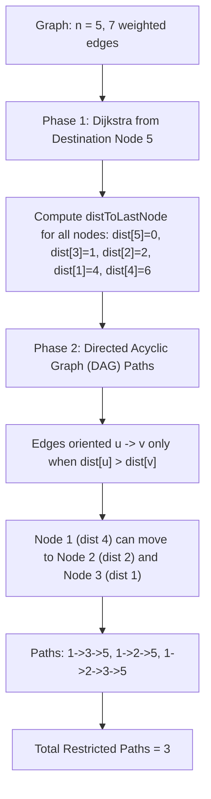

# Guided Example: Number of Restricted Paths From First to Last Node

We trace the step-by-step execution of Dijkstra shortest-path calculation followed by directed acyclic graph (DAG) dynamic programming on a representative problem instance:

- **Input:**
  - `n = 5`
  - `edges = [[1, 2, 3], [1, 3, 3], [2, 3, 1], [1, 4, 2], [5, 2, 2], [3, 5, 1], [5, 4, 10]]`
- **Required Output:** `3`

This instance features alternative pathways, an indirect edge shortcutting a direct high-cost edge (reaching node $4$ via $1$ rather than directly from $5$), and an invalid branch ($1 \to 4$ where distance increases), clearly illustrating how strict distance descent converts an undirected graph into an acyclic path-counting problem.

---

## 1. Instance & Teaching Goal

We are given an undirected weighted connected graph with $n$ nodes labeled $1$ to $n$.
A path from node $1$ to node $n$ is defined as **restricted** if every step along the path from $u$ to $v$ strictly decreases the shortest distance to the destination node $n$:
$$\text{distToLastNode}(u) > \text{distToLastNode}(v)$$
We must compute the total number of restricted paths from node $1$ to node $n$, modulo $10^9 + 7$.

### Two-Phase Algorithm Decomposition
1. **Shortest Path Distances via Dijkstra:**
   Run Dijkstra's algorithm from the destination node $n$ across the undirected graph to compute $\text{dist}[u] = \text{distToLastNode}(u)$ for every node $u \in [1, n]$.
2. **Dynamic Programming on the Implicit DAG:**
   Direct every edge $(u, v)$ from $u$ to $v$ if and only if $\text{dist}[u] > \text{dist}[v]$.
   Because distances strictly decrease along every directed edge, the resulting directed graph is guaranteed to be **acyclic** (a DAG).
   Path counting on a DAG is solved via memoized dynamic programming:
   $$dp(u) = \sum_{(u, v) \in E, \text{dist}[u] > \text{dist}[v]} dp(v) \pmod{10^9 + 7}, \quad \text{with } dp(n) = 1$$

---

## 2. Conceptual Foundation & Invariants

### State Representation

| Component | Mathematical Definition | Role |
|---|---|---|
| Distance Vector $\text{dist}$ | Shortest path from $u$ to $n$ in the graph | Defines valid descent directions |
| Min-Priority Queue $Q$ | Heap of pairs $(d, u)$ | Drives Dijkstra expansion from node $n$ |
| Path Count $dp(u)$ | Number of restricted paths from $u$ to $n$ | Subproblem memoization |
| Modulo Constant | $10^9 + 7$ | Prevents integer overflow |

### Mathematical Invariants

> **Strict Monotonicity & Acyclicity Theorem.**
> Let $G = (V, E)$ be an undirected graph with positive edge weights. Orient edges such that:
> $$\vec{E} = \{(u, v) \mid (u, v) \in E \land \text{dist}[u] > \text{dist}[v]\}$$
> 1. $\vec{G} = (V, \vec{E})$ is a Directed Acyclic Graph (DAG).
>    *Proof:* If a directed cycle $v_1 \to v_2 \to \dots \to v_k \to v_1$ existed, we would have $\text{dist}[v_1] > \text{dist}[v_2] > \dots > \text{dist}[v_k] > \text{dist}[v_1]$, an impossibility.
> 2. Every path from $1$ to $n$ in $\vec{G}$ is by construction a restricted path.
> 3. Memoized recursion on $\vec{G}$ computes the exact path count without infinite loops.

---

## 3. Step-by-Step Worked Execution

We trace $n = 5$ with edges:
`[1, 2, 3], [1, 3, 3], [2, 3, 1], [1, 4, 2], [5, 2, 2], [3, 5, 1], [5, 4, 10]`.

---

### Phase 1: Dijkstra Shortest Paths from Destination Node $5$

Initialize: $\text{dist}[5] = 0$, all other $\text{dist} = \infty$. Min-heap $Q = [(0, 5)]$.

1. **Extract $(0, 5)$:**
   - Relax neighbor $3$ via edge weight $1$: $\text{dist}[3] = 0 + 1 = 1$. Enqueue $(1, 3)$.
   - Relax neighbor $2$ via edge weight $2$: $\text{dist}[2] = 0 + 2 = 2$. Enqueue $(2, 2)$.
   - Relax neighbor $4$ via edge weight $10$: $\text{dist}[4] = 0 + 10 = 10$. Enqueue $(10, 4)$.

2. **Extract $(1, 3)$:**
   - Relax neighbor $2$ via edge weight $1$: $\text{dist}[3] + 1 = 1 + 1 = 2 \ngtr \text{dist}[2]$ (No change).
   - Relax neighbor $1$ via edge weight $3$: $\text{dist}[1] = 1 + 3 = 4$. Enqueue $(4, 1)$.

3. **Extract $(2, 2)$:**
   - Relax neighbor $1$ via edge weight $3$: $2 + 3 = 5 > \text{dist}[1] = 4$ (No change).

4. **Extract $(4, 1)$:**
   - Relax neighbor $4$ via edge weight $2$:
     $$\text{dist}[1] + 2 = 4 + 2 = 6 < \text{dist}[4] = 10$$
     Update: $\text{dist}[4] \leftarrow 6$. Enqueue $(6, 4)$.

5. **Extract $(6, 4)$:** No improvements.
6. **Extract $(10, 4)$:** Stale entry ($10 > \text{dist}[4] = 6$). Skipped.

#### Final Distances to Node $5$:
$$\text{dist}[5] = 0, \quad \text{dist}[3] = 1, \quad \text{dist}[2] = 2, \quad \text{dist}[1] = 4, \quad \text{dist}[4] = 6$$

---

### Phase 2: Directed Acyclic Graph Counting

We evaluate $dp(u)$ from $u = 1$ using memoized DFS:

- **Base Case:** $dp(5) = 1$.

- **Evaluate $dp(3)$ ($\text{dist}[3] = 1$):**
  - Neighbors of $3$: Node $1$ ($\text{dist} = 4$), Node $2$ ($\text{dist} = 2$), Node $5$ ($\text{dist} = 0$).
  - Valid strictly smaller neighbor: Only Node $5$ ($0 < 1$).
  - $$dp(3) = dp(5) = 1$$

- **Evaluate $dp(2)$ ($\text{dist}[2] = 2$):**
  - Neighbors of $2$: Node $1$ ($\text{dist} = 4$), Node $3$ ($\text{dist} = 1$), Node $5$ ($\text{dist} = 0$).
  - Valid strictly smaller neighbors:
    - Node $5$ ($0 < 2 \implies dp(5) = 1$)
    - Node $3$ ($1 < 2 \implies dp(3) = 1$)
  - $$dp(2) = dp(5) + dp(3) = 1 + 1 = 2$$

- **Evaluate $dp(1)$ ($\text{dist}[1] = 4$):**
  - Neighbors of $1$:
    - Node $4$: $\text{dist}[4] = 6 \not< 4$ (Invalid! Distance increases; cannot move $1 \to 4$).
    - Node $2$: $\text{dist}[2] = 2 < 4$ (Valid! Contributes $dp(2) = 2$).
    - Node $3$: $\text{dist}[3] = 1 < 4$ (Valid! Contributes $dp(3) = 1$).
  - $$dp(1) = dp(2) + dp(3) = 2 + 1 = 3$$

---

### Enumeration of the Three Restricted Paths
1. $1 \to 3 \to 5$ (Distances: $4 \to 1 \to 0$)
2. $1 \to 2 \to 5$ (Distances: $4 \to 2 \to 0$)
3. $1 \to 2 \to 3 \to 5$ (Distances: $4 \to 2 \to 1 \to 0$)

Final Answer:
$$\text{Restricted Paths} = 3$$

---

## 4. Complete Execution Trace

| Node $u$ | Shortest Distance $\text{dist}[u]$ | Neighbors Inspected $v$ | Neighbor Distance $\text{dist}[v]$ | Descent Condition $\text{dist}[u] > \text{dist}[v]$ | Transition Allowed? | Contribution to $dp(u)$ | Cumulative $dp(u)$ |
|---|---|---|---|---|---|---|---|
| $5$ | $0$ | Destination | — | — | — | Base case | **$1$** |
| $3$ | $1$ | $5$ | $0$ | $1 > 0$ (True) | Yes | $dp(5) = 1$ | **$1$** |
| $2$ | $2$ | $5$ | $0$ | $2 > 0$ (True) | Yes | $dp(5) = 1$ | — |
| $2$ | $2$ | $3$ | $1$ | $2 > 1$ (True) | Yes | $dp(3) = 1$ | **$2$** |
| $1$ | $4$ | $4$ | $6$ | $4 > 6$ (False) | **No (Blocked)** | $0$ | — |
| $1$ | $4$ | $2$ | $2$ | $4 > 2$ (True) | Yes | $dp(2) = 2$ | — |
| $1$ | $4$ | $3$ | $1$ | $4 > 1$ (True) | Yes | $dp(3) = 1$ | **$3$** |

---

## 5. Algorithmic Correctness

### Key Invariants and Correctness Argument

1. **Cycle Prevention:**
   Because each hop on a restricted path must strictly reduce $\text{dist}[u]$, it is mathematically impossible to revisit any previously traversed node. This guarantees that the directed graph is a DAG and the recursion never loops.
2. **Correctness of Subproblem Summation:**
   The set of restricted paths starting at $u$ partitions into disjoint sets based on the immediate next node $v$. Summing $dp(v)$ over all valid downward neighbors $v$ obeys the sum rule of combinatorics.

### Boundary and Edge Cases

| Scenario | Configuration | Expected Output | Strategic Handling |
|---|---|---|---|
| No Downward Path | Node $1$ has only neighbors with larger/equal distance | $0$ | No valid transition edges; returns $0$. |
| Single Direct Path | Graph is a simple chain $1 - 2 - 3 - \dots - n$ | $1$ | Unique monotonic descending path. |
| Equal Distance Neighbors | Adjacent node has identical distance | Excluded | Strict inequality $\text{dist}[u] > \text{dist}[v]$ excludes flat transitions. |
| Huge Path Count | Complex grid with exponential paths | Correct modulo | Sums modulo $10^9 + 7$ prevent overflow. |

---

## 6. Complexity Derivation

- **Time Complexity:** $\mathcal{O}(E \log V + V + E)$ where $V = n$ and $E = |\text{edges}|$.
  - Phase 1 (Dijkstra): Uses a binary min-heap, processing each edge at most once, taking $\mathcal{O}(E \log V)$ time.
  - Phase 2 (DAG DP): Visits each node once and inspects each edge at most once, taking $\mathcal{O}(V + E)$ time.
  - For $V \le 2 \times 10^4$ and $E \le 4 \times 10^4$, total operations are $\approx 4 \times 10^4 \times 15 \approx 6 \times 10^5$, executing in under $0.05\text{ s}$.
- **Space Complexity:** $\mathcal{O}(V + E)$ auxiliary space to store the adjacency list, Dijkstra priority queue, distance array, and DP memoization cache.
