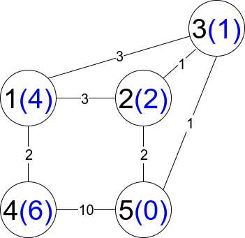
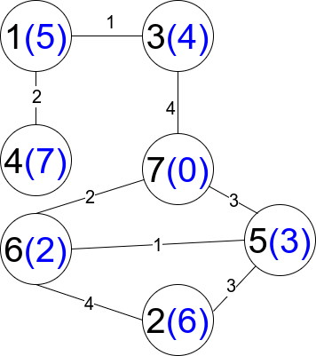

## Description

There is an undirected weighted connected graph. You are given a positive integer `n` which denotes that the graph has `n` nodes labeled from `1` to `n`, and an array `edges` where each $\text{edges}[i] = [u_{i}, v_{i}, \text{weight}_{i}]$ denotes that there is an edge between nodes $u_{i}$ and $v_{i}$ with weight equal to $\text{weight}_{i}$.

A path from node `start` to node `end` is a sequence of nodes $[z_{0}, z_{1},_ z_{2}, ..., z_{k}]$ such that $z_{0} = start$ and $z_{k} = end$ and there is an edge between $z_{i}$ and $z_{i}+1$ where $0 \le i \le k-1$.

The distance of a path is the sum of the weights on the edges of the path. Let `distanceToLastNode(x)` denote the shortest distance of a path between node `n` and node `x`. A **restricted path** is a path that also satisfies that $distanceToLastNode(z_{i}) > distanceToLastNode(z_{i}+1)$ where $0 \le i \le k-1$.

Return *the number of restricted paths from node* `1` *to node* `n`. Since that number may be too large, return it **modulo** $10^{9} + 7$.
### Function Contract

- `n`: Input parameter.
- Returns expected result.

### Examples

#### Example 1

- **Input:** $n = 5, edges = [[1,2,3],[1,3,3],[2,3,1],[1,4,2],[5,2,2],[3,5,1],[5,4,10]]$
- **Output:** `3`
- **Explanation:** Each circle contains the node number in black and its distanceToLastNode value in blue. The three restricted paths are:
1) 1 --> 2 --> 5
2) 1 --> 2 --> 3 --> 5
3) 1 --> 3 --> 5
#### Example 2

- **Input:** $n = 7, edges = [[1,3,1],[4,1,2],[7,3,4],[2,5,3],[5,6,1],[6,7,2],[7,5,3],[2,6,4]]$
- **Output:** `1`
- **Explanation:** Each circle contains the node number in black and its distanceToLastNode value in blue. The only restricted path is 1 --> 3 --> 7.
### Constraints

- $1 \le n \le 2 * 10^{4}$

- $n - 1 \le \text{edges.length} \le 4 * 10^{4}$

- $\text{edges}[i].length = 3$

- $1 \le u_{i}, v_{i} \le n$

- $u_{i} \neq v_{i}$

- $1 \le \text{weight}_{i} \le 10^{5}$

- There is at most one edge between any two nodes.

- There is at least one path between any two nodes.