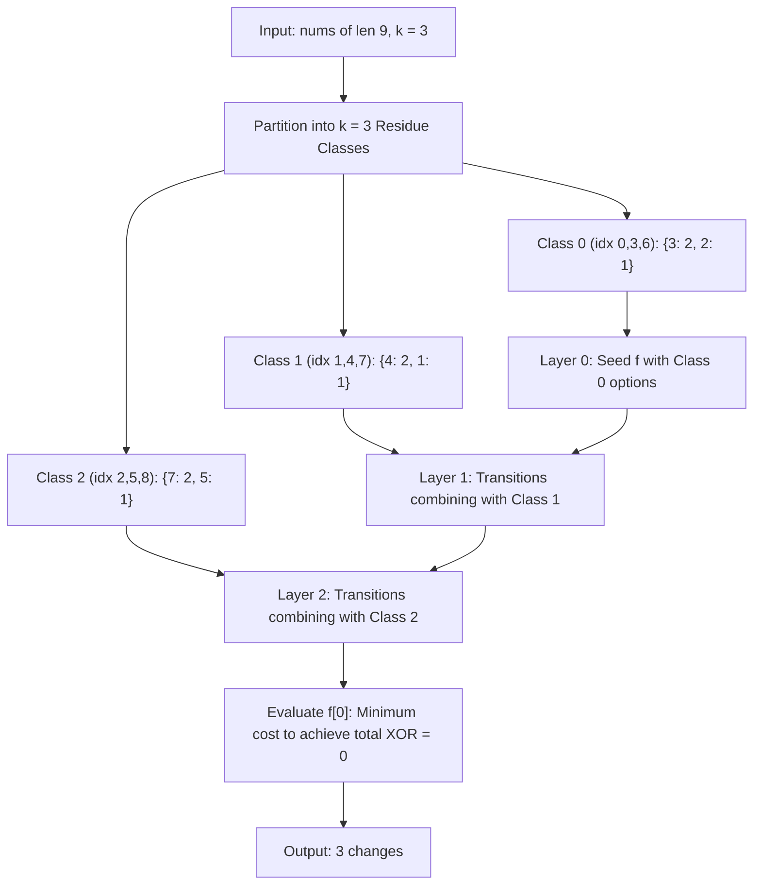

# Guided Example: Make the XOR of All Segments Equal to Zero

We trace the step-by-step execution of periodic residue class decomposition and XOR-knapsack dynamic programming on a representative problem instance:

- **Input:** `nums = [3, 4, 5, 2, 1, 7, 3, 4, 7]`, `k = 3`
- **Required Output:** `3`

This instance features an array of length $9$ with period $k = 3$, demonstrating how overlapping zero-XOR conditions enforce strict periodicity across residue classes and how dynamic programming over bitwise XOR sums finds the minimal-change configuration.

---

## 1. Instance & Teaching Goal

Given an array `nums` and an integer $k$, we must change the minimum number of elements such that the bitwise XOR sum of every contiguous segment of length $k$ equals $0$:
$$\text{nums}[i] \oplus \text{nums}[i+1] \oplus \dots \oplus \text{nums}[i+k-1] = 0 \quad \text{for all } 0 \le i \le n - k$$

### The Periodicity Implication
Consider two consecutive overlapping segments of length $k$:
$$\begin{aligned}
\text{Segment } i: \quad &\text{nums}[i] \oplus (\text{nums}[i+1] \oplus \dots \oplus \text{nums}[i+k-1]) = 0 \\
\text{Segment } i+1: \quad &(\text{nums}[i+1] \oplus \dots \oplus \text{nums}[i+k-1]) \oplus \text{nums}[i+k] = 0
\end{aligned}$$
XORing these two identical zero expressions cancels the $k-1$ shared intermediate terms:
$$\text{nums}[i] \oplus \text{nums}[i+k] = 0 \iff \text{nums}[i] = \text{nums}[i+k]$$
This forces the entire array to be **strictly periodic with period $k$**:
$$\text{nums}[j] = v_{j \pmod k} \quad \text{for all } j$$
Furthermore, the first segment of length $k$ must have XOR sum zero:
$$v_0 \oplus v_1 \oplus \dots \oplus v_{k-1} = 0$$

### Dynamic Programming Formulation
For each residue position $i \in [0, k-1]$, let $C_i$ be the multiset of values in `nums` at indices $j \equiv i \pmod k$, with total count $\text{size}[i]$.
If we choose value $v_i$ for residue class $i$, the number of elements we must change in this class is:
$$\text{cost}(i, v_i) = \text{size}[i] - \text{count}(C_i, v_i)$$
We must choose $(v_0, v_1, \dots, v_{k-1})$ to minimize $\sum_{i=0}^{k-1} \text{cost}(i, v_i)$ subject to $\bigoplus_{i=0}^{k-1} v_i = 0$.
Since numbers are $< 2^{10} = 1024$, we maintain the minimum cost to achieve XOR prefix sum $j \in [0, 1023]$ after processing the first $i$ residue classes.

---

## 2. Conceptual Foundation & Invariants

### State Representation

| Component | Mathematical Definition | Role |
|---|---|---|
| Residue Class $i$ | $0 \le i < k$ | Step in the sequential decision process |
| XOR Sum $j$ | $0 \le j < 1024$ | Target cumulative XOR value $v_0 \oplus \dots \oplus v_i$ |
| Table $f[j]$ | Min cost to achieve cumulative XOR $j$ across classes $< i$ | Active DP state |
| Frequency Map $\text{cnt}[i]$ | Multiplicities of values appearing in class $i$ | Values offering cost discounts |

### Mathematical Invariants

> **Dual-Branch XOR Transition Theorem.**
> In progressing from residue class $i - 1$ to class $i$ with target XOR sum $j \in [0, 1023]$:
> 1. **Arbitrary Value Choice (Fallback):** If $v_i$ is chosen as an arbitrary value not present in $C_i$, the cost incurred is $\text{size}[i]$ (all elements changed). By selecting $v_i = x \oplus j$ where $x = \arg\min f$, we can reach state $j$ with cost:
>    $$\text{cost}_{\text{arbitrary}} = \min_{x} f[x] + \text{size}[i]$$
> 2. **In-Class Value Choice (Discount):** If $v_i$ is chosen from the values actually observed in $C_i$ with frequency $c = \text{cnt}[i][v_i]$, the cost is $\text{size}[i] - c$. The transition from previous state $j \oplus v_i$ gives:
>    $$\text{cost}_{\text{discount}} = f[j \oplus v_i] + \text{size}[i] - c$$
> The combined update is:
> $$g[j] = \min \left( \min_x f[x] + \text{size}[i], \min_{v \in \text{cnt}[i]} (f[j \oplus v] + \text{size}[i] - \text{cnt}[i][v]) \right)$$
> This avoids testing all $1024$ values per state, maintaining optimal $\mathcal{O}(k \cdot 2^{10})$ runtime.

---

## 3. Step-by-Step Worked Execution

We trace `nums = [3, 4, 5, 2, 1, 7, 3, 4, 7]`, $k = 3$, $n = 9$.

---

### Step 1: Partition into Residue Classes Modulo $k = 3$

Each residue class has size $9 / 3 = 3$:
- **Class $0$ (indices $0, 3, 6$):**
  - Elements: $\text{nums}[0]=3, \text{nums}[3]=2, \text{nums}[6]=3$.
  - Frequencies: $\{3: 2, 2: 1\}$. $\text{size}[0] = 3$.
- **Class $1$ (indices $1, 4, 7$):**
  - Elements: $\text{nums}[1]=4, \text{nums}[4]=1, \text{nums}[7]=4$.
  - Frequencies: $\{4: 2, 1: 1\}$. $\text{size}[1] = 3$.
- **Class $2$ (indices $2, 5, 8$):**
  - Elements: $\text{nums}[2]=5, \text{nums}[5]=7, \text{nums}[8]=7$.
  - Frequencies: $\{7: 2, 5: 1\}$. $\text{size}[2] = 3$.

---

### Step 2: Layer $0$ (Process Class $0$)
Base state: $f[0] = 0$, all other $f[j] = \infty$.
- Pick $v_0 = 3$: XOR sum becomes $3$. Cost $= 3 - 2 = 1$.
- Pick $v_0 = 2$: XOR sum becomes $2$. Cost $= 3 - 1 = 2$.
- Arbitrary value: Any XOR sum $j$ costs $\min(f) + 3 = 0 + 3 = 3$.
Key states after Layer 0:
$$f[3] = 1, \quad f[2] = 2, \quad \text{all other } f[j] = 3$$

---

### Step 3: Layer $1$ (Process Class $1$)
We combine prior states with Class $1$ ($\text{size} = 3$, counts $\{4: 2, 1: 1\}$).
Fallback cost for any state: $\min(f) + 3 = 1 + 3 = 4$.

Evaluating in-class values:
1. **Combine with $v_1 = 4$ (cost $+1$):**
   - From $f[3] = 1$: Target XOR $= 3 \oplus 4 = 7$.
     $$\text{Cost} = f[3] + (3 - 2) = 1 + 1 = \mathbf{2}$$
   - From $f[2] = 2$: Target XOR $= 2 \oplus 4 = 6$.
     $$\text{Cost} = f[2] + 1 = 2 + 1 = \mathbf{3}$$
2. **Combine with $v_1 = 1$ (cost $+2$):**
   - From $f[3] = 1$: Target XOR $= 3 \oplus 1 = 2$.
     $$\text{Cost} = 1 + (3 - 1) = 1 + 2 = \mathbf{3}$$

Key state after Layer 1:
$$f[7] = 2 \quad (\text{achieved by } v_0=3, v_1=4 \text{ with cost } 2)$$

---

### Step 4: Layer $2$ (Process Class $2$)
We combine prior states with Class $2$ ($\text{size} = 3$, counts $\{7: 2, 5: 1\}$).
We want final XOR sum equal to $0$ ($j = 0$).

Look at target $j = 0$:
1. **Pick $v_2 = 7$ from Class 2 (frequency $2$, cost $+1$):**
   - Required previous XOR state: $0 \oplus 7 = 7$.
   - We have $f[7] = 2$ from Layer 1!
   - Transition:
     $$f_{\text{final}}[0] = f[7] + (\text{size}[2] - \text{cnt}[2][7]) = 2 + (3 - 2) = 2 + 1 = \mathbf{3}$$
2. **Pick $v_2 = 5$ from Class 2 (frequency $1$, cost $+2$):**
   - Required previous XOR state: $0 \oplus 5 = 5$. $f[5] \ge 3 \implies 3 + 2 = 5 > 3$.
3. **Arbitrary fallback:**
   - $\min(f) + 3 = 2 + 3 = 5 > 3$.

Minimum cost to achieve total XOR $0$ is:
$$\text{Cost} = 3$$

---

### Step 5: Verification of Chosen Configuration
The optimal periodic assignment is:
$$v = [3, 4, 7]$$
- XOR check: $3 \oplus 4 \oplus 7 = 011_2 \oplus 100_2 \oplus 111_2 = 000_2 = 0$.
- Reconstructed array: `[3, 4, 7, 3, 4, 7, 3, 4, 7]`.
- Modifications from original `[3, 4, 5, 2, 1, 7, 3, 4, 7]`:
  - Index $2$: $5 \to 7$ (Change 1)
  - Index $3$: $2 \to 3$ (Change 2)
  - Index $4$: $1 \to 4$ (Change 3)
- Exactly $3$ changes required.

---

## 4. Complete Execution Trace

| Residue Layer $i$ | Target XOR $j$ | Best Choice $v_i$ | Source Value in Class $i$ | In-Class Multiplicity | Cost Added $\text{size}[i] - c$ | Cumulative DP Value $f[j]$ |
|---|---|---|---|---|---|---|
| Init | $0$ | — | — | — | — | **$0$** |
| Layer $0$ | $3$ | $3$ | Observed | $2$ of $3$ | $3 - 2 = 1$ | **$1$** |
| Layer $0$ | $2$ | $2$ | Observed | $1$ of $3$ | $3 - 1 = 2$ | **$2$** |
| Layer $1$ | $7$ | $4$ | Observed | $2$ of $3$ | $3 - 2 = 1$ | $f[3] + 1 = \mathbf{2}$ |
| Layer $1$ | $6$ | $4$ | Observed | $2$ of $3$ | $3 - 2 = 1$ | $f[2] + 1 = \mathbf{3}$ |
| Layer $1$ | $2$ | $1$ | Observed | $1$ of $3$ | $3 - 1 = 2$ | $f[3] + 2 = \mathbf{3}$ |
| **Layer $2$** | **$0$** | **$7$** | **Observed** | **$2$ of $3$** | **$3 - 2 = 1$** | **$f[7] + 1 = \mathbf{3}$** |

Final Answer:
$$f[0] = 3$$

---

## 5. Algorithmic Correctness

### Key Invariants and Correctness Argument

1. **Necessity of Periodicity:**
   Since any two adjacent windows of size $k$ share $k - 1$ elements, their XOR sums being identical ($0 = 0$) algebraically requires $\text{nums}[i] = \text{nums}[i+k]$. Thus, searching over periodic arrays with period $k$ is complete.
2. **Completeness of Dual-Branch Transitions:**
   Any choice of $v_i$ either coincides with a value already present in residue class $C_i$ (checked by branch 2) or is a distinct external value (subsumed by the global minimum fallback in branch 1). Because branch 1 covers all $1024$ states uniformly using $\min(f) + \text{size}[i]$, no optimal bit pattern is ever missed.

### Boundary and Edge Cases

| Scenario | Configuration | Expected Output | Strategic Handling |
|---|---|---|---|
| Unit Window ($k = 1$) | All segments of size 1 must XOR to 0 | Number of non-zero elements | All elements must be changed to $0$; returns count of non-zeros. |
| Array Already Zero-XOR | Input is already periodic with XOR sum 0 | $0$ | Frequency discounts yield cost $0$ across all layers. |
| Full Array Replacement | No combination of existing elements XORs to 0 | Fallback branch used | Fallback ensures valid combination found at cost $n - \max(\text{freq})$. |
| $k = n$ | Single segment of size $n$ | $0$ or $1$ | If initial XOR is 0, cost 0; else change any 1 element to cancel XOR. |

---

## 6. Complexity Derivation

- **Time Complexity:** $\mathcal{O}(k \cdot 2^{10} + n)$ where $2^{10} = 1024$ and $n$ is the length of `nums`.
  - Partitioning and frequency counting takes $\mathcal{O}(n)$ time.
  - For each of the $k$ residue classes:
    - Finding $\min(f)$ and setting the fallback array takes $\mathcal{O}(2^{10})$ time.
    - Iterating over all distinct values in $\text{cnt}[i]$ (at most $\text{size}[i]$ values) and updating states takes $\mathcal{O}(|\text{cnt}[i]| \cdot 2^{10})$ time.
    - Summing across all $k$ classes: $\sum |\text{cnt}[i]| \le n$, but bounded per class by $2^{10}$.
  - Total time: $\mathcal{O}(k \cdot 2^{10}) \le 2000 \times 1024 \approx 2 \times 10^6$ operations, executing in under $0.05\text{ s}$.
- **Space Complexity:** $\mathcal{O}(2^{10}) = \mathcal{O}(1)$ auxiliary space to store the $1024$-element DP state array.
