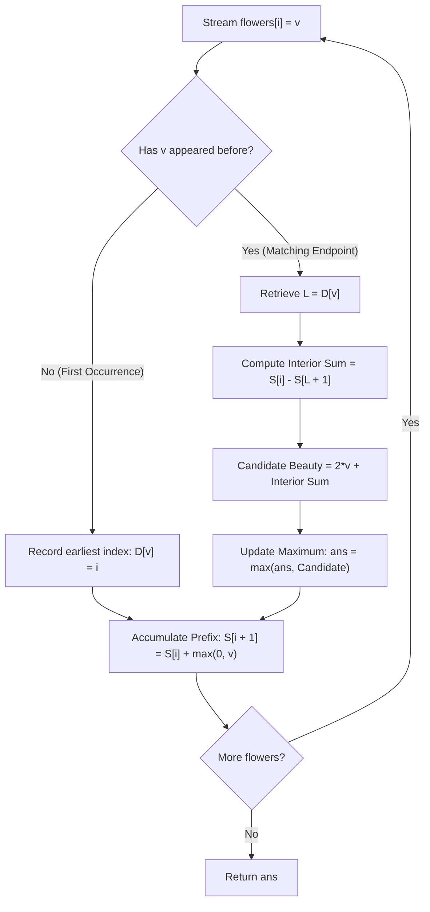

# Guided Example: Maximize the Beauty of the Garden

We trace the step-by-step execution of prefix-sum accumulation and earliest-occurrence boundary tracking on a representative problem instance:

- **Input:** `flowers = [1, 2, 3, 1, 2]`
- **Required Output:** `8`

This instance features multiple candidate endpoint values ($1$ and $2$) with positive interior blossoms, demonstrating how prefix-filtering of optional interior flowers and greedy earliest-occurrence anchoring determine the maximum attainable garden beauty.

---

## 1. Instance & Teaching Goal

We are given an array `flowers` of size $n$, where each entry $\text{flowers}[i]$ denotes the beauty value of the $i^{\text{th}}$ flower in a linear bed. A valid garden must satisfy:
1. It contains at least $2$ flowers.
2. The first and last retained flowers share the exact same beauty value.
3. Any flowers between the chosen boundary endpoints may be retained or removed at will, preserving their original relative ordering.

The beauty of a retained garden is the algebraic sum of the beauty values of all its remaining flowers. Our goal is to compute the maximum possible beauty of any valid garden.

### The Interior Filter & Boundary Mandate
For any candidate garden bounded by indices $L < R$ with identical beauty $\text{flowers}[L] = \text{flowers}[R] = v$:
- **Endpoints are mandatory:** Both boundary flowers must remain to satisfy the equality contract, contributing $2v$ to the total beauty regardless of whether $v$ is positive, zero, or negative.
- **Interior flowers are strictly optional:** For every interior index $k$ ($L < k < R$):
  - If $\text{flowers}[k] > 0$, retaining it increases the sum by $\text{flowers}[k]$.
  - If $\text{flowers}[k] \le 0$, removing it prevents subtracting from or neutralizing the sum.
  - Therefore, the optimal interior contribution from index $k$ is precisely $\max(0, \text{flowers}[k])$.

The total score achieved by fixing endpoints $L$ and $R$ is:
$$\text{Beauty}(L, R) = 2v + \sum_{k = L + 1}^{R - 1} \max(0, \text{flowers}[k])$$

---

## 2. Conceptual Foundation & Invariants

### Mathematical Definitions

Let $S$ be the cumulative sum of non-negative interior contributions:
$$S[i] = \sum_{k = 0}^{i - 1} \max(0, \text{flowers}[k]), \quad S[0] = 0$$

For any interval strictly between indices $L$ and $R$ ($L < R$):
$$\sum_{k = L + 1}^{R - 1} \max(0, \text{flowers}[k]) = S[R] - S[L + 1]$$

Thus, for any matching boundary pair with $\text{flowers}[L] = \text{flowers}[R] = v$:
$$\text{Beauty}(L, R) = 2v + S[R] - S[L + 1]$$

### The Earliest-Occurrence Optimality Principle

> **Equal Endpoint Prefix Dominance Theorem.**
> Let index $R$ be a candidate right endpoint with $\text{flowers}[R] = v$. Suppose value $v$ appears at earlier positions $L_1 < L_2 < \dots < L_m < R$.
> Because each term in the prefix sum is non-negative ($\max(0, \text{flowers}[k]) \ge 0$), the sequence $S[i]$ is monotonically non-decreasing:
> $$S[L_1 + 1] \le S[L_2 + 1] \le \dots \le S[L_m + 1]$$
> Subtracting a smaller prefix sum yields a larger or equal result:
> $$S[R] - S[L_1 + 1] \ge S[R] - S[L_2 + 1]$$
> Adding identical boundary values $2v$ preserves the inequality:
> $$\text{Beauty}(L_1, R) \ge \text{Beauty}(L_2, R)$$
> Hence, for any fixed right endpoint $R$, pairing it with the **earliest observed occurrence** $L_1$ of value $v$ strictly dominates all subsequent left endpoints $L_2, \dots, L_m$.

---

## 3. Step-by-Step Worked Execution

We trace the array `flowers = [1, 2, 3, 1, 2]`.

### Trace Setup
- Initial prefix sum: $S[0] = 0$.
- Earliest occurrence map: $D = \{\}$.
- Maximum beauty accumulator: $\text{ans} = -\infty$.

---

### Step 1: Process Index $i = 0$, Value $v = 1$
- **Check Map:** Value $1$ is not in $D$.
  - Record first occurrence: $D[1] = 0$.
- **Update Prefix Sum:**
  $$S[1] = S[0] + \max(0, 1) = 0 + 1 = 1$$
- State: $D = \{1: 0\}$, $S = [0, 1]$, $\text{ans} = -\infty$.

---

### Step 2: Process Index $i = 1$, Value $v = 2$
- **Check Map:** Value $2$ is not in $D$.
  - Record first occurrence: $D[2] = 1$.
- **Update Prefix Sum:**
  $$S[2] = S[1] + \max(0, 2) = 1 + 2 = 3$$
- State: $D = \{1: 0, 2: 1\}$, $S = [0, 1, 3]$, $\text{ans} = -\infty$.

---

### Step 3: Process Index $i = 2$, Value $v = 3$
- **Check Map:** Value $3$ is not in $D$.
  - Record first occurrence: $D[3] = 2$.
- **Update Prefix Sum:**
  $$S[3] = S[2] + \max(0, 3) = 3 + 3 = 6$$
- State: $D = \{1: 0, 2: 1, 3: 2\}$, $S = [0, 1, 3, 6]$, $\text{ans} = -\infty$.

---

### Step 4: Process Index $i = 3$, Value $v = 1$
- **Check Map:** Value $1$ is present in $D$ with earliest index $L = D[1] = 0$.
  - A valid garden bounded by indices $L = 0$ and $R = 3$ can be formed:
    $$\text{Interior Sum} = S[3] - S[0 + 1] = S[3] - S[1] = 6 - 1 = 5$$
    (This corresponds to keeping flowers at indices $1$ and $2$, values $2$ and $3$, where $2 + 3 = 5$.)
    $$\text{Candidate Beauty} = 2 \times 1 + 5 = 7$$
  - Update accumulator:
    $$\text{ans} = \max(-\infty, 7) = 7$$
- **Update Prefix Sum:**
  $$S[4] = S[3] + \max(0, 1) = 6 + 1 = 7$$
- State: $D = \{1: 0, 2: 1, 3: 2\}$, $S = [0, 1, 3, 6, 7]$, $\text{ans} = 7$.

---

### Step 5: Process Index $i = 4$, Value $v = 2$
- **Check Map:** Value $2$ is present in $D$ with earliest index $L = D[2] = 1$.
  - A valid garden bounded by indices $L = 1$ and $R = 4$ can be formed:
    $$\text{Interior Sum} = S[4] - S[1 + 1] = S[4] - S[2] = 7 - 3 = 4$$
    (This corresponds to keeping flowers at indices $2$ and $3$, values $3$ and $1$, where $3 + 1 = 4$.)
    $$\text{Candidate Beauty} = 2 \times 2 + 4 = 8$$
  - Update accumulator:
    $$\text{ans} = \max(7, 8) = 8$$
- **Update Prefix Sum:**
  $$S[5] = S[4] + \max(0, 2) = 7 + 2 = 9$$
- State: $D = \{1: 0, 2: 1, 3: 2\}$, $S = [0, 1, 3, 6, 7, 9]$, $\text{ans} = 8$.

---

## 4. Complete Execution Trace

| Index $i$ | Value $v$ | First Seen? | Matching $L$ | Interior Sum $S[i] - S[L+1]$ | Candidate Beauty | Running $\text{ans}$ | Running $S[i+1]$ |
|:---:|:---:|:---:|:---:|:---:|:---:|:---:|:---:|
| $0$ | $1$ | Yes | — | — | — | $-\infty$ | $1$ |
| $1$ | $2$ | Yes | — | — | — | $-\infty$ | $3$ |
| $2$ | $3$ | Yes | — | — | — | $-\infty$ | $6$ |
| $3$ | $1$ | No | $0$ | $S[3] - S[1] = 6 - 1 = 5$ | $2(1) + 5 = 7$ | $7$ | $7$ |
| $4$ | $2$ | No | $1$ | $S[4] - S[2] = 7 - 3 = 4$ | $2(2) + 4 = 8$ | $8$ | $9$ |

At array termination, the confirmed maximum beauty is **$8$**.

---

## 5. Algorithmic Correctness

**Soundness.** Every evaluated candidate corresponds to an actual pair of flowers with identical values $\text{flowers}[L] = \text{flowers}[R]$ and an optimal subset of non-negative flowers retained in between. Discarding negative interior flowers is permissible because the problem permits arbitrary deletions. Endpoints are strictly included with multiplicity $2$.

**Completeness.** By the Equal Endpoint Prefix Dominance Theorem, any left endpoint later than the first occurrence of value $v$ produces a prefix sum difference $S[R] - S[L' + 1] \le S[R] - S[L_1 + 1]$. Thus, no omitted left boundary could ever exceed the candidate formed with $L_1$. By testing every repeated value at each subsequent position $R$, all maximal configurations are evaluated.

---

## 6. Traps This Instance Exposes

- **Initializing Maximum to Zero:** If all flowers have negative values (e.g., `[-2, -3, -2]`), the only valid garden has beauty $-2 + (-2) = -4$. Initializing $\text{ans} = 0$ would incorrectly output $0$. The accumulator must be initialized to $-\infty$.
- **Filtering Endpoints:** Endpoints cannot be discarded even if their values are negative. For example, in `[-1, 2, -1]`, the endpoints contribute $2 \times (-1) = -2$, while the interior contributes $+2$, yielding $0$. Discarding negative endpoints violates the boundary equality contract.
- **Storing All Occurrences:** Storing a list of all prior indices for each value and iterating through them leads to quadratic $\mathcal{O}(n^2)$ worst-case time on arrays with many duplicates. Storing only the earliest occurrence guarantees $\mathcal{O}(n)$ time without sacrificing optimality.
- **Prefix Inclusions:** The interior interval is strictly between $L$ and $R$, meaning indices $L+1$ through $R-1$. The subtraction must be $S[R] - S[L + 1]$, excluding both index $L$ (which is counted in $2v$) and index $R$ (also counted in $2v$).

---

## 7. Complexity Derivation

- **Time Complexity:** $\mathcal{O}(n)$. The algorithm performs a single forward sweep of length $n$. At each step, hash map lookups, insertions, arithmetic operations, and prefix updates execute in $\mathcal{O}(1)$ average time. Total time is linear in the number of flowers.
- **Auxiliary Space Complexity:** $\mathcal{O}(n)$. Storing the prefix sum array $S$ takes $\mathcal{O}(n)$ space, and the hash map $D$ stores at most $\min(n, U)$ distinct flower values where $U$ is the number of unique beauty values.
