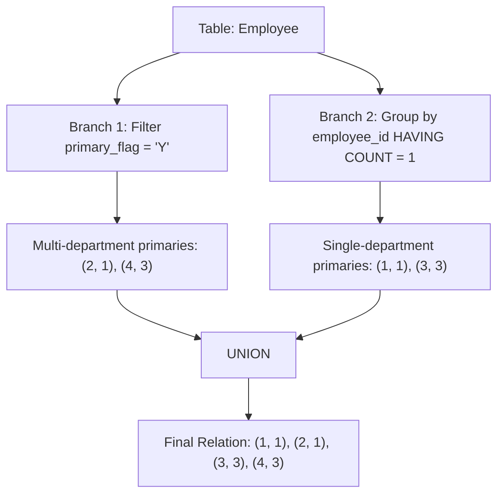

# Guided Example: Primary Department for Each Employee

We trace the step-by-step relational evaluation of bifurcated selection and grouping on a representative database instance:

- **Input:**
  Table `Employee`:
  ```text
  +-------------+---------------+--------------+
  | employee_id | department_id | primary_flag |
  +-------------+---------------+--------------+
  | 1           | 1             | N            |
  | 2           | 1             | Y            |
  | 2           | 2             | N            |
  | 3           | 3             | N            |
  | 4           | 2             | N            |
  | 4           | 3             | Y            |
  | 4           | 4             | N            |
  +-------------+---------------+--------------+
  ```
- **Required Output:**
  ```text
  +-------------+---------------+
  | employee_id | department_id |
  +-------------+---------------+
  | 1           | 1             |
  | 2           | 1             |
  | 3           | 3             |
  | 4           | 3             |
  +-------------+---------------+
  ```

This instance features both single-department employees (employees $1$ and $3$) whose only rows carry `primary_flag = 'N'`, and multi-department employees (employees $2$ and $4$) whose designated primary department carries `primary_flag = 'Y'`.

---

## 1. Instance & Teaching Goal

In relational modeling, flags often exhibit semantic asymmetry. Here, the business rules state:
1. When an employee belongs to multiple departments, exactly one row has `primary_flag = 'Y'`, designating the primary department. All other rows for that employee have `primary_flag = 'N'`.
2. When an employee belongs to exactly one department, their sole row has `primary_flag = 'N'`.

Our goal is to produce a relation with attributes `(employee_id, department_id)` containing each employee mapped to their unambiguous primary department.

A naive query filtering strictly on `primary_flag = 'Y'` drops all single-department employees. Conversely, a naive query filtering on `primary_flag = 'N'` includes non-primary departments of multi-department staff. The optimal approach cleanly partitions the employee domain into two mutually exclusive sets and unifies their outputs.

---

## 2. Conceptual Foundation & Invariants

### Relational Domain Partitioning

Let $\mathcal{E}$ denote the set of distinct `employee_id`s in `Employee`. For any employee $e \in \mathcal{E}$, let $D(e)$ be the set of departments to which $e$ belongs:
$$D(e) = \{ d \mid (e, d, \text{flag}) \in \text{Employee} \}$$

The population $\mathcal{E}$ partitions into two disjoint sets:
- **Single-Department Employees ($\mathcal{E}_1$):** $|D(e)| = 1$. The only row for $e$ has $\text{flag} = \text{'N'}$. The primary department is the sole $d \in D(e)$.
- **Multi-Department Employees ($\mathcal{E}_{>1}$):** $|D(e)| > 1$. Exactly one row has $\text{flag} = \text{'Y'}$, and all other $|D(e)| - 1$ rows have $\text{flag} = \text{'N'}$. The primary department is the unique $d$ where $\text{flag} = \text{'Y'}$.

> **Relational Partition & Disjoint Union Theorem.**
> Because $\mathcal{E}_1 \cap \mathcal{E}_{>1} = \emptyset$ and $\mathcal{E}_1 \cup \mathcal{E}_{>1} = \mathcal{E}$:
> 1. The selection $R_Y = \sigma_{\text{primary\_flag} = \text{'Y'}}(\text{Employee})$ extracts exactly one primary record for every employee $e \in \mathcal{E}_{>1}$, and zero records for employees in $\mathcal{E}_1$.
> 2. The aggregate filter $R_1 = \pi_{e, d}(\sigma_{|D(e)| = 1}(\text{Employee}))$ extracts the unique department for every employee $e \in \mathcal{E}_1$, and zero records for employees in $\mathcal{E}_{>1}$.
> 3. The relational union $R_Y \cup R_1$ is strictly disjoint, completely covers $\mathcal{E}$, and contains exactly one primary department for every employee.



---

## 3. Step-by-Step Worked Execution

We trace the evaluation across the two relational branches.

---

### Step 1: Evaluate Branch 1 (Explicit Flag Filter)

Scan each tuple in `Employee` and test the predicate `primary_flag = 'Y'`:

| `employee_id` | `department_id` | `primary_flag` | `primary_flag = 'Y'`? | Retained in $R_Y$? |
|:---:|:---:|:---:|:---:|:---:|
| $1$ | $1$ | N | False | No |
| $2$ | $1$ | Y | True | **Yes $\to (2, 1)$** |
| $2$ | $2$ | N | False | No |
| $3$ | $3$ | N | False | No |
| $4$ | $2$ | N | False | No |
| $4$ | $3$ | Y | True | **Yes $\to (4, 3)$** |
| $4$ | $4$ | N | False | No |

Result of Branch 1:
$$R_Y = \{ (2, 1), (4, 3) \}$$

---

### Step 2: Evaluate Branch 2 (Single-Membership Grouping)

Group all records by `employee_id` and compute the group cardinality $|D(e)|$:

| `employee_id` | Associated Departments | Membership Count $\lvert D(e) \rvert$ | Condition: $\lvert D(e) \rvert = 1$? | Output Tuple $(e, d)$ |
|:---:|:---:|:---:|:---:|:---:|
| $1$ | $\{1\}$ | $1$ | True | **$(1, 1)$** |
| $2$ | $\{1, 2\}$ | $2$ | False | — |
| $3$ | $\{3\}$ | $1$ | True | **$(3, 3)$** |
| $4$ | $\{2, 3, 4\}$ | $3$ | False | — |

Result of Branch 2:
$$R_1 = \{ (1, 1), (3, 3) \}$$

---

### Step 3: Relational Union of the Disjoint Branches

Combine the tuples from both branches:
$$R_{\text{final}} = R_Y \cup R_1 = \{ (2, 1), (4, 3) \} \cup \{ (1, 1), (3, 3) \}$$

Evaluating set membership:
- Employee $1$: Present in $R_1 \implies (1, 1)$
- Employee $2$: Present in $R_Y \implies (2, 1)$
- Employee $3$: Present in $R_1 \implies (3, 3)$
- Employee $4$: Present in $R_Y \implies (4, 3)$

The combined relation matches the target output exactly.

---

## 4. Complete Execution Trace

| Employee $e$ | Raw Records in Table | Classification | Active Branch | Primary Department Assigned |
|:---:|:---:|:---:|:---:|:---:|
| $1$ | $(1, 1, \text{N})$ | Single ($\lvert D(1) \rvert = 1$) | Branch 2 (`COUNT = 1`) | Department $1$ |
| $2$ | $(2, 1, \text{Y}), (2, 2, \text{N})$ | Multiple ($\lvert D(2) \rvert = 2$) | Branch 1 (`flag = 'Y'`) | Department $1$ |
| $3$ | $(3, 3, \text{N})$ | Single ($\lvert D(3) \rvert = 1$) | Branch 2 (`COUNT = 1`) | Department $3$ |
| $4$ | $(4, 2, \text{N}), (4, 3, \text{Y}), (4, 4, \text{N})$ | Multiple ($\lvert D(4) \rvert = 3$) | Branch 1 (`flag = 'Y'`) | Department $3$ |

---

## 5. Algorithmic Correctness

**Soundness.** Every row generated by Branch 1 has `primary_flag = 'Y'`, which under the domain contract constitutes the verified primary department for a multi-department employee. Every row generated by Branch 2 belongs to an employee with exactly one department membership, where the sole available department is unambiguously primary.

**Completeness.** Since every employee in the table belongs to either $\mathcal{E}_1$ or $\mathcal{E}_{>1}$, no employee is missed. Because the two criteria are mutually exclusive, no employee can produce duplicate differing rows in the output.

---

## 6. Traps This Instance Exposes

- **Global Flag Filtering (`WHERE primary_flag = 'Y'`):** Completely excludes employees who belong to only one department, as their flag is `'N'`. For this instance, employees $1$ and $3$ would be missing.
- **Filtering by `primary_flag = 'N'`:** Incorrectly includes non-primary departments for multi-department employees (e.g. $(2, 2)$ and $(4, 2), (4, 4)$).
- **`WHERE` vs `HAVING`:** Group count conditions like `COUNT(1) = 1` operate on groups formed by aggregation and must appear in `HAVING`, not `WHERE`.
- **Duplicate Rows from Union:** Because the predicate `primary_flag = 'Y'` and the predicate `COUNT(1) = 1` partition the employee IDs into disjoint sets, `UNION ALL` is logically equivalent to `UNION`, allowing the query planner to bypass redundant deduplication sorting if desired.

---

## 7. Complexity Derivation

- **Time Complexity:** $\mathcal{O}(M)$ where $M$ is the number of rows in the `Employee` table. Branch 1 performs a linear scan filtering on the flag column in $\mathcal{O}(M)$ time. Branch 2 groups by `employee_id` using hash aggregation or sort aggregation in $\mathcal{O}(M)$ time. Combining the streams takes $\mathcal{O}(E)$ time where $E$ is the number of distinct employees.
- **Auxiliary Space Complexity:** $\mathcal{O}(E)$ auxiliary memory to store hash buckets for the grouping operator and intermediate result buffers for the union.
