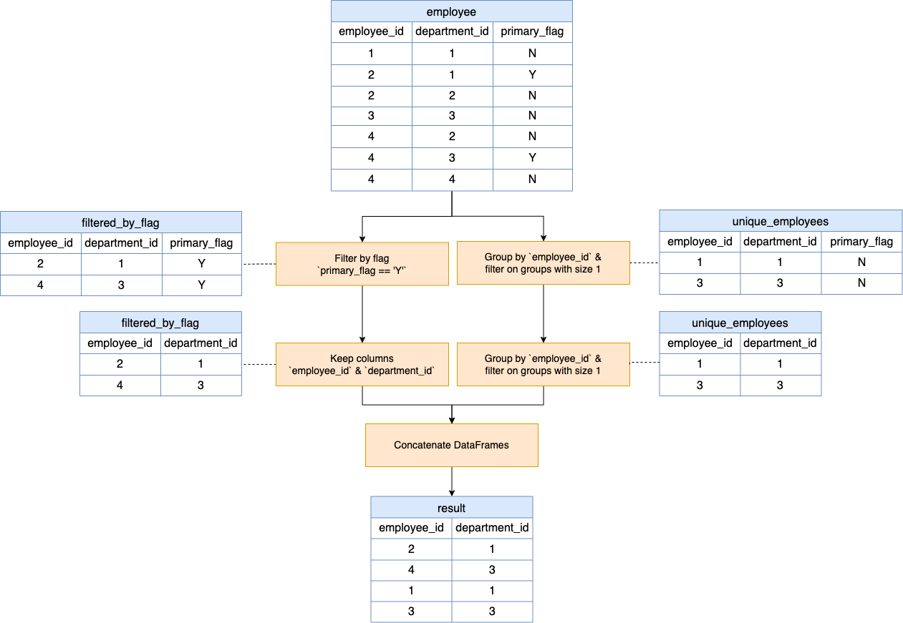
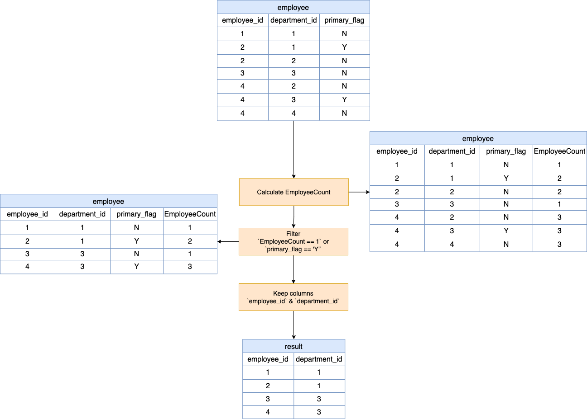

[TOC]

# Solution

---

### Overview

Employees can be associated with one or multiple departments. The task is to determine and report each employee's primary department, noting that if they're part of only one department, that's automatically their primary.

---

## pandas
### Approach 1: Conditional Filtering and Aggregation-based Union



#### Intuition

Sample `employee` DataFrame:

<table>
   <thead>
      <tr>
         <th>employee_id</th>
         <th>department_id</th>
         <th>primary_flag</th>
      </tr>
   </thead>
   <tbody>
      <tr>
         <td>1</td>
         <td>1</td>
         <td>N</td>
      </tr>
      <tr>
         <td>2</td>
         <td>1</td>
         <td>Y</td>
      </tr>
      <tr>
         <td>2</td>
         <td>2</td>
         <td>N</td>
      </tr>
      <tr>
         <td>3</td>
         <td>3</td>
         <td>N</td>
      </tr>
      <tr>
         <td>4</td>
         <td>2</td>
         <td>N</td>
      </tr>
      <tr>
         <td>4</td>
         <td>3</td>
         <td>Y</td>
      </tr>
      <tr>
         <td>4</td>
         <td>4</td>
         <td>N</td>
      </tr>
   </tbody>
</table>
<br>

 **Step 1 - Filter by Flag**:
```python
 filtered_by_flag = employee[employee['primary_flag'] == 'Y'][['employee_id', 'department_id']]
```
 - This part deals with employees that belong to multiple departments.
  - The code filters rows from the `employee` DataFrame where the $\text{primary}_{flag}$ is set to `'Y'`. This means we are interested in the primary department of employees who belong to multiple departments.
  - After filtering, we only select two columns: $'\text{employee}_{id}'$ and $'\text{department}_{id}'$. This will give us the primary department of each employee.
  - The result is stored in `filtered_by_flag`.

<table>
   <thead>
      <tr>
         <th>employee_id</th>
         <th>department_id</th>
      </tr>
   </thead>
   <tbody>
      <tr>
         <td>2</td>
         <td>1</td>
      </tr>
      <tr>
         <td>4</td>
         <td>3</td>
      </tr>
   </tbody>
</table>
<br>

**Step 2 - Unique Employees**:
```python
unique_employees = employee.groupby('employee_id').filter(lambda x: len(x) == 1)[['employee_id', 'department_id']]
```
  - This part deals with employees that belong to only one department.
  - Using `groupby`, we group the `employee` DataFrame by $\text{employee}_{id}$. This will group the rows based on the unique employee IDs.
  - Using the `filter` function, we filter out groups whose size (number of rows in the group) is exactly 1. This means that these employees belong to only one department.
  - After filtering, we select the same two columns: $'\text{employee}_{id}'$ and $'\text{department}_{id}'$. Since these employees belong to only one department, that single department is their primary department.
  - The result is stored in $\text{unique}_{employees}$.

<table>
   <thead>
      <tr>
         <th>employee_id</th>
         <th>department_id</th>
      </tr>
   </thead>
   <tbody>
      <tr>
         <td>1</td>
         <td>1</td>
      </tr>
      <tr>
         <td>3</td>
         <td>3</td>
      </tr>
   </tbody>
</table>
<br>

**Step 3 - Combining and Cleaning**:
```python
result = pd.concat([filtered_by_flag, unique_employees]).drop_duplicates().reset_index(drop=True)
```
  - We now have two DataFrames: `filtered_by_flag`, which contains the primary departments of employees with multiple departments, and $\text{unique}_{employees}$, which contains the primary (and only) department of employees with a single department.
  - Using `pd.concat`, we concatenate (or combine) these two DataFrames vertically. The resulting DataFrame will have all the primary departments for all employees.
  - We then call $\text{drop}_{duplicates}()$ to remove any duplicate rows. This is a safety measure; in the given context, it's unlikely that duplicates exist after the previous steps. However, it's good to be cautious.
  - Finally, $\text{reset}_{index}(drop=True)$ is used to reset the index of the DataFrame and make it more orderly. The `drop=True` argument ensures the old index doesn't become a column in the DataFrame.

<table>
   <thead>
      <tr>
         <th>employee_id</th>
         <th>department_id</th>
      </tr>
   </thead>
   <tbody>
      <tr>
         <td>2</td>
         <td>1</td>
      </tr>
      <tr>
         <td>4</td>
         <td>3</td>
      </tr>
      <tr>
         <td>1</td>
         <td>1</td>
      </tr>
      <tr>
         <td>3</td>
         <td>3</td>
      </tr>
   </tbody>
</table>
<br>

**4. Return Result**:
```python
return result
```
  - The final DataFrame, `result`, containing the primary department for each employee, is returned.

In summary, the function provides an efficient way to determine the primary department of each employee, regardless of whether they belong to one or multiple departments.

#### Implementation

Based on the understanding above, the solution can be implemented as:

```python
import pandas as pd

def find_primary_department(employee: pd.DataFrame) -> pd.DataFrame:
    # 1. Employees with primary_flag set to 'Y'
    filtered_by_flag = employee[employee['primary_flag'] == 'Y'][['employee_id', 'department_id']]

    # 2. Employees that appear exactly once in the Employee table
    unique_employees = employee.groupby('employee_id').filter(lambda x: len(x) == 1)[['employee_id', 'department_id']]

    # 3. Combine both DataFrames using concat and drop duplicates
    result = pd.concat([filtered_by_flag, unique_employees]).drop_duplicates().reset_index(drop=True)

    #4. Return result
    return result

```

### Approach 2: Group-based Transform and Conditional Filtering



#### Intuition

Sample `employee` dataframe:
<table>
   <thead>
      <tr>
         <th>employee_id</th>
         <th>department_id</th>
         <th>primary_flag</th>
      </tr>
   </thead>
   <tbody>
      <tr>
         <td>1</td>
         <td>1</td>
         <td>N</td>
      </tr>
      <tr>
         <td>2</td>
         <td>1</td>
         <td>Y</td>
      </tr>
      <tr>
         <td>2</td>
         <td>2</td>
         <td>N</td>
      </tr>
      <tr>
         <td>3</td>
         <td>3</td>
         <td>N</td>
      </tr>
      <tr>
         <td>4</td>
         <td>2</td>
         <td>N</td>
      </tr>
      <tr>
         <td>4</td>
         <td>3</td>
         <td>Y</td>
      </tr>
      <tr>
         <td>4</td>
         <td>4</td>
         <td>N</td>
      </tr>
   </tbody>
</table>
<br>

 **Step 1 - Calculate EmployeeCount**:
```python
 employee["EmployeeCount"] = employee.groupby("employee_id")["employee_id"].transform("size")
```
  - For each employee ($\text{employee}_{id}$), the code calculates how many departments they are associated with.
  - The `groupby` method groups the DataFrame by unique employee IDs.
  - The `transform("size")` method calculates the size (or count) of each group. It will return a Series with an identical size to `employee` where each entry corresponds to the count of rows for that $\text{employee}_{id}$.
  - The result is a new column named `EmployeeCount` in the `employee` DataFrame which contains the number of rows (i.e., departments) for each $\text{employee}_{id}$.

<table>
   <thead>
      <tr>
         <th>employee_id</th>
         <th>department_id</th>
         <th>primary_flag</th>
         <th>EmployeeCount</th>
      </tr>
   </thead>
   <tbody>
      <tr>
         <td>1</td>
         <td>1</td>
         <td>N</td>
         <td>1</td>
      </tr>
      <tr>
         <td>2</td>
         <td>1</td>
         <td>Y</td>
         <td>2</td>
      </tr>
      <tr>
         <td>2</td>
         <td>2</td>
         <td>N</td>
         <td>2</td>
      </tr>
      <tr>
         <td>3</td>
         <td>3</td>
         <td>N</td>
         <td>1</td>
      </tr>
      <tr>
         <td>4</td>
         <td>2</td>
         <td>N</td>
         <td>3</td>
      </tr>
      <tr>
         <td>4</td>
         <td>3</td>
         <td>Y</td>
         <td>3</td>
      </tr>
      <tr>
         <td>4</td>
         <td>4</td>
         <td>N</td>
         <td>3</td>
      </tr>
   </tbody>
</table>
<br>

 **Step 2 - Filtering the DataFrame**:
```python
result = employee[(employee["EmployeeCount"] == 1) | (employee["primary_flag"] == "Y")][
    ["employee_id", "department_id"]
]
```
  - The goal is to filter out rows that represent the primary department for each employee.
  - Two conditions are applied for filtering:
      1. If `EmployeeCount` is `1`, it means the employee belongs to only one department, so that department is automatically the primary one.
      2. If $\text{primary}_{flag}$ is `"Y"`, it indicates that for employees who are part of multiple departments, this particular department is their primary one.
  - The logical "or" (`|`) operator is used to combine the two conditions, so any row meeting either condition is retained.
  - The resulting filtered DataFrame will contain only the primary department for each employee.
  - The final filtered DataFrame will only retain two columns: $"\text{employee}_{id}"$ and $"\text{department}_{id}"$.

<table>
   <thead>
      <tr>
         <th>employee_id</th>
         <th>department_id</th>
      </tr>
   </thead>
   <tbody>
      <tr>
         <td>1</td>
         <td>1</td>
      </tr>
      <tr>
         <td>2</td>
         <td>1</td>
      </tr>
      <tr>
         <td>3</td>
         <td>3</td>
      </tr>
      <tr>
         <td>4</td>
         <td>3</td>
      </tr>
   </tbody>
</table>
<br>

 **Step 3 - Return Result**:
```python
 return result
```
  - Return the filtered DataFrame as the result.

In essence, the function works efficiently by leveraging the power of pandas to group and transform the data. It ensures that the output DataFrame contains only the primary department for each employee, whether they belong to one or multiple departments.
#### Implementation

Based on the understanding above, the solution can be implemented as:

```python
import pandas as pd

def find_primary_department(employee: pd.DataFrame) -> pd.DataFrame:
    # 1. Calculate EmployeeCount as the number of rows for each employee_id
    employee["EmployeeCount"] = employee.groupby("employee_id")[
        "employee_id"
    ].transform("size")

    # 2. Filter based on the EmployeeCount or primary_flag
    result = employee[
        (employee["EmployeeCount"] == 1) | (employee["primary_flag"] == "Y")
    ][["employee_id", "department_id"]]

    # 3. Return result
    return result
```

---

## Database
### Approach 1: `UNION`

#### Intuition

The `UNION` approach combines two distinct sets of logic using the `UNION` operator. Here's the intuition behind each part:

**Step 1 - Retrieving employees with primary_flag set to 'Y'**:
```sql
SELECT
  employee_id,
  department_id
FROM
  Employee
WHERE
  primary_flag = 'Y'
```
  - This part selects those employees that have been explicitly marked as having a particular department as their primary.
  - For employees who belong to multiple departments, one of those departments will have the $\text{primary}_{flag}$ set to 'Y', which denotes it as the primary department.
  - The SQL code fetches $\text{employee}_{id}$ and $\text{department}_{id}$ where $\text{primary}_{flag}$ is 'Y'.

**Step 2 - Retrieving employees that appear exactly once in the Employee table**:
```sql
SELECT
  employee_id,
  department_id
FROM
  Employee
GROUP BY
  employee_id
HAVING
  COUNT(employee_id) = 1
```
  - The objective here is to capture employees who are associated with only one department. In such cases, that single department is automatically their primary department.
  - The code groups the records in the `Employee` table by $\text{employee}_{id}$ using `GROUP BY`. For each employee ID, it then checks the count of associated rows (or departments).
  - The `HAVING` clause filters out groups where the count of rows (i.e., departments) for that employee is not equal to 1.
  - This way, only those employees who are associated with a single department are selected.

**Step 3 - Combining both results with UNION**:
```sql
SELECT
  employee_id,
  department_id
FROM
  Employee
WHERE
  primary_flag = 'Y'
UNION
SELECT
  employee_id,
  department_id
FROM
  Employee
GROUP BY
  employee_id
HAVING
  COUNT(employee_id) = 1;
```
  - `UNION` is an SQL operator that combines the results of two SELECT statements into a single set of rows. It automatically removes duplicates.
  - Here, it's used to merge the results from the two aforementioned logics: those with $\text{primary}_{flag} = 'Y'$ and those appearing only once in the table.
  - The final output is a unified list containing the primary department for each employee.

In essence, the SQL code ensures that for every employee, either their explicitly marked primary department is selected, or if they belong to only one department, that department is picked as the primary.

#### Implementation

Based on the understanding above, the solution can be implemented as:

```sql
-- Retrieving employees with primary_flag set to 'Y'
SELECT
  employee_id,
  department_id
FROM
  Employee
WHERE
  primary_flag = 'Y'
UNION
-- Retrieving employees that appear exactly once in the Employee table
SELECT
  employee_id,
  department_id
FROM
  Employee
GROUP BY
  employee_id
HAVING
  COUNT(employee_id) = 1;

```

### Approach 2: Window Function (`COUNT`)

#### Intuition

This approach uses an *advanced* SQL feature called window functions, specifically `COUNT() OVER()`. Here's the intuition for each step:

**Step 1 - Inner Query with Window Function**:
```sql
SELECT
  *,
  COUNT(employee_id) OVER(PARTITION BY employee_id) AS EmployeeCount
FROM
  Employee
```
  - This query fetches all columns from the `Employee` table and adds a new computed column, `EmployeeCount`.
  - $COUNT(\text{employee}_{id}) OVER(PARTITION BY \text{employee}_{id})$ is a window function. Let's break down what it does:
      - $PARTITION BY \text{employee}_{id}$: This breaks down the data into 'windows' or 'partitions' of rows that have the same $\text{employee}_{id}$. Each window is essentially a subset of the data for a specific employee.
      - $COUNT(\text{employee}_{id}) OVER(...)$: This counts the number of rows (i.e., the number of departments) for each employee within their respective partition/window. The result is a new column, `EmployeeCount`, which tells us how many departments each employee is associated with. This count is repeated for every row of the same employee.

**Step 2 - Alias & Outer Query**:
```sql
SELECT
  employee_id,
  department_id
FROM
  EmployeePartition
```
  - The inner query result is treated as a temporary table named `EmployeePartition`.
  - From this table, we select the desired columns: $\text{employee}_{id}$ and $\text{department}_{id}$.

**Step 3 - Filtering with WHERE Clause**:
```sql
WHERE
  EmployeeCount = 1
  OR primary_flag = 'Y'
```
  - We have two conditions to filter out the primary department for each employee:
      1. $EmployeeCount = 1$: This captures those employees who belong to only one department. For them, that single department is automatically their primary department.
      2. $\text{primary}_{flag} = 'Y'$: This captures employees who belong to multiple departments but have one department explicitly marked as primary with a flag 'Y'.
  - The `OR` operator is used, so any row satisfying either of the above conditions is included in the result.

**Summary**:
The code first assigns an employee department count to each row using a window function. It then filters out the desired rows based on whether an employee is associated with just one department or has a department explicitly flagged as primary. The end result is a list of primary departments for each employee.

#### Implementation

Based on the understanding above, the solution can be implemented as:

```sql
SELECT
  employee_id,
  department_id
FROM
  (
    SELECT
      *,
      COUNT(employee_id) OVER(PARTITION BY employee_id) AS EmployeeCount
    FROM
      Employee
  ) EmployeePartition
WHERE
  EmployeeCount = 1
  OR primary_flag = 'Y';

```