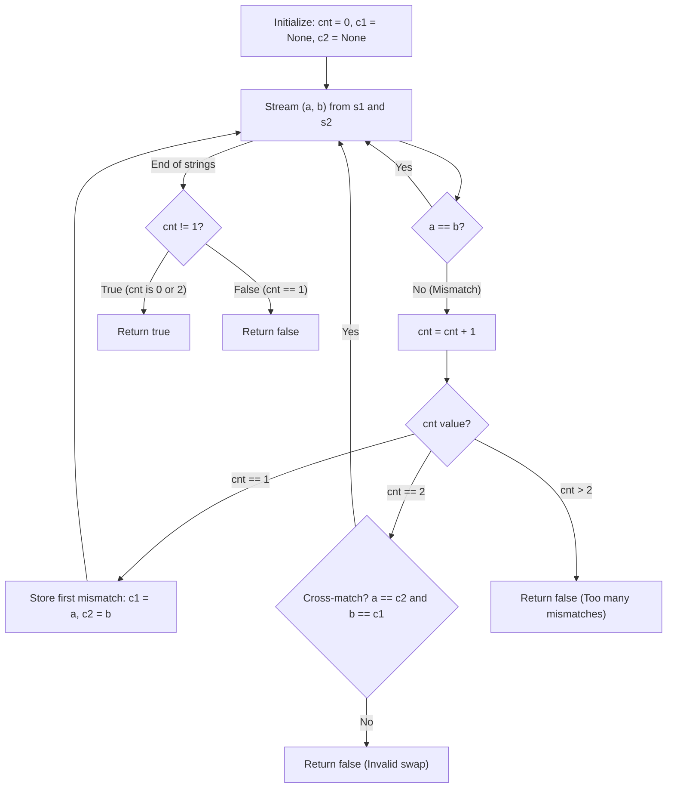

# Guided Example: Check if One String Swap Can Make Strings Equal

We trace the step-by-step verification of positional equality and transposition cross-matching on a representative problem instance:

- **Input:** `s1 = "bank"`, `s2 = "kanb"`
- **Required Output:** `true`

This instance demonstrates how scanning paired characters detects positional discrepancies, records an initial mismatched character pair, and validates that a subsequent mismatch forms a perfect two-character transposition.

---

## 1. Instance & Teaching Goal

We are given two strings `s1` and `s2` of equal length $n$. A single string swap consists of choosing two indices $i$ and $j$ in one of the strings and swapping the characters at those positions. We must determine whether `s1` can be made equal to `s2` using at most one swap.

A naive approach might generate all $\mathcal{O}(n^2)$ possible index pairs, perform each swap, and compare strings in $\mathcal{O}(n)$ time, consuming $\mathcal{O}(n^3)$ overall time. The optimal approach operates in a single linear pass by analyzing the cardinality and character alignment of mismatched indices.

---

## 2. Conceptual Foundation & Invariants

### Mismatch Set and Transposition Classification

Let $M$ be the set of indices where the two strings differ:
$$M = \{ k \in [0, n - 1] \mid s1[k] \ne s2[k] \}$$

Because a single swap modifies the characters at at most two distinct positions, the cardinality $|M|$ completely determines feasibility:
1. **Case $|M| = 0$:** The strings are identical without any swap ($0$ swaps $\le 1$). Return `true`.
2. **Case $|M| = 1$:** A single swap necessarily changes two distinct indices; it is impossible to alter only one character without affecting another. Return `false`.
3. **Case $|M| = 2$:** Let $M = \{i, j\}$ with $i < j$. Swapping $s1[i]$ with $s1[j]$ results in $s1 = s2$ if and only if:
   $$s1[i] = s2[j] \quad \text{and} \quad s1[j] = s2[i]$$
   This is the exact two-character cross-match condition.
4. **Case $|M| > 2$:** Since one swap can fix at most two mismatched positions, three or more mismatches can never be resolved. Return `false`.

> **Single Transposition Invariant & Mismatch Cardinality Theorem.**
> Two equal-length strings $s1$ and $s2$ satisfy the at-most-one-swap equivalence if and only if $|M| \in \{0, 2\}$ and, when $|M| = 2$ with indices $i < j$, the cross-match identity $(s1[i], s2[i]) = (s2[j], s1[j])$ holds.

---

## 3. Step-by-Step Worked Execution

We trace `s1 = "bank"` and `s2 = "kanb"`, where $n = 4$.

### Trace Setup
- Mismatch counter: $\text{cnt} = 0$.
- Saved first mismatch characters: $c_1 = \text{None}, c_2 = \text{None}$.

---

### Step 1: Index $k = 0$, Characters `('b', 'k')`
- Comparing $s1[0] = \text{'b'}$ and $s2[0] = \text{'k'}$:
  $$\text{'b'} \ne \text{'k'}$$
- This is the first mismatch:
  $$\text{cnt} = 0 + 1 = 1$$
- Record character tuple:
  $$c_1 = \text{'b'}, \quad c_2 = \text{'k'}$$
- State: $\text{cnt} = 1$, $(c_1, c_2) = (\text{'b'}, \text{'k'})$.

---

### Step 2: Index $k = 1$, Characters `('a', 'a')`
- Comparing $s1[1] = \text{'a'}$ and $s2[1] = \text{'a'}$:
  $$\text{'a'} == \text{'a'}$$
- Characters match. No change to state.
- State: $\text{cnt} = 1$, $(c_1, c_2) = (\text{'b'}, \text{'k'})$.

---

### Step 3: Index $k = 2$, Characters `('n', 'n')`
- Comparing $s1[2] = \text{'n'}$ and $s2[2] = \text{'n'}$:
  $$\text{'n'} == \text{'n'}$$
- Characters match. No change to state.
- State: $\text{cnt} = 1$, $(c_1, c_2) = (\text{'b'}, \text{'k'})$.

---

### Step 4: Index $k = 3$, Characters `('k', 'b')`
- Comparing $s1[3] = \text{'k'}$ and $s2[3] = \text{'b'}$:
  $$\text{'k'} \ne \text{'b'}$$
- Mismatch detected. Increment counter:
  $$\text{cnt} = 1 + 1 = 2$$
- Evaluate cross-match conditions against saved $(c_1, c_2) = (\text{'b'}, \text{'k'})$:
  1. Does current $s1[3]$ match saved $c_2$?
     $$\text{'k'} == \text{'k'} \implies \text{True}$$
  2. Does current $s2[3]$ match saved $c_1$?
     $$\text{'b'} == \text{'b'} \implies \text{True}$$
- Cross-match condition is satisfied.
- State: $\text{cnt} = 2$.

---

### Step 5: Termination and Result Synthesis
- Both strings are fully traversed.
- Final mismatch count is $\text{cnt} = 2$.
- Because $\text{cnt} \ne 1$ (it is exactly $2$, and the cross-match was validated), the function confirms that swapping indices $0$ and $3$ transforms `s1` into `s2`:
  $$\text{Swap } s1[0] \leftrightarrow s1[3]: \quad \text{"bank"} \longrightarrow \text{"kanb"}$$
- Final decision: **`true`**.

---

## 4. Complete Execution Trace

| Index $k$ | $s1[k]$ | $s2[k]$ | Character Equality | Mismatch Count $\text{cnt}$ | Stored Pair $(c_1, c_2)$ | Cross-Match Check |
|:---:|:---:|:---:|:---:|:---:|:---:|:---:|
| $0$ | `'b'` | `'k'` | `'b' != 'k'` | $1$ | `('b', 'k')` | Initialized |
| $1$ | `'a'` | `'a'` | `'a' == 'a'` | $1$ | `('b', 'k')` | Skipped |
| $2$ | `'n'` | `'n'` | `'n' == 'n'` | $1$ | `('b', 'k')` | Skipped |
| $3$ | `'k'` | `'b'` | `'k' != 'b'` | $2$ | `('b', 'k')` | Passed: `'k' == c2` and `'b' == c1` |

End of input reached with $\text{cnt} = 2$ and valid cross-match $\implies$ Output **`true`**.

---

## 5. Algorithmic Correctness

**Soundness.** A swap of indices $i$ and $j$ in $s1$ leaves all other indices unchanged. Therefore, positions $k \notin \{i, j\}$ must already have $s1[k] = s2[k]$. The swap sets the new character at index $i$ to $s1[j]$ and at index $j$ to $s1[i]$. Thus, equality requires $s1[j] = s2[i]$ and $s1[i] = s2[j]$. The algorithm directly verifies this condition when $|M| = 2$.

**Completeness.** Any string pair requiring zero swaps has $\text{cnt} = 0 \ne 1$, returning `true`. Any pair requiring more than one swap will produce either $|M| > 2$ (which immediately aborts with `false`) or $|M| = 2$ with non-transposed characters (which aborts on the cross-match check) or $|M| = 1$ (which returns `false` via $\text{cnt} == 1$). Every possible scenario is covered without false positives.

---

## 6. Traps This Instance Exposes

- **Single Mismatch Trap:** If `s1 = "a"` and `s2 = "b"`, there is $1$ mismatch. One cannot swap a single character without swapping it with another index. Checking `cnt != 1` at the end cleanly catches this.
- **Identical Strings ($0$ Mismatches):** When `s1 = "abc"` and `s2 = "abc"`, $\text{cnt} = 0$. The problem asks if strings can be equal with *at most* one swap. Zero swaps is explicitly allowed ($\le 1$). Returning `cnt != 1` correctly evaluates to `true`.
- **Identical Frequency but Wrong Positions:** If `s1 = "abc"` and `s2 = "bca"`, characters are permutations of each other, but the cyclic shift requires two swaps. Here $|M| = 3$, which triggers early exit when $\text{cnt} > 2$.
- **Transposition Asymmetry:** If `s1 = "ab"` and `s2 = "ac"`, $|M| = 1$. If `s1 = "ab"` and `s2 = "cd"`, $|M| = 2$, but $s1[1] \ne s2[0]$ ('b' != 'c'). Testing both $s1[j] == s2[i]$ and $s1[i] == s2[j]$ prevents treating arbitrary double-mismatches as swappable.

---

## 7. Complexity Derivation

- **Time Complexity:** $\mathcal{O}(n)$. The algorithm performs a single pass over strings of length $n$. At each position, comparison and arithmetic operations take $\mathcal{O}(1)$ time. Early return occurs immediately upon a third mismatch or failed second mismatch. Worst-case time is strictly linear in $n$.
- **Auxiliary Space Complexity:** $\mathcal{O}(1)$. The method uses only a counter integer and two character variables, requiring constant auxiliary memory.
