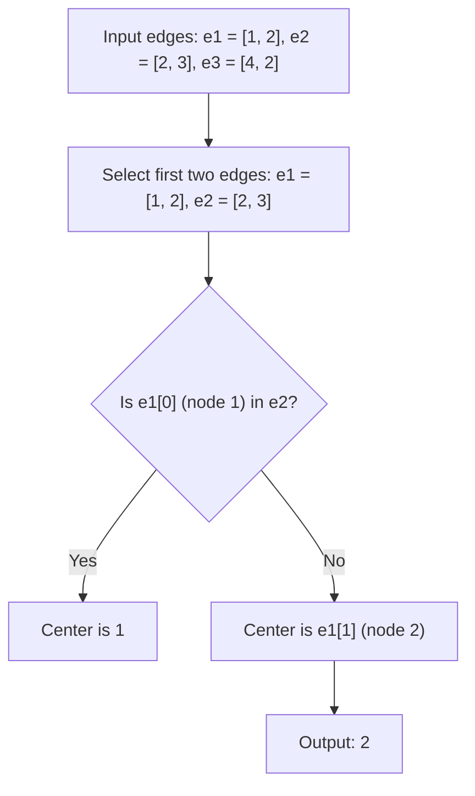

# Guided Example: Find Center of Star Graph

We trace the step-by-step structural identification of the central hub in a star graph on a representative problem instance:

- **Input:** `edges = [[1, 2], [2, 3], [4, 2]]`
- **Required Output:** `2`

This instance demonstrates how graph topology invariants eliminate the need to construct adjacency lists, count degrees, or inspect more than two edges, identifying the central vertex in strictly $\mathcal{O}(1)$ time.

---

## 1. Instance & Teaching Goal

An undirected star graph on $n$ vertices labeled $1$ to $n$ consists of:
- Exactly one central vertex $c$ of degree $n - 1$, connected by an edge to every other vertex.
- Exactly $n - 1$ peripheral vertices (leaves) of degree $1$, connected solely to the center.
- Exactly $n - 1$ undirected edges.

The task is to return the label of the center node.

A general graph algorithm might construct an adjacency list or compute all vertex degrees by scanning all $n - 1$ edges in $\mathcal{O}(n)$ time and memory. However, knowing that the input is guaranteed to be a valid star graph allows us to exploit the unique intersection property of any two edges.

---

## 2. Conceptual Foundation & Invariants

### Topological Invariant of Star Graphs

Let $G = (V, E)$ be a star graph with $|V| = n \ge 3$ and $|E| = n - 1$.
- There exists a unique vertex $c \in V$ such that $\deg(c) = n - 1$.
- For every leaf $v \in V \setminus \{c\}$, $\deg(v) = 1$.
- Every edge $e \in E$ is of the form $\{c, v\}$ for some leaf $v$.

> **Star Graph Centrality & Unique Edge Intersection Theorem.**
> Let $e_1$ and $e_2$ be any two distinct edges in $E$.
> Because every edge contains the central vertex $c$, we have $c \in e_1$ and $c \in e_2$, which implies:
> $$c \in (e_1 \cap e_2)$$
> Furthermore, since leaves have degree $1$, no leaf can belong to two distinct edges. Thus:
> $$(e_1 \setminus \{c\}) \cap (e_2 \setminus \{c\}) = \emptyset$$
> Therefore, the intersection of any two distinct edges in a star graph is precisely the singleton set containing the center:
> $$e_1 \cap e_2 = \{c\}$$
> Given the first edge $e_1 = \{u_1, v_1\}$ and second edge $e_2 = \{u_2, v_2\}$:
> $$c = \begin{cases} u_1 & \text{if } u_1 = u_2 \text{ or } u_1 = v_2 \\ v_1 & \text{otherwise} \end{cases}$$

---

## 3. Step-by-Step Worked Execution

We trace `edges = [[1, 2], [2, 3], [4, 2]]` where $n = 4$.

### Trace Setup
- Edge $0$: $e_0 = [1, 2]$ with endpoints $u_0 = 1$ and $v_0 = 2$.
- Edge $1$: $e_1 = [2, 3]$ with endpoints $u_1 = 2$ and $v_1 = 3$.

---

### Step 1: Examine the First Endpoint of Edge 0
- Select candidate node $u_0 = 1$.
- Test membership of $u_0$ in $e_1 = [2, 3]$:
  - Is $1 == 2$? False.
  - Is $1 == 3$? False.
- Consequence: Vertex $1$ is an endpoint of $e_0$ but does not appear in $e_1$.
- By the theorem, because the center must belong to every edge, vertex $1$ cannot be the center. It must be a leaf.

---

### Step 2: Conclude the Center from the Second Endpoint of Edge 0
- Because edge $e_0 = [1, 2]$ connects the center to a leaf, and vertex $1$ is proven to be a leaf:
  - The remaining endpoint $v_0 = 2$ **must** be the center.
- Verification (optional sanity check):
  - $2 \in e_0 \implies [1, 2]$ contains $2$.
  - $2 \in e_1 \implies [2, 3]$ contains $2$.
  - $2 \in e_2 \implies [4, 2]$ contains $2$.
- Confirmed center: **$2$**.

---

## 4. Complete Execution Trace

| Comparison Step | Candidate Node | Tested Against Edge | Membership Result | Conclusion |
|:---:|:---:|:---:|:---:|:---:|
| 1 | $e_0[0] = 1$ | $e_1 = [2, 3]$ | $1 \notin \{2, 3\}$ | $1$ is a leaf; cannot be center |
| 2 | $e_0[1] = 2$ | $e_0 = [1, 2]$ | Direct deduction | **$2$ is the unique center** |

The algorithm completes after at most two integer comparisons without examining `edges[2] = [4, 2]`.

---

## 5. Algorithmic Correctness

**Soundness.** In an undirected star graph, every edge is incident to the center vertex. Thus, if a vertex appears in both of the first two distinct edges, it is incident to two edges. In a star graph, only the center has degree $\ge 2$ (specifically $n - 1 \ge 2$ for $n \ge 3$). Hence, the shared vertex is guaranteed to be the center.

**Completeness.** Since $n \ge 3$, there are at least two edges in `edges`. The first two edges are distinct. Because the center is incident to all edges, it must appear in both `edges[0]` and `edges[1]`. Testing whether `edges[0][0]` is in `edges[1]` is exhaustive: either `edges[0][0]` is the shared vertex, or `edges[0][1]` is. No third possibility exists.

---

## 6. Traps This Instance Exposes

- **Over-Engineering with Adjacency Graphs:** Constructing an adjacency list `graph[u].append(v)` allocates $\mathcal{O}(n)$ lists and scans all $n - 1$ edges, incurring unnecessary memory allocation and runtime overhead.
- **Full Degree Counting:** Scanning all edges to tally counts in a hash map or frequency array consumes $\mathcal{O}(n)$ time and $\mathcal{O}(n)$ space, whereas $\mathcal{O}(1)$ time suffices.
- **Edge Ordering Assumption:** Assuming the center is always the first element in each edge pair (e.g. `edges[i][0]`) is invalid. Edges can be oriented in arbitrary order (e.g. `[leaf, center]` or `[center, leaf]`), as demonstrated by `[4, 2]` where $2$ appears second.
- **Assuming $n \ge 3$:** The problem statement specifies $3 \le n \le 10^5$, which guarantees that at least two distinct edges always exist.

---

## 7. Complexity Derivation

- **Time Complexity:** $\mathcal{O}(1)$. The algorithm inspects exactly two edges (`edges[0]` and `edges[1]`) and performs at most two integer equality comparisons (`edges[0][0] == edges[1][0]` or `edges[0][0] == edges[1][1]`). The execution time is strictly independent of $n$.
- **Auxiliary Space Complexity:** $\mathcal{O}(1)$. Zero additional data structures or dynamically allocated containers are created.
