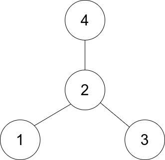

### 1. Description

There is an undirected **star** graph consisting of `n` nodes labeled from `1` to `n`. A star graph is a graph where there is one **center** node and **exactly** $n - 1$ edges that connect the center node with every other node.

You are given a 2D integer array `edges` where each $\text{edges}[i] = [u_{i}, v_{i}]$ indicates that there is an edge between the nodes $u_{i}$ and $v_{i}$. Return the center of the given star graph.

### 2. Function Contract

**Inputs**

- `edges`: Input parameter (`List[List[int]]`).

**Return value**

- Returns `int`.

### 3. Examples

#### Example 1

- **Input:** $edges = [[1,2],[2,3],[4,2]]$
- **Output:** `2`
- **Explanation:** As shown in the figure above, node 2 is connected to every other node, so 2 is the center.

#### Example 2

- **Input:** $edges = [[1,2],[5,1],[1,3],[1,4]]$
- **Output:** `1`

### 4. Constraints

- $3 \le n \le 10^{5}$

- $\text{edges.length} = n - 1$

- $\text{edges}[i].length = 2$

- $1 \le u_{i}, v_{i} \le n$

- $u_{i} \neq v_{i}$

- The given `edges` represent a valid star graph.
