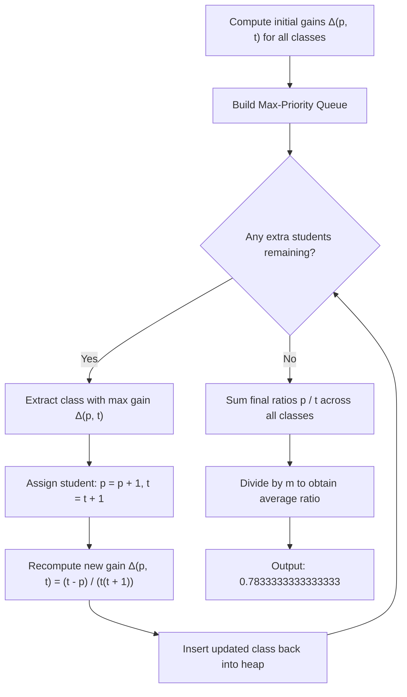

# Guided Example: Maximum Average Pass Ratio

We trace the step-by-step priority queue simulation and marginal gain optimization on a representative problem instance:

- **Input:** `classes = [[1, 2], [3, 5], [2, 2]]`, `extraStudents = 2`
- **Required Output:** `0.7833333333333333`

This instance demonstrates how class size and existing ratios interact to determine the marginal increase in passing ratio, and how discrete concavity validates assigning each extra student greedily via a max-priority queue.

---

## 1. Instance & Teaching Goal

We are given $m$ classes, where class $i$ currently has $p_i$ passing students out of $t_i$ total students. Its current pass ratio is $p_i / t_i$. We are given $k = \text{extraStudents}$ additional students, each guaranteed to pass the exam. Assigning an extra student to class $i$ increases both $p_i$ and $t_i$ by $1$.

Our goal is to assign all $k$ students to classes such that the average pass ratio across all classes,
$$\bar{R} = \frac{1}{m} \sum_{i=1}^m \frac{p_i}{t_i}$$
is maximized.

Because the number of classes $m$ is constant, maximizing the average ratio is mathematically equivalent to maximizing the sum of individual ratios. A naive greedy choice might pick the class with the lowest current ratio, or attempt to distribute students evenly. However, the true metric of improvement is the marginal gain produced by adding one student to a specific class.

---

## 2. Conceptual Foundation & Invariants

### The Marginal Gain Formula

When one passing student is assigned to a class with $p$ passing and $t$ total students, the pass ratio changes from $p/t$ to $(p+1)/(t+1)$. The marginal improvement is:
$$\Delta(p, t) = \frac{p+1}{t+1} - \frac{p}{t} = \frac{t(p+1) - p(t+1)}{t(t+1)} = \frac{t - p}{t(t+1)}$$

Key observations:
1. **Unpassed Students Matter:** The numerator is $t - p$, the number of failing students in the class. If $p = t$ (a $100\%$ pass rate), the numerator is $0$, meaning zero gain can ever be extracted by adding more students to an already perfect class.
2. **Class Size Matters:** The denominator is $t(t+1)$. For identical numbers of failing students, smaller classes experience substantially larger gains than larger classes.

### Discrete Concavity and Greedy Optimality

> **Diminishing Marginal Gains & Greedy Priority Optimality Theorem.**
> For any class with baseline $(p, t)$, let $g_s = \Delta(p + s, t + s)$ be the marginal gain gained by allocating the $(s+1)^{\text{th}}$ extra student to this class:
> $$g_s = \frac{t - p}{(t + s)(t + s + 1)}$$
> As $s$ increases, the numerator $t - p$ remains constant while the denominator $(t + s)(t + s + 1)$ strictly increases. Therefore:
> $$g_0 > g_1 > g_2 > \dots \ge 0$$
> Each class exhibits strictly diminishing marginal returns (discrete concavity).
> By the Fox-Groenevelt discrete resource allocation theorem, when allocating discrete units among separable concave objectives, the greedy policy—allocating each successive unit to the component currently exhibiting the maximum marginal gain—achieves the global maximum.

---

## 3. Step-by-Step Worked Execution

We trace `classes = [[1, 2], [3, 5], [2, 2]]` with `extraStudents = 2`.

### Step 1: Initial State & Heap Construction

Evaluate the current ratio and immediate marginal gain $\Delta(p, t)$ for each of the $m = 3$ classes:

1. **Class 0:** $p = 1, t = 2$
   - Current ratio: $1/2 = 0.500000$
   - Marginal gain:
     $$\Delta(1, 2) = \frac{2 - 1}{2 \times 3} = \frac{1}{6} \approx 0.166667$$
2. **Class 1:** $p = 3, t = 5$
   - Current ratio: $3/5 = 0.600000$
   - Marginal gain:
     $$\Delta(3, 5) = \frac{5 - 3}{5 \times 6} = \frac{2}{30} = \frac{1}{15} \approx 0.066667$$
3. **Class 2:** $p = 2, t = 2$
   - Current ratio: $2/2 = 1.000000$
   - Marginal gain:
     $$\Delta(2, 2) = \frac{2 - 2}{2 \times 3} = 0.000000$$

Priority order based on marginal gain:
$$\text{Class 0 } (0.166667) > \text{Class 1 } (0.066667) > \text{Class 2 } (0.000000)$$

---

### Step 2: Allocate 1st Extra Student
- **Select Maximum Gain:** Class 0 has the highest gain ($\approx 0.166667$).
- **Assign Student:**
  - $p_0 = 1 + 1 = 2$
  - $t_0 = 2 + 1 = 3$
  - Updated ratio: $2/3 \approx 0.666667$
- **Recompute Marginal Gain for Class 0:**
  $$\Delta(2, 3) = \frac{3 - 2}{3 \times 4} = \frac{1}{12} \approx 0.083333$$
- **Updated Pool of Gains:**
  - Class 0: $\Delta = 1/12 \approx 0.083333$
  - Class 1: $\Delta = 1/15 \approx 0.066667$
  - Class 2: $\Delta = 0.000000$

---

### Step 3: Allocate 2nd Extra Student
- **Compare Gains:**
  $$0.083333 \text{ (Class 0)} > 0.066667 \text{ (Class 1)} > 0.000000 \text{ (Class 2)}$$
- **Select Maximum Gain:** Class 0 still offers the largest gain.
- **Assign Student:**
  - $p_0 = 2 + 1 = 3$
  - $t_0 = 3 + 1 = 4$
  - Updated ratio: $3/4 = 0.750000$
- **Recompute Marginal Gain for Class 0:**
  $$\Delta(3, 4) = \frac{4 - 3}{4 \times 5} = \frac{1}{20} = 0.050000$$
- All $2$ extra students have now been allocated.

---

### Step 4: Final Ratio Calculation
Sum the finalized pass ratios across all $3$ classes:
- Class 0: $3/4 = 0.750000$
- Class 1: $3/5 = 0.600000$
- Class 2: $2/2 = 1.000000$

Total ratio sum:
$$\sum_{i=0}^2 \frac{p_i}{t_i} = 0.75 + 0.60 + 1.00 = 2.35$$

Compute the average pass ratio:
$$\bar{R} = \frac{2.35}{3} = \frac{47}{60} \approx 0.7833333333333333$$

---

## 4. Complete Execution Trace

| Allocation Step | Active Class Chosen | Class State Before | Marginal Gain $\Delta$ | Class State After | New Ratio | Heap Top Next |
|:---:|:---:|:---:|:---:|:---:|:---:|:---:|
| Setup | — | — | — | — | — | Class 0 ($0.1667$) |
| Student 1 | Class 0 | $[1, 2]$ | $1/6 \approx 0.1667$ | $[2, 3]$ | $2/3 \approx 0.6667$ | Class 0 ($0.0833$) |
| Student 2 | Class 0 | $[2, 3]$ | $1/12 \approx 0.0833$ | $[3, 4]$ | $3/4 = 0.7500$ | Class 1 ($0.0667$) |

Final average pass ratio: $(0.75 + 0.60 + 1.00) / 3 = 0.7833333333333333$.

---

## 5. Algorithmic Correctness

**Soundness.** Every allocation of a student to a class increases the total sum of pass ratios by precisely the computed marginal gain $\Delta(p, t)$. Because each student is added to an existing class, all intermediate counts $p_i \le t_i$ remain valid, and every student accounted for is guaranteed to pass.

**Completeness.** By the Diminishing Marginal Gains Theorem, each subsequent student allocated to the same class yields a strictly smaller gain. Because all candidate choices exhibit independent, decreasing marginal utilities, no future allocation sequence can achieve a larger sum than the sequence formed by iteratively picking the largest current marginal gain.

---

## 6. Traps This Instance Exposes

- **Lowest-Ratio Fallacy:** Class 0 had a lower ratio ($0.50$) than Class 1 ($0.60$), but if Class 1 were instead $[10, 100]$ (ratio $0.10$), its gain would be $(100 - 10)/(100 \times 101) = 90/10100 \approx 0.0089$, far lower than Class 0's $0.1667$. Selecting by lowest ratio fails completely.
- **Equal Allocation Fallacy:** Distributing extra students evenly across all classes ignores differences in class size and diminishing returns. Here, both students are optimally assigned to Class 0.
- **Perfect Ratio Zero Gain:** Classes with $p = t$ have zero failing students ($t - p = 0$). Adding students to such classes never increases the ratio. They must naturally sit at the bottom of the priority queue.
- **Floating-Point Precision in Heaps:** Representing marginal gains as floats can lead to subtle ordering issues if precision is lost; however, within standard double-precision floating-point arithmetic, the differences between class sizes up to $10^5$ are well within machine epsilon.

---

## 7. Complexity Derivation

- **Time Complexity:** $\mathcal{O}(m + k \log m)$, where $m$ is the number of classes and $k = \text{extraStudents}$. Constructing the initial heap takes linear $\mathcal{O}(m)$ time via bottom-up heapification. Each of the $k$ student allocations performs one extraction and one insertion in the heap of size $m$, costing $\mathcal{O}(\log m)$ per student. Computing the final ratio sum takes $\mathcal{O}(m)$. Total time is $\mathcal{O}(m + k \log m)$.
- **Auxiliary Space Complexity:** $\mathcal{O}(m)$. The priority queue maintains exactly one tuple per class, requiring $\mathcal{O}(m)$ auxiliary space.
