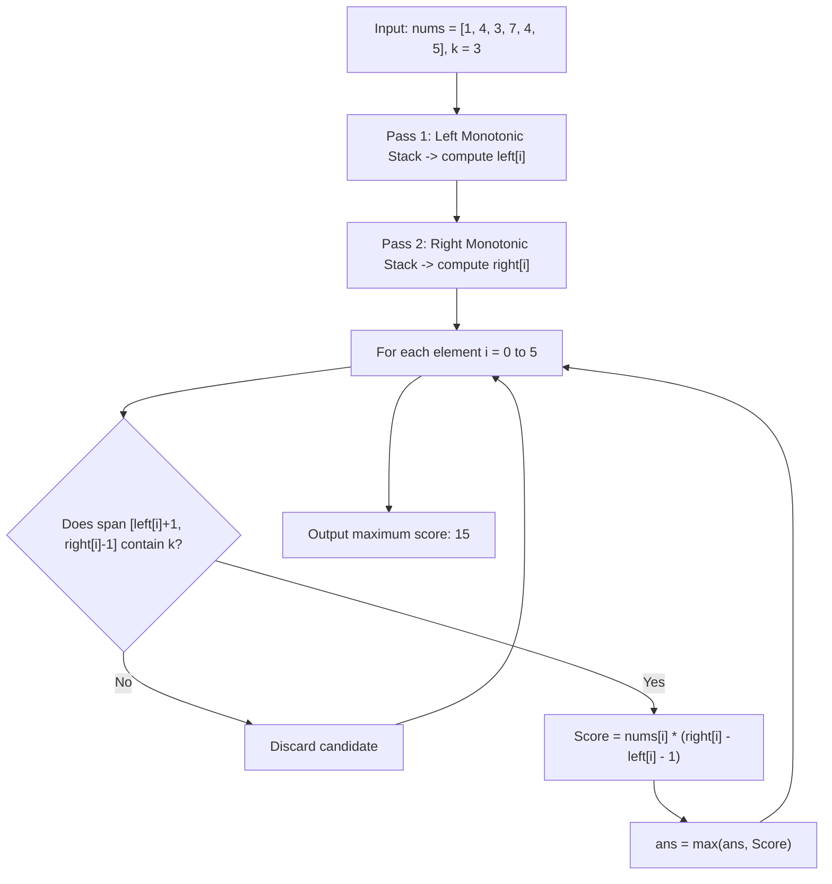

# Guided Example: Maximum Score of a Good Subarray

We trace the step-by-step execution of monotonic stack boundary expansion and anchor containment verification on a representative problem instance:

- **Input:** `nums = [1, 4, 3, 7, 4, 5]`, `k = 3`
- **Required Output:** `15`

This instance features non-uniform peaks and valleys around the anchor index $k = 3$, demonstrating how monotonic stacks determine the maximal valid span for each candidate minimum and filter exclusively for intervals containing $k$.

---

## 1. Instance & Teaching Goal

Given an integer array `nums` and an index $k$, a subarray $\text{nums}[i..j]$ is considered **good** if it contains the required anchor index:
$$0 \le i \le k \le j < n$$

The score of a subarray is defined as:
$$\text{Score}(i, j) = \min(\text{nums}[i..j]) \times (j - i + 1)$$

Our goal is to find the maximum possible score among all good subarrays.

A naive approach would evaluate all $\mathcal{O}(n^2)$ subarrays containing $k$, taking $\mathcal{O}(n^2)$ time with running minima or $\mathcal{O}(n^3)$ without. The optimal approach uses monotonic stacks to identify the maximal contiguous domain over which each element serves as the bottleneck (minimum) value, filtering only those spans covering $k$.

---

## 2. Conceptual Foundation & Invariants

### Maximal Span for Fixed Minimums

Every subarray has at least one minimum element. If we designate index $m$ such that $\text{nums}[m] = v$ is the minimum value of a subarray, that subarray can be greedily extended left and right as far as possible without encountering any element strictly smaller than $v$.
- Let $\text{left}[m]$ be the index of the nearest element to the left strictly smaller than $\text{nums}[m]$ (or $-1$ if none exists).
- Let $\text{right}[m]$ be the index of the nearest element to the right smaller than or equal to $\text{nums}[m]$ (or $n$ if none exists).

The maximal contiguous interval where $\text{nums}[m]$ is the minimum is:
$$I_m = [\text{left}[m] + 1, \text{right}[m] - 1]$$
The width of this interval is:
$$W_m = (\text{right}[m] - 1) - (\text{left}[m] + 1) + 1 = \text{right}[m] - \text{left}[m] - 1$$

> **Maximal Span Invariant & Monotonic Boundary Containment Theorem.**
> 1. **Maximality:** For any fixed minimum value $v = \text{nums}[m]$, any subarray contained within $I_m$ has width $W \le W_m$ and minimum $\ge v$. Its score cannot exceed $v \times W_m$. Thus, it suffices to test only the maximal interval $I_m$ for each element $m$.
> 2. **Anchor Containment:** The maximal interval $I_m$ is a valid "good" subarray if and only if:
>    $$\text{left}[m] + 1 \le k \le \text{right}[m] - 1$$
> 3. **Linear Monotonicity:** Monotonic stacks determine $\text{left}[m]$ and $\text{right}[m]$ for all $m \in [0, n - 1]$ in $\mathcal{O}(n)$ amortized time.

---

## 3. Step-by-Step Worked Execution

We trace `nums = [1, 4, 3, 7, 4, 5]` of length $n = 6$ with $k = 3$ ($\text{nums}[3] = 7$).

---

### Step 1: Compute Left Boundaries (`left[i]`) via Monotonic Stack

Scan left to right, maintaining a strictly increasing stack of indices:

1. **$i = 0$, $v = 1$:** Stack is empty $\implies \text{left}[0] = -1$. Push $0$. Stack: `[0]`.
2. **$i = 1$, $v = 4$:** $\text{nums}[0] = 1 < 4 \implies \text{left}[1] = 0$. Push $1$. Stack: `[0, 1]`.
3. **$i = 2$, $v = 3$:** $\text{nums}[1] = 4 \ge 3 \implies$ Pop $1$. Top is $0$ ($\text{nums}[0] = 1 < 3) \implies \text{left}[2] = 0$. Push $2$. Stack: `[0, 2]`.
4. **$i = 3$, $v = 7$:** $\text{nums}[2] = 3 < 7 \implies \text{left}[3] = 2$. Push $3$. Stack: `[0, 2, 3]`.
5. **$i = 4$, $v = 4$:** $\text{nums}[3] = 7 \ge 4 \implies$ Pop $3$. Top is $2$ ($\text{nums}[2] = 3 < 4) \implies \text{left}[4] = 2$. Push $4$. Stack: `[0, 2, 4]`.
6. **$i = 5$, $v = 5$:** $\text{nums}[4] = 4 < 5 \implies \text{left}[5] = 4$. Push $5$. Stack: `[0, 2, 4, 5]`.

Resulting left boundary array:
$$\text{left} = [-1, 0, 0, 2, 2, 4]$$

---

### Step 2: Compute Right Boundaries (`right[i]`) via Monotonic Stack

Scan right to left ($i = 5$ down to $0$), popping strictly greater elements:

1. **$i = 5$, $v = 5$:** Stack is empty $\implies \text{right}[5] = 6$. Push $5$. Stack: `[5]`.
2. **$i = 4$, $v = 4$:** $\text{nums}[5] = 5 > 4 \implies$ Pop $5$. Stack is empty $\implies \text{right}[4] = 6$. Push $4$. Stack: `[4]`.
3. **$i = 3$, $v = 7$:** Top is $4$ ($\text{nums}[4] = 4 \le 7) \implies \text{right}[3] = 4$. Push $3$. Stack: `[4, 3]`.
4. **$i = 2$, $v = 3$:** $\text{nums}[3] = 7 > 3 \implies$ Pop $3$. $\text{nums}[4] = 4 > 3 \implies$ Pop $4$. Stack is empty $\implies \text{right}[2] = 6$. Push $2$. Stack: `[2]`.
5. **$i = 1$, $v = 4$:** Top is $2$ ($\text{nums}[2] = 3 \le 4) \implies \text{right}[1] = 2$. Push $1$. Stack: `[2, 1]`.
6. **$i = 0$, $v = 1$:** $\text{nums}[1] = 4 > 1 \implies$ Pop $1$. $\text{nums}[2] = 3 > 1 \implies$ Pop $2$. Stack is empty $\implies \text{right}[0] = 6$. Push $0$. Stack: `[0]`.

Resulting right boundary array:
$$\text{right} = [6, 2, 6, 4, 6, 6]$$

---

### Step 3: Evaluate Maximal Spans Containing $k = 3$

For each index $i$, check if the valid span contains anchor $k = 3$, and compute the score:

- **$i = 0$ ($v = 1$):**
  - Span: $[\text{left}[0] + 1, \text{right}[0] - 1] = [0, 5]$.
  - Does $[0, 5]$ contain $k = 3$? **Yes** ($0 \le 3 \le 5$).
  - Width: $6 - (-1) - 1 = 6$.
  - Score: $1 \times 6 = 6$. Running max: $\mathbf{6}$.
- **$i = 1$ ($v = 4$):**
  - Span: $[0 + 1, 2 - 1] = [1, 1]$.
  - Does $[1, 1]$ contain $k = 3$? **No** ($1 \le 3 \le 1$ is False). Discarded.
- **$i = 2$ ($v = 3$):**
  - Span: $[0 + 1, 6 - 1] = [1, 5]$.
  - Does $[1, 5]$ contain $k = 3$? **Yes** ($1 \le 3 \le 5$).
  - Width: $6 - 0 - 1 = 5$.
  - Score: $3 \times 5 = 15$. Running max: $\max(6, 15) = \mathbf{15}$.
- **$i = 3$ ($v = 7$):**
  - Span: $[2 + 1, 4 - 1] = [3, 3]$.
  - Does $[3, 3]$ contain $k = 3$? **Yes** ($3 \le 3 \le 3$).
  - Width: $4 - 2 - 1 = 1$.
  - Score: $7 \times 1 = 7$. Running max: $\mathbf{15}$.
- **$i = 4$ ($v = 4$):**
  - Span: $[2 + 1, 6 - 1] = [3, 5]$.
  - Does $[3, 5]$ contain $k = 3$? **Yes** ($3 \le 3 \le 5$).
  - Width: $6 - 2 - 1 = 3$.
  - Score: $4 \times 3 = 12$. Running max: $\mathbf{15}$.
- **$i = 5$ ($v = 5$):**
  - Span: $[4 + 1, 6 - 1] = [5, 5]$.
  - Does $[5, 5]$ contain $k = 3$? **No** ($5 \le 3 \le 5$ is False). Discarded.

---

## 4. Complete Execution Trace

| Index $i$ | $\text{nums}[i]$ | $\text{left}[i]$ | $\text{right}[i]$ | Maximal Span | Contains $k=3$? | Subarray Width | Candidate Score | Running $\text{ans}$ |
|:---:|:---:|:---:|:---:|:---:|:---:|:---:|:---:|:---:|
| $0$ | $1$ | $-1$ | $6$ | $[0, 5]$ | Yes | $6$ | $1 \times 6 = 6$ | $6$ |
| $1$ | $4$ | $0$ | $2$ | $[1, 1]$ | No | $1$ | — | $6$ |
| $2$ | $3$ | $0$ | $6$ | $[1, 5]$ | **Yes** | $5$ | $3 \times 5 = 15$ | **$15$** |
| $3$ | $7$ | $2$ | $4$ | $[3, 3]$ | Yes | $1$ | $7 \times 1 = 7$ | $15$ |
| $4$ | $4$ | $2$ | $6$ | $[3, 5]$ | Yes | $3$ | $4 \times 3 = 12$ | $15$ |
| $5$ | $5$ | $4$ | $6$ | $[5, 5]$ | No | $1$ | — | $15$ |

The confirmed maximum score of a good subarray is **$15$**.

---

## 5. Algorithmic Correctness

**Soundness.** For every index $i$, the elements in the interval $[\text{left}[i] + 1, \text{right}[i] - 1]$ are strictly $\ge \text{nums}[i]$ by the definition of the nearest smaller element. Because $\text{nums}[i]$ is within this interval, the minimum value across this interval is exactly $\text{nums}[i]$. Filtering by $\text{left}[i] + 1 \le k \le \text{right}[i] - 1$ ensures that only subarrays covering $k$ are scored.

**Completeness.** Any valid good subarray has some minimum element $v = \text{nums}[m]$. The maximal subarray with minimum $v$ is $[\text{left}[m] + 1, \text{right}[m] - 1]$. Any other subarray with the same minimum is a subset of this interval and has strictly smaller length, hence a strictly smaller score. Because every index $m \in [0, n - 1]$ is evaluated, the true optimal subarray is guaranteed to be tested.

---

## 6. Traps This Instance Exposes

- **Ignoring the Anchor $k$:** Testing all intervals without checking $L \le k \le R$ yields the solution to the standard "largest rectangle in histogram" problem, which might pick an interval far from $k$ (e.g. $[1, 1]$ with score $4$ if $k$ were elsewhere).
- **Asymmetric Tie-Breaking:** When values are equal (e.g. `nums = [4, 4]`), using strict inequality on both passes could result in both intervals failing to claim the full array. By using $\ge$ on the left and $>$ on the right, duplicate minimums partition spans without double counting or omission.
- **Out of Bounds Sentinels:** Sentinels $-1$ on the left and $n$ on the right ensure that spans reaching the ends of the array compute width correctly via $\text{right}[i] - \text{left}[i] - 1$.
- **Two-Pointer Dual Approach:** While two pointers expanding outward from $k$ can also achieve $\mathcal{O}(n)$ time, monotonic stacks guarantee correctness across all input distributions with deterministic non-backtracking passes.

---

## 7. Complexity Derivation

- **Time Complexity:** $\mathcal{O}(n)$. The left monotonic stack pass pushes each of the $n$ indices once and pops each index at most once, performing $\mathcal{O}(n)$ total stack operations. Symmetrically, the right stack pass takes $\mathcal{O}(n)$ time. The final scoring pass visits each index once in $\mathcal{O}(n)$ time. Overall time is strictly linear in $n$.
- **Auxiliary Space Complexity:** $\mathcal{O}(n)$. Storing arrays `left`, `right`, and the monotonic stack requires $\mathcal{O}(n)$ auxiliary memory.
