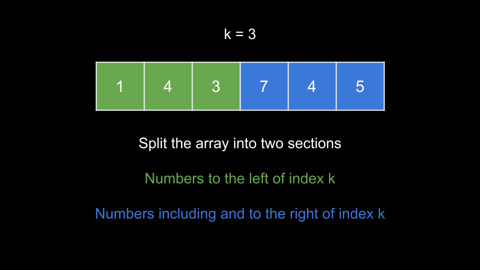
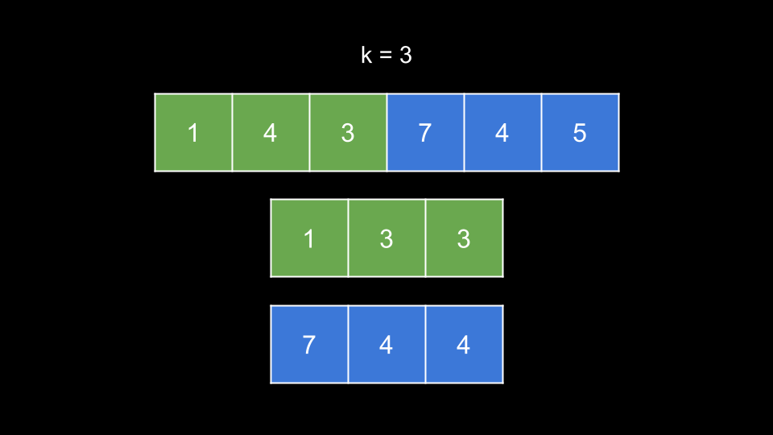
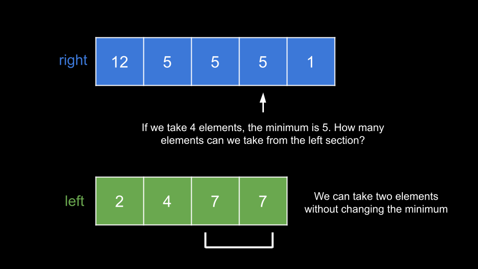
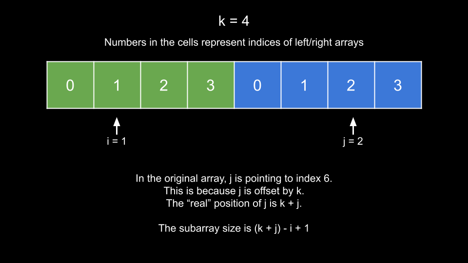
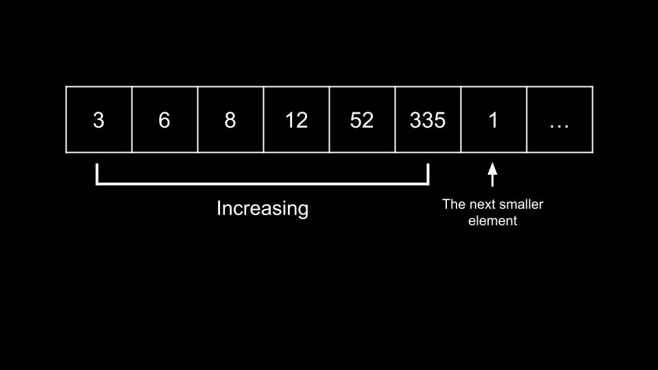

[TOC]

## Solution

---

### Approach 1: Binary Search

**Intuition**

The score of a subarray is its length multiplied by its minimum element. In this problem, we must find the maximum score of all subarrays that contain $\text{nums}[k]$.

How can we improve our score? When we take more elements we increase the length of the subarray, which helps the score. However, we may find new minimums, which would decrease our score.

We can start by separating the array - numbers to the left of `k` and numbers to the right of `k` (and including `k`).


<br>

Notice that `k` is the meeting point of these sections. If we want to take elements in the left section, we start from the end of the left section and move toward the beginning. If we want to take elements in the right section, we start from the beginning and move toward the end.

Of course, each element we take will increase our length by `1`. But how will it affect our minimum? To compute this quickly, we can create new arrays for each section. These arrays will represent the minimum element we have seen in the section if we started from `k`.


<br>

In the above example, let's say that we took two elements from the left section. We can quickly see that the minimum element from the left section is `3` using these arrays. Similarly, if we took all elements from the right section, we could quickly see that the minimum element from the right section is `4`.

> We will call these arrays that allow us to find the minimums `left` and `right`.

Now that we have these arrays, how can we solve the problem? Because $\text{nums}[k]$ is in the right section, we will iterate over the entire right section and try to take each element. Let's say we take some number of elements from the right section, and the minimum is `x`. How many elements can we take from the left section without changing `x` as the minimum? We must only take elements from the left that are greater than or equal to `x`.

Let's switch to another example. For a given array, assuming we have already built the `left` and `right` arrays using the previous method.


<br>

In the above example, let's say that we take four elements from the right section. The minimum is `5`. How many elements can we take from the left section without changing the minimum? Two. This gives us a total size of $4 + 2 = 6$, and a total score of $6 * 5 = 30$.

How do we quickly find the number of elements we can take from the left section? Note that when we are building the array `left` from right to left, each time we go left we encounter a new number that is only likely to lower the minimum value, and the further to the left we go, the smaller the minimum value becomes, i.e., `left` is already sorted from smallest to largest. Therefore, we can perform a binary search to identify how many elements we can take.

This brings us to our solution. We iterate with `j` over each index of `right` and assign $currMin = \text{right}[j]$, which represents the minimum of our subarray. We then perform a binary search to find `i`, the insertion index of `currMin` in `left`. Once we have `i`, we can calculate the size of our subarray, and thus the score. We take the maximum of all scores.

How do we calculate the size of our subarray given `i` and `j`?


<br>

Because the right section starts at index `k`, its indices are offset by `k` from the real indices. Thus, in the original array, $\text{right}[j]$ points to index $k + j$. The left section is not offset at all, so `i` is correctly positioned. The size of a subarray bounded by `[left, right]` is $right - left + 1$. Thus, the size of our subarray `[i, k + j]` is $(k + j) - i + 1$. We can multiply this by $\text{right}[j]$ to calculate our score.

You may have noticed: this algorithm assumes that in the optimal subarray, the minimum value is in the right section. But what if this assumption is wrong, and its actually in the left section? We can check the left section by simply reversing the array and then applying the same algorithm to it. Note that when we reverse the array, `k` will change. After reversal, the original `k` will be at $\text{nums.length} - k - 1$.

**Algorithm**

1. Define a function `solve(nums, k)` that runs our algorithm:
- Set $n = \text{nums.length}$, `left` to an array of length `k`, and `currMin` to a large value.
- Iterate `i` from $k - 1$ until `0`. At each index, update `currMin` with $\text{nums}[i]$ if it is smaller and set $\text{left}[i] = currMin$.
- Initialize an empty array `right` and reset `currMin` to a large value.
- Iterate `i` from `k` until $n - 1$. At each index, update `currMin` with $\text{nums}[i]$ if it is smaller and push `currMin` to `right`.
- Initialize $ans = 0$.
- Iterate `j` over the indices of `right`:
- Set $currMin = \text{right}[j]$.
- Find `i`, the insertion index of `currMin` in `left` using binary search.
- Calculate $size = (k + j) - i - 1$.
- Update `ans` with $currMin * size$ if it is larger.
- Return `ans`.
2. Initialize $ans = solve(nums, k)$.
3. Reverse `nums`.
4. Return the larger of $ans, solve(nums, \text{nums.length} - k - 1)$.

**Implementation**

```python
class Solution:
    def maximumScore(self, nums: List[int], k: int) -> int:
        def solve(nums, k):
            n = len(nums)
            left = [0] * k
            curr_min = inf
            for i in range(k - 1, -1, -1):
                curr_min = min(curr_min, nums[i])
                left[i] = curr_min

            right = []
            curr_min = inf
            for i in range(k, n):
                curr_min = min(curr_min, nums[i])
                right.append(curr_min)

            ans = 0
            for j in range(len(right)):
                curr_min = right[j]
                i = bisect_left(left, curr_min)
                size = (k + j) - i + 1
                ans = max(ans, curr_min * size)

            return ans

        return max(solve(nums, k), solve(nums[::-1], len(nums) - k - 1))
```

**Complexity Analysis**

Given $n$ as the length of `nums`,

* Time complexity: $O(n \cdot \log{}n)$

    We require $O(n)$ time to create `left` and `right`. Then, we iterate over the indices of `right`, which is not more than $O(n)$ iterations. At each iteration, we perform a binary search over `left`, which does not cost more than $O(\log{}n)$. Thus, `solve` costs $O(n \cdot \log{}n)$, and we call it twice.

* Space complexity: $O(n)$

    `left` and `right` have a combined length of $n$.

<br/>

---

### Approach 2: Monotonic Stack

**Intuition**

In this approach, we will use a similar idea as in the previous approach. For a given index `i`, if we treat $\text{nums}[i]$ as the minimum element, we need to know how many elements we can take on the left and right such that we do not take any elements less than $\text{nums}[i]$.

> You might be thinking: what if $\text{nums}[k]$ is not included? We will get to that after presenting the full idea of the approach.

Essentially, we need to know how far away the next lesser element is on both sides. If we have this information for all indices, we can quickly calculate the maximum score possible by treating every $\text{nums}[i]$ as the minimum, since in the optimal solution, one of the indices must be the minimum.

There is a very similar problem called [Next Greater Element](https://leetcode.com/problems/next-greater-element-i/). The logic is identical, except that we are looking for the next smaller element. We can accomplish this using a monotonic stack.

<details><summary><b>If you aren't familiar with monotonic stacks, click here.</b></summary>

A monotonic stack is a stack whose elements are always sorted. In our case, we want a monotonic **increasing** stack, i.e. the elements in the stack are always sorted in ascending order.

To maintain this monotonic stack, we need to make sure that whenever we push a new element, it is the largest value in the stack. Before we push an element `num`, we check the top of the stack. If the top of the stack is greater than `num`, we pop from it. Since there may be multiple elements greater than `num` in the stack, we need to use a while loop to "clean" the stack before pushing `num`.

Only once there are no elements in the stack greater than `num` will we push `num`.

</details>

<br>

We will create an array `left`, where $\text{left}[i]$ has the index of the first element to the left of `i` that has a lower value in `nums` than $\text{nums}[i]$.

Similarly, we will create an array `right` where $\text{right}[i]$ has the index of the first element to the right of `i` that has a lower value in `nums` than $\text{nums}[i]$.

So how do we calculate `right`? Let's say that we are iterating over `nums` from the left and we have a chain of increasing numbers:


<br>

As you can see in the example, we have 6 increasing numbers, and then a `1` that is less than all of them. This `1` (at index 6) should be the value of `right` for all the indices of the increasing numbers. If we maintain a monotonic increasing stack, then this `1` will cause all those numbers to be popped out.

With a monotonic increasing stack, whenever we see an element that is smaller than the top of the stack, it is guaranteed to be the first smaller element for the element at the top of the stack. This is exactly what we are looking for.

To calculate `left`, we use the exact same process, except we iterate backward starting from the end of `nums`.

Note that because we need to remember what indices to update when we pop from the stack, we will store indices on the stack instead of the elements themselves. We can easily find the values by referencing `nums`.

We will initialize the values of `left` to `-1` and the values of `right` to `n`. This way, the math will still work out later if there are elements that do not have any lower values to the left or right.

Once we have `left` and `right`, we can iterate over all indices `i` and try to find a maximum score. Remember that the subarray must contain index `k`. Thus, we can only use an index `i` as the minimum if $\text{left}[i] < k$ and $\text{right}[i] > k$.

When we treat an index `i` as the minimum, what score can we achieve? Our window starts one index after $\text{left}[i]$ because including $\text{left}[i]$ would create a new minimum. Similarly, our window ends one index before $\text{right}[i]$. Thus, we need to subtract `2` from the normal subarray size formula. This gives us a subarray size of $\text{right}[i] - \text{left}[i] - 1$. We multiply this size by $\text{nums}[i]$ to get our score.

**Algorithm**

1. Initialize $n = \text{nums.length}$, `left` as an array of length `n` with values of `-1`, and an empty `stack`.
2. Iterate `i` from $n - 1$ until `0`:
- While the element at the index at the top of `stack` is greater than $\text{nums}[i]$, pop this index from `stack`. Given `j` as the index popped from the `stack`, set $\text{left}[j] = i$.
- Push `i` to `stack`.
3. Initialize `right` as an array of length `n` with values of `n` and reset `stack`.
4. Iterate `i` over the indices of `nums`:
- While the element at the index at the top of `stack` is greater than $\text{nums}[i]$, pop this index from `stack`. Given `j` as the index popped from the `stack`, set $\text{right}[j] = i$.
- Push `i` to `stack`.
5. Initialize $ans = 0$.
6. Iterate `i` over the indices of `nums`:
- If $\text{left}[i] < k$ and $\text{right}[i] > k$, update `ans` with $\text{nums}[i] * (\text{right}[i] - \text{left}[i] - 1)$ if it is larger.
7. Return `ans`.

**Implementation**

```python
class Solution:
    def maximumScore(self, nums: List[int], k: int) -> int:
        n = len(nums)
        left = [-1] * n
        stack = []

        for i in range(n - 1, -1, -1):
            while stack and nums[stack[-1]] > nums[i]:
                left[stack.pop()] = i

            stack.append(i)

        right = [n] * n
        stack = []
        for i in range(n):
            while stack and nums[stack[-1]] > nums[i]:
                right[stack.pop()] = i

            stack.append(i)

        ans = 0
        for i in range(n):
            if left[i] < k and right[i] > k:
                ans = max(ans, nums[i] * (right[i] - left[i] - 1))

        return ans
```

**Complexity Analysis**

Given $n$ as the length of `nums`,

* Time complexity: $O(n)$

    It costs $O(n)$ to calculate `left` and `right`. We iterate over each index once and perform amortized $O(1)$ work at each iteration. The reason it amortizes to $O(1)$, despite the while loop, is because the while loop can run a maximum of $n$ times across all iterations, and each index can only be pushed onto and popped from the stack once.

    To calculate `ans`, we iterate over the indices once and perform $O(1)$ work at each iteration.

* Space complexity: $O(n)$

    `left`, `right`, and `stack` all require $O(n)$ space.

<br/>

---

### Approach 3: Greedy

**Intuition**

Sometimes the simplest approach is the best! The optimal subarray must contain index `k`, so it makes sense to consider the subarray with only $\text{nums}[k]$ as a starting point.

From here, how do we expand the subarray? We can either add an element to the left or an element to the right. Let's say we have two pointers, `left` and `right` that represent our subarray. Which direction should we go?

If we move left, it's equivalent to adding $nums[left - 1]$ to our subarray. If we move right, it's equivalent to adding $nums[right + 1]$ to our subarray. We should move in the direction of the greater element.

At each step, we update `currMin` which is initially set to $\text{nums}[k]$, and try to update `ans` which is also initially set to $\text{nums}[k]$. We can update `ans` with $currMin * (right - left + 1)$ if it is larger.

This greedy process is very similar to the one used to solve [Container With Most Water](https://leetcode.com/problems/container-with-most-water/). But why does it work? We will use a proof by contradiction to demonstrate that not doing it this way wouldn't result in a higher value either.

At each step, we choose between having our subarray as `[left - 1, right]` or `[left, right + 1]`. Let's assume that $nums[left - 1] > nums[right + 1]$ and the optimal subarray has not been found yet. The optimal subarray must include $nums[left - 1]$. If it doesn't, then it must include $nums[right + 1]$, since we could only move right to "avoid" $nums[left - 1]$. However, any subarray that includes $nums[right + 1]$ could also include $nums[left - 1]$ without affecting the minimum, while also increasing the length of the subarray and thus the score. Thus, it is impossible for the optimal subarray to include $nums[right + 1]$ and not $nums[left - 1]$, and in general the optimal subarray must include $nums[left - 1]$.

**Algorithm**

To implement the while loop, we will iterate until we have exhausted the array. If one of the pointers is out of bounds, we will consider the element it points to as `0`.

1. Initialize $n = \text{nums.length}$, $left = k$, $right = k$, $ans = \text{nums}[k]$, and $currMin = \text{nums}[k]$.
2. While `left > 0` or $right < n - 1$:
- Compare $nums[left - 1]$ with $nums[right + 1]$:
- If $nums[right + 1]$ is greater, increment `right` and update `currMin` with $\text{nums}[right]$ if it is lower.
- Otherwise, decrement `left` and update `currMin` with $\text{nums}[left]$ if it is lower.
- Update `ans` with $currMin * (right - left + 1)$ if it is greater.
3. Return `ans`.

**Implementation**

```python
class Solution:
    def maximumScore(self, nums: List[int], k: int) -> int:
        n = len(nums)
        left = k
        right = k
        ans = nums[k]
        curr_min = nums[k]

        while left > 0 or right < n - 1:
            if (nums[left - 1] if left else 0) < (nums[right + 1] if right < n - 1 else 0):
                right += 1
                curr_min = min(curr_min, nums[right])
            else:
                left -= 1
                curr_min = min(curr_min, nums[left])

            ans = max(ans, curr_min * (right - left + 1))

        return ans
```

**Complexity Analysis**

Given $n$ as the length of `nums`,

* Time complexity: $O(n)$

    At each iteration, our `left` or `right` pointers move closer to the edges of the array by `1`. Thus, we perform $O(n)$ iterations. Each iteration costs $O(1)$.

* Space complexity: $O(1)$

    We aren't using any extra space other than a few integers.

<br/>

---