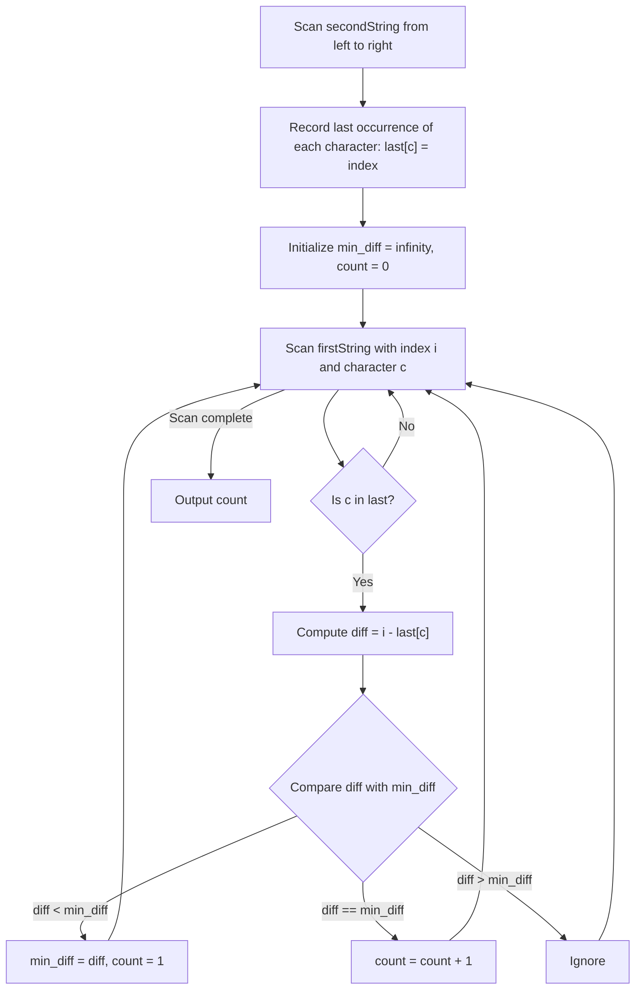

# Guided Example: Count Pairs of Equal Substrings With Minimum Difference

We trace the step-by-step reduction from arbitrary substring matching to extremal character pair evaluation on a representative problem instance:

- **Input:** `firstString = "abcd"`, `secondString = "bccda"`
- **Required Output:** `1`

This instance illustrates how mathematical analysis eliminates multi-character substring exploration, reducing a four-dimensional search into a single-pass hash lookup that minimizes the difference between index positions.

---

## 1. Instance & Teaching Goal

We are given two strings `firstString` and `secondString` consisting of lowercase English letters. We are tasked with counting the number of index quadruples $(i, j, a, b)$ such that:
1. $0 \le i \le j < \text{firstString.length}$
2. $0 \le a \le b < \text{secondString.length}$
3. $\text{firstString}[i..j] == \text{secondString}[a..b]$ (the two substrings are identical)
4. The difference $j - a$ is the **minimum possible** across all valid quadruples.

A brute-force search over all quadruples requires evaluating $\mathcal{O}(n^2 \cdot m^2)$ combinations, which is completely intractable. By establishing that any multi-character substring is strictly dominated by its initial single character, we reduce the search space to at most $26$ candidate character choices.

---

## 2. Conceptual Foundation & Invariants

### Mathematical Reduction to Length-1 Substrings

Suppose $(i, j, a, b)$ is a valid quadruple of length $L = j - i + 1 = b - a + 1 \ge 1$.
Because $\text{firstString}[i..j] = \text{secondString}[a..b]$, their first characters must match:
$$\text{firstString}[i] = \text{secondString}[a]$$

The quadruple $(i, i, a, a)$ represents the length-$1$ substring consisting solely of that first character.
Comparing the target difference values:
$$j - a = (i + L - 1) - a = (i - a) + (L - 1)$$

Since $L \ge 1$, we observe:
- If $L = 1$, then $j - a = i - a$.
- If $L > 1$, then $L - 1 > 0$, so $j - a > i - a$.

> **Length-1 Substring Dominance & Extremal Index Theorem.**
> 1. **Length-1 Dominance:** Any valid matching substring of length $L > 1$ yields a difference $j - a$ strictly greater than the difference $i - a$ of the single-character match at its start. Therefore, the minimum difference among all quadruples can **only** be achieved by single-character substrings ($i = j$ and $a = b$).
> 2. **Extremal Index Selection:** For any fixed index $i$ in `firstString` with character $c = \text{firstString}[i]$, we wish to minimize $i - a$ over all indices $a$ where $\text{secondString}[a] = c$.
>    To minimize $i - a$, we must maximize $a$.
>    Therefore, the optimal $a$ for a given character $c$ is uniquely its **last (rightmost) occurrence** in `secondString`, denoted $\text{last}[c]$.
> 3. Any earlier occurrence $a' < \text{last}[c]$ yields $i - a' > i - \text{last}[c]$, which is strictly suboptimal.

---

## 3. Step-by-Step Worked Execution

We trace `firstString = "abcd"` ($n = 4$) and `secondString = "bccda"` ($m = 5$).

---

### Step 1: Build the Rightmost Index Map for `secondString`

Scan `secondString = "bccda"`:
- Index $0$, character `'b'` $\implies \text{last}['\text{b}'] = 0$.
- Index $1$, character `'c'` $\implies \text{last}['\text{c}'] = 1$.
- Index $2$, character `'c'` $\implies \text{last}['\text{c}'] = 2$ (overwrites index $1$).
- Index $3$, character `'d'` $\implies \text{last}['\text{d}'] = 3$.
- Index $4$, character `'a'` $\implies \text{last}['\text{a}'] = 4$.

Resulting map:
$$\text{last} = \{ \text{'a'}: 4, \ \text{'b'}: 0, \ \text{'c'}: 2, \ \text{'d'}: 3 \}$$

---

### Step 2: Scan `firstString` to Find Minimum Differences

Initialize running minimum difference $\text{mi} = +\infty$ and counter $\text{ans} = 0$.

1. **Index $i = 0$, Character $c = \text{'a'}$:**
   - Character `'a'` exists in $\text{last}$ at index $4$.
   - Target difference:
     $$t = i - \text{last}[\text{'a'}] = 0 - 4 = -4$$
   - Since $t = -4 < \text{mi} = +\infty$:
     - Update minimum: $\text{mi} = -4$.
     - Reset count: $\text{ans} = 1$.
     - Matching quadruple: $(0, 0, 4, 4)$ where $j - a = 0 - 4 = -4$.

2. **Index $i = 1$, Character $c = \text{'b'}$:**
   - Character `'b'` exists in $\text{last}$ at index $0$.
   - Target difference:
     $$t = i - \text{last}[\text{'b'}] = 1 - 0 = 1$$
   - Since $1 > \text{mi} = -4$, ignore.

3. **Index $i = 2$, Character $c = \text{'c'}$:**
   - Character `'c'` exists in $\text{last}$ at index $2$.
   - Target difference:
     $$t = i - \text{last}[\text{'c'}] = 2 - 2 = 0$$
   - Since $0 > \text{mi} = -4$, ignore.

4. **Index $i = 3$, Character $c = \text{'d'}$:**
   - Character `'d'` exists in $\text{last}$ at index $3$.
   - Target difference:
     $$t = i - \text{last}[\text{'d'}] = 3 - 3 = 0$$
   - Since $0 > \text{mi} = -4$, ignore.

---

### Step 3: Conclude the Count
The global minimum difference across all single-character matches is $\mathbf{-4}$.
Exactly one index pairing achieved this value: $i = 0$ with $a = 4$ for character `'a'`.
Final count: **`1`**.

---

## 4. Complete Execution Trace

| Index $i$ | Character $c$ | Exists in $\text{last}$? | Optimal $a = \text{last}[c]$ | Difference $t = i - a$ | Comparison with $\text{mi}$ | Running $\text{mi}$ | Running $\text{ans}$ |
|:---:|:---:|:---:|:---:|:---:|:---:|:---:|:---:|
| $0$ | `'a'` | Yes | $4$ | $0 - 4 = -4$ | $-4 < +\infty$ | **$-4$** | **$1$** |
| $1$ | `'b'` | Yes | $0$ | $1 - 0 = 1$ | $1 > -4$ | $-4$ | $1$ |
| $2$ | `'c'` | Yes | $2$ | $2 - 2 = 0$ | $0 > -4$ | $-4$ | $1$ |
| $3$ | `'d'` | Yes | $3$ | $3 - 3 = 0$ | $0 > -4$ | $-4$ | $1$ |

Termination: The unique minimizing quadruple is $(0, 0, 4, 4)$ with difference $-4$. Total count = **$1$**.

---

## 5. Algorithmic Correctness

**Soundness.** Every considered candidate $(i, i, a, a)$ is a valid quadruple of length $1$ where $\text{firstString}[i..i] = \text{secondString}[a..a]$. Because single-character matches are legal quadruples under the problem statement, their differences are feasible candidates.

**Completeness.** By the Length-1 Substring Dominance Theorem, no substring of length $L > 1$ can ever achieve a smaller value of $j - a$ than the length-$1$ substring at its start. Furthermore, for any fixed $i$, choosing any occurrence of character $c$ earlier than its last occurrence in `secondString` would strictly increase $i - a$. Because all characters in `firstString` are checked against the maximal possible second-string index, the absolute minimum difference and the complete count of quadruples achieving it are guaranteed to be exact.

---

## 6. Traps This Instance Exposes

- **Searching Multi-Character Substrings:** Attempting suffix trees, rolling hashes, or dynamic programming tables to match multi-character substrings is not only computationally prohibitive but conceptually redundant, as length $L > 1$ strictly worsens $j - a$.
- **Negative Differences are Valid:** The objective is to minimize $j - a$, not $|j - a|$. When $a > j$, the difference $j - a$ is negative. Negative numbers are smaller than positive numbers, so a large $a$ with a small $j$ is the most optimal scenario. Initializing $\text{mi} = 0$ would incorrectly discard all negative differences.
- **Multiple Disjoint Letters Achieving the Same Minimum:** If two different characters achieve the same minimal difference (e.g. difference $-4$), both must be counted. Incrementing `ans` when $t == \text{mi}$ handles this correctly.
- **Overwriting on Duplicate Letters in `firstString`:** If the same letter appears multiple times in `firstString`, each position $i$ represents a distinct quadruple $(i, i, a, a)$ with a distinct difference $i - a$, so each occurrence in `firstString` must be evaluated.

---

## 7. Complexity Derivation

- **Time Complexity:** $\mathcal{O}(n + m)$ where $n = \text{firstString.length}$ and $m = \text{secondString.length}$. Building the map of last occurrences requires a single pass over `secondString` in $\mathcal{O}(m)$ time. Evaluating differences requires a single pass over `firstString` in $\mathcal{O}(n)$ time, with $\mathcal{O}(1)$ dictionary lookups per character. Total runtime is strictly linear.
- **Auxiliary Space Complexity:** $\mathcal{O}(|\Sigma|)$ where $\Sigma$ is the alphabet of lowercase English letters ($|\Sigma| \le 26$). The map stores at most $26$ entries, which requires strictly $\mathcal{O}(1)$ bounded space.
