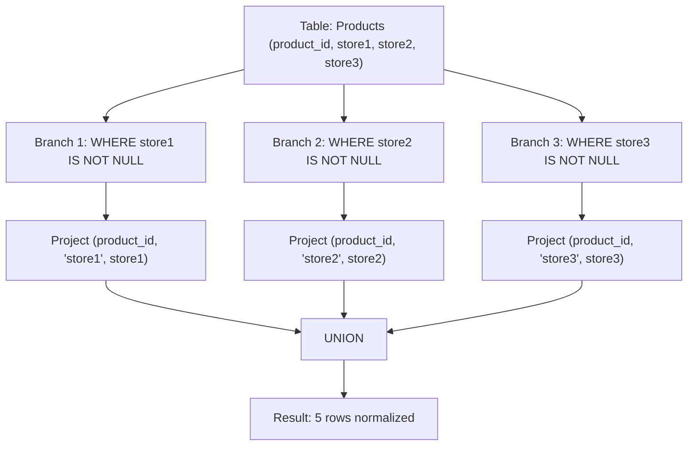

# Guided Example: Rearrange Products Table

We trace the step-by-step relational transformation from wide attribute columns to a normalized long entity-attribute-value format on a representative database instance:

- **Input:**
  Table `Products`:
  ```text
  +------------+--------+--------+--------+
  | product_id | store1 | store2 | store3 |
  +------------+--------+--------+--------+
  | 0          | 95     | 100    | 105    |
  | 1          | 70     | null   | 80     |
  +------------+--------+--------+--------+
  ```
- **Required Output:**
  ```text
  +------------+--------+-------+
  | product_id | store  | price |
  +------------+--------+-------+
  | 0          | store1 | 95    |
  | 1          | store1 | 70    |
  | 0          | store2 | 100   |
  | 0          | store3 | 105   |
  | 1          | store3 | 80    |
  +------------+--------+-------+
  ```

This instance features a fully stocked product (product $0$ available across all three stores) and a sparsely stocked product (product $1$ with a null entry for `store2`), demonstrating how null-filtering and projection restructure wide schema rows into key-value pairs.

---

## 1. Instance & Teaching Goal

In database design, tables are frequently formatted in a wide layout (with multiple measurement columns like `store1`, `store2`, `store3`) for tabular entry, but analytical pipelines and downstream reporting require a normalized vertical layout `(product_id, store, price)`. Furthermore, products not carried by a store are represented by `null` values and must be completely omitted from the output.

Our goal is to rearrange the wide table into a long table while dropping any `null` price records.

A naive query might attempt horizontal case statements or cross-joins with auxiliary tables. The optimal approach models wide-to-long restructuring as a union of independent projections, filtering for non-null attributes in each branch.

---

## 2. Conceptual Foundation & Invariants

### Relational Projection and Horizontal Unpivoting

Let relation $P$ have schema $(K, S_1, S_2, \dots, S_m)$, where $K = \text{product\_id}$ is the primary key and each $S_j$ represents the price in store $j$.
To unpivot $P$ into a normalized relation with schema $(K, \text{store}, \text{price})$:
For each store column $S_j \in \{S_1, S_2, S_3\}$:
1. Filter out unavailable products: $\sigma_{S_j \text{ IS NOT NULL}}(P)$
2. Project the key $K$, the store name as a string literal $'S_j'$, and the price value $S_j$:
   $$B_j = \pi_{K, 'S_j', S_j}(\sigma_{S_j \text{ IS NOT NULL}}(P))$$

> **Relational Unpivoting & Attribute Projection Theorem.**
> Let $B_1, B_2, \dots, B_m$ be the relations produced by projecting each store column with its corresponding literal identifier.
> Because each branch $B_j$ tags its tuples with the distinct constant $'S_j'$, the sets of tuples are pairwise disjoint:
> $$B_j \cap B_k = \emptyset \quad \text{for all } j \ne k$$
> Therefore, the relational union $\bigcup_{j=1}^m B_j$ reconstructs the exact set of valid $(product\_id, store, price)$ triples without duplicate tuples and without omitting any available product-store price.



---

## 3. Step-by-Step Worked Execution

We trace the input table with products $0$ and $1$.

---

### Step 1: Evaluate Branch 1 (`store1`)

Scan `Products` and retain rows where `store1 IS NOT NULL`:
- Product $0$: $\text{store1} = 95$ (non-null) $\implies$ Retain $(0, \text{'store1'}, 95)$
- Product $1$: $\text{store1} = 70$ (non-null) $\implies$ Retain $(1, \text{'store1'}, 70)$

Result of Branch 1:
$$B_1 = \{ (0, \text{'store1'}, 95), \ (1, \text{'store1'}, 70) \}$$

---

### Step 2: Evaluate Branch 2 (`store2`)

Scan `Products` and retain rows where `store2 IS NOT NULL`:
- Product $0$: $\text{store2} = 100$ (non-null) $\implies$ Retain $(0, \text{'store2'}, 100)$
- Product $1$: $\text{store2} = \text{null}$ $\implies$ Filtered out!

Result of Branch 2:
$$B_2 = \{ (0, \text{'store2'}, 100) \}$$

---

### Step 3: Evaluate Branch 3 (`store3`)

Scan `Products` and retain rows where `store3 IS NOT NULL`:
- Product $0$: $\text{store3} = 105$ (non-null) $\implies$ Retain $(0, \text{'store3'}, 105)$
- Product $1$: $\text{store3} = 80$ (non-null) $\implies$ Retain $(1, \text{'store3'}, 80)$

Result of Branch 3:
$$B_3 = \{ (0, \text{'store3'}, 105), \ (1, \text{'store3'}, 80) \}$$

---

### Step 4: Union of Projections

Combine the tuples from all three branches:
$$B_{\text{final}} = B_1 \cup B_2 \cup B_3$$

The resulting relation contains exactly the $5$ non-null pricing observations:
1. $(0, \text{'store1'}, 95)$
2. $(1, \text{'store1'}, 70)$
3. $(0, \text{'store2'}, 100)$
4. $(0, \text{'store3'}, 105)$
5. $(1, \text{'store3'}, 80)$

---

## 4. Complete Execution Trace

| Product ID | Store Column Evaluated | Stored Value | Filter Condition (`IS NOT NULL`) | Emitted Tuple `(product_id, store, price)` |
|:---:|:---:|:---:|:---:|:---:|
| $0$ | `store1` | $95$ | Pass | `(0, 'store1', 95)` |
| $0$ | `store2` | $100$ | Pass | `(0, 'store2', 100)` |
| $0$ | `store3` | $105$ | Pass | `(0, 'store3', 105)` |
| $1$ | `store1` | $70$ | Pass | `(1, 'store1', 70)` |
| $1$ | `store2` | `null` | **Fail (Dropped)** | — |
| $1$ | `store3` | $80$ | Pass | `(1, 'store3', 80)` |

Total emitted rows: **$5$**.

---

## 5. Algorithmic Correctness

**Soundness.** Each branch strictly checks `storeX IS NOT NULL`, ensuring no unavailable product prices appear in the output. The literal store tag `'store1'`, `'store2'`, or `'store3'` precisely corresponds to the source attribute from which the price was extracted.

**Completeness.** Since the schema has three known store columns, evaluating all three branches covers the entire space of possible store-product associations. Because the store labels are mutually distinct, no valid pricing record can be overwritten or discarded during set union.

---

## 6. Traps This Instance Exposes

- **Null Comparison with Equality (`store != NULL`):** In SQL, comparing `null` with equality operators (`= NULL` or `!= NULL`) evaluates to `UNKNOWN` in three-valued logic, which drops all rows in a `WHERE` clause. One must explicitly use `IS NOT NULL`.
- **Emitting Null Prices:** Omitting the `WHERE storeX IS NOT NULL` condition would generate rows such as `(1, 'store2', null)`, which directly violates the requirement that products unavailable in a store must not be included.
- **`UNION` vs `UNION ALL`:** Because the second column (`store`) has a distinct literal constant in each branch (`'store1'`, `'store2'`, `'store3'`), rows across different branches can never conflict or duplicate each other. `UNION ALL` can be used to bypass an unnecessary sort-based deduplication step in relational engines.

---

## 7. Complexity Derivation

- **Time Complexity:** $\mathcal{O}(R)$ where $R$ is the number of rows in the `Products` table. The query executes three linear scans over $R$ rows (one for each store column). Because the number of stores is fixed ($3$), total work is $3 \times \mathcal{O}(R) = \mathcal{O}(R)$.
- **Auxiliary Space Complexity:** $\mathcal{O}(K)$ where $K \le 3R$ is the number of non-null cells emitted to the result buffer.
