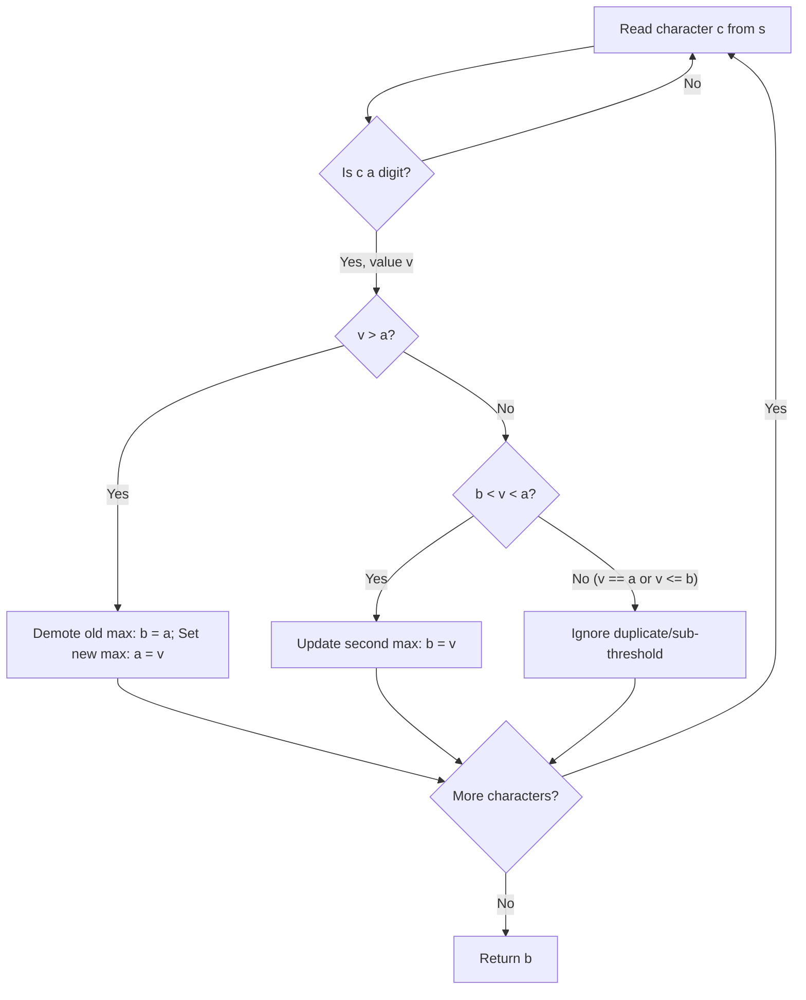

# Guided Example: Second Largest Digit in a String

We trace the step-by-step extraction and online rank tracking of numerical digits on a representative problem instance:

- **Input:** `s = "dfa12321afd"`
- **Required Output:** `2`

This instance features non-digit alphabetic characters, duplicate digits ($1$ and $2$ appear multiple times), and out-of-order numerical occurrences, demonstrating how tracking two rank variables in a single pass identifies the second strictly largest distinct digit.

---

## 1. Instance & Teaching Goal

Given an alphanumeric string `s`, we must find the **second largest distinct digit** that appears in `s`. If no such second largest digit exists (for instance, if the string contains only letters or only one distinct digit), we must return `-1`.

A naive approach might extract all digits, insert them into a hash set to eliminate duplicates, sort the unique set, and return the penultimate element. While correct, sorting introduces unnecessary overhead. The optimal approach maintains the largest and second largest distinct values dynamically in a single pass using $\mathcal{O}(1)$ auxiliary space.

---

## 2. Conceptual Foundation & Invariants

### Dual Extremum Invariant

We maintain two integer variables:
- $a$: The largest distinct digit observed so far, initialized to $-1$.
- $b$: The second largest distinct digit observed so far, initialized to $-1$.

At every stage of the traversal over characters in $s$, the invariant requires:
$$-1 \le b < a \le 9 \quad \text{(with equality only when both are } -1\text{)}$$

When a character $c$ is a decimal digit with numerical value $v \in [0, 9]$:
1. **New Global Maximum ($v > a$):**
   The previous global maximum $a$ is demoted to become the second largest distinct digit $b$, and $v$ becomes the new maximum:
   $$(a, b) \longleftarrow (v, a)$$
2. **Intermediate Second Maximum ($b < v < a$):**
   The value $v$ is strictly less than the maximum $a$, but strictly greater than the current second maximum $b$. Thus, $b$ is updated to $v$:
   $$b \longleftarrow v$$
3. **Redundant or Sub-threshold Value ($v == a$ or $v \le b$):**
   If $v == a$, it duplicates the current maximum and cannot be the second distinct largest. If $v \le b$, it cannot improve or replace the second maximum. In both cases, the state remains unchanged.

> **Extremal Separation Theorem.**
> Let $D = \{ v_1, v_2, \dots, v_k \}$ be the set of distinct digit values appearing in $s$.
> Updating $(a, b)$ under the three disjoint partitions ($v > a$, $b < v < a$, and elsewhere) guarantees that after processing the entire string:
> - $a = \max(D)$ if $D \ne \emptyset$, else $-1$.
> - $b = \max(D \setminus \{a\})$ if $|D| \ge 2$, else $-1$.

---

## 3. Step-by-Step Worked Execution

We trace `s = "dfa12321afd"`.

### Trace Setup
- Initial state: $a = -1$, $b = -1$.

---

### Step-by-Step Character Inspection

1. **Index $0$, $c = \text{'d'}$:** Non-digit character. Ignored.
2. **Index $1$, $c = \text{'f'}$:** Non-digit character. Ignored.
3. **Index $2$, $c = \text{'a'}$:** Non-digit character. Ignored.
4. **Index $3$, $c = \text{'1'}$:** Digit value $v = 1$.
   - Test $v > a$: $1 > -1$ holds.
   - Demote: $b = a = -1$.
   - Promote: $a = v = 1$.
   - State: $a = 1, b = -1$.
5. **Index $4$, $c = \text{'2'}$:** Digit value $v = 2$.
   - Test $v > a$: $2 > 1$ holds.
   - Demote: $b = a = 1$.
   - Promote: $a = v = 2$.
   - State: $a = 2, b = 1$.
6. **Index $5$, $c = \text{'3'}$:** Digit value $v = 3$.
   - Test $v > a$: $3 > 2$ holds.
   - Demote: $b = a = 2$.
   - Promote: $a = v = 3$.
   - State: $a = 3, b = 2$.
7. **Index $6$, $c = \text{'2'}$:** Digit value $v = 2$.
   - Test $v > a$: $2 > 3$ False.
   - Test $b < v < a$: $2 < 2 < 3$ False (since $v = b = 2$).
   - Duplicate of current second maximum. Ignored.
   - State: $a = 3, b = 2$.
8. **Index $7$, $c = \text{'1'}$:** Digit value $v = 1$.
   - Test $v > a$: $1 > 3$ False.
   - Test $b < v < a$: $2 < 1 < 3$ False (since $1 \le b = 2$).
   - Sub-threshold value. Ignored.
   - State: $a = 3, b = 2$.
9. **Index $8$, $c = \text{'a'}$:** Non-digit. Ignored.
10. **Index $9$, $c = \text{'f'}$:** Non-digit. Ignored.
11. **Index $10$, $c = \text{'d'}$:** Non-digit. Ignored.

---

## 4. Complete Execution Trace

| Index | Character $c$ | Digit Value $v$ | Condition Triggered | Action Taken | Largest $a$ | Second Largest $b$ |
|:---:|:---:|:---:|:---:|:---:|:---:|:---:|
| $0$ | `'d'` | — | Non-digit | Skip | $-1$ | $-1$ |
| $1$ | `'f'` | — | Non-digit | Skip | $-1$ | $-1$ |
| $2$ | `'a'` | — | Non-digit | Skip | $-1$ | $-1$ |
| $3$ | `'1'` | $1$ | $v > a$ ($1 > -1$) | $b \leftarrow -1, a \leftarrow 1$ | $1$ | $-1$ |
| $4$ | `'2'` | $2$ | $v > a$ ($2 > 1$) | $b \leftarrow 1, a \leftarrow 2$ | $2$ | $1$ |
| $5$ | `'3'` | $3$ | $v > a$ ($3 > 2$) | $b \leftarrow 2, a \leftarrow 3$ | $3$ | $2$ |
| $6$ | `'2'` | $2$ | $v = b$ | Ignore duplicate | $3$ | $2$ |
| $7$ | `'1'` | $1$ | $v < b$ | Ignore sub-threshold | $3$ | $2$ |
| $8$ | `'a'` | — | Non-digit | Skip | $3$ | $2$ |
| $9$ | `'f'` | — | Non-digit | Skip | $3$ | $2$ |
| $10$ | `'d'` | — | Non-digit | Skip | $3$ | $2$ |

At string termination, the second largest distinct digit is $b = \mathbf{2}$.

---

## 5. Algorithmic Correctness

**Soundness.** Variable $a$ stores strictly the maximum distinct digit encountered so far. Whenever a strictly greater value arrives, $a$ cannot be equal to $v$, and the previous $a$ represents the largest distinct digit smaller than $v$, correctly becoming the candidate for $b$. If an arriving value is strictly between $b$ and $a$, it is distinct from both and larger than $b$, thus replacing $b$. Equal values ($v == a$ or $v == b$) trigger no change, preserving strict distinctness.

**Completeness.** Every character in $s$ is examined. Because distinctness is preserved and updates strictly maintain the top two highest distinct values, no larger distinct candidate can be missed. If fewer than two distinct digits exist in the entire string, $b$ remains at its initial sentinel $-1$.

---

## 6. Traps This Instance Exposes

- **Duplicate Maximum Values:** If the string is `"abc111"`, the digit $1$ appears three times. The second occurrence has $v == a = 1$, which must not update $b$. Otherwise, $b$ would erroneously become $1$, reporting a duplicate rather than a distinct second largest.
- **No Digits Present:** If $s$ contains only letters (e.g. `"abc"`), both $a$ and $b$ remain $-1$, returning $-1$ correctly.
- **Only One Distinct Digit:** If $s = "a1b1"$, $a = 1$ but $b = -1$. The algorithm returns $-1$, adhering to the requirement for a distinct second largest.
- **Digit Filtering:** Relying on character conversions without verifying whether a character is a digit can produce unexpected behavior; checking `c.isdigit()` prevents non-numeric ASCII values from polluting numerical ranks.

---

## 7. Complexity Derivation

- **Time Complexity:** $\mathcal{O}(n)$ where $n$ is the length of string `s`. The algorithm inspects each character once, performing $\mathcal{O}(1)$ comparison and assignment operations per character.
- **Auxiliary Space Complexity:** $\mathcal{O}(1)$. The algorithm allocates only two integer scalar variables ($a$ and $b$), requiring constant auxiliary space.
