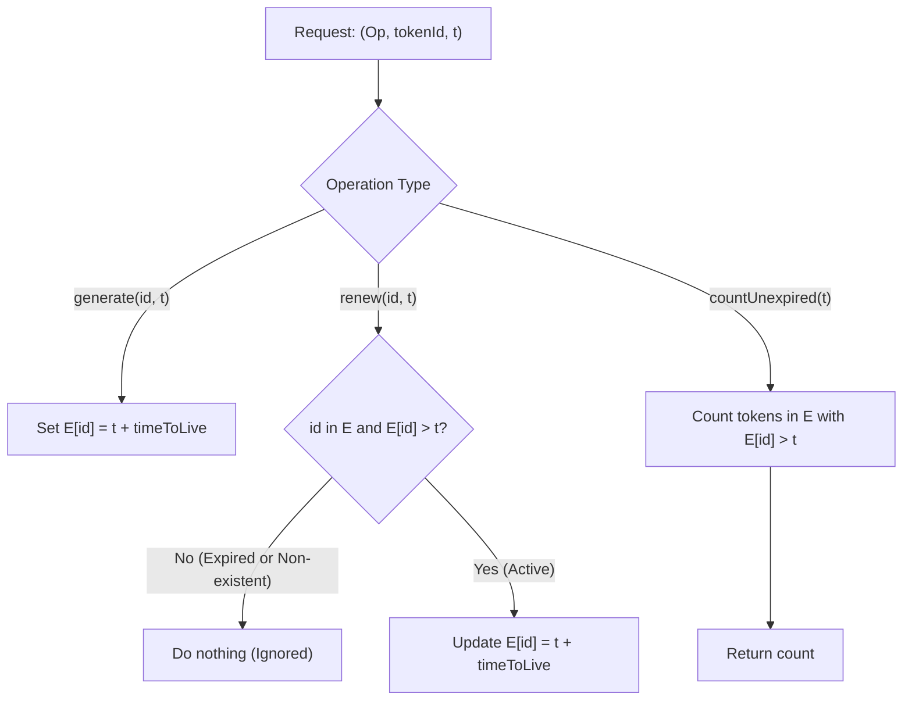

# Guided Example: Design Authentication Manager

We trace the step-by-step state evolution of token generation, conditional renewal, and temporal expiration filtering on a representative problem instance:

- **Input:**
  `operations = ["AuthenticationManager", "renew", "generate", "countUnexpiredTokens", "generate", "renew", "renew", "countUnexpiredTokens"]`
  `arguments = [[5], ["aaa", 1], ["aaa", 2], [6], ["bbb", 7], ["aaa", 8], ["bbb", 10], [15]]`
- **Required Output:** `[null, null, null, 1, null, null, null, 0]`

This instance demonstrates key temporal boundary semantics: renewing non-existent tokens, renewing expired tokens, extending active token lifespans, and strict inequality evaluation at boundary timestamps.

---

## 1. Instance & Teaching Goal

We must design an authentication manager that issues, renews, and counts time-limited session tokens:
- **`__init__(timeToLive)`:** Initializes the manager with a fixed positive duration $T$.
- **`generate(tokenId, currentTime)`:** Creates a token with ID `tokenId` expiring at $t_{\text{exp}} = \text{currentTime} + T$.
- **`renew(tokenId, currentTime)`:** Renews `tokenId` if and only if it exists and has **not yet expired** ($\text{expiry} > \text{currentTime}$). Upon valid renewal, updates expiration to $\text{currentTime} + T$. If the token is missing or already expired ($\text{expiry} \le \text{currentTime}$), the operation does nothing.
- **`countUnexpiredTokens(currentTime)`:** Returns the number of tokens whose expiration time is **strictly greater** than `currentTime`.

The goal is to maintain the token registry accurately without allowing resurrected expired tokens to pollute active counts.

---

## 2. Conceptual Foundation & Invariants

### Token Lifespan State Model

Each token `id` is mapped to an expiration timestamp $E[\text{id}] \in \mathbb{Z}^+$.

1. **Active vs Expired Boundary:**
   At query timestamp $t$:
   - A token is **Active** if and only if $E[\text{id}] > t$.
   - A token is **Expired** if and only if $E[\text{id}] \le t$.
   Equality ($\text{expiry} = t$) constitutes expiration; a token expiring at timestamp $7$ cannot be renewed or counted at timestamp $7$ or later.
2. **Renewal Precondition:**
   A renewal request at time $t$ succeeds if and only if:
   $$\text{id} \in E \quad \text{and} \quad E[\text{id}] > t$$
   If this condition is met:
   $$E[\text{id}] \longleftarrow t + T$$
   Otherwise, the operation is ignored.

> **Temporal Invariant of Token Expiration.**
> At any current time $t$, unexpired tokens form the set:
> $$\mathcal{A}(t) = \{ \text{id} \in \text{keys}(E) \mid E[\text{id}] > t \}$$
> Token renewal strictly preserves this property: an expired token ($E[\text{id}] \le t$) is never updated or restored, ensuring that $\mathcal{A}(t)$ monotonically reflects only legitimately active sessions.

---

## 3. Step-by-Step Worked Execution

We trace the operations with $T = \text{timeToLive} = 5$.

### Operation 1: `AuthenticationManager(5)`
- Set $T = 5$.
- Initialize token dictionary: $E = \{\}$.
- Emitted output: `null`.

---

### Operation 2: `renew("aaa", 1)`
- Current time: $t = 1$.
- Check status of `"aaa"` in $E$:
  - `"aaa"` does not exist in $E$.
- Renewal fails. $E$ remains empty: $E = \{\}$.
- Emitted output: `null`.

---

### Operation 3: `generate("aaa", 2)`
- Current time: $t = 2$.
- Compute expiration timestamp:
  $$t_{\text{exp}} = t + T = 2 + 5 = 7$$
- Record token in dictionary:
  $$E[\text{"aaa"}] = 7$$
- State: $E = \{\text{"aaa"}: 7\}$.
- Emitted output: `null`.

---

### Operation 4: `countUnexpiredTokens(6)`
- Current time: $t = 6$.
- Filter active tokens where $E[\text{id}] > 6$:
  - Token `"aaa"`: $E[\text{"aaa"}] = 7 > 6 \implies$ **Active (1)**.
- Total unexpired tokens: **$1$**.
- Emitted output: `1`.

---

### Operation 5: `generate("bbb", 7)`
- Current time: $t = 7$.
- Compute expiration timestamp:
  $$t_{\text{exp}} = 7 + 5 = 12$$
- Record token in dictionary:
  $$E[\text{"bbb"}] = 12$$
- State: $E = \{\text{"aaa"}: 7, \ \text{"bbb"}: 12\}$.
- Emitted output: `null`.

---

### Operation 6: `renew("aaa", 8)`
- Current time: $t = 8$.
- Inspect token `"aaa"` in $E$:
  - $E[\text{"aaa"}] = 7$.
  - Compare with current time: $7 \le 8$ (the token expired at time $7$, prior to $t = 8$).
- Because $E[\text{"aaa"}] \le 8$, renewal is **rejected**.
- $E$ is unchanged: $E = \{\text{"aaa"}: 7, \ \text{"bbb"}: 12\}$.
- Emitted output: `null`.

---

### Operation 7: `renew("bbb", 10)`
- Current time: $t = 10$.
- Inspect token `"bbb"` in $E$:
  - $E[\text{"bbb"}] = 12$.
  - Compare with current time: $12 > 10 \implies$ **Active!**
- Update expiration time:
  $$E[\text{"bbb"}] = 10 + 5 = 15$$
- State: $E = \{\text{"aaa"}: 7, \ \text{"bbb"}: 15\}$.
- Emitted output: `null`.

---

### Operation 8: `countUnexpiredTokens(15)`
- Current time: $t = 15$.
- Filter active tokens where $E[\text{id}] > 15$:
  - Token `"aaa"`: $E[\text{"aaa"}] = 7 \le 15 \implies$ Expired.
  - Token `"bbb"`: $E[\text{"bbb"}] = 15 \le 15 \implies$ Expired (equality means expired!).
- Total active tokens: **$0$**.
- Emitted output: `0`.

---

## 4. Complete Execution Trace

| Op # | Method Call | Current Time $t$ | Evaluation / Check | State of Registry $E$ | Output |
|:---:|:---:|:---:|:---:|:---:|:---:|
| 1 | `init(5)` | — | Set $T = 5$ | $\{\}$ | `null` |
| 2 | `renew("aaa", 1)` | $1$ | `"aaa"` missing | $\{\}$ | `null` |
| 3 | `generate("aaa", 2)` | $2$ | Set expiry $2 + 5 = 7$ | $\{\text{"aaa"}: 7\}$ | `null` |
| 4 | `countUnexpired(6)` | $6$ | `"aaa"` ($7 > 6$) | $\{\text{"aaa"}: 7\}$ | **$1$** |
| 5 | `generate("bbb", 7)` | $7$ | Set expiry $7 + 5 = 12$ | $\{\text{"aaa"}: 7, \text{"bbb"}: 12\}$ | `null` |
| 6 | `renew("aaa", 8)` | $8$ | `"aaa"` expired ($7 \le 8$) | $\{\text{"aaa"}: 7, \text{"bbb"}: 12\}$ | `null` |
| 7 | `renew("bbb", 10)` | $10$ | `"bbb"` active ($12 > 10$) $\to 15$ | $\{\text{"aaa"}: 7, \text{"bbb"}: 15\}$ | `null` |
| 8 | `countUnexpired(15)` | $15$ | `"aaa"` ($7 \le 15$), `"bbb"` ($15 \le 15$) | $\{\text{"aaa"}: 7, \text{"bbb"}: 15\}$ | **$0$** |

Result sequence: `[null, null, null, 1, null, null, null, 0]`.

---

## 5. Algorithmic Correctness

**Soundness.** A token is renewed only when its current expiration timestamp strictly exceeds `currentTime`. This enforces that expired tokens are never revived. Counting tokens checks the condition $E[\text{id}] > \text{currentTime}$, which matches the strict inequality specification.

**Completeness.** Every generated token is recorded in the map with its exact calculated expiration $t + T$. The linear scan in `countUnexpiredTokens` evaluates every recorded token, guaranteeing that every token whose lifetime extends beyond `currentTime` is counted.

---

## 6. Traps This Instance Exposes

- **Boundary Equality Trap ($t_{\text{exp}} == \text{currentTime}$):** A token with expiration timestamp $15$ is expired at timestamp $15$. Using $\ge$ instead of $>$ in renewal or counting would mistakenly treat expired tokens as active.
- **Renewing Non-Existent Tokens:** Invoking `renew` on a token that was never generated must not insert a new token into the dictionary. Checking whether the token is in the dictionary or has expiration $\le t$ avoids accidental generation.
- **Resurrecting Expired Tokens:** Once a token has expired, calling `renew` on it must be a no-op; it must not receive a new expiration.
- **Lazy Cleanup vs Full Scan:** While an explicit doubly-linked list or ordered map allows $\mathcal{O}(1)$ evictions, within typical interview problem constraints where the number of operations is $\le 2000$, a hash map with streaming summation on count queries remains well within time limits.

---

## 7. Complexity Derivation

- **Time Complexity:**
  - `generate`: $\mathcal{O}(1)$ average time for hash map insertion.
  - `renew`: $\mathcal{O}(1)$ average time for key lookup and update.
  - `countUnexpiredTokens`: $\mathcal{O}(N)$ where $N$ is the total number of unique generated tokens stored in the map.
- **Auxiliary Space Complexity:** $\mathcal{O}(N)$ to store the mapping from token strings to their integer expiration timestamps.
