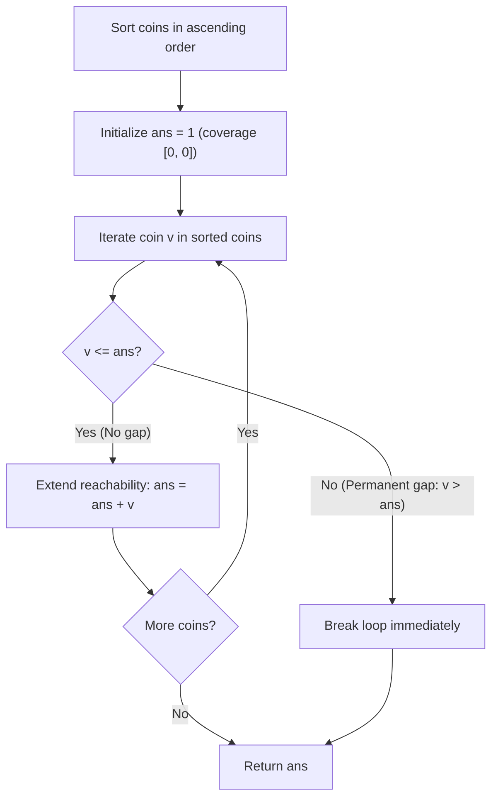

# Guided Example: Maximum Number of Consecutive Values You Can Make

We trace the step-by-step induction of contiguous integer reachability and greedy gap detection on a representative problem instance:

- **Input:** `coins = [1, 3]`
- **Required Output:** `2`

This instance demonstrates how a small set of coins establishes a contiguous baseline starting at $0$ and how a subsequent coin that exceeds the current coverage frontier causes a permanent unbridgeable gap.

---

## 1. Instance & Teaching Goal

We are given an integer array `coins` of size $n$, where each $\text{coins}[i]$ is the face value of a coin. We can choose any subset of our $n$ coins and sum their values. We must find the maximum number of consecutive integer values we can make, **starting from $0$** (that is, $0, 1, 2, \dots, M$).

A naive subset-sum dynamic programming approach records all possible achievable sums, scaling with the sum of all coin values, which is computationally infeasible. The optimal greedy approach tracks a single continuous reachability interval $[0, M]$ and processes coins in ascending order.

---

## 2. Conceptual Foundation & Invariants

### Continuous Reachability Induction

Let coins be sorted in non-decreasing order:
$$c_1 \le c_2 \le \dots \le c_n$$

Suppose that using some subset of the first $k$ coins $\{c_1, \dots, c_k\}$, we can construct **every integer** in the contiguous range:
$$[0, M_k]$$
Initially, before using any coins ($k = 0$), the empty subset produces a sum of $0$, so $M_0 = 0$.

When we introduce the next coin $v = c_{k+1}$:
- If we do not include $v$, we can form any value in $[0, M_k]$.
- If we include $v$, we add $v$ to each previously constructible value, forming any value in $[v, M_k + v]$.

Combining both options, the set of constructible values becomes:
$$[0, M_k] \cup [v, M_k + v]$$

> **Continuous Reachability Induction & Greedy Gap Theorem.**
> 1. **Contiguity Condition ($v \le M_k + 1$):**
>    If $v \le M_k + 1$, the second interval $[v, M_k + v]$ starts at or before the integer immediately following $M_k$.
>    The two intervals overlap or touch, uniting into the unbroken contiguous range:
>    $$[0, M_{k+1}] = [0, M_k + v]$$
>    The reachability frontier advances from $M_k$ to $M_k + v$.
> 2. **Permanent Gap Condition ($v > M_k + 1$):**
>    If $v > M_k + 1$, the value $M_k + 1$ cannot be formed:
>    - Using only prior coins yields a sum at most $M_k < M_k + 1$.
>    - Using coin $v$ or any subsequent sorted coin $c_j \ge v$ yields a sum at least $v > M_k + 1$.
>    Because no coin is negative, no future coin can ever fill the gap at $M_k + 1$. The consecutive sequence starting from $0$ terminates permanently at $M_k$.
> 3. The total count of consecutive integers in $[0, M]$ is $M + 1$.

---

## 3. Step-by-Step Worked Execution

We trace `coins = [1, 3]` with $n = 2$.

### Trace Setup
- Sort `coins`: $[1, 3]$ (already sorted).
- Initial state: $\text{ans} = 1$, representing the first currently unachievable integer, with covered interval $[0, \text{ans} - 1] = [0, 0]$.

---

### Step 1: Process Coin $v = 1$
- Current reachable range: $[0, 0]$.
- Target threshold: $\text{ans} = 1$.
- Evaluate contiguity test:
  $$v \le \text{ans} \iff 1 \le 1 \implies \text{True}$$
- Adding $v = 1$ to existing range $[0, 0]$ generates $[1, 0 + 1] = [1, 1]$.
- Unifying ranges:
  $$[0, 0] \cup [1, 1] = [0, 1]$$
- Advance threshold:
  $$\text{ans} \longleftarrow \text{ans} + v = 1 + 1 = 2$$
- State: Reachable range is $[0, 1]$, first missing value is $\text{ans} = 2$.

---

### Step 2: Process Coin $v = 3$
- Current reachable range: $[0, 1]$.
- Target threshold: $\text{ans} = 2$.
- Evaluate contiguity test:
  $$v \le \text{ans} \iff 3 \le 2 \implies \text{False}$$
- Gap detected: The integer $2$ cannot be formed:
  - Without coin $3$, the maximum constructible value is $1$.
  - With coin $3$, the minimum constructible value is $3$.
  - Any future coin has value $\ge 3$.
- The gap at value $2$ is permanent.
- Terminate loop immediately via `break`.

---

### Step 3: Result Extraction
The unbroken run of consecutive integers constructible from $0$ is:
$$\{0, 1\}$$
The total count of consecutive integers is $\text{ans} = \mathbf{2}$.

---

## 4. Complete Execution Trace

| Step | Current Coin $v$ | Current Reachable Interval | First Missing $\text{ans}$ | Condition ($v \le \text{ans}$) | Action Taken | Updated Interval | New $\text{ans}$ |
|:---:|:---:|:---:|:---:|:---:|:---:|:---:|:---:|
| 0 (Init) | — | $[0, 0]$ | $1$ | — | Seed base range | $[0, 0]$ | $1$ |
| 1 | $1$ | $[0, 0]$ | $1$ | $1 \le 1$ (Pass) | Extend by $+1$ | $[0, 1]$ | $2$ |
| 2 | $3$ | $[0, 1]$ | $2$ | $3 \le 2$ (Fail) | Gap at $2 \implies$ Break | $[0, 1]$ | **$2$** |

Final result: **$2$** consecutive values ($0$ and $1$).

---

## 5. Algorithmic Correctness

**Soundness.** For any integer $x \in [0, M_k + v]$, if $x \le M_k$, it is formed by a subset of the first $k$ coins. If $x > M_k$, then $x - v \in [x - v, M_k] \subseteq [0, M_k]$ because $v \le M_k + 1$. Thus $x - v$ is formed by prior coins, and including $v$ yields exactly $x$. Hence, every integer in $[0, M_k + v]$ is constructible.

**Completeness.** Because coins are sorted in non-decreasing order, if $c_{k+1} > M_k + 1$, all subsequent coins $c_{k+2}, \dots, c_n$ are also strictly greater than $M_k + 1$. Any subset of coins that includes at least one coin from index $k+1$ onward has sum at least $c_{k+1} > M_k + 1$. Any subset using only the first $k$ coins has sum at most $M_k < M_k + 1$. Therefore, no combination of coins can ever form $M_k + 1$, proving that stopping upon the first gap is globally optimal.

---

## 6. Traps This Instance Exposes

- **Processing Coins Unsorted:** If `coins = [3, 1]`, processing $3$ first would see $3 > 1$, falsely concluding that $1$ is a gap and returning $1$. Sorting ensures all potential fillers for small numbers are evaluated before larger coins.
- **Starting at 1 Instead of 0:** The problem states: "You can make some value $x$ if you can choose some coins that sum to $x$." The empty set sums to $0$, so $0$ is always achievable. If the smallest coin is $2$ (e.g. `[2]`), you can make $0$, but cannot make $1$. The answer is $1$ (only value $0$ is consecutive from $0$).
- **Subset-Sum DP Memory Explosion:** If coin values are up to $4 \times 10^4$ and $n \le 4 \times 10^4$, total sum can reach $1.6 \times 10^9$. A bitset or DP array would exhaust memory. The interval boundary requires only $\mathcal{O}(1)$ space.
- **Duplicate Coins:** Duplicate coin values (e.g. `[1, 1, 1]`) follow the exact same induction: $1 \le 1 \to [0, 1]$, next $1 \le 2 \to [0, 2]$, next $1 \le 3 \to [0, 3]$. No special duplicate handling is required.

---

## 7. Complexity Derivation

- **Time Complexity:** $\mathcal{O}(n \log n)$ where $n$ is the number of coins. Sorting the array takes $\mathcal{O}(n \log n)$ time. The subsequent linear scan performs $\mathcal{O}(1)$ comparison and addition operations per coin, taking $\mathcal{O}(n)$ time. Total time is dominated by sorting: $\mathcal{O}(n \log n)$.
- **Auxiliary Space Complexity:** $\mathcal{O}(1)$ beyond the sorting space (or $\mathcal{O}(n)$ if creating a new sorted copy), as only a single running accumulator $\text{ans}$ is maintained.
