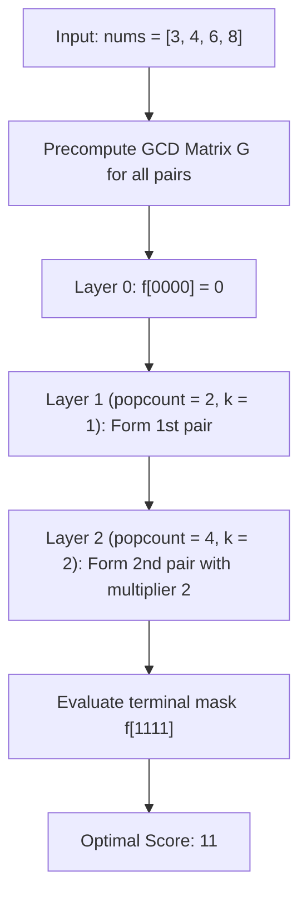

# Guided Example: Maximize Score After N Operations

We trace the step-by-step evaluation of bitmask dynamic programming and stage-weighted greatest common divisor pairing on a representative problem instance:

- **Input:** `nums = [3, 4, 6, 8]`
- **Required Output:** `11`

This instance features $2n = 4$ elements ($n = 2$ operations) where competing divisors demonstrate why greedily taking the largest GCD first is suboptimal compared to saving the largest GCD for later higher-weighted operation rounds.

---

## 1. Instance & Teaching Goal

We are given an array `nums` of $2n$ positive integers. We must perform exactly $n$ operations numbered $1$ to $n$.
In the $k^{\text{th}}$ operation ($1 \le k \le n$):
1. Choose two previously unselected elements $x$ and $y$.
2. Add $k \cdot \gcd(x, y)$ to the total score.
3. Remove $x$ and $y$ from future consideration.

Our goal is to maximize the final total score.

Because earlier operations receive smaller multipliers ($1, 2, \dots$) and later operations receive larger multipliers, the order in which pairs are chosen directly affects the score. A greedy strategy that matches the highest GCD pair first wastes large GCDs on small coefficients (e.g. $1 \times \gcd(4, 8) = 4$). We must find the globally optimal assignment across both pairings and chronological stages.

---

## 2. Conceptual Foundation & Invariants

### State Representation via Bitmasks

Since $2n \le 14$, we represent any subset of chosen elements as a bitmask $S \in [0, 2^{2n} - 1]$, where the $i^{\text{th}}$ bit of $S$ is $1$ if `nums[i]` has been used, and $0$ if it is still available.

Key observations:
1. **Cardinality Identifies the Stage:** Each operation removes exactly $2$ elements. Therefore, if a bitmask $S$ has Hamming weight (popcount) $\text{popcount}(S) = 2k$, exactly $k$ operations have taken place.
2. **The Active Multiplier is Fixed:** Any pair $\{i, j\}$ chosen to form the $k^{\text{th}}$ operation transition receives multiplier $k = \text{popcount}(S) / 2$.
3. **Precomputed GCD Table:** We precompute $G[i][j] = \gcd(\text{nums}[i], \text{nums}[j])$ for all $0 \le i < j < 2n$ in $\mathcal{O}(n^2 \log(\max A))$ time.

> **Bitmask Subproblem Decomposition & Step-Indexed Transition Theorem.**
> Let $f[S]$ be the maximum score attainable using exactly the subset of indices represented by bitmask $S$, where $|S| = 2k$.
> The state transition considers all pairs of indices $\{i, j\} \subseteq S$ as the candidate pair for operation $k$:
> $$f[S] = \max_{\substack{i < j \\ i \in S, j \in S}} \left( f[S \setminus \{i, j\}] + k \cdot G[i][j] \right)$$
> Evaluating masks $S$ in increasing numerical order from $0$ to $2^{2n} - 1$ guarantees that every subproblem $S \setminus \{i, j\} < S$ is solved prior to computing $f[S]$. The final answer is $f[2^{2n} - 1]$.

---

## 3. Step-by-Step Worked Execution

We trace `nums = [3, 4, 6, 8]` where $2n = 4$, $n = 2$.
Indices:
- Index $0$: $3$
- Index $1$: $4$
- Index $2$: $6$
- Index $3$: $8$

---

### Step 1: Precompute Pairwise GCD Matrix $G$

Calculate $G[i][j] = \gcd(\text{nums}[i], \text{nums}[j])$ for all $0 \le i < j < 4$:
- $G[0][1] = \gcd(3, 4) = 1$
- $G[0][2] = \gcd(3, 6) = 3$
- $G[0][3] = \gcd(3, 8) = 1$
- $G[1][2] = \gcd(4, 6) = 2$
- $G[1][3] = \gcd(4, 8) = 4$
- $G[2][3] = \gcd(6, 8) = 2$

---

### Step 2: Base State & Layer 1 ($k = 1$, Popcount = 2)

Base state: $f[0] = 0$.
For each mask with $\text{popcount} = 2$, operation multiplier is $k = 2 / 2 = 1$:
1. Mask $0011_2$ (indices $\{0, 1\}$):
   $$f[0011] = f[0] + 1 \times G[0][1] = 0 + 1(1) = 1$$
2. Mask $0101_2$ (indices $\{0, 2\}$):
   $$f[0101] = f[0] + 1 \times G[0][2] = 0 + 1(3) = 3$$
3. Mask $1001_2$ (indices $\{0, 3\}$):
   $$f[1001] = f[0] + 1 \times G[0][3] = 0 + 1(1) = 1$$
4. Mask $0110_2$ (indices $\{1, 2\}$):
   $$f[0110] = f[0] + 1 \times G[1][2] = 0 + 1(2) = 2$$
5. Mask $1010_2$ (indices $\{1, 3\}$):
   $$f[1010] = f[0] + 1 \times G[1][3] = 0 + 1(4) = 4$$
6. Mask $1100_2$ (indices $\{2, 3\}$):
   $$f[1100] = f[0] + 1 \times G[2][3] = 0 + 1(2) = 2$$

---

### Step 3: Layer 2 ($k = 2$, Popcount = 4)

Target mask: $S = 1111_2 = 15$ (all elements $\{0, 1, 2, 3\}$ used).
Multiplier is $k = 4 / 2 = 2$.
We evaluate all $6$ possible final pairs $\{i, j\}$ taken as the $2^{\text{nd}}$ operation:

1. **Last pair $\{0, 1\}$ (values $3, 4$):**
   - Prior mask: $S \setminus \{0, 1\} = 1100_2$ (pair $\{2, 3\}$ taken first).
   - Score: $f[1100] + 2 \times G[0][1] = 2 + 2(1) = 4$.
2. **Last pair $\{0, 2\}$ (values $3, 6$):**
   - Prior mask: $S \setminus \{0, 2\} = 1010_2$ (pair $\{1, 3\}$ taken first).
   - Score: $f[1010] + 2 \times G[0][2] = 4 + 2(3) = 10$.
3. **Last pair $\{0, 3\}$ (values $3, 8$):**
   - Prior mask: $S \setminus \{0, 3\} = 0110_2$ (pair $\{1, 2\}$ taken first).
   - Score: $f[0110] + 2 \times G[0][3] = 2 + 2(1) = 4$.
4. **Last pair $\{1, 2\}$ (values $4, 6$):**
   - Prior mask: $S \setminus \{1, 2\} = 1001_2$ (pair $\{0, 3\}$ taken first).
   - Score: $f[1001] + 2 \times G[1][2] = 1 + 2(2) = 5$.
5. **Last pair $\{1, 3\}$ (values $4, 8$):**
   - Prior mask: $S \setminus \{1, 3\} = 0101_2$ (pair $\{0, 2\}$ taken first).
   - Score: $f[0101] + 2 \times G[1][3] = 3 + 2(4) = \mathbf{11}$.
6. **Last pair $\{2, 3\}$ (values $6, 8$):**
   - Prior mask: $S \setminus \{2, 3\} = 0011_2$ (pair $\{0, 1\}$ taken first).
   - Score: $f[0011] + 2 \times G[2][3] = 1 + 2(2) = 5$.

Taking the maximum across all six transitions:
$$f[1111] = \max(4, 10, 4, 5, \mathbf{11}, 5) = \mathbf{11}$$

---

## 4. Complete Execution Trace

| Mask $S$ | Binary | Popcount | Active Stage $k$ | Best Prior Mask | Incoming Pair | Calculation | $f[S]$ |
|:---:|:---:|:---:|:---:|:---:|:---:|:---:|:---:|
| $0$ | $0000$ | $0$ | $0$ | — | — | Base | $0$ |
| $3$ | $0011$ | $2$ | $1$ | $0$ | $\{0, 1\}$ | $0 + 1(1)$ | $1$ |
| $5$ | $0101$ | $2$ | $1$ | $0$ | $\{0, 2\}$ | $0 + 1(3)$ | $3$ |
| $6$ | $0110$ | $2$ | $1$ | $0$ | $\{1, 2\}$ | $0 + 1(2)$ | $2$ |
| $9$ | $1001$ | $2$ | $1$ | $0$ | $\{0, 3\}$ | $0 + 1(1)$ | $1$ |
| $10$ | $1010$ | $2$ | $1$ | $0$ | $\{1, 3\}$ | $0 + 1(4)$ | $4$ |
| $12$ | $1100$ | $2$ | $1$ | $0$ | $\{2, 3\}$ | $0 + 1(2)$ | $2$ |
| $15$ | $1111$ | $4$ | $2$ | $5$ ($0101$) | $\{1, 3\}$ | $3 + 2(4)$ | **$11$** |

Optimal schedule:
- Round 1: Pair $\{0, 2\}$ (elements $3$ and $6$), contributing $1 \times 3 = 3$.
- Round 2: Pair $\{1, 3\}$ (elements $4$ and $8$), contributing $2 \times 4 = 8$.
- Total score: $3 + 8 = \mathbf{11}$.

---

## 5. Algorithmic Correctness

**Soundness.** Each state transition subtracts two bits $i$ and $j$ from mask $S$, ensuring elements are never reused. The multiplier $k$ strictly equals the sequential step number $\text{popcount}(S) / 2$, adhering to the problem definition.

**Completeness.** Iterating over all masks $0 \le S < 2^{2n}$ in numerical order evaluates every possible subset of paired elements. For each mask, all possible final pairs are examined. By optimal substructure, the best score for mask $S$ is guaranteed to be found.

---

## 6. Traps This Instance Exposes

- **Greedy Largest GCD First:** If we pick the pair with the largest GCD first (pair $\{1, 3\}$ with $\gcd(4, 8) = 4$), it scores $1 \times 4 = 4$. The remaining pair $\{0, 2\}$ then scores $2 \times \gcd(3, 6) = 2 \times 3 = 6$, giving a total of $4 + 6 = 10 < 11$. Saving the largest GCD for the second round scores $1 \times 3 + 2 \times 4 = 11$.
- **Odd Bitmask Processing:** Masks with odd popcount represent incomplete pairs and cannot be valid intermediate states. Filtering by `popcount(k) % 2 == 0` skips these invalid states.
- **Repeated GCD Calculations:** Computing $\gcd$ inside the triple loop would incur $\mathcal{O}(2^{2n} \cdot n^2 \log(\max A))$ time. Precomputing $G[i][j]$ once reduces inner loop work to simple table lookups.

---

## 7. Complexity Derivation

- **Time Complexity:** $\mathcal{O}\left(n^2 \log(\max A) + 2^{2n} \cdot (2n)^2\right)$. Precomputing pairwise GCDs takes $\mathcal{O}((2n)^2 \log(\max A))$ time. There are $2^{2n}$ bitmasks; for each mask with even popcount, there are $\binom{2n}{2} = \mathcal{O}(n^2)$ pairs checked. With $2n \le 14$, $2^{14} \times 91 \approx 1.5 \times 10^6$ operations, completing in tens of milliseconds.
- **Auxiliary Space Complexity:** $\mathcal{O}(2^{2n} + (2n)^2)$. The DP table requires $2^{2n} = 2^{14} = 16384$ entries, and the precomputed GCD matrix takes $(2n)^2 = 196$ integers.