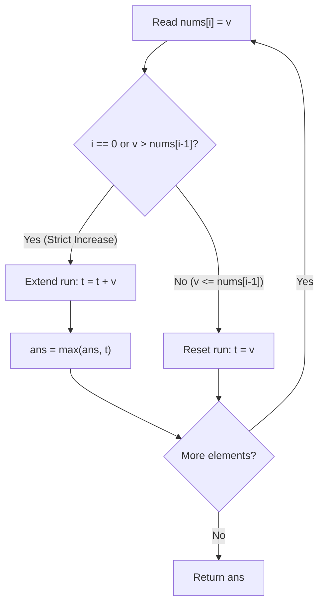

# Guided Example: Maximum Ascending Subarray Sum

We trace the step-by-step execution of streaming run accumulation and segment boundary resetting on a representative problem instance:

- **Input:** `nums = [10, 20, 30, 5, 10, 50]`
- **Required Output:** `65`

This instance features two disjoint ascending segments with an intermediate downward drop ($30 \to 5$), illustrating how strict monotonicity boundaries partition the array and how all-positive elements guarantee that maximal segments dominate all internal subsegments.

---

## 1. Instance & Teaching Goal

Given an array of positive integers `nums`, a subarray `nums[i..j]` is **strictly ascending** if:
$$\text{nums}[k] < \text{nums}[k+1] \quad \text{for all } i \le k < j$$

The score of an ascending subarray is the sum of its elements. We must find the maximum possible sum of any strictly ascending subarray in `nums`.

A naive approach might consider all $\mathcal{O}(n^2)$ subarrays, checking whether each is strictly ascending and computing its sum. The optimal linear approach uses the fact that strict increase partitions the array into non-overlapping maximal runs, and that positive values ensure maximal runs always produce the highest sums.

---

## 2. Conceptual Foundation & Invariants

### Segment Partitioning and Positivity Dominance

Let array `nums` be of length $n$.
1. **Unambiguous Partition:**
   The relationship $\text{nums}[i] > \text{nums}[i-1]$ uniquely partitions the array into maximal contiguous ascending segments:
   $$P_1, P_2, \dots, P_m$$
   Whenever $\text{nums}[i] \le \text{nums}[i-1]$, strict monotonicity is violated. No strictly ascending subarray can span across index $i - 1$ and index $i$. Thus, index $i$ must mark the beginning of a new segment.
2. **Positivity Dominance:**
   Every element is positive ($\text{nums}[k] \ge 1$). For any subsegment $[a, b] \subseteq [L, R]$ within a maximal ascending run $[L, R]$:
   $$\sum_{k=a}^b \text{nums}[k] \le \sum_{k=L}^R \text{nums}[k]$$
   Equality holds if and only if $[a, b] = [L, R]$. Therefore, the optimal ascending subarray is guaranteed to be one of the full, maximal ascending runs.

> **Contiguous Ascending Partition & Positivity Sum Dominance Theorem.**
> Because strict monotonicity creates pairwise disjoint maximal intervals and all elements are strictly positive, the maximum ascending subarray sum is exactly:
> $$\max_{k=1}^m \left( \sum_{x \in P_k} x \right)$$
> Tracking a running sum $t$ that accumulates while $\text{nums}[i] > \text{nums}[i-1]$ and resets to $\text{nums}[i]$ when $\text{nums}[i] \le \text{nums}[i-1]$ finds the global maximum in $\mathcal{O}(n)$ time and $\mathcal{O}(1)$ space.

---

## 3. Step-by-Step Worked Execution

We trace `nums = [10, 20, 30, 5, 10, 50]` of length $n = 6$.

### Trace Setup
- Running run sum: $t = 0$.
- Global maximum sum: $\text{ans} = 0$.

---

### Step 1: Index $i = 0$, Value $v = 10$
- Boundary condition: $i = 0$.
- Starts the first ascending run:
  $$t = 0 + 10 = 10$$
  $$\text{ans} = \max(0, 10) = 10$$
- State: $t = 10$, $\text{ans} = 10$.

---

### Step 2: Index $i = 1$, Value $v = 20$
- Compare with prior: $\text{nums}[1] = 20 > \text{nums}[0] = 10$ (Strict increase).
- Extend run:
  $$t = 10 + 20 = 30$$
  $$\text{ans} = \max(10, 30) = 30$$
- State: $t = 30$, $\text{ans} = 30$.

---

### Step 3: Index $i = 2$, Value $v = 30$
- Compare with prior: $\text{nums}[2] = 30 > \text{nums}[1] = 20$ (Strict increase).
- Extend run:
  $$t = 30 + 30 = 60$$
  $$\text{ans} = \max(30, 60) = 60$$
- State: $t = 60$, $\text{ans} = 60$.

---

### Step 4: Index $i = 3$, Value $v = 5$
- Compare with prior: $\text{nums}[3] = 5 \le \text{nums}[2] = 30$ (Increase broken!).
- A new segment must begin at index $3$.
- Reset run sum to the current singleton:
  $$t = 5$$
- Note on $\text{ans}$: Prior run achieved $60$. Since $5 \le 30 \le 60$, the new singleton cannot exceed $\text{ans}$.
- State: $t = 5$, $\text{ans} = 60$.

---

### Step 5: Index $i = 4$, Value $v = 10$
- Compare with prior: $\text{nums}[4] = 10 > \text{nums}[3] = 5$ (Strict increase).
- Extend run:
  $$t = 5 + 10 = 15$$
  $$\text{ans} = \max(60, 15) = 60$$
- State: $t = 15$, $\text{ans} = 60$.

---

### Step 6: Index $i = 5$, Value $v = 50$
- Compare with prior: $\text{nums}[5] = 50 > \text{nums}[4] = 10$ (Strict increase).
- Extend run:
  $$t = 15 + 50 = 65$$
  $$\text{ans} = \max(60, 65) = 65$$
- State: $t = 65$, $\text{ans} = 65$.

---

## 4. Complete Execution Trace

| Index $i$ | $\text{nums}[i]$ | Comparison with Previous | Branch Taken | Active Run Elements | Running Sum $t$ | Global Max $\text{ans}$ |
|:---:|:---:|:---:|:---:|:---:|:---:|:---:|
| $0$ | $10$ | $i = 0$ | Start Run 1 | `[10]` | $10$ | $10$ |
| $1$ | $20$ | $20 > 10$ | Extend Run 1 | `[10, 20]` | $30$ | $30$ |
| $2$ | $30$ | $30 > 20$ | Extend Run 1 | `[10, 20, 30]` | $60$ | $60$ |
| $3$ | $5$ | $5 \le 30$ | Break & Reset | `[5]` | $5$ | $60$ |
| $4$ | $10$ | $10 > 5$ | Extend Run 2 | `[5, 10]` | $15$ | $60$ |
| $5$ | $50$ | $50 > 10$ | Extend Run 2 | `[5, 10, 50]` | $65$ | **$65$** |

At end of traversal, the maximal ascending sum is **$65$**.

---

## 5. Algorithmic Correctness

**Soundness.** Every time $\text{ans}$ is updated with $t$, $t$ represents the exact sum of a verified strictly ascending contiguous subarray starting at some index $L$ and ending at $i$. Because every element in `nums` is strictly positive, the sum is algebraically correct and non-negative.

**Completeness.** Any strictly ascending subarray must reside entirely within one of the maximal contiguous ascending segments. Within any maximal segment, adding more positive elements monotonically increases the sum, so the full segment sum is maximal for that run. Since $t$ computes the total sum for every maximal segment and $\text{ans}$ captures the running maximum, no superior ascending subarray can exist.

---

## 6. Traps This Instance Exposes

- **Non-Decreasing vs Strictly Increasing:** Adjacent equal values (e.g. `[10, 10]`) violate strict increase ($10 \not> 10$). Equal elements must break the run and trigger a reset.
- **Subarray vs Subsequence:** Subarrays must be contiguous. One cannot skip the drop $30 \to 5$ to join $10, 20, 30$ with $50$.
- **Single Element Arrays:** If $n = 1$, the loop executes once on $i = 0$, setting $t = \text{nums}[0]$ and $\text{ans} = \text{nums}[0]$, returning correctly.
- **Strictly Decreasing Arrays:** For `[50, 40, 30]`, each step resets $t$ to the current element. The answer is correctly the single largest element ($50$).

---

## 7. Complexity Derivation

- **Time Complexity:** $\mathcal{O}(n)$ where $n$ is the length of `nums`. The single `for` loop visits each element exactly once, performing constant-time comparisons, arithmetic additions, and maximum selections. Total runtime is strictly linear.
- **Auxiliary Space Complexity:** $\mathcal{O}(1)$. The algorithm requires only two integer scalar variables ($t$ and $\text{ans}$), using strictly constant additional memory.
