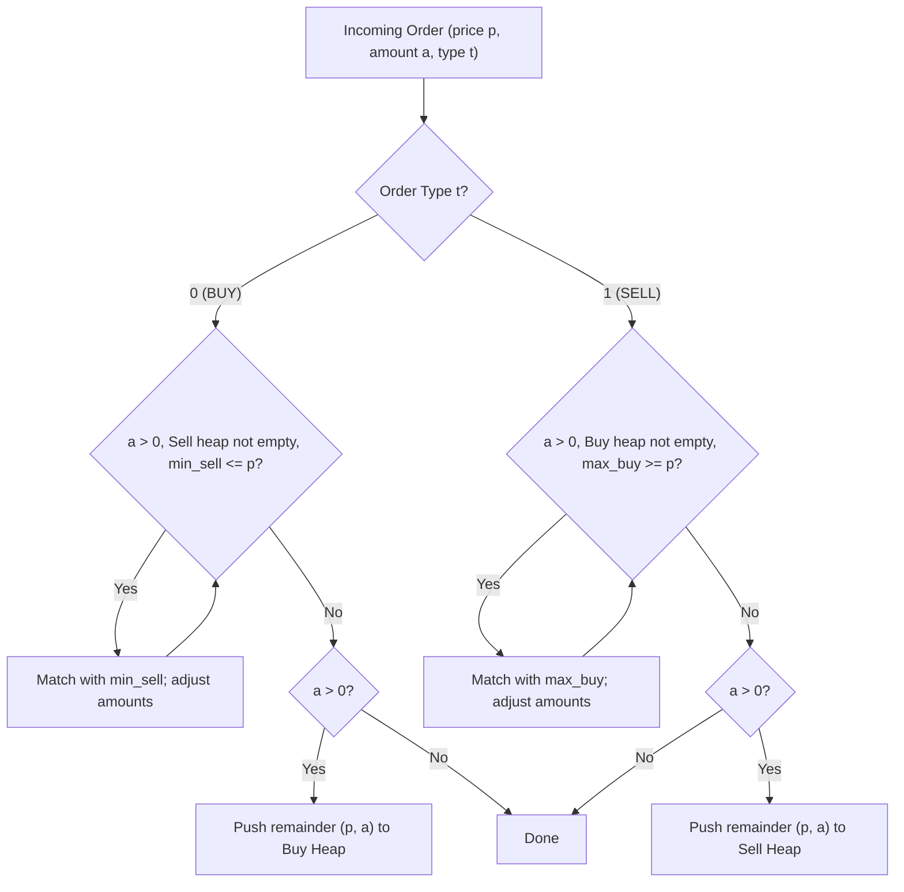

# Guided Example: Number of Orders in the Backlog

We trace the step-by-step priority queue matching and backlog accumulation of a continuous double auction on a representative problem instance:

- **Input:** `orders = [[10, 5, 0], [15, 2, 1], [25, 1, 1], [30, 4, 0]]`
- **Required Output:** `6`

This instance features batched buy and sell orders, non-matching spreads, multi-level depth clearing (an aggressive buy order consuming multiple cheaper sell tiers), and residual backlog retention.

---

## 1. Instance & Teaching Goal

We simulate a continuous double auction order book. Each order in `orders` is specified as $[\text{price}, \text{amount}, \text{orderType}]$:
- $\text{orderType} = 0$ (Buy Order): Look for the cheapest backlog sell order with $\text{sell\_price} \le \text{price}$. Match and execute the maximum possible amount. If units remain after all eligible sell orders are exhausted, add the remainder to the buy backlog.
- $\text{orderType} = 1$ (Sell Order): Look for the most expensive backlog buy order with $\text{buy\_price} \ge \text{price}$. Match and execute the maximum possible amount. If units remain after all eligible buy orders are exhausted, add the remainder to the sell backlog.

The task is to determine the total number of unexecuted order units remaining in both backlogs after processing all orders, modulo $10^9 + 7$.

Because order quantities can reach $10^9$, we cannot simulate individual unit transactions. Instead, we maintain orders as aggregated price-level parcels within dual priority queues.

---

## 2. Conceptual Foundation & Invariants

### Dual Priority Queue Order Book Model

The backlog is partitioned into two heaps:
1. **Buy Backlog (Max-Heap):** Prioritizes highest buy prices. Modeled via tuples $(-p, a)$ where $-p$ enables Python's min-heap to surface the maximum price.
2. **Sell Backlog (Min-Heap):** Prioritizes lowest sell prices. Modeled via tuples $(p, a)$ where $p$ surfaces the minimum price.

> **Continuous Double Auction & Dual Priority Queue Invariant.**
> At any point in time:
> 1. **No Crossing Spread:** The backlog heaps never cross:
>    $$\max_{b \in \text{Buy}} (\text{price}(b)) < \min_{s \in \text{Sell}} (\text{price}(s))$$
>    Any viable match ($\text{buy\_price} \ge \text{sell\_price}$) is executed immediately upon arrival.
> 2. **Best Price Execution:**
>    - An incoming buy order matches greedily against the minimum available sell price until either the buy amount is depleted, the sell heap is empty, or the cheapest sell price exceeds the buy offer.
>    - An incoming sell order matches greedily against the maximum available buy price until either the sell amount is depleted, the buy heap is empty, or the highest buy bid falls below the sell asking price.
> 3. **Amortized Complexity:** Each input batch creates at most one backlog entry if unexhausted. A partial fill pops and re-inserts at most one opposite order. Thus, at most $2$ heap insertions occur per input batch, guaranteeing $\mathcal{O}(m \log m)$ runtime across $m$ orders.

---

## 3. Step-by-Step Worked Execution

We trace `orders = [[10, 5, 0], [15, 2, 1], [25, 1, 1], [30, 4, 0]]`.

### Initial State
- Buy Heap: $\emptyset$
- Sell Heap: $\emptyset$

---

### Step 1: Process `[10, 5, 0]` (BUY 5 @ $10)
- Order type: Buy ($t = 0$), $p = 10, a = 5$.
- Check Sell Heap: Currently empty. No matching possible.
- Push entire order to Buy Heap:
  $$\text{Buy Heap} = \{(\text{price: } 10, \text{amount: } 5)\}$$
- Backlog state: Buy $= \{10: 5\}$, Sell $= \emptyset$.

---

### Step 2: Process `[15, 2, 1]` (SELL 2 @ $15)
- Order type: Sell ($t = 1$), $p = 15, a = 2$.
- Check Buy Heap: Top buy order has price $\$10$.
- Evaluate matching condition:
  $$\text{Top Buy Price } (\$10) \ge \text{Sell Asking Price } (\$15) \implies \text{False}$$
- No match occurs (spread does not cross).
- Push entire order to Sell Heap:
  $$\text{Sell Heap} = \{(\text{price: } 15, \text{amount: } 2)\}$$
- Backlog state: Buy $= \{10: 5\}$, Sell $= \{15: 2\}$.

---

### Step 3: Process `[25, 1, 1]` (SELL 1 @ $25)
- Order type: Sell ($t = 1$), $p = 25, a = 1$.
- Check Buy Heap: Top buy order has price $\$10$.
- Evaluate matching condition:
  $$\text{Top Buy Price } (\$10) \ge \text{Sell Asking Price } (\$25) \implies \text{False}$$
- No match occurs.
- Push to Sell Heap:
  $$\text{Sell Heap} = \{(\text{price: } 15, \text{amount: } 2), \ (\text{price: } 25, \text{amount: } 1)\}$$
- Backlog state: Buy $= \{10: 5\}$, Sell $= \{15: 2, \ 25: 1\}$.

---

### Step 4: Process `[30, 4, 0]` (BUY 4 @ $30)
- Order type: Buy ($t = 0$), $p = 30, a = 4$.
- **Match Iteration 1:**
  - Sell Heap top is $(15, 2)$.
  - Check condition: $\text{Sell Price } (\$15) \le \text{Buy Price } (\$30) \implies \text{True}$.
  - Pop $(15, 2)$ from Sell Heap.
  - Since incoming $a = 4 \ge 2$, all $2$ units of the sell order are executed:
    $$a \longleftarrow 4 - 2 = 2$$
  - Sell order at $\$15$ is fully cleared.
- **Match Iteration 2:**
  - Sell Heap top is now $(25, 1)$.
  - Check condition: $\text{Sell Price } (\$25) \le \text{Buy Price } (\$30) \implies \text{True}$.
  - Pop $(25, 1)$ from Sell Heap.
  - Since incoming $a = 2 \ge 1$, all $1$ unit of the sell order is executed:
    $$a \longleftarrow 2 - 1 = 1$$
  - Sell order at $\$25$ is fully cleared.
- **Match Termination:**
  - Sell Heap is now empty.
  - Residual amount: $a = 1$.
  - Push residual buy order to Buy Heap:
    $$\text{Push } (30, 1) \text{ to Buy Heap}$$
- Backlog state:
  - Buy Heap: $\{(\text{price: } 30, \text{amount: } 1), \ (\text{price: } 10, \text{amount: } 5)\}$
  - Sell Heap: $\emptyset$

---

### Step 5: Tally Total Backlog Units
Sum the unexecuted amounts remaining across both heaps:
- Buy Backlog: $1 + 5 = 6$
- Sell Backlog: $0$
Total backlog orders:
$$6 \pmod{10^9 + 7} = \mathbf{6}$$

---

## 4. Complete Execution Trace

| Order Index | Input `[p, a, t]` | Action Description | Matched Units & Price | Remaining Buy Backlog | Remaining Sell Backlog |
|:---:|:---:|:---:|:---:|:---:|:---:|
| 0 | `[10, 5, 0]` | Buy $5$ @ $10$ | None (Sell empty) | `[(10, 5)]` | `[]` |
| 1 | `[15, 2, 1]` | Sell $2$ @ $15$ | None ($10 < 15$) | `[(10, 5)]` | `[(15, 2)]` |
| 2 | `[25, 1, 1]` | Sell $1$ @ $25$ | None ($10 < 25$) | `[(10, 5)]` | `[(15, 2), (25, 1)]` |
| 3 | `[30, 4, 0]` | Buy $4$ @ $30$ | $2$ @ $\$15$, $1$ @ $\$25$ | `[(30, 1), (10, 5)]` | `[]` |

Total backlog orders remaining: $1 + 5 = \mathbf{6}$.

---

## 5. Algorithmic Correctness

**Soundness.** All executions obey the rules of price priority and eligibility: buy orders only execute against sell orders priced at or below the buy bid, and sell orders only execute against buy bids priced at or above the sell offer. When multiple matching counterparties exist, priority queues guarantee execution against the best price (lowest sell or highest buy).

**Completeness.** Every incoming order is processed sequentially. For each order, all possible executions against the existing backlog are performed until no valid opposing order remains. Unfilled quantities are strictly preserved in their respective priority queue. Summing all remaining quantities over both heaps yields the exact backlog count.

---

## 6. Traps This Instance Exposes

- **Unit-by-Unit Simulation:** Order amounts can be up to $10^9$. Simulating individual unit decrements leads to Time Limit Exceeded. Orders must be stored as aggregated tuples `(price, amount)`.
- **Partial Execution Reinsertion:** When an incoming order partially matches a backlog order ($a < y$), the difference $y - a$ must be pushed back into the backlog heap with its original price.
- **Modulo Application:** The modulo $10^9 + 7$ must only be applied to the final sum of backlog amounts, never to intermediate amounts during transaction matching.
- **Strict Inequality on Prices:** Equal prices ($\text{buy\_price} == \text{sell\_price}$) are valid matches. Using strict inequality ($<$) would incorrectly leave matching orders in the backlog.

---

## 7. Complexity Derivation

- **Time Complexity:** $\mathcal{O}(m \log m)$ where $m$ is the number of orders. Each order batch is pushed to a heap at most once. Each fully executed batch is popped once. A partially executed batch is popped and re-inserted once, but this partial execution exhausts the incoming batch (at most one partial match per incoming order). Thus, the total number of heap operations is at most $4m$, each costing $\mathcal{O}(\log m)$ time.
- **Auxiliary Space Complexity:** $\mathcal{O}(m)$. In the worst case where no orders match, both heaps store at most $m$ tuples combined.
