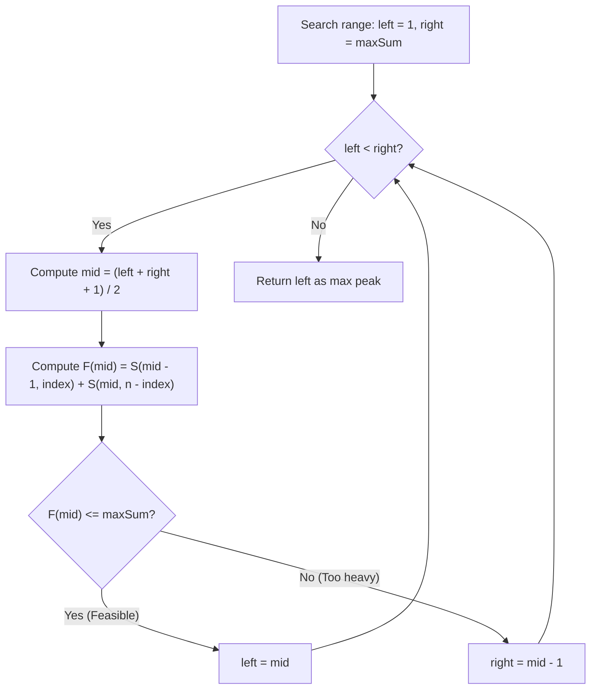

# Guided Example: Maximum Value at a Given Index in a Bounded Array

We trace the step-by-step execution of monotonic pyramidal sum verification and binary search bisection on a representative problem instance:

- **Input:** `n = 4`, `index = 2`, `maxSum = 6`
- **Required Output:** `2`

This instance features non-symmetric left and right boundaries with a low sum budget, demonstrating how triangular arithmetic progression formulas compute minimal envelope sums in $\mathcal{O}(1)$ time and guide binary search to the maximum feasible peak value.

---

## 1. Instance & Teaching Goal

We must construct an array `nums` of length $n$ satisfying:
1. Every element is a positive integer: $\text{nums}[i] \ge 1$.
2. Adjacent elements differ by at most $1$: $|\text{nums}[i] - \text{nums}[i+1]| \le 1$.
3. The sum of all elements does not exceed `maxSum`: $\sum_{i=0}^{n-1} \text{nums}[i] \le \text{maxSum}$.

Our goal is to maximize the value at the given target index: $\text{nums}[\text{index}]$.

A naive brute-force or incremental elevation approach scales linearly with `maxSum` (up to $10^9$), which is far too slow. The optimal approach recognizes that to maximize the value at `index` under a sum budget, all other elements should decrease as steeply as possible ($1$ unit per step) toward the floor of $1$.

---

## 2. Conceptual Foundation & Invariants

### The Minimal Pyramidal Envelope

To support a peak value $x$ at `index` with the smallest possible total sum:
- The element at `index` is $x$.
- Moving left from `index`, elements decrease by $1$ at each step: $x - 1, x - 2, \dots$ until reaching $1$, remaining at $1$ thereafter.
- Moving right from `index`, elements decrease by $1$ at each step: $x - 1, x - 2, \dots$ until reaching $1$, remaining at $1$ thereafter.

### Closed-Form Subarray Sum Function

Let $S(x, \text{cnt})$ denote the minimal sum of a sequence of $\text{cnt}$ elements starting at peak $x$ and decreasing by $1$ per step down to at least $1$:
1. **Case $x \ge \text{cnt}$ (Does not hit bottom $1$):**
   The sequence consists of $\text{cnt}$ elements from $x$ down to $x - \text{cnt} + 1$.
   By the arithmetic series sum formula:
   $$S(x, \text{cnt}) = \frac{(x + (x - \text{cnt} + 1)) \times \text{cnt}}{2} = \frac{(2x - \text{cnt} + 1) \times \text{cnt}}{2}$$
2. **Case $x < \text{cnt}$ (Hits bottom $1$ and plateaus):**
   The sequence decreases from $x$ down to $1$ over $x$ elements, and the remaining $\text{cnt} - x$ elements are all $1$:
   $$S(x, \text{cnt}) = \frac{x(x + 1)}{2} + (\text{cnt} - x)$$

Total minimum sum supporting peak $x$ at `index`:
$$F(x) = S(x - 1, \text{index}) + S(x, n - \text{index})$$

> **Pyramidal Sum Monotonicity & Bounded Array Convexity Theorem.**
> The minimal envelope sum $F(x)$ is strictly monotonically increasing with respect to the peak height $x \ge 1$.
> Consequently, the predicate $P(x) \equiv (F(x) \le \text{maxSum})$ is monotonically decreasing: it evaluates to `True` for all $x \le x^*$, and `False` for all $x > x^*$.
> Binary search over the integer interval $[1, \text{maxSum}]$ finds the maximal valid peak $x^*$ in $\mathcal{O}(\log(\text{maxSum}))$ steps.

---

## 3. Step-by-Step Worked Execution

We trace $n = 4$, $\text{index} = 2$, $\text{maxSum} = 6$.
- Left partition length: $\text{index} = 2$ elements (indices $0, 1$).
- Right partition length: $n - \text{index} = 4 - 2 = 2$ elements (indices $2, 3$).

---

### Step 1: Initial Search Interval
- $\text{left} = 1$, $\text{right} = 6$.

---

### Step 2: Binary Search Iteration 1
- Compute upper-biased midpoint:
  $$\text{mid} = \left\lfloor \frac{1 + 6 + 1}{2} \right\rfloor = 4$$
- Evaluate minimal sum for peak $x = 4$ at index $2$:
  - **Left flank:** $S(4 - 1, 2) = S(3, 2)$.
    Since $x = 3 \ge \text{cnt} = 2$:
    $$S(3, 2) = \frac{(2 \times 3 - 2 + 1) \times 2}{2} = \frac{5 \times 2}{2} = 5$$
    (Flank values: $\text{nums}[1] = 3, \text{nums}[0] = 2$, sum $2 + 3 = 5$.)
  - **Right flank:** $S(4, 2)$.
    Since $x = 4 \ge \text{cnt} = 2$:
    $$S(4, 2) = \frac{(2 \times 4 - 2 + 1) \times 2}{2} = \frac{7 \times 2}{2} = 7$$
    (Flank values: $\text{nums}[2] = 4, \text{nums}[3] = 3$, sum $4 + 3 = 7$.)
  - Total sum: $F(4) = 5 + 7 = 12$.
- Compare with $\text{maxSum} = 6$:
  $$12 \le 6 \implies \text{False (Infeasible)}$$
- Contract search space:
  $$\text{right} = \text{mid} - 1 = 4 - 1 = 3$$
- New range: $[\text{left}, \text{right}] = [1, 3]$.

---

### Step 3: Binary Search Iteration 2
- Compute midpoint:
  $$\text{mid} = \left\lfloor \frac{1 + 3 + 1}{2} \right\rfloor = 2$$
- Evaluate minimal sum for peak $x = 2$ at index $2$:
  - **Left flank:** $S(2 - 1, 2) = S(1, 2)$.
    Since $x = 1 < \text{cnt} = 2$ (hits 1 and plateaus):
    $$S(1, 2) = \frac{1 \times 2}{2} + (2 - 1) = 1 + 1 = 2$$
    (Flank values: $\text{nums}[1] = 1, \text{nums}[0] = 1$, sum $1 + 1 = 2$.)
  - **Right flank:** $S(2, 2)$.
    Since $x = 2 \ge \text{cnt} = 2$:
    $$S(2, 2) = \frac{(2 \times 2 - 2 + 1) \times 2}{2} = \frac{3 \times 2}{2} = 3$$
    (Flank values: $\text{nums}[2] = 2, \text{nums}[3] = 1$, sum $2 + 1 = 3$.)
  - Total sum: $F(2) = 2 + 3 = 5$.
- Compare with $\text{maxSum} = 6$:
  $$5 \le 6 \implies \text{True (Feasible!)}$$
- The array `[1, 1, 2, 1]` is fully valid and sums to $5 \le 6$.
- Contract search space to keep feasible peak:
  $$\text{left} = \text{mid} = 2$$
- New range: $[\text{left}, \text{right}] = [2, 3]$.

---

### Step 4: Binary Search Iteration 3
- Compute midpoint:
  $$\text{mid} = \left\lfloor \frac{2 + 3 + 1}{2} \right\rfloor = 3$$
- Evaluate minimal sum for peak $x = 3$ at index $2$:
  - **Left flank:** $S(3 - 1, 2) = S(2, 2)$.
    Since $x = 2 \ge \text{cnt} = 2$:
    $$S(2, 2) = \frac{(4 - 2 + 1) \times 2}{2} = 3$$
    (Flank values: $\text{nums}[1] = 2, \text{nums}[0] = 1$, sum $1 + 2 = 3$.)
  - **Right flank:** $S(3, 2)$.
    Since $x = 3 \ge \text{cnt} = 2$:
    $$S(3, 2) = \frac{(6 - 2 + 1) \times 2}{2} = 5$$
    (Flank values: $\text{nums}[2] = 3, \text{nums}[3] = 2$, sum $3 + 2 = 5$.)
  - Total sum: $F(3) = 3 + 5 = 8$.
- Compare with $\text{maxSum} = 6$:
  $$8 \le 6 \implies \text{False (Infeasible)}$$
- Contract search space:
  $$\text{right} = \text{mid} - 1 = 3 - 1 = 2$$
- New range: $[\text{left}, \text{right}] = [2, 2]$.

---

### Step 5: Termination
- $\text{left} == \text{right} == 2$. Search terminates.
- Confirmed maximum peak value: **$2$**.

---

## 4. Complete Execution Trace

| Iteration | Current $[\text{left}, \text{right}]$ | Midpoint $\text{mid}$ | Left Flank Sum $S(\text{mid}-1, 2)$ | Right Flank Sum $S(\text{mid}, 2)$ | Total Min Sum $F(\text{mid})$ | Feasible ($F \le 6$)? | Updated $[\text{left}, \text{right}]$ |
|:---:|:---:|:---:|:---:|:---:|:---:|:---:|:---:|
| 1 | $[1, 6]$ | $4$ | $5$ | $7$ | $12$ | No | $[1, 3]$ |
| 2 | $[1, 3]$ | $2$ | $2$ | $3$ | $5$ | **Yes** | $[2, 3]$ |
| 3 | $[2, 3]$ | $3$ | $3$ | $5$ | $8$ | No | $[2, 2]$ |

Converged on $\text{left} = \mathbf{2}$.

---

## 5. Algorithmic Correctness

**Soundness.** For any peak value $x$, the construction that decreases by $1$ per step until reaching $1$ achieves the minimum sum among all possible arrays satisfying the constraint $|\text{nums}[i] - \text{nums}[i+1]| \le 1$ and $\text{nums}[i] \ge 1$. If this minimal sum $F(x)$ exceeds `maxSum`, no other valid array with $\text{nums}[\text{index}] = x$ can exist. If $F(x) \le \text{maxSum}$, the remaining budget $\text{maxSum} - F(x) \ge 0$ can be distributed without violating any constraints (e.g. by adding to elements as needed).

**Completeness.** Monotonicity of $F(x)$ ensures that binary search eliminates only provably infeasible (when $F(x) > \text{maxSum}$) or strictly suboptimal (when testing larger values) regions, ensuring the global maximum integer peak is discovered.

---

## 6. Traps This Instance Exposes

- **Integer Overflow in Arithmetic Formulas:** Intermediate products like $x \times \text{cnt}$ can exceed $32$-bit integers when $x, \text{cnt} \approx 10^9$. In languages with fixed-width integers, $64$-bit integer types are mandatory.
- **Midpoint Bias in Binary Search:** When searching for the maximum value satisfying a predicate, using standard floor midpoint $\lfloor (L + R) / 2 \rfloor$ with $L = \text{mid}$ leads to an infinite loop when $R = L + 1$. The midpoint must be upper-biased: $\lfloor (L + R + 1) / 2 \rfloor$.
- **Plateau Handling at 1:** Forgetting the case where elements hit $1$ before the array ends would result in negative numbers if assuming an unconstrained arithmetic sequence. The closed form must switch to $x(x + 1) / 2 + (\text{cnt} - x)$ when $x < \text{cnt}$.

---

## 7. Complexity Derivation

- **Time Complexity:** $\mathcal{O}(\log(\text{maxSum}))$. Each binary search step executes a constant number of basic arithmetic operations to compute $S(x, \text{cnt})$ in $\mathcal{O}(1)$ time. The search range $[1, \text{maxSum}]$ is halved at each iteration, requiring at most $\approx 30$ iterations for $\text{maxSum} \le 10^9$.
- **Auxiliary Space Complexity:** $\mathcal{O}(1)$. The algorithm requires only a few scalar variables for search boundaries and sum calculations.