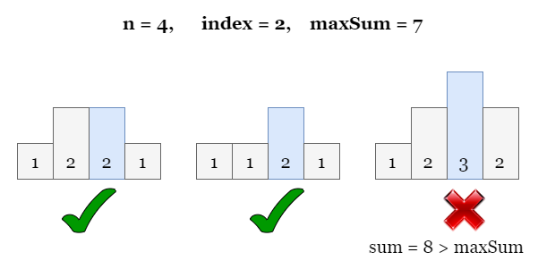
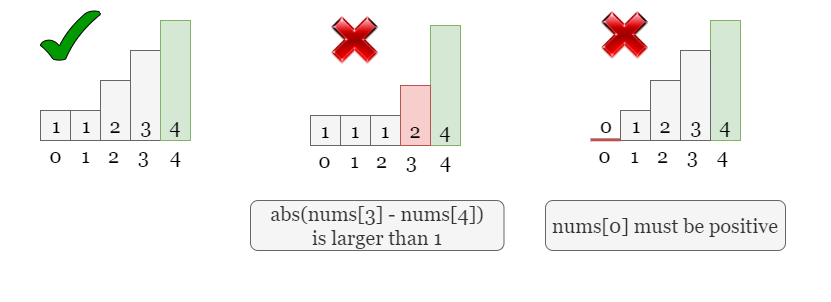
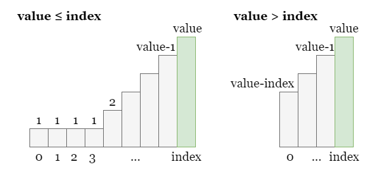
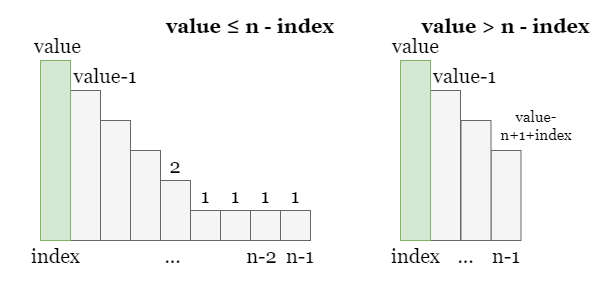

[TOC]

## Solution

---

### Overview

As usual, let's start with the example given in the problem statement. Referring to the figure below, there are several ways to make $\text{nums}[2]$ the maximum, as shown in the first two examples. However, once we want a larger $\text{nums}[2]$ as `3`, the sum of the array will certainly be greater than `maxSum`.



---

### Approach: Greedy + Binary Search

#### Intuition

The objective is to maximize $\text{nums}[index]$ while ensuring the sum the array does not exceed `maxSum`, so we can try using a greedy algorithm. In order to maximize $\text{nums}[index]$, we need to ensure that all other values are **as small as possible**.

However, we cannot take the other values to be arbitrarily small. Referring to the two rules given in the problem:
> - The difference between adjacent numbers cannot be greater than `1`.
> - $\text{nums}[i]$ must be positive.

Therefore, the last two examples in the figure below are not valid. In the example in the middle, the difference between adjacent numbers ($\text{nums}[3]$ and $\text{nums}[4]$) is greater than `1`. In the example on the right, the first number is equal to `0`, which is not allowed.

Hence, we need to ensure that $\text{nums}[i]$ satisfies these conditions as well.



Therefore, the straightforward approach is after setting a value for $\text{nums}[index]$, let the numbers to its left decrease one by one from right to left until they reach `1`. Similarly, the numbers to its right decrease one by one from left to right until they reach `1`. This way, we can ensure that the total sum of the array is minimized without violating the rules.

Next, we need to calculate the sum of the array, which is a purely mathematical problem. Let's take the numbers to the left of $\text{nums}[index]$ as an example. There will be an arithmetic sequence to its left, and (possibly) a consecutive sequence of `1`s if $\text{nums}[index]$ is less than the number of elements to the left. We need to determine the length of the arithmetic sequence based on the relative sizes of `index` and `value`.

Once we have determined the length of the arithmetic sequence, we can calculate the sum of the sequence using the arithmetic sequence formula:

$\text{sum} = (A[1] + A[n]) \cdot n / 2$

where $A[1]$ and $A[n]$ are the first and last terms of the sequence respectively, and `n` is the length of the sequence.

Take the following figure as an example:



- If $value \le index$, it means in addition to the arithmetic sequence from value to `1`, there will also be a continuous sequence of `1`s with length $index - value + 1$. The sum of all elements on `index`'s left (including $\text{nums}[index]$) is made up by two parts:
- The sum of arithmetic sequence `[1, 2, 3, ..., value - 1, value]`, which is $(value + 1) * value / 2$.
- The sum of sequence of length $index - value + 1$ consisting of all `1`s, which is $index - value + 1$.

- Otherwise, it means there is only one arithmetic sequence on the left side of index, with the first item being `value` and the last item being $value - index$, so the sum of all elements on `index`'s left (including $\text{nums}[index]$) is:
- The sum of arithmetic sequence `[value - index, ..., value - 1, value]`, which is $(value + value - index) * (index + 1) / 2$.

<br>

Similarly, the right side of $\text{nums}[index]$ is exactly the same. We need to determine the length of the arithmetic sequence and the length of the continuous subarray of `1` based on the relative sizes of $n - index$ and `value`.



- If `value` is less than or equal to $n - index$, it means there is a subarray of length $n - index - value$ consisting of all `1`s in addition to the arithmetic sequence from `value` to `1`. The sum of all elements on `index`'s right (including $\text{nums}[index]$) is made up by two parts:
- The sum of arithmetic sequence `[value, value - 1, ..., 2, 1]`, which is $(value + 1) * value / 2$.
- The sum of sequence of length $index - value + 1$ consisting of all `1`s, which is $n - index - value$

- Otherwise, there is only an arithmetic sequence on the right side of index with the first term being `value` and the last term being $value - n + 1 + index$, so the sum of all elements on `index`'s right (including $\text{nums}[index]$) is:
- The sum of arithmetic sequence `[value, value - 1, ..., value - n + 1 + index]`, which is $(value + value - n + 1 + index) * (n - index) / 2$.

<br>

Don't forget that we have added the actual `value` at `index` twice, so we need to subtract the final sum by `value`.

<br>

Now that we know how to calculate the array sum given a specific $\text{nums}[index] = value$, the question is how do we maximize `value`?

We can use binary search to find the maximum `value` that meets the criteria. First, we define a search range `[left, right]` that ensures the maximum `value` falls within this range. Next, we perform a binary search within this range. For each boundary value `mid` that divides the current search space in half, we try whether $\text{nums}[index] = mid$ is a feasible value that ensures the sum of the array does not exceed `maxSum`. If it is valid, we continue searching for a larger `mid` in the right half of the interval. If it is not feasible, it means that `mid` is too large, and we need to search for a smaller value in the left half of the interval. In this way, we can halve the search interval at each step, and find the maximum `mid` that meets the criteria in logarithmic time.
<br>

<details>

<summary>There are many other interesting problems that can be solved by performing a binary search to find the optimal value. You can practice using the binary search approach on the following problems! (click to show)</summary>

<br>

- [410. Split Array Largest Sum](https://leetcode.com/problems/split-array-largest-sum/)
- [774. Minimize Max Distance to Gas Station](https://leetcode.com/problems/minimize-max-distance-to-gas-station/)
- [875. Koko Eating Bananas](https://leetcode.com/problems/koko-eating-bananas/)
- [1011. Capacity To Ship Packages Within D Days](https://leetcode.com/problems/capacity-to-ship-packages-within-d-days/)
- [1231. Divide Chocolate](https://leetcode.com/problems/divide-chocolate/)

</details>

#### Algorithm

1) We first need to define a function `getSum(index, value)` to calculate the minimum sum of the array given $\text{nums}[index] = value$.
2) Initialize the search space `[left, right]`, set $left = 1$ as it is the minimum possible value, set $right = maxSum$ for it is the maximum possible value.
3) While `left < right`, get the middle index of the search space as $mid = (left + right + 1) / 2$, and check if $getSum(index, mid) \le maxSum$:
- If so, it means that $\text{nums}[index] = mid$ is a valid value, we can go for the right half by setting $left = mid$.
- Otherwise, it means that `mid` is too large for $\text{nums}[index]$, we shall go for the left half of the searching space by setting $right = mid - 1$.
4) Return `left` once the binary search ends.

#### Implementation

```python
class Solution:
    def getSum(self, index: int, value: int, n: int) -> int:
        count = 0

        # On index's left:
        # If value > index, there are index + 1 numbers in the arithmetic sequence:
        # [value - index, ..., value - 1, value].
        # Otherwise, there are value numbers in the arithmetic sequence:
        # [1, 2, ..., value - 1, value], plus a sequence of length (index - value + 1) of 1s.
        if value > index:
            count += (value + value - index) * (index + 1) // 2
        else:
            count += (value + 1) * value // 2 + index - value + 1

        # On index's right:
        # If value >= n - index, there are n - index numbers in the arithmetic sequence:
        # [value, value - 1, ..., value - n + 1 + index].
        # Otherwise, there are value numbers in the arithmetic sequence:
        # [value, value - 1, ..., 1], plus a sequence of length (n - index - value) of 1s.
        if value >= n - index:
            count += (value + value - n + 1 + index) * (n - index) // 2
        else:
            count += (value + 1) * value // 2 + n - index - value

        return count - value

    def maxValue(self, n: int, index: int, maxSum: int) -> int:
        left, right = 1, maxSum
        while left < right:
            mid = (left + right + 1) // 2
            if self.getSum(index, mid, n) <= maxSum:
                left = mid
            else:
                right = mid - 1

        return left
```

#### Complexity Analysis

* Time complexity: $O(\log (\text{maxSum}))$

- We set the searching space as `[1, maxSum]`, thus it takes $O(\log (\text{maxSum}))$ steps to finish the binary search.

- At each step, we made some calculations that take $O(1)$ time.

* Space complexity: $O(1)$

- Both the binary search and the `getSum` function take $O(1)$ space.

<br/>