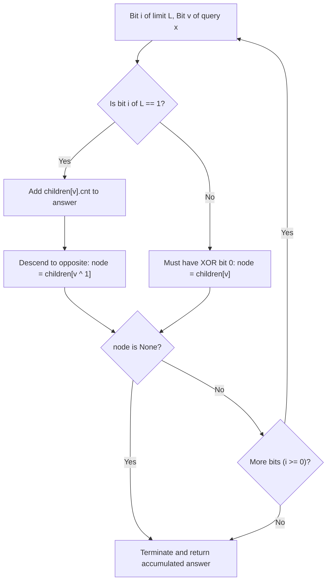

# Guided Example: Count Pairs With XOR in a Range

We trace the step-by-step execution of 0-1 Trie bit decomposition and range-count prefix bisection on a representative problem instance:

- **Input:** `nums = [1, 4, 2, 7]`, `low = 2`, `high = 6`
- **Required Output:** `6`

This instance features all $\binom{4}{2} = 6$ pairs falling within the inclusive interval $[2, 6]$, demonstrating how binary Trie nodes accumulate subtree weights to evaluate strict XOR threshold queries in $\mathcal{O}(\text{bits})$ time.

---

## 1. Instance & Teaching Goal

Given an integer array `nums` and two integers `low` and `high`, a pair $(i, j)$ with $0 \le i < j < n$ is called **nice** if:
$$\text{low} \le \text{nums}[i] \oplus \text{nums}[j] \le \text{high}$$
where $\oplus$ denotes bitwise XOR. We must return the total number of nice pairs.

A brute-force comparison of all pairs requires $\mathcal{O}(n^2)$ bitwise XOR operations, which is far too slow for $n = 20{,}000$ (yielding $2 \times 10^8$ operations). The optimal approach maintains an online binary prefix tree (0-1 Trie) and decomposes the range condition into two prefix-sum queries.

---

## 2. Conceptual Foundation & Invariants

### Range Reduction via Prefix Subtraction

For a fixed element $x$, let $C(x, L)$ denote the number of previously inserted numbers $y$ satisfying:
$$x \oplus y < L$$

The number of partners $y$ whose XOR sum with $x$ lies in the inclusive interval $[\text{low}, \text{high}]$ is:
$$\text{Count}(x, \text{low}, \text{high}) = C(x, \text{high} + 1) - C(x, \text{low})$$

By querying the Trie for $x$ against $L = \text{high} + 1$ and $L = \text{low}$, and then inserting $x$ into the Trie, we guarantee that each pair $(i, j)$ with $i < j$ is evaluated exactly once without self-pairing.

### 0-1 Trie Search Invariant

Each Trie node maintains:
- `children[0]`, `children[1]`: Links to subtrees for bit $0$ and bit $1$.
- `cnt`: The total number of inserted numbers whose binary representations pass through this node.

Numbers and limits are bounded by $2 \times 10^4 < 2^{15}$, so a 16-bit representation (from bit $15$ down to $0$) is sufficient.

> **Prefix-Trie XOR Bounded Query Theorem.**
> To evaluate $C(x, L)$, traverse the Trie from the most significant bit $i = 15$ down to $0$. Let $v = (x \gg i) \& 1$ and $b_L = (L \gg i) \& 1$:
> 1. **Case $b_L = 1$:**
>    - Choosing the branch with bit $v$ produces an XOR bit $v \oplus v = 0$. Since $0 < b_L = 1$, **all** numbers in the subtree `children[v]` yield a prefix strictly less than $L$. We immediately add `children[v].cnt` to our answer.
>    - To explore numbers whose $i^{\text{th}}$ XOR bit matches $b_L = 1$, we advance to the opposite child: $\text{node} \longleftarrow \text{children}[v \oplus 1]$.
> 2. **Case $b_L = 0$:**
>    - Choosing the branch with XOR bit $1$ would exceed $L$, which is forbidden.
>    - To keep the XOR prefix equal to $L$, we must choose the branch with XOR bit $0$, which corresponds to stored bit $v$: $\text{node} \longleftarrow \text{children}[v]$.
> If at any step the required continuation child does not exist, no further matching numbers exist, and the search terminates early.

---

## 3. Step-by-Step Worked Execution

We trace `nums = [1, 4, 2, 7]`, `low = 2`, `high = 6`.
Thresholds: $L_{\text{upper}} = \text{high} + 1 = 7$, $L_{\text{lower}} = \text{low} = 2$.
Total pair accumulator: $\text{ans} = 0$.

Binary representations (using 4 relevant low bits $b_3 b_2 b_1 b_0$):
- $\text{nums}[0] = 1 = 0001_2$
- $\text{nums}[1] = 4 = 0100_2$
- $\text{nums}[2] = 2 = 0010_2$
- $\text{nums}[3] = 7 = 0111_2$
- Limits: $L_{\text{upper}} = 7 = 0111_2$, $L_{\text{lower}} = 2 = 0010_2$.

---

### Step 1: Process Element $x = 1$ ($0001_2$)
- Trie is initially empty.
- $C(1, 7) = 0$, $C(1, 2) = 0$.
- Contribution: $0 - 0 = 0$. Running $\text{ans} = 0$.
- **Insert $1$ ($0001_2$) into Trie.**
  - Path: Root $\xrightarrow{0} N_1 \xrightarrow{0} N_2 \xrightarrow{0} N_3 \xrightarrow{1} N_4$. All node counts along this path $= 1$.

---

### Step 2: Process Element $x = 4$ ($0100_2$)
Evaluate $x = 4$ against numbers in Trie (`{1}`):
- **Query $C(4, 7)$ ($L = 0111_2$):**
  - Bit 3: $x_3 = 0, L_3 = 0 \implies$ Follow child $0$ to $N_1$.
  - Bit 2: $x_2 = 1, L_2 = 1 \implies$
    - Add child $1$ count (if present): none.
    - Follow opposite child $0$ to $N_2$.
  - Bit 1: $x_1 = 0, L_1 = 1 \implies$
    - Add child $0$ count: $N_2.\text{children}[0] = N_3$ has $\text{cnt} = 1$. Add $+1$.
    - Follow opposite child $1$: None $\implies$ Search halts.
  - Result: $C(4, 7) = 1$.
- **Query $C(4, 2)$ ($L = 0010_2$):**
  - Bit 3: $x_3 = 0, L_3 = 0 \implies$ Follow child $0$ to $N_1$.
  - Bit 2: $x_2 = 1, L_2 = 0 \implies$ Must follow child $1$: None $\implies$ Search halts with $0$.
  - Result: $C(4, 2) = 0$.
- Partner contribution for $x = 4$:
  $$C(4, 7) - C(4, 2) = 1 - 0 = 1 \quad (\text{Pair } \{1, 4\} \text{ has } 1 \oplus 4 = 5 \in [2, 6])$$
- Running total: $\text{ans} = 0 + 1 = 1$.
- **Insert $4$ ($0100_2$) into Trie.**

---

### Step 3: Process Element $x = 2$ ($0010_2$)
Evaluate $x = 2$ against numbers in Trie (`{1, 4}`):
- $1 \oplus 2 = 3 \in [2, 6]$
- $4 \oplus 2 = 6 \in [2, 6]$
- Query $C(2, 7)$:
  - Both $1$ and $4$ have $2 \oplus y < 7 \implies C(2, 7) = 2$.
- Query $C(2, 2)$:
  - Neither has $2 \oplus y < 2 \implies C(2, 2) = 0$.
- Partner contribution: $2 - 0 = 2$.
- Running total: $\text{ans} = 1 + 2 = 3$.
- **Insert $2$ ($0010_2$) into Trie.**

---

### Step 4: Process Element $x = 7$ ($0111_2$)
Evaluate $x = 7$ against numbers in Trie (`{1, 4, 2}`):
- $1 \oplus 7 = 6 \in [2, 6]$
- $4 \oplus 7 = 3 \in [2, 6]$
- $2 \oplus 7 = 5 \in [2, 6]$
- Query $C(7, 7)$:
  - All three values yield XOR $\le 6 < 7 \implies C(7, 7) = 3$.
- Query $C(7, 2)$:
  - None has XOR $< 2 \implies C(7, 2) = 0$.
- Partner contribution: $3 - 0 = 3$.
- Running total: $\text{ans} = 3 + 3 = 6$.
- **Insert $7$ ($0111_2$) into Trie.**

---

## 4. Complete Execution Trace

| Step | Current Element $x$ | Binary $x$ | $C(x, \text{high}+1)$ | $C(x, \text{low})$ | Valid Partners Found | Pairs Formed | Running $\text{ans}$ |
|:---:|:---:|:---:|:---:|:---:|:---:|:---:|:---:|
| 1 | $1$ | $0001_2$ | $0$ | $0$ | $0$ | — | $0$ |
| 2 | $4$ | $0100_2$ | $1$ | $0$ | $1$ | $(1, 4) \to \text{XOR } 5$ | $1$ |
| 3 | $2$ | $0010_2$ | $2$ | $0$ | $2$ | $(1, 2) \to 3, \ (4, 2) \to 6$ | $3$ |
| 4 | $7$ | $0111_2$ | $3$ | $0$ | $3$ | $(1, 7) \to 6, \ (4, 7) \to 3, \ (2, 7) \to 5$ | **$6$** |

At termination, the confirmed count of nice pairs is **$6$**.

---

## 5. Algorithmic Correctness

**Soundness.** For each element $x$ at index $j$, the query counts elements $y$ from indices $i < j$. Because binary representations are evaluated bit by bit from most to least significant, whenever a limit bit is $1$, any element matching $x$'s bit strictly minimizes the XOR bit to $0 < 1$. All elements under that subtree are guaranteed to satisfy $x \oplus y < L$. Subtracting $C(x, \text{low})$ from $C(x, \text{high} + 1)$ mathematically isolates pairs in $[\text{low}, \text{high}]$.

**Completeness.** Since $x$ is inserted into the Trie strictly after performing the queries, every pair $\{i, j\}$ with $i < j$ is queried exactly once (when processing $j$). No pairs are double-counted, and no self-pairs ($i = j$) are formed.

---

## 6. Traps This Instance Exposes

- **Inclusive Upper Bound:** Querying $C(x, \text{high})$ would exclude pairs where $x \oplus y == \text{high}$. The query must use $C(x, \text{high} + 1)$ to include the upper boundary.
- **Insert Before Query:** Inserting $x$ before searching would cause $x$ to pair with itself ($x \oplus x = 0$), which violates the strict index ordering $i < j$ and corrupts pair counts.
- **Bit Width Allocation:** Numbers can be up to $2 \times 10^4$. Since $2^{14} = 16384 < 20000 < 32768 = 2^{15}$, bit indices must run from at least $15$ down to $0$ ($16$ bits). Using fewer bits truncates high-order bits and causes silent errors.
- **Duplicate Elements:** If identical values exist in `nums`, their paths in the Trie overlap. Storing a subtree `cnt` incremented on every pass ensures that multiple identical numbers are each correctly counted.

---

## 7. Complexity Derivation

- **Time Complexity:** $\mathcal{O}(n \cdot B)$ where $n$ is the length of `nums` and $B = 16$ is the number of bits. For each of the $n$ elements, we perform two Trie queries and one Trie insertion. Each operation traverses at most $B$ nodes in the tree. Total time is $3 \cdot n \cdot B \approx 48 n$ operations, which is strictly $\mathcal{O}(n)$ linear time.
- **Auxiliary Space Complexity:** $\mathcal{O}(n \cdot B)$. Each inserted number adds at most $B$ nodes to the 0-1 Trie. For $n \le 20{,}000$ and $B = 16$, the Trie contains at most $3.2 \times 10^5$ nodes, well within standard heap limits.
