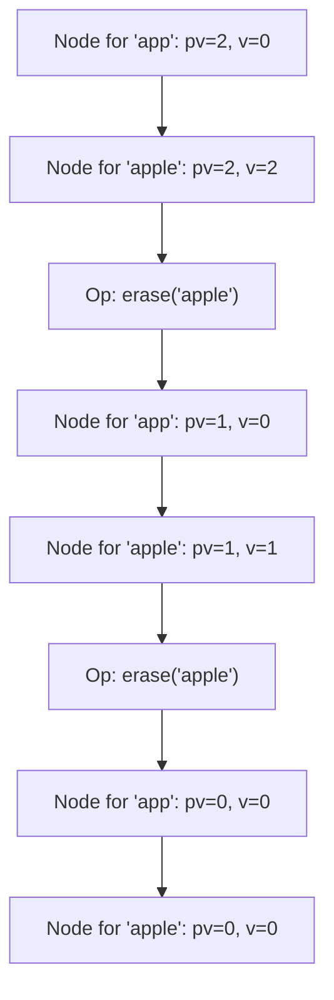

# Guided Example: Implement Trie II (Prefix Tree)

We trace the step-by-step lifecycle of word insertions, duplicate multiset tracking, prefix queries, and online deletions on a representative problem instance:

- **Input:**
  `operations = ["Trie", "insert", "insert", "countWordsEqualTo", "countWordsStartingWith", "erase", "countWordsEqualTo", "countWordsStartingWith", "erase", "countWordsStartingWith"]`
  `arguments = [[], ["apple"], ["apple"], ["apple"], ["app"], ["apple"], ["apple"], ["app"], ["apple"], ["app"]]`
- **Required Output:** `[null, null, null, 2, 2, null, 1, 1, null, 0]`

This instance demonstrates multiset frequency counting, shared prefix propagation, dual counter maintenance (`v` for exact matches, `pv` for prefixes), and reversible in-place state retraction during deletion.

---

## 1. Instance & Teaching Goal

Standard Tries typically track set membership using a boolean flag `is_end`. In a multiset or dictionary application, we need to support:
1. **Duplicates:** Words may be inserted multiple times and erased multiple times.
2. **Exact Word Count:** `countWordsEqualTo(word)` returns how many times `word` exists in the Trie.
3. **Prefix Frequency Count:** `countWordsStartingWith(prefix)` returns how many words in the Trie have `prefix` as a prefix.
4. **Online Deletion:** `erase(word)` decrements the count of `word` by $1$. The problem guarantees that `word` exists in the Trie when `erase` is called.

The goal is to answer both exact and prefix frequency queries in $\mathcal{O}(L)$ time (where $L$ is query length) without performing expensive sub-tree traversals on every prefix query.

---

## 2. Conceptual Foundation & Invariants

### Dual-Counter Trie Node Structure

Each Trie node maintains:
- `children`: An array of size $26$ for characters `'a'` through `'z'`.
- `v` (Value / Exact Word Count): The number of inserted words that terminate exactly at this node.
- `pv` (Prefix Value / Subtree Pass Count): The number of inserted words whose paths pass through this node (that is, words that have the prefix represented by this node).

> **Prefix-Frequency Conservation & Online Trie Dynamic Invariant.**
> For any node $u$ representing prefix $P(u)$:
> 1. Exact count invariant:
>    $$u.v = |\{ w \in \text{Multiset} \mid w = P(u) \}|$$
> 2. Prefix sum invariant:
>    $$u.pv = |\{ w \in \text{Multiset} \mid P(u) \text{ is a prefix of } w \}| = \sum_{d \in \text{subtree}(u)} d.v$$
> 3. **Insertion:** Walking the path for word $w$ increments $pv$ on every visited child node, and increments $v$ on the terminal node.
> 4. **Deletion:** Walking the path for word $w$ decrements $pv$ on every visited child node, and decrements $v$ on the terminal node.
> By updating $pv$ during insertion and deletion, `countWordsStartingWith(prefix)` reduces to a direct $\mathcal{O}(L)$ path traversal to node $u$, returning $u.pv$ immediately in $\mathcal{O}(1)$ without sub-tree exploration.

---

## 3. Step-by-Step Worked Execution

We trace the sequence of operations for word `"apple"` and prefix `"app"`.

---

### Step 1: `Trie()`
- Initialize root node: $\text{root}.v = 0, \text{root}.pv = 0$, all $26$ child pointers are `None`.
- Output: `null`.

---

### Step 2: `insert("apple")`
- Traverse character by character:
  - `'a'`: Create node for `"a"`, set $\text{pv} = 1$.
  - `'p'`: Create node for `"ap"`, set $\text{pv} = 1$.
  - `'p'`: Create node for `"app"`, set $\text{pv} = 1$.
  - `'l'`: Create node for `"appl"`, set $\text{pv} = 1$.
  - `'e'`: Create node for `"apple"`, set $\text{pv} = 1$.
- At terminal node `"apple"`:
  $$v \longleftarrow v + 1 = 0 + 1 = 1$$
- Output: `null`.

---

### Step 3: `insert("apple")` (Second Instance)
- Retraverse path `"apple"`:
  - `"a"`: $\text{pv} \leftarrow 1 + 1 = 2$.
  - `"ap"`: $\text{pv} \leftarrow 1 + 1 = 2$.
  - `"app"`: $\text{pv} \leftarrow 1 + 1 = 2$.
  - `"appl"`: $\text{pv} \leftarrow 1 + 1 = 2$.
  - `"apple"`: $\text{pv} \leftarrow 1 + 1 = 2$.
- At terminal node `"apple"`:
  $$v \longleftarrow 1 + 1 = 2$$
- Output: `null`.

---

### Step 4: `countWordsEqualTo("apple")`
- Follow path `'a' \to 'p' \to 'p' \to 'l' \to 'e'`.
- Reach terminal node for `"apple"`.
- Return terminal count: $v = \mathbf{2}$.
- Output: `2`.

---

### Step 5: `countWordsStartingWith("app")`
- Follow prefix path `'a' \to 'p' \to 'p'`.
- Reach prefix node for `"app"`.
- Return prefix counter: $\text{pv} = \mathbf{2}$.
- Output: `2`.

---

### Step 6: `erase("apple")`
- Retract one occurrence of `"apple"`:
  - Decrement $\text{pv}$ on each child node:
    - `"a"`: $\text{pv} \leftarrow 2 - 1 = 1$.
    - `"ap"`: $\text{pv} \leftarrow 2 - 1 = 1$.
    - `"app"`: $\text{pv} \leftarrow 2 - 1 = 1$.
    - `"appl"`: $\text{pv} \leftarrow 2 - 1 = 1$.
    - `"apple"`: $\text{pv} \leftarrow 2 - 1 = 1$.
  - Decrement terminal count:
    $$v \longleftarrow 2 - 1 = 1$$
- Output: `null`.

---

### Step 7: `countWordsEqualTo("apple")`
- Traverse to node `"apple"`.
- Return terminal count: $v = \mathbf{1}$.
- Output: `1`.

---

### Step 8: `countWordsStartingWith("app")`
- Traverse to node `"app"`.
- Return prefix count: $\text{pv} = \mathbf{1}$.
- Output: `1`.

---

### Step 9: `erase("apple")` (Second Erasure)
- Retract final occurrence of `"apple"`:
  - Nodes `"a"`, `"ap"`, `"app"`, `"appl"`, `"apple"` all have $\text{pv} \leftarrow 1 - 1 = 0$.
  - Terminal node `"apple"` has $v \leftarrow 1 - 1 = 0$.
- Output: `null`.

---

### Step 10: `countWordsStartingWith("app")`
- Traverse to node `"app"`.
- Node exists, but its prefix count is $\text{pv} = \mathbf{0}$.
- Output: `0`.

---

## 4. Complete Execution Trace

| Op # | Method Call | Argument | Node Visited / Affected | Counter Change | Result Emitted |
|:---:|:---:|:---:|:---:|:---:|:---:|
| 1 | `init` | — | Root | Initialized | `null` |
| 2 | `insert` | `"apple"` | Path `"apple"` | $\text{pv} \to 1$, $v \to 1$ | `null` |
| 3 | `insert` | `"apple"` | Path `"apple"` | $\text{pv} \to 2$, $v \to 2$ | `null` |
| 4 | `countEqualTo` | `"apple"` | Node `"apple"` | Read $v$ | **$2$** |
| 5 | `countStartingWith` | `"app"` | Node `"app"` | Read $\text{pv}$ | **$2$** |
| 6 | `erase` | `"apple"` | Path `"apple"` | $\text{pv} \to 1$, $v \to 1$ | `null` |
| 7 | `countEqualTo` | `"apple"` | Node `"apple"` | Read $v$ | **$1$** |
| 8 | `countStartingWith` | `"app"` | Node `"app"` | Read $\text{pv}$ | **$1$** |
| 9 | `erase` | `"apple"` | Path `"apple"` | $\text{pv} \to 0$, $v \to 0$ | `null` |
| 10 | `countStartingWith` | `"app"` | Node `"app"` | Read $\text{pv}$ | **$0$** |

Complete emitted sequence: `[null, null, null, 2, 2, null, 1, 1, null, 0]`.

---

## 5. Algorithmic Correctness

**Soundness.** Every node represents a unique prefix. The counter $v$ records exactly how many times a word ending at that prefix has been inserted and not yet erased. The counter $pv$ records the number of times any word having that prefix was inserted and not yet erased. When an operation deletes a word, decrementing both counters on the corresponding path accurately restores the multiset invariant.

**Completeness.** Since the alphabet consists of $26$ lowercase English letters, every word traces a deterministic path. Because the problem statement guarantees that `erase` is called only on words currently present in the Trie, paths never encounter missing nodes during erasure and counters never drop below zero.

---

## 6. Traps This Instance Exposes

- **Subtree DFS on Prefix Queries:** Dynamically summing terminal counts across all descendant nodes of `"app"` on every `countWordsStartingWith` call can degenerate to $\mathcal{O}(\text{Total Stored Characters})$, causing TLE on deep trees. Caching $pv$ during insertion gives instantaneous $\mathcal{O}(1)$ lookup upon reaching the prefix node.
- **Physical Node Deletion:** Trying to prune nodes whose $pv = 0$ requires tracking parent pointers or recursive unlinking. Simply leaving allocated nodes in place with $pv = 0$ is completely correct, avoiding complex pointer rewiring and facilitating rapid re-insertion.
- **Missing Path Handling:** If a queried word or prefix does not exist in the Trie, `search` reaches a `None` child pointer. The query methods must gracefully return $0$ rather than causing an attribute error.

---

## 7. Complexity Derivation

- **Time Complexity:**
  - `insert(word)`: $\mathcal{O}(L)$ where $L = \text{len}(word)$. Traverses $L$ characters, doing $\mathcal{O}(1)$ array indexing and integer additions.
  - `countWordsEqualTo(word)`: $\mathcal{O}(L)$ to navigate to the target node and read $v$.
  - `countWordsStartingWith(prefix)`: $\mathcal{O}(P)$ where $P = \text{len}(prefix)$ to navigate to the prefix node and read $pv$.
  - `erase(word)`: $\mathcal{O}(L)$ to navigate the path and decrement counters.
- **Auxiliary Space Complexity:** $\mathcal{O}(N \cdot L \cdot \Sigma)$ where $N$ is the number of inserted words, $L$ is average word length, and $\Sigma = 26$. Each node holds an array of $26$ references and two integer counters.
