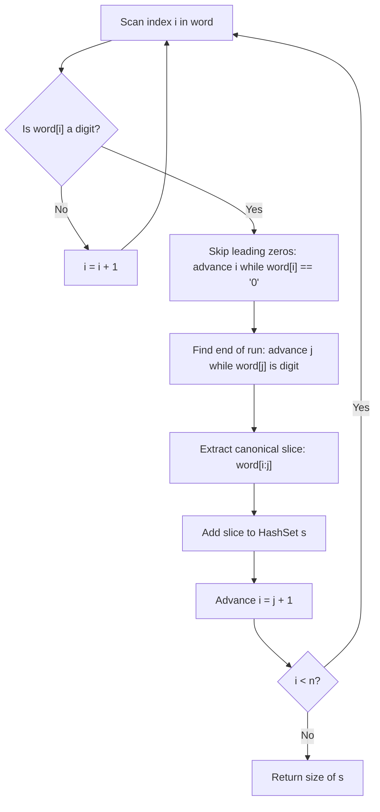

# Guided Example: Number of Different Integers in a String

We trace the step-by-step two-pointer scanning, leading-zero normalization, and hash set deduplication on a representative problem instance:

- **Input:** `word = "a123bc34d8ef34"`
- **Required Output:** `3`

This instance demonstrates letter-bounded delimiter handling, multi-digit integer tokenization, and deduplication of repeated integers ($34$ appears twice in different positions).

---

## 1. Instance & Teaching Goal

Given an alphanumeric string `word`, consecutive sequences of digits separated by letters represent individual integers. We are tasked with finding the number of **different** integers formed after removing any non-digit separators.

Two integers are identical if and only if their numerical values are equal (e.g. `"01"`, `"1"`, and `"001"` represent the same integer $1$, while `"0"` and `"00"` represent $0$).

A naive approach converting parsed substrings into large integers risks integer overflow in fixed-width languages or unnecessary parsing overhead. The optimal approach canonicalizes each maximal digit run as a normalized string directly through index manipulation and inserts the canonical slices into a hash set.

---

## 2. Conceptual Foundation & Invariants

### Maximal Run Identification and Leading-Zero Stripping

We partition the string into maximal digit runs bounded by alphabetic characters:
1. **Finding the Start:** Advance index $i$ until $\text{word}[i]$ is a decimal digit.
2. **Stripping Leading Zeros:** Advance $i$ while $i < n$ and $\text{word}[i] == \text{'0'}$.
   - If the digit run consisted purely of zeros (e.g. `"00"`), $i$ moves past all zeros to the next non-digit delimiter, leaving an empty slice `word[i:i] == ""`. The empty string `""` serves as the unique canonical key for numerical value $0$.
   - If the digit run contains non-zero digits, $i$ points to the first non-zero digit.
3. **Capturing the Significant Body:** Let $j = i$. Advance $j$ while $j < n$ and $\text{word}[j]$ is a digit.
4. **Canonical Token:** The slice $\text{word}[i:j]$ uniquely identifies the integer.

> **Sub-string Tokenization & Leading-Zero Canonicalization Theorem.**
> Let $D$ be the set of maximal contiguous digit runs extracted from `word`.
> The transformation that discards leading zeros maps every digit run $s \in D$ to a canonical representation $\text{canon}(s)$ such that:
> $$\text{val}(s_1) = \text{val}(s_2) \iff \text{canon}(s_1) = \text{canon}(s_2)$$
> Inserting $\text{canon}(s)$ into a hash set $\mathcal{S}$ achieves deduplication in time proportional to token length. The number of distinct integers is precisely $|\mathcal{S}|$.

---

## 3. Step-by-Step Worked Execution

We trace `word = "a123bc34d8ef34"` with length $n = 14$.
Initialize set: $S = \emptyset$.

---

### Step 1: Character $i = 0$, `'a'`
- $\text{word}[0] = \text{'a'}$ is not a digit.
- Advance $i \to 1$.

---

### Step 2: Extract First Integer at $i = 1$ (`"123"`)
- $\text{word}[1] = \text{'1'}$ is a digit.
- Skip leading zeros: $\text{word}[1] \ne \text{'0'}$, so $i$ remains $1$.
- Find end of digits:
  - $j = 1 \to \text{'1'}$
  - $j = 2 \to \text{'2'}$
  - $j = 3 \to \text{'3'}$
  - $j = 4 \to \text{'b'}$ (non-digit; stops).
- Extracted canonical slice: $\text{word}[1:4] = \mathbf{\text{"123"}}$.
- Insert into set: $S = \{\text{"123"}\}$.
- Set $i = 4$, then outer loop advances $i \to 5$.

---

### Step 3: Character $i = 5$, `'c'`
- $\text{word}[5] = \text{'c'}$ is not a digit.
- Advance $i \to 6$.

---

### Step 4: Extract Second Integer at $i = 6$ (`"34"`)
- $\text{word}[6] = \text{'3'}$ is a digit.
- Skip leading zeros: none present ($i = 6$).
- Find end of digits:
  - $j = 6 \to \text{'3'}$
  - $j = 7 \to \text{'4'}$
  - $j = 8 \to \text{'d'}$ (non-digit; stops).
- Extracted canonical slice: $\text{word}[6:8] = \mathbf{\text{"34"}}$.
- Insert into set: $S = \{\text{"123"}, \ \text{"34"}\}$.
- Set $i = 8$, then outer loop advances $i \to 9$.

---

### Step 5: Extract Third Integer at $i = 9$ (`"8"`)
- $\text{word}[9] = \text{'8'}$ is a digit.
- Skip leading zeros: none ($i = 9$).
- Find end of digits:
  - $j = 9 \to \text{'8'}$
  - $j = 10 \to \text{'e'}$ (non-digit; stops).
- Extracted canonical slice: $\text{word}[9:10] = \mathbf{\text{"8"}}$.
- Insert into set: $S = \{\text{"123"}, \ \text{"34"}, \ \text{"8"}\}$.
- Set $i = 10$, outer loop advances $i \to 11$.

---

### Step 6: Character $i = 11$, `'f'`
- $\text{word}[11] = \text{'f'}$ is not a digit.
- Advance $i \to 12$.

---

### Step 7: Extract Fourth Integer at $i = 12$ (`"34"`)
- $\text{word}[12] = \text{'3'}$ is a digit.
- Skip leading zeros: none ($i = 12$).
- Find end of digits:
  - $j = 12 \to \text{'3'}$
  - $j = 13 \to \text{'4'}$
  - $j = 14 = n$ (end of string; stops).
- Extracted canonical slice: $\text{word}[12:14] = \mathbf{\text{"34"}}$.
- Insert into set: `"34"` is already present in $S$. Set size remains unchanged.
- $S = \{\text{"123"}, \ \text{"34"}, \ \text{"8"}\}$.
- Loop terminates as $i \ge n$.

---

### Step 8: Return Count
The size of set $S$ is $|S| = \mathbf{3}$.

---

## 4. Complete Execution Trace

| Pass # | Start Index | Raw Substring | Leading Zeros Stripped | Canonical Slice | Added to Set? | Unique Set $S$ |
|:---:|:---:|:---:|:---:|:---:|:---:|:---:|
| 1 | $1$ | `"123"` | None | `"123"` | Yes (New) | `{"123"}` |
| 2 | $6$ | `"34"` | None | `"34"` | Yes (New) | `{"123", "34"}` |
| 3 | $9$ | `"8"` | None | `"8"` | Yes (New) | `{"123", "34", "8"}` |
| 4 | $12$ | `"34"` | None | `"34"` | No (Duplicate) | `{"123", "34", "8"}` |

Final distinct integer count: **$3$**.

---

## 5. Algorithmic Correctness

**Soundness.** Bounding runs by non-digit characters guarantees that every identified token represents a separate number as mandated by the problem specification. Stripping leading zeros maps equivalent numerical representations (such as `"05"` and `"5"`) to identical canonical strings, ensuring that set hashing accurately reflects numerical equality.

**Completeness.** The linear pointer sweep examines every index of `word` from $0$ to $n - 1$. No maximal digit run can be bypassed because the loop advances through all characters deterministically without gaps.

---

## 6. Traps This Instance Exposes

- **All-Zero Runs (e.g. `"00"`):** An all-zero sequence has all its zeros skipped, producing an empty slice `""`. Since all all-zero sequences collapse to `""`, numerical zero is correctly treated as a single unique integer.
- **Large Integer Overflow:** If a digit sequence is $1000$ digits long, converting it into a standard fixed-width 64-bit integer will overflow. By treating canonical normalized strings as set keys, the approach handles arbitrarily large integers without overflow.
- **Adjacent Separators:** Multiple consecutive letters (e.g. `"bc"`, `"ef"`) are smoothly skipped by the outer index progression without creating empty tokens.

---

## 7. Complexity Derivation

- **Time Complexity:** $\mathcal{O}(n)$ where $n = \text{len}(word)$. Pointers $i$ and $j$ advance monotonically across the string; each character is visited at most twice. Slicing and hashing string tokens of total length $\le n$ requires $\mathcal{O}(n)$ time.
- **Auxiliary Space Complexity:** $\mathcal{O}(n)$. In the worst case, storing all distinct canonical slices in the hash set requires at most $\mathcal{O}(n)$ space.
