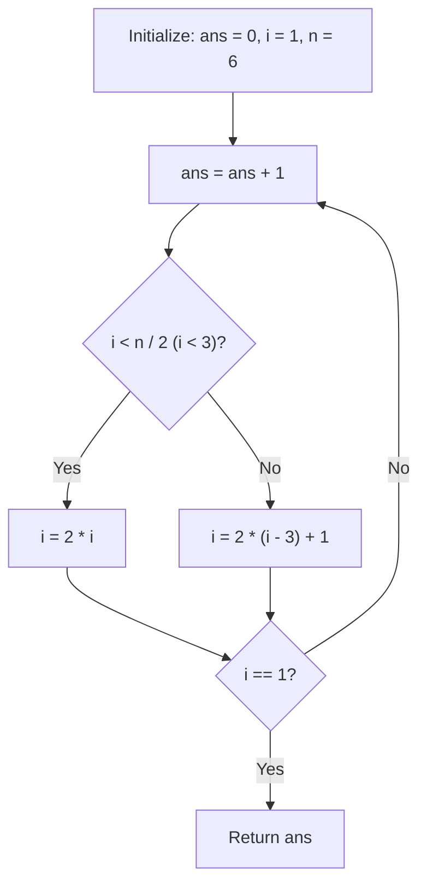

# Guided Example: Minimum Number of Operations to Reinitialize a Permutation

We trace the step-by-step execution of position-orbit simulation and modular multiplicative order dynamics on a representative problem instance:

- **Input:** `n = 6`
- **Required Output:** `4`

This instance features a permutation of length $6$ ($n - 1 = 5$), demonstrating how the perfect out-shuffle operation maps to powers of $2$ modulo $n - 1$ and how tracking the single trajectory of index $1$ determines the global recurrence period.

---

## 1. Instance & Teaching Goal

We are given an even integer $n$. Initially, we have a permutation $\text{perm}$ of length $n$ where $\text{perm}[i] = i$.
In each operation, we construct a new array $\text{arr}$ from $\text{perm}$ using the rule:
- If index $j$ is even: $\text{arr}[j] = \text{perm}[j / 2]$
- If index $j$ is odd: $\text{arr}[j] = \text{perm}[n / 2 + (j - 1) / 2]$

We then update $\text{perm} = \text{arr}$. We must find the minimum non-zero number of operations needed to return $\text{perm}$ back to its initial identity configuration $[0, 1, \dots, n - 1]$.

A naive approach simulates the entire permutation array of size $n$ at every step, copying and allocating memory repeatedly. The optimal approach recognizes the mathematical structure of the out-shuffle, inverting the coordinate transformation to track only the single orbit of index $1$.

---

## 2. Conceptual Foundation & Invariants

### Inverting the Coordinate Mapping

The problem describes where each new position $j$ reads from in the old array $\text{perm}$. To track where an element currently at position $i$ moves to in $\text{arr}$:
1. If old index $i$ lies in the first half ($0 \le i < n / 2$):
   Setting $j / 2 = i \implies j = 2i$ (an even index).
2. If old index $i$ lies in the second half ($n / 2 \le i < n$):
   Setting $n / 2 + (j - 1) / 2 = i \implies j = 2(i - n / 2) + 1 = 2i - n + 1$ (an odd index).

Notice that for all interior indices $1 \le i \le n - 2$:
$$2i - n + 1 = 2i - (n - 1) \equiv 2i \pmod{n - 1}$$
And for the first half, $2i < 2(n / 2) = n$, so $2i \equiv 2i \pmod{n - 1}$.
Endpoints $0$ and $n - 1$ are fixed points:
$$T(0) = 0, \quad T(n - 1) = 2(n - 1) - (n - 1) = n - 1$$

> **Faro Shuffle Permutation & Multiplicative Order Theorem.**
> Every step maps each interior position $i \in [1, n - 2]$ according to:
> $$T(i) \equiv 2i \pmod{n - 1}$$
> By induction, after $k$ operations, the element originally at index $i$ moves to position:
> $$T^{(k)}(i) \equiv i \cdot 2^k \pmod{n - 1}$$
> The entire permutation returns to identity ($T^{(k)}(i) = i$ for all $i$) if and only if:
> $$2^k \equiv 1 \pmod{n - 1}$$
> Because $n$ is even, $n - 1$ is odd, ensuring $\gcd(2, n - 1) = 1$. By Euler's theorem, such a $k$ always exists. The minimum number of operations is precisely the multiplicative order of $2$ modulo $n - 1$:
> $$k = \text{ord}_{n-1}(2)$$
> Consequently, tracking the position of the element starting at index $1$ until it returns to $1$ determines the exact global period.

---

## 3. Step-by-Step Worked Execution

We trace $n = 6$ ($n / 2 = 3$, $n - 1 = 5$).
We follow the position $i$ of the element that started at index $1$.

### Initial State
- Initial position: $i = 1$.
- Operation counter: $\text{ans} = 0$.

---

### Step 1: Operation 1
- Increment counter: $\text{ans} = 0 + 1 = 1$.
- Test position: $i = 1 < 3$ (First half).
- Apply transformation:
  $$i \longleftarrow 2 \times 1 = 2$$
  (Modulo check: $2 \times 1 \equiv 2 \pmod 5$.)
- Permutation state: `arr = [0, 3, 1, 4, 2, 5]`.
  Element $1$ is now at index $2$.
- Is $i == 1$? False ($2 \ne 1$). Continue.

---

### Step 2: Operation 2
- Increment counter: $\text{ans} = 1 + 1 = 2$.
- Test position: $i = 2 < 3$ (First half).
- Apply transformation:
  $$i \longleftarrow 2 \times 2 = 4$$
  (Modulo check: $2 \times 2 \equiv 4 \pmod 5$.)
- Permutation state: `arr = [0, 4, 3, 2, 1, 5]`.
  Element $1$ is now at index $4$.
- Is $i == 1$? False ($4 \ne 1$). Continue.

---

### Step 3: Operation 3
- Increment counter: $\text{ans} = 2 + 1 = 3$.
- Test position: $i = 4 \ge 3$ (Second half).
- Apply transformation:
  $$i \longleftarrow 2 \times (4 - 3) + 1 = 2 \times 1 + 1 = 3$$
  (Modulo check: $2 \times 4 = 8 \equiv 3 \pmod 5$.)
- Permutation state: `arr = [0, 2, 4, 1, 3, 5]`.
  Element $1$ is now at index $3$.
- Is $i == 1$? False ($3 \ne 1$). Continue.

---

### Step 4: Operation 4
- Increment counter: $\text{ans} = 3 + 1 = 4$.
- Test position: $i = 3 \ge 3$ (Second half).
- Apply transformation:
  $$i \longleftarrow 2 \times (3 - 3) + 1 = 2 \times 0 + 1 = 1$$
  (Modulo check: $2 \times 3 = 6 \equiv 1 \pmod 5$.)
- Permutation state: `arr = [0, 1, 2, 3, 4, 5]`.
  Element $1$ is back at index $1$!
- Is $i == 1$? **True**. The cycle is complete.
- Terminate and return $\text{ans} = \mathbf{4}$.

---

## 4. Complete Execution Trace

| Step $\text{ans}$ | Position Before $i$ | Half ($i < n/2$) | Transformation Rule | Modular Evaluation ($2i \pmod 5$) | Position After $i$ | Restored to $1$? |
|:---:|:---:|:---:|:---:|:---:|:---:|:---:|
| 1 | $1$ | Yes ($1 < 3$) | $2 \times 1 = 2$ | $2 \pmod 5 = 2$ | $2$ | No |
| 2 | $2$ | Yes ($2 < 3$) | $2 \times 2 = 4$ | $4 \pmod 5 = 4$ | $4$ | No |
| 3 | $4$ | No ($4 \ge 3$) | $2(4 - 3) + 1 = 3$ | $8 \pmod 5 = 3$ | $3$ | No |
| 4 | $3$ | No ($3 \ge 3$) | $2(3 - 3) + 1 = 1$ | $6 \pmod 5 = 1$ | **$1$** | **Yes** |

Full cycle length: **$4$** operations.

---

## 5. Algorithmic Correctness

**Soundness.** Every operation applies the exact piecewise coordinate transformation defined by the problem statement. The position update for index $1$ exactly tracks where the element originally located at index $1$ moves. By number theory, the entire permutation returns to its initial configuration precisely when $2^k \equiv 1 \pmod{n - 1}$. Because index $1$ has order equal to $\text{ord}_{n-1}(2)$, tracking index $1$ guarantees that the whole permutation is restored simultaneously.

**Completeness.** Since $n$ is even, $n - 1$ is odd and coprime to $2$. The powers of $2$ modulo $n - 1$ form a finite cyclic subgroup of the multiplicative group $(\mathbb{Z} / (n - 1)\mathbb{Z})^\times$. By group theory, the orbit must return to $1$ in at most $n - 1$ steps, guaranteeing finite termination.

---

## 6. Traps This Instance Exposes

- **Full Array Allocation:** Simulating arrays of size $n = 1000$ over dozens of operations creates thousands of unnecessary array allocations. Tracking a single integer variable reduces memory usage to $\mathcal{O}(1)$.
- **Non-Zero Requirement:** The array starts in the target configuration at step $0$. The problem asks for the minimum *positive* number of operations. Checking `i == 1` at the end of the loop body rather than the start ensures at least one operation is performed.
- **Base Case $n = 2$:** When $n = 2$, $n / 2 = 1$. Index $1 \ge 1$ triggers the second half rule: $2(1 - 1) + 1 = 1$. The loop executes once, sees $i = 1$, and immediately returns $1$.

---

## 7. Complexity Derivation

- **Time Complexity:** $\mathcal{O}(k)$ where $k = \text{ord}_{n-1}(2) \le n$. Each iteration performs simple bit-shift and conditional operations in $\mathcal{O}(1)$ time. In the worst case, $k < n$, making the algorithm strictly $\mathcal{O}(n)$ time.
- **Auxiliary Space Complexity:** $\mathcal{O}(1)$. Auxiliary storage is limited to two integer counters ($i$ and $\text{ans}$).
