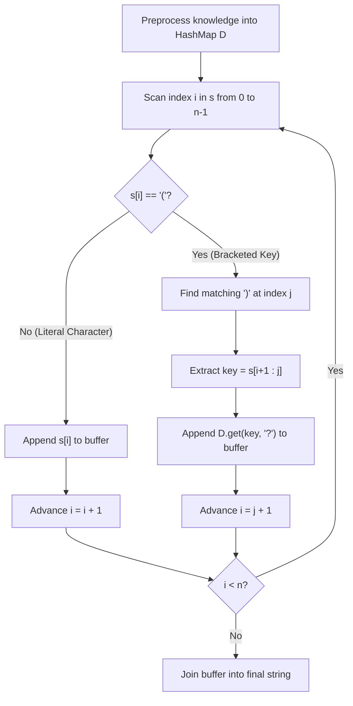

# Guided Example: Evaluate the Bracket Pairs of a String

We trace the step-by-step execution of streaming grammar parsing, dictionary-backed key replacement, and string buffer assembly on a representative problem instance:

- **Input:** `s = "(name)is(age)yearsold"`, `knowledge = [["name", "bob"], ["age", "two"]]`
- **Required Output:** `"bobistwoyearsold"`

This instance features multiple bracketed interpolation tokens interspersed with literal alphanumeric text, demonstrating how non-nested parentheses allow linear single-pass delimiter scanning and hash-map substitution.

---

## 1. Instance & Teaching Goal

We are given a template string `s` containing bracketed placeholders of the form `(key)` where each `key` is a non-empty string. We are also given a list of key-value replacement pairs `knowledge`.
- For each bracket pair `(key)`, if `key` is present in `knowledge`, we replace `(key)` with its associated value.
- If `key` is not present in `knowledge`, we replace `(key)` with a single question mark `'?'`.
- All text outside brackets remains unchanged.

Our goal is to construct the fully evaluated string.

A naive approach repeatedly scanning the `knowledge` list on every bracket pair incurs $\mathcal{O}(|s| \cdot |knowledge|)$ time. Repeatedly performing string concatenation inside a loop creates quadratic copying overhead. The optimal approach preprocesses `knowledge` into a hash table and appends evaluated tokens to a dynamic array buffer in a single linear pass.

---

## 2. Conceptual Foundation & Invariants

### Non-Nested Grammar and Hash Substitution

The problem guarantees:
1. Every opening bracket `'('` has a unique matching closing bracket `')'`.
2. Brackets are strictly non-nested: no bracket appears inside another bracket pair.
3. Every bracket pair contains a non-empty alphanumeric key.

> **Disjoint Bracket Grammar & Hash-Map Substitution Theorem.**
> Because brackets are non-nested, the string $s$ partitions into a sequence of disjoint segments:
> $$s = T_0 \cdot (K_1) \cdot T_1 \cdot (K_2) \cdots (K_m) \cdot T_m$$
> where each $T_k$ is a literal substring and each $(K_k)$ is a bracketed key.
> 1. Literal characters are appended verbatim.
> 2. For each key $K_k$, looking up $K_k$ in a precomputed hash map $D$ takes $\mathcal{O}(|K_k|)$ average time, returning $D[K_k]$ if present, or `'?'` if missing.
> 3. Advancing the scan index $i$ directly to the closing bracket index $j$ ensures every character of $s$ is visited exactly once.

---

## 3. Step-by-Step Worked Execution

We trace `s = "(name)is(age)yearsold"` with `knowledge = [["name", "bob"], ["age", "two"]]`.

---

### Step 1: Precompute Knowledge Dictionary
Build hash map $D$ from `knowledge`:
$$D = \{ \text{"name"}: \text{"bob"}, \ \text{"age"}: \text{"two"} \}$$
Initialize character buffer: $\text{ans} = []$.

---

### Step 2: Index $i = 0$, Encounter `'('`
- $s[0] == \text{'('}$.
- Find matching closing bracket:
  - Search from index $1$: $s[5] == \text{')'}$, so $j = 5$.
- Extract key:
  $$\text{key} = s[0 + 1 : 5] = s[1:5] = \text{"name"}$$
- Query dictionary:
  $$D[\text{"name"}] = \text{"bob"}$$
- Append replacement: $\text{ans}.\text{append}(\text{"bob"})$.
- Advance index: $i = j = 5$.
- End of loop step: $i \leftarrow 5 + 1 = 6$.
- State: $\text{ans} = [\text{"bob"}]$, next $i = 6$.

---

### Step 3: Indices $i = 6$ and $i = 7$, Literal `"is"`
- $i = 6$: $s[6] = \text{'i'} \ne \text{'('} \implies \text{ans}.\text{append}(\text{'i'}), \ i \to 7$.
- $i = 7$: $s[7] = \text{'s'} \ne \text{'('} \implies \text{ans}.\text{append}(\text{'s'}), \ i \to 8$.
- State: $\text{ans} = [\text{"bob"}, \text{'i'}, \text{'s'}]$, next $i = 8$.

---

### Step 4: Index $i = 8$, Encounter `'('`
- $s[8] == \text{'('}$.
- Find matching closing bracket:
  - Search from index $9$: $s[12] == \text{')'}$, so $j = 12$.
- Extract key:
  $$\text{key} = s[8 + 1 : 12] = s[9:12] = \text{"age"}$$
- Query dictionary:
  $$D[\text{"age"}] = \text{"two"}$$
- Append replacement: $\text{ans}.\text{append}(\text{"two"})$.
- Advance index: $i = j = 12$.
- End of loop step: $i \leftarrow 12 + 1 = 13$.
- State: $\text{ans} = [\text{"bob"}, \text{'i'}, \text{'s'}, \text{"two"}]$, next $i = 13$.

---

### Step 5: Indices $i = 13$ to $20$, Literal `"yearsold"`
- $s[13..20] = \text{"yearsold"}$ contains no opening brackets.
- Characters `'y', 'e', 'a', 'r', 's', 'o', 'l', 'd'` are appended sequentially to $\text{ans}$.
- State: $\text{ans} = [\text{"bob"}, \text{'i'}, \text{'s'}, \text{"two"}, \text{'y'}, \text{'e'}, \text{'a'}, \text{'r'}, \text{'s'}, \text{'o'}, \text{'l'}, \text{'d'}]$.

---

### Step 6: Buffer Assembly
Join the elements of $\text{ans}$:
$$\text{Output} = \mathbf{\text{"bobistwoyearsold"}}$$

---

## 4. Complete Execution Trace

| Step Range | Characters Processed | Classification | Target Key | Map Lookup Result | Appended Value |
|:---:|:---:|:---:|:---:|:---:|:---:|
| $0..5$ | `"(name)"` | Bracketed placeholder | `"name"` | Found $\to$ `"bob"` | `"bob"` |
| $6$ | `'i'` | Literal character | — | — | `'i'` |
| $7$ | `'s'` | Literal character | — | — | `'s'` |
| $8..12$ | `"(age)"` | Bracketed placeholder | `"age"` | Found $\to$ `"two"` | `"two"` |
| $13..20$ | `"yearsold"` | Literal substring | — | — | `"yearsold"` |

Final reconstructed string: **`"bobistwoyearsold"`**.

---

## 5. Algorithmic Correctness

**Soundness.** All bracketed intervals $[i, j]$ are strictly parsed according to the problem specification. Keys are looked up in the precomputed dictionary. If a key exists, its assigned string replaces the entire $(key)$ expression; if missing, `'?'` replaces it. Literal characters outside brackets are preserved without alteration.

**Completeness.** Because brackets do not nest, finding the next `')'` from index $i + 1$ uniquely and accurately delimits the active key. Because the loop advances index $i$ past each closing bracket, every character in the template string $s$ is processed without overlap, duplication, or omission.

---

## 6. Traps This Instance Exposes

- **Missing Key Fallback:** If a key does not exist in `knowledge` (e.g. `(unknown)`), `d.get(key, '?')` replaces it with `'?'`. Omitting this fallback would raise a key error or produce an empty string.
- **Nested Bracket Confusion:** While general bracket parsing requires a stack, the problem constraints guarantee non-nested brackets. Using a simple linear scanner with `s.find(')', i + 1)` is both sufficient and faster.
- **Repeated String Concatenation:** Using repeated string additions `result += val` in languages with immutable strings creates an $\mathcal{O}(|s|^2)$ bottleneck. Collecting pieces in an array and calling `join` maintains linear $\mathcal{O}(|s| + \text{output\_length})$ performance.

---

## 7. Complexity Derivation

- **Time Complexity:** $\mathcal{O}(|s| + K)$ where $|s|$ is the length of the string and $K$ is the sum of lengths of all strings in `knowledge`. Constructing the hash map takes $\mathcal{O}(K)$ time. Scanning $s$ and slicing keys takes $\mathcal{O}(|s|)$ time because each character is visited at most twice. Joining the output array takes time proportional to the output length. Overall time is strictly linear.
- **Auxiliary Space Complexity:** $\mathcal{O}(K + |s|)$ to store the hash map and the output buffer.
