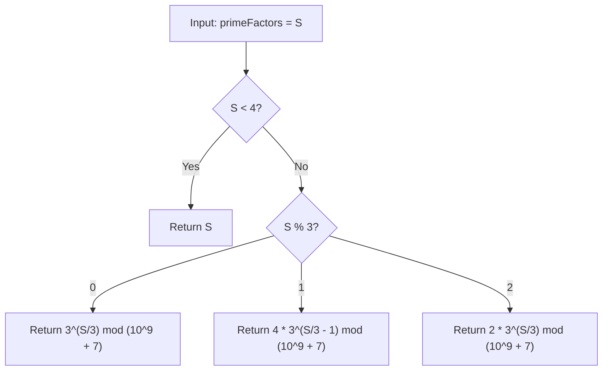

# Guided Example: Maximize Number of Nice Divisors

We trace the step-by-step mathematical reduction from prime factor multiplicities to integer product partition maximization on a representative problem instance:

- **Input:** `primeFactors = 5`
- **Required Output:** `6`

This instance features a non-multiple of three with remainder $2$, demonstrating how the prime factor sum translates into an integer partition problem, why parts of size $3$ dominate, and how modular exponentiation computes the maximum number of nice divisors in logarithmic time.

---

## 1. Instance & Teaching Goal

We must construct a positive integer $n$ such that:
1. The total count of prime factors of $n$ (counted with multiplicity) is at most `primeFactors`.
2. The number of **nice divisors** of $n$ is maximized.
A divisor of $n$ is defined as *nice* if it is divisible by every distinct prime factor of $n$. We must return the maximum number of nice divisors modulo $10^9 + 7$.

A naive approach attempting to factorize numbers or compute dynamic programming tables up to `primeFactors` ($10^9$) is impossible. The optimal approach maps the problem directly to the classic integer-partition product problem and computes the answer in closed form.

---

## 2. Conceptual Foundation & Invariants

### Mapping Prime Factor Multiplicities to Divisor Counts

Let the prime factorization of $n$ be:
$$n = p_1^{a_1} p_2^{a_2} \cdots p_k^{a_k}$$
where each $p_i$ is a distinct prime, and each exponent $a_i \ge 1$.
- Total number of prime factors:
  $$\sum_{i=1}^k a_i \le \text{primeFactors}$$
- A divisor $d$ of $n$ has the form $d = p_1^{e_1} p_2^{e_2} \cdots p_k^{e_k}$.
  For $d$ to be divisible by every distinct prime factor $p_i$, each exponent $e_i$ must be at least $1$:
  $$1 \le e_i \le a_i$$
  For each prime factor $p_i$, there are exactly $a_i$ valid choices for its exponent $e_i$.
- By the multiplication principle, the total number of nice divisors is:
  $$\prod_{i=1}^k a_i$$

The specific prime numbers chosen for $p_i$ do not affect this count; only their exponents $a_i$ matter. The problem is therefore mathematically isomorphic to:
$$\text{Maximize } \prod_{i=1}^k a_i \quad \text{subject to} \quad \sum_{i=1}^k a_i \le \text{primeFactors}, \quad a_i \in \mathbb{Z}^+$$

> **Integer Factor Partition & Geometric Mean Maximization Theorem.**
> 1. **Continuous Relaxation:** Maximizing $\prod_{i=1}^k x_i$ subject to $\sum x_i = S$ achieves its maximum when all parts are equal ($x_i = S/k$). The product is $(x^{1/x})^S$. The function $f(x) = x^{1/x}$ attains its unique global maximum at $x = e \approx 2.718$.
> 2. **Discrete Optimality of 3:** Among integers, $3$ is closest to $e$. Comparing values per unit sum:
>    $$3^{1/3} \approx 1.4422 > 2^{1/2} \approx 1.4142$$
> 3. **Splitting Rules:**
>    - Any part $x \ge 5$ can be split into $3$ and $x - 3$, yielding $3(x - 3) > x$.
>    - A remainder of $1$ (e.g. $3 + 1 = 4$) should be grouped as $2 \times 2 = 4 > 3 \times 1 = 3$.
> 4. **Closed Form for $S = \text{primeFactors}$:**
>    - If $S < 4$: Return $S$.
>    - If $S \equiv 0 \pmod 3$: Product is $3^{S/3}$.
>    - If $S \equiv 1 \pmod 3$: Product is $4 \times 3^{(S/3) - 1}$.
>    - If $S \equiv 2 \pmod 3$: Product is $2 \times 3^{S/3}$.

---

## 3. Step-by-Step Worked Execution

We trace `primeFactors = 5`.

---

### Step 1: Constraint & Boundary Check
- Check condition $S < 4$:
  $$5 < 4 \implies \text{False}$$
- We must determine the optimal partition into parts of $3$ and $2$.

---

### Step 2: Evaluate Modulo 3
- Compute quotient and remainder:
  $$\text{quotient} = \lfloor 5 / 3 \rfloor = 1$$
  $$\text{remainder} = 5 \pmod 3 = 2$$
- Because the remainder is $2$:
  - We allocate one factor of $2$ and $1$ factor of $3$.
  - Partition of sum: $5 = 3 + 2$.
  - Associated number construction: $n = p_1^3 \cdot p_2^2$ (e.g. $n = 2^3 \cdot 3^2 = 72$).
  - Prime factors: $[2, 2, 2, 3, 3]$ (total count: $3 + 2 = 5$).

---

### Step 3: Compute Nice Divisors
- Multiplicities: $a_1 = 3, a_2 = 2$.
- Number of nice divisors:
  $$\text{Product} = a_1 \times a_2 = 3 \times 2 = \mathbf{6}$$
- Verifying nice divisors of $n = 72 = 2^3 \cdot 3^2$:
  - A nice divisor must be divisible by $2 \times 3 = 6$.
  - Possible divisors: $6, 12, 18, 24, 36, 72$ (exactly $6$ nice divisors).
- Applying modulo $10^9 + 7$:
  $$6 \pmod{10^9 + 7} = \mathbf{6}$$

---

## 4. Complete Execution Trace

| Candidate Partition of $5$ | Individual Exponents | Exponent Sum | Product of Exponents | Status |
|:---:|:---:|:---:|:---:|:---:|
| Single prime | $[5]$ | $5$ | $5$ | Suboptimal |
| Two primes ($4 + 1$) | $[4, 1]$ | $5$ | $4 \times 1 = 4$ | Suboptimal |
| Two primes ($3 + 2$) | $[3, 2]$ | $5$ | $3 \times 2 = \mathbf{6}$ | **Optimal** |
| Three primes ($3 + 1 + 1$) | $[3, 1, 1]$ | $5$ | $3 \times 1 \times 1 = 3$ | Suboptimal |
| Three primes ($2 + 2 + 1$) | $[2, 2, 1]$ | $5$ | $2 \times 2 \times 1 = 4$ | Suboptimal |

The optimal product is **$6$**.

---

## 5. Algorithmic Correctness

**Soundness.** Every partition of $S$ corresponds to a concrete, valid integer $n = p_1^{a_1} \dots p_k^{a_k}$ with $\sum a_i = S$. The number of nice divisors is mathematically identical to $\prod a_i$. Any candidate solution produced by the formula represents an achievable number of nice divisors.

**Completeness.** By the Geometric Mean Maximization Theorem, no partition containing integers $\ge 5$ or containing $1$ can be optimal, as replacing them with combinations of $2$ and $3$ strictly increases the product. Testing the modular cases covers all possible remainder structures, guaranteeing that the true maximum product is attained.

---

## 6. Traps This Instance Exposes

- **Greedy Powers of 2:** Using $2 + 2 + 1 = 5$ gives product $2 \times 2 \times 1 = 4 < 6$. Powers of $3$ are strictly denser per unit sum than powers of $2$.
- **Remainder 1 Fallacy:** For $S = 4$, taking $3 + 1$ gives product $3$. Regrouping as $2 + 2 = 4$ increases the product by $33\%$. The formula $4 \times 3^{(S/3) - 1}$ specifically prevents trailing factors of $1$.
- **Modulus Application:** Because $S \le 10^9$, computing $3^{S/3}$ as an unbounded integer would create a number with millions of digits, exhausting memory. Using modular exponentiation `pow(3, exp, mod)` computes the remainder in logarithmic time.

---

## 7. Complexity Derivation

- **Time Complexity:** $\mathcal{O}(\log(\text{primeFactors}))$. Finding the quotient and remainder takes $\mathcal{O}(1)$ time. Exponentiation by squaring (`pow`) performs $\mathcal{O}(\log(S/3))$ modular multiplications. Total runtime is strictly logarithmic, finishing in under a microsecond for $S \le 10^9$.
- **Auxiliary Space Complexity:** $\mathcal{O}(1)$. All calculations use fixed-size scalar variables.
