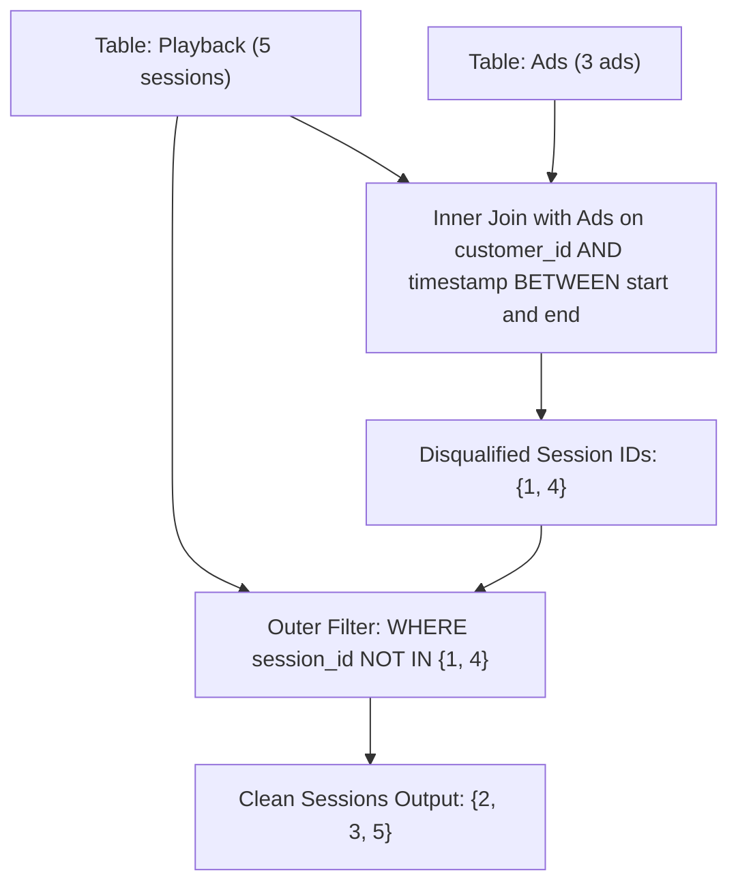

# Guided Example: Ad-Free Sessions

We trace the step-by-step relational interval evaluation and antijoin filtering on a representative database instance:

- **Input:**
  Table `Playback`:
  ```text
  +------------+-------------+------------+----------+
  | session_id | customer_id | start_time | end_time |
  +------------+-------------+------------+----------+
  | 1          | 1           | 1          | 5        |
  | 2          | 1           | 15         | 23       |
  | 3          | 2           | 10         | 12       |
  | 4          | 2           | 17         | 28       |
  | 5          | 2           | 2          | 8        |
  +------------+-------------+------------+----------+
  ```
  Table `Ads`:
  ```text
  +-------+-------------+-----------+
  | ad_id | customer_id | timestamp |
  +-------+-------------+-----------+
  | 1     | 1           | 5         |
  | 2     | 2           | 15        |
  | 3     | 2           | 20        |
  +-------+-------------+-----------+
  ```
- **Required Output:**
  ```text
  +------------+
  | session_id |
  +------------+
  | 2          |
  | 3          |
  | 5          |
  +------------+
  ```

This instance features boundary ad occurrences (ad $1$ at timestamp $5$ exactly coinciding with session $1$'s `end_time`), intervening gaps (ad $2$ occurring between sessions), and ad containment (ad $3$ inside session $4$).

---

## 1. Instance & Teaching Goal

We track customer streaming playback sessions and advertising events across two tables:
- `Playback`: Stores `session_id`, `customer_id`, `start_time`, and `end_time`.
- `Ads`: Stores `ad_id`, `customer_id`, and `timestamp`.

An ad is shown during a session if and only if:
1. It belongs to the same customer: $\text{Ads.customer\_id} = \text{Playback.customer\_id}$.
2. Its timestamp occurs within the inclusive playback window:
   $$\text{start\_time} \le \text{timestamp} \le \text{end\_time}$$

We must report the `session_id` of all sessions that did not experience any ads during playback.

Finding what did *not* happen in relational algebra is modeled as an **antijoin** (complementary filtering). We identify all disqualified sessions through a theta-join and subtract them from the full session universe.

---

## 2. Conceptual Foundation & Invariants

### Temporal Antijoin Model

Let $\mathcal{P}$ denote the relation `Playback` and $\mathcal{A}$ denote `Ads`.
1. **Disqualified Sessions ($\mathcal{D}$):**
   A session $p \in \mathcal{P}$ is disqualified if there exists an ad $a \in \mathcal{A}$ such that:
   $$\text{Match}(p, a) \equiv (p.\text{customer\_id} = a.\text{customer\_id}) \land (p.\text{start\_time} \le a.\text{timestamp} \le p.\text{end\_time})$$
   The set of disqualified session IDs is:
   $$\mathcal{D} = \pi_{\text{session\_id}} (\mathcal{P} \bowtie_{\text{Match}(p, a)} \mathcal{A})$$
2. **Ad-Free Sessions ($\mathcal{P}_{\text{free}}$):**
   The target set of clean sessions is the antijoin of $\mathcal{P}$ with respect to $\mathcal{D}$:
   $$\mathcal{P}_{\text{free}} = \pi_{\text{session\_id}}(\mathcal{P}) \setminus \mathcal{D}$$

> **Temporal Interval Antijoin & Complementary Filtering Theorem.**
> 1. Because the condition $\text{start\_time} \le \text{timestamp} \le \text{end\_time}$ is inclusive, an ad occurring exactly at $\text{start\_time}$ or $\text{end\_time}$ is counted as inside the session.
> 2. The subquery $\mathcal{D}$ isolates all sessions that experienced at least one advertisement.
> 3. The outer predicate `session_id NOT IN (D)` discards all matched sessions while preserving all sessions that generated zero ad matches.



---

## 3. Step-by-Step Worked Execution

We trace the evaluation across the database tables.

---

### Step 1: Evaluate Ad-Session Matches (Subquery Join)

We examine each ad in `Ads` and check if it falls within any session for the same customer:

1. **Ad $1$ (`customer_id = 1, timestamp = 5`):**
   - Compare with Customer 1's sessions:
     - Session $1$: $[1, 5]$. Condition $1 \le 5 \le 5 \implies$ **Match!** Session $1$ is disqualified.
     - Session $2$: $[15, 23]$. Condition $15 \le 5 \le 23 \implies$ No match.
2. **Ad $2$ (`customer_id = 2, timestamp = 15`):**
   - Compare with Customer 2's sessions:
     - Session $3$: $[10, 12]$. Condition $10 \le 15 \le 12 \implies$ No match.
     - Session $4$: $[17, 28]$. Condition $17 \le 15 \le 28 \implies$ No match.
     - Session $5$: $[2, 8]$. Condition $2 \le 15 \le 8 \implies$ No match.
   - Ad $2$ falls between sessions $3$ and $4$; it does not intersect any playback window.
3. **Ad $3$ (`customer_id = 2, timestamp = 20`):**
   - Compare with Customer 2's sessions:
     - Session $3$: $[10, 12]$. No match.
     - Session $4$: $[17, 28]$. Condition $17 \le 20 \le 28 \implies$ **Match!** Session $4$ is disqualified.
     - Session $5$: $[2, 8]$. No match.

Disqualified session set:
$$\mathcal{D} = \{ 1, 4 \}$$

---

### Step 2: Apply Antijoin Predicate (`NOT IN`)

Test each session in `Playback` against $\mathcal{D} = \{1, 4\}$:

| `session_id` | `customer_id` | Window $[\text{start}, \text{end}]$ | Present in $\mathcal{D}$? | Action / Output |
|:---:|:---:|:---:|:---:|:---:|
| $1$ | $1$ | $[1, 5]$ | Yes ($1 \in \mathcal{D}$) | Discarded |
| $2$ | $1$ | $[15, 23]$ | No ($2 \notin \mathcal{D}$) | **Retained $\to 2$** |
| $3$ | $2$ | $[10, 12]$ | No ($3 \notin \mathcal{D}$) | **Retained $\to 3$** |
| $4$ | $2$ | $[17, 28]$ | Yes ($4 \in \mathcal{D}$) | Discarded |
| $5$ | $2$ | $[2, 8]$ | No ($5 \notin \mathcal{D}$) | **Retained $\to 5$** |

Resulting set of ad-free sessions:
$$\mathcal{P}_{\text{free}} = \{ 2, 3, 5 \}$$

---

## 4. Complete Execution Trace

| Session ID | Customer | Interval | Intersecting Ads | Disqualification Status | Included in Final Output? |
|:---:|:---:|:---:|:---:|:---:|:---:|
| $1$ | $1$ | $[1, 5]$ | Ad $1$ ($t = 5$) | Disqualified | No |
| $2$ | $1$ | $[15, 23]$ | None | Ad-Free | **Yes** |
| $3$ | $2$ | $[10, 12]$ | None | Ad-Free | **Yes** |
| $4$ | $2$ | $[17, 28]$ | Ad $3$ ($t = 20$) | Disqualified | No |
| $5$ | $2$ | $[2, 8]$ | None | Ad-Free | **Yes** |

Emitted session IDs: **`2, 3, 5`**.

---

## 5. Algorithmic Correctness

**Soundness.** A session is retained only if no row exists in `Ads` sharing the same `customer_id` whose `timestamp` lies between the session's start and end times. Since SQL's `BETWEEN` is inclusive, any ad occurring on the boundaries is correctly treated as intersecting the session.

**Completeness.** Every session from `Playback` is tested. The subquery identifies all ad-playback overlaps without customer cross-contamination. Any session with zero overlaps evaluates to true under `session_id NOT IN (...)`, ensuring no ad-free session is omitted.

---

## 6. Traps This Instance Exposes

- **Inclusive Boundary Conditions:** An ad with `timestamp = 5` matches a session ending at `end_time = 5`. Using strict inequalities ($<$) would erroneously declare Session 1 ad-free. `BETWEEN` correctly enforces inclusive bounds.
- **Ignoring Customer ID:** An ad displayed to Customer 2 at timestamp $15$ must not disqualify Customer 1's session $[15, 23]$. Equating `p.customer_id = a.customer_id` is mandatory.
- **Ads Outside All Sessions:** Ads may be served when no session is active (e.g. Ad 2 at $t = 15$). Such ads produce zero join rows and must not trigger spurious disqualifications.

---

## 7. Complexity Derivation

- **Time Complexity:** $\mathcal{O}(P + A)$ on average when indexed on `(customer_id, timestamp)`, or $\mathcal{O}(P \cdot A)$ for unindexed nested-loop scans, where $P$ is the number of playback sessions and $A$ is the number of ads. The subquery evaluates temporal intersections, and the antijoin filters remaining IDs in linear time.
- **Auxiliary Space Complexity:** $\mathcal{O}(P)$ to buffer the set of disqualified session IDs and accumulate output records.
