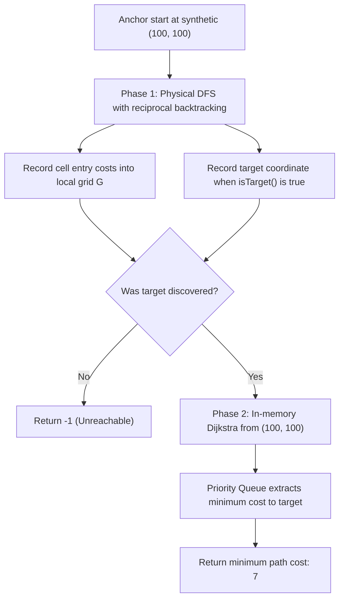

# Guided Example: Minimum Path Cost in a Hidden Grid

We trace the step-by-step execution of embodied physical DFS mapping and in-memory Dijkstra geodesic optimization on a representative problem instance:

- **Input:** Hidden grid with start cell at $(0, 0)$, target cell at $(0, 1)$ with entry cost $7$, and start entry cost $99$.
- **Required Output:** `7`

This instance illustrates the decoupling of interactive physical exploration (where the robot physically moves and must reciprocally backtrack) from mathematical shortest-path optimization (where Dijkstra's algorithm computes the minimum entry-cost path).

---

## 1. Instance & Teaching Goal

We control a robot inside a hidden $m \times n$ grid through a black-box `GridMaster` API:
- `canMove(direction)`: Returns `True` if moving in `direction` (`'U'`, `'D'`, `'L'`, `'R'`) is unblocked.
- `move(direction)`: Physically moves the robot one cell in `direction` and returns the positive entry cost of the newly occupied cell.
- `isTarget()`: Returns `True` if the robot currently stands on the destination target cell.

The starting cell cost is not paid initially; only entry costs of subsequent cells along the path to the target are paid. We must find the minimum path cost from start to target, or return `-1` if unreachable.

A naive attempt to run Dijkstra's algorithm interactively fails because priority queues expand frontier cells arbitrarily across the grid, but the physical robot cannot teleport. The optimal approach decouples discovery from optimization:
1. **Physical Discovery Phase:** A recursive DFS with reciprocal backtracking maps all reachable cells and their entry costs into a local synthetic coordinate grid.
2. **In-Memory Optimization Phase:** Dijkstra's shortest-path algorithm operates on the mapped weighted graph to find the minimum-cost route.

---

## 2. Conceptual Foundation & Invariants

### Synthetic Coordinates and Reversible DFS Movement

Because the true grid dimensions ($m, n \le 100$) and start coordinates are hidden:
- We allocate a $200 \times 200$ synthetic grid $G$ initialized with $-1$ (unvisited/wall).
- We anchor the unknown start position at synthetic center $(s_x, s_y) = (100, 100)$.
- Any reachable cell $(r, c)$ in an $m \times n$ grid ($m, n \le 100$) lies within $[-99, +99]$ relative offset, fitting safely within $[0, 199] \times [0, 199]$.

Directions and inverse backtracking:
$$\text{Directions: } \text{'U'} \leftrightarrow \text{'D'}, \quad \text{'R'} \leftrightarrow \text{'L'}$$
For direction vector $d$, its exact inverse is $d^{-1} = (k + 2) \pmod 4$.

> **Embodied Physical DFS Invariant & Decoupled Dijkstra Theorem.**
> 1. **Physical Return Invariant:** Whenever `dfs(x, y)` begins and terminates, the physical robot is located precisely at synthetic cell $(x, y)$. Every forward movement `master.move(d)` is strictly paired with a reciprocal backtrack `master.move(d^{-1})`, maintaining positional synchronization.
> 2. **Complete Reachability:** DFS visits every cell reachable from $(s_x, s_y)$ without cycle entrapment by marking $G[nx][ny] = \text{cost}$.
> 3. **Geodesic Shortest Path:** Once $G$ is mapped, Dijkstra's algorithm computes the minimum entry-cost path to the recorded target coordinate in $\mathcal{O}(V \log V)$ in-memory time, where start cost is initialized to $0$.

---

## 3. Step-by-Step Worked Execution

We trace the environment where start is at $(0, 0)$ and target is at $(0, 1)$ with cost $7$.
Synthetic start coordinate: $(s_x, s_y) = (100, 100)$.

---

### Phase 1: Physical DFS Exploration

1. **At $(100, 100)$ (Start):**
   - Check `master.isTarget()` $\implies$ `False`.
   - Probe directions in order `'U', 'R', 'D', 'L'`:
     - `'U'` (Up): `master.canMove('U')` $\implies$ `False` (Wall).
     - `'R'` (Right): `master.canMove('R')` $\implies$ `True` (Open path).
2. **Move Right to $(100, 101)$:**
   - Execute forward move: $\text{cost} = \text{master.move('R')} = 7$.
   - Record in synthetic grid: $G[100][101] = 7$.
   - Robot is physically at $(100, 101)$.
   - Check `master.isTarget()` $\implies$ **`True`**!
   - Record target location: $\text{target} = (100, 101)$.
   - Probe neighbors from $(100, 101)$:
     - `'U', 'R', 'D'` return `False` (Blocked).
     - `'L'` leads to $(100, 100)$ (already visited, $G \ne -1$).
3. **Backtrack to $(100, 100)$:**
   - Execute reciprocal backtrack: $\text{master.move('L')}$.
   - Robot is physically back at $(100, 100)$.
4. **Continue Probing from $(100, 100)$:**
   - `'D'` (Down): `master.canMove('D')` $\implies$ `False`.
   - `'L'` (Left): `master.canMove('L')` $\implies$ `False`.
- DFS terminates. Synthetic grid contains reachable cells and $\text{target} = (100, 101)$.

---

### Phase 2: In-Memory Dijkstra Pathfinding

Construct Dijkstra priority queue:
- Initial state: $\text{dist}[100][100] = 0$, push `(0, 100, 100)` to min-heap.
- All other cells have $\text{dist} = \infty$.

1. **Extract min:** `(0, 100, 100)`
   - Current node: $(100, 100)$ with cost $0$.
   - Is it target? No.
   - Relax neighbor $(100, 101)$:
     - Entry cost in $G$: $G[100][101] = 7$.
     - Candidate distance: $0 + 7 = 7 < \infty$.
     - Update: $\text{dist}[100][101] = 7$.
     - Push `(7, 100, 101)` to min-heap.
2. **Extract min:** `(7, 100, 101)`
   - Current node: $(100, 101)$ with cost $7$.
   - Is it target? **Yes** ($(100, 101) == \text{target}$).
   - Reached target via minimum path cost.
- Terminate Dijkstra and return **$7$**.

---

## 4. Complete Execution Trace

| Phase | Action | Synthetic Pos | True Pos | Physical Action / API | Result / Cost | Recorded State |
|:---:|:---:|:---:|:---:|:---:|:---:|:---:|
| DFS | Init | $(100, 100)$ | $(0, 0)$ | `isTarget()` | False | Anchor at $(100, 100)$ |
| DFS | Probe | $(100, 100)$ | $(0, 0)$ | `canMove('R')` | True | Candidate $(100, 101)$ |
| DFS | Advance | $(100, 101)$ | $(0, 1)$ | `move('R')` | $7$ | $G[100][101] = 7$ |
| DFS | Check | $(100, 101)$ | $(0, 1)$ | `isTarget()` | True | $\text{target} \leftarrow (100, 101)$ |
| DFS | Backtrack | $(100, 100)$ | $(0, 0)$ | `move('L')` | — | Physical pos restored |
| Dijkstra | Init | $(100, 100)$ | — | Heap push | $0$ | $\text{dist}[100][100] = 0$ |
| Dijkstra | Pop & Relax | $(100, 101)$ | — | Edge relaxation | $0 + 7 = 7$ | $\text{dist}[100][101] = 7$ |
| Dijkstra | Target Reached | $(100, 101)$ | — | Pop target | $7$ | **Output $7$** |

Confirmed minimum path cost: **$7$**.

---

## 5. Algorithmic Correctness

**Soundness.** Reciprocal moves (`move(k)` followed immediately by `move((k+2)%4)` upon return) strictly restore the robot's coordinates, ensuring the synthetic map accurately matches real grid topology. Dijkstra's algorithm guarantees finding the shortest path on graphs with non-negative edge weights. Because cell entry costs returned by `move()` are strictly positive, Dijkstra is provably sound.

**Completeness.** DFS visits every cell in the connected component containing the start. If the target is reachable, it is guaranteed to be detected and recorded. Once the full reachable subgraph is in memory, Dijkstra explores all paths in non-decreasing order of cumulative cost, ensuring the minimal cost path to the target is found.

---

## 6. Traps This Instance Exposes

- **Teleportation Fallacy in Dijkstra:** Attempting to move the physical robot directly along Dijkstra's priority queue frontier fails because the robot cannot jump across non-adjacent cells. Decoupling mapping from search is mandatory.
- **Backtracking Omission:** Forgetting to move backwards after a recursive DFS call leaves the physical robot in a desynchronized position, corrupting all future coordinate mappings.
- **Charging Start Cell Cost:** The robot begins on the start cell; its entry cost is not paid. Initializing $\text{dist}[\text{start}] = 0$ ensures only entry costs of visited cells along the path are counted.
- **Breadth-First Search Fallacy:** BFS finds the path with the fewest *hops*, not the lowest *cost*. When cell entry costs vary (e.g. $1$ vs $99$), Dijkstra is required to minimize cumulative cost.

---

## 7. Complexity Derivation

- **Time Complexity:** $\mathcal{O}(V \log V + E)$ where $V \le 10^4$ is the number of reachable cells and $E \le 4V$ is the number of edges. Physical DFS visits each edge at most twice (forward and backward), calling API methods at most $4V$ times. In-memory Dijkstra processes $V$ vertices with heap extractions in $\mathcal{O}(V \log V)$ time. Total runtime is well within the 1-second limit.
- **Auxiliary Space Complexity:** $\mathcal{O}(M \cdot N)$ to store the $200 \times 200$ synthetic grid, the distance matrix, and the priority queue ($4 \times 10^4$ entries total).
