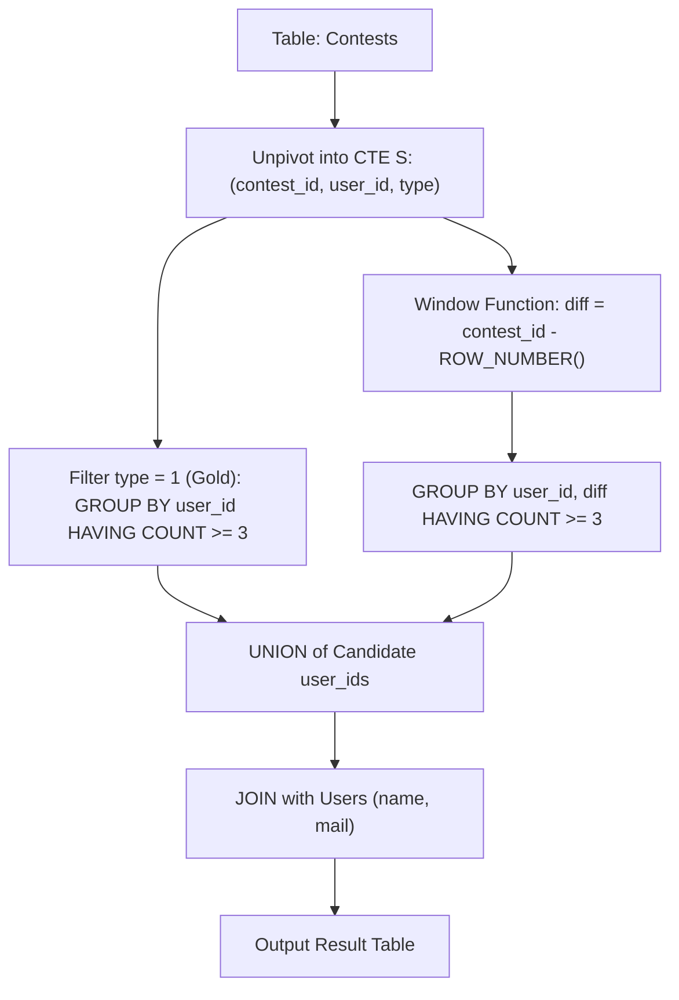

# Guided Example: Find Interview Candidates

We trace the step-by-step execution of relational medal normalization, gaps-and-islands consecutive sequence clustering, and multi-criteria candidate selection on a representative database instance:

- **Input:**
  Table `Contests`:
  ```text
  +------------+------------+--------------+--------------+
  | contest_id | gold_medal | silver_medal | bronze_medal |
  +------------+------------+--------------+--------------+
  | 190        | 1          | 5            | 2            |
  | 191        | 2          | 3            | 5            |
  | 192        | 5          | 2            | 3            |
  | 193        | 1          | 3            | 5            |
  | 194        | 4          | 5            | 2            |
  | 195        | 4          | 2            | 1            |
  | 196        | 1          | 5            | 2            |
  +------------+------------+--------------+--------------+
  ```
  Table `Users`:
  ```text
  +---------+--------------------+-------+
  | user_id | mail               | name  |
  +---------+--------------------+-------+
  | 1       | sarah@leetcode.com | Sarah |
  | 2       | bob@leetcode.com   | Bob   |
  | 3       | alice@leetcode.com | Alice |
  | 4       | hercy@leetcode.com | Hercy |
  | 5       | quarz@leetcode.com | Quarz |
  +---------+--------------------+-------+
  ```
- **Required Output:**
  ```text
  +-------+--------------------+
  | name  | mail               |
  +-------+--------------------+
  | Sarah | sarah@leetcode.com |
  | Bob   | bob@leetcode.com   |
  | Alice | alice@leetcode.com |
  | Quarz | quarz@leetcode.com |
  +-------+--------------------+
  ```

This instance features candidates qualifying under different rules: Sarah qualifies via total gold medal dominance (winning $3$ golds across disjoint contests), while Bob, Alice, and Quarz qualify via consecutive medal streaks of length $3$ or more across mixed medal ranks.

---

## 1. Instance & Teaching Goal

We are tasked with identifying interview candidates from competitive programming records. A user qualifies as an interview candidate if they satisfy **either** of two conditions:
1. **Consecutive Medal Streak:** They won any medal (gold, silver, or bronze) in at least $3$ consecutive contests.
2. **Gold Medal Excellence:** They won the gold medal in at least $3$ contests (not necessarily consecutive).

We must return the `name` and `mail` of each qualifying user in any order.

A naive SQL query with multi-way self-joins for consecutive contests is brittle and fails to generalize to longer streaks. The optimal relational approach:
1. Unpivots the horizontal medal columns into a normalized stream of medal events.
2. Applies the classic **gaps-and-islands** window function technique to group consecutive contest IDs.
3. Unifies streak qualifiers with gold-count qualifiers before joining with `Users`.

---

## 2. Conceptual Foundation & Invariants

### Normalization and Gaps-and-Islands

The source table stores gold, silver, and bronze winners horizontally in one row per contest.
1. **Unpivoting (CTE $S$):**
   Combine all medal assignments into tuples $(contest\_id, user\_id, type)$, where $type = 1$ denotes Gold.
2. **Consecutive ID Clustering (CTE $T$):**
   Partition medal events by $user\_id$ and order them by $contest\_id$.
   Assign a sequential integer rank $r = \text{ROW\_NUMBER}() \in \{1, 2, \dots\}$.
   Compute the difference:
   $$\text{diff} = contest\_id - r$$

> **Relational Unpivoting & Gaps-and-Islands Consecutive Run Theorem.**
> 1. **Equivalence of Invariance:** If a user medals in strictly consecutive contests $c, c+1, c+2$, the row numbers are $r, r+1, r+2$. The difference:
>    $$(c + k) - (r + k) = c - r = \text{constant}$$
>    remains invariant. A missed contest creates a jump in $contest\_id$ without a corresponding jump in $r$, altering $\text{diff}$ and establishing a new island.
> 2. Grouping by $(user\_id, \text{diff})$ and checking $\text{COUNT}(1) \ge 3$ isolates all users with consecutive runs of length $\ge 3$.
> 3. Grouping $S$ where $type = 1$ by $user\_id$ with $\text{COUNT}(1) \ge 3$ isolates all users with $\ge 3$ golds.
> 4. The relational `UNION` of both candidate sets deduplicates users qualifying under both rules.



---

## 3. Step-by-Step Worked Execution

We trace the candidate evaluation across the sample data.

---

### Step 1: Normalize Medal Events (CTE $S$)
Each contest emits three rows $(contest, user, type)$:
- Contest 190: $(190, 1, 1), (190, 5, 2), (190, 2, 3)$
- Contest 191: $(191, 2, 1), (191, 3, 2), (191, 5, 3)$
- Contest 192: $(192, 5, 1), (192, 2, 2), (192, 3, 3)$
- Contest 193: $(193, 1, 1), (193, 3, 2), (193, 5, 3)$
- Contest 194: $(194, 4, 1), (194, 5, 2), (194, 2, 3)$
- Contest 195: $(195, 4, 1), (195, 2, 2), (195, 1, 3)$
- Contest 196: $(196, 1, 1), (196, 5, 2), (196, 2, 3)$

---

### Step 2: Evaluate Condition 1 (Gold Medal Count $\ge 3$)
Filter for $type = 1$ and count occurrences per user:
- User $1$: Contests $190, 193, 196 \implies \mathbf{3}$ golds. **Qualifies ($\ge 3$)!**
- User $2$: Contest $191 \implies 1$ gold.
- User $4$: Contests $194, 195 \implies 2$ golds.
- User $5$: Contest $192 \implies 1$ gold.

Gold medal candidate set:
$$\mathcal{C}_{\text{gold}} = \{ 1 \}$$

---

### Step 3: Evaluate Condition 2 (Consecutive Medal Streak $\ge 3$)
Extract all medal contests per user and compute $\text{diff} = contest\_id - \text{ROW\_NUMBER}()$:

1. **User 2 (Bob):**
   - Contests: $190, 191, 192, 194, 195, 196$.
   - Row numbers $r = 1, 2, 3, 4, 5, 6$.
   - Differences:
     - $190 - 1 = 189$
     - $191 - 2 = 189$
     - $192 - 3 = 189$ (Island $189$ has count **$3 \ge 3$ $\implies$ Qualifies!**)
     - $194 - 4 = 190$
     - $195 - 5 = 190$
     - $196 - 6 = 190$ (Island $190$ has count **$3 \ge 3$**).
2. **User 3 (Alice):**
   - Contests: $191, 192, 193$.
   - Row numbers $r = 1, 2, 3$.
   - Differences:
     - $191 - 1 = 190$
     - $192 - 2 = 190$
     - $193 - 3 = 190$ (Island $190$ has count **$3 \ge 3$ $\implies$ Qualifies!**)
3. **User 4 (Hercy):**
   - Contests: $194, 195$.
   - Row numbers $r = 1, 2$.
   - Differences: $194 - 1 = 193, 195 - 2 = 193$ (Count is $2 < 3 \implies$ Does not qualify).
4. **User 5 (Quarz):**
   - Contests: $190, 191, 192, 193, 194, 196$.
   - Row numbers $r = 1, 2, 3, 4, 5, 6$.
   - Differences:
     - $190 - 1 = 189$
     - $191 - 2 = 189$
     - $192 - 3 = 189$
     - $193 - 4 = 189$
     - $194 - 5 = 189$ (Island $189$ has count **$5 \ge 3$ $\implies$ Qualifies!**)
     - $196 - 6 = 190$ (Count is $1$).

Streak candidate set:
$$\mathcal{C}_{\text{streak}} = \{ 2, 3, 5 \}$$

---

### Step 4: Union Candidates and Join with Users Table
Combine candidate user IDs:
$$\mathcal{C} = \mathcal{C}_{\text{gold}} \cup \mathcal{C}_{\text{streak}} = \{ 1 \} \cup \{ 2, 3, 5 \} = \{ 1, 2, 3, 5 \}$$

Join with `Users` to project `name` and `mail`:
- User $1 \to (\text{"Sarah"}, \text{"sarah@leetcode.com"})$
- User $2 \to (\text{"Bob"}, \text{"bob@leetcode.com"})$
- User $3 \to (\text{"Alice"}, \text{"alice@leetcode.com"})$
- User $5 \to (\text{"Quarz"}, \text{"quarz@leetcode.com"})$

---

## 4. Complete Execution Trace

| User ID | Name | Gold Medals Won | Max Consecutive Medal Streak | Qualifying Criterion | Included in Result? |
|:---:|:---:|:---:|:---:|:---:|:---:|
| $1$ | Sarah | $3$ (Contests 190, 193, 196) | $2$ (Contests 195, 196) | Gold Medal Count ($\ge 3$) | **Yes** |
| $2$ | Bob | $1$ (Contest 191) | $3$ (Contests 190..192) | Consecutive Streak ($\ge 3$) | **Yes** |
| $3$ | Alice | $0$ | $3$ (Contests 191..193) | Consecutive Streak ($\ge 3$) | **Yes** |
| $4$ | Hercy | $2$ (Contests 194, 195) | $2$ (Contests 194..195) | None (Below threshold) | No |
| $5$ | Quarz | $1$ (Contest 192) | $5$ (Contests 190..194) | Consecutive Streak ($\ge 3$) | **Yes** |

---

## 5. Algorithmic Correctness

**Soundness.** Every user emitted by the query either won at least $3$ gold medals or secured medals in at least $3$ consecutive contests. The gaps-and-islands technique guarantees that consecutive contest sequences are mathematically exact without false island merges. Joining with the `Users` primary key ensures accurate personal attributes.

**Completeness.** Unpivoting captures every medal awarded in every contest. The window function ranks all contests per user without omitting gaps. Using `UNION` guarantees that candidates qualifying under both criteria are included without duplication.

---

## 6. Traps This Instance Exposes

- **Contest ID Gap Detection:** If a user medals in contests $190, 191, 194$, they have $3$ total medals, but not $3$ consecutive medals. The gaps-and-islands calculation distinguishes this: $190-1=189, 191-2=189$, but $194-3=191$, partitioning the records into two distinct islands of sizes $2$ and $1$.
- **Duplicate Qualification:** Sarah won $3$ golds; if she had also won $3$ consecutive medals, `UNION` ensures she appears only once in the candidate relation.
- **Multiple Medals in Same Contest:** A user cannot win multiple medals in the same contest by problem invariants. Each medal type is separated into distinct rows.

---

## 7. Complexity Derivation

- **Time Complexity:** $\mathcal{O}(C \log C + U)$ where $C$ is the number of contests and $U$ is the number of users. Unpivoting produces $3C$ rows. Partitioning and sorting by `contest_id` for window ranking requires $\mathcal{O}(C \log C)$ time. Aggregating by island and hash joining with `Users` takes $\mathcal{O}(C + U)$ time.
- **Auxiliary Space Complexity:** $\mathcal{O}(C + U)$ to buffer intermediate CTE tables and hash join buckets.
