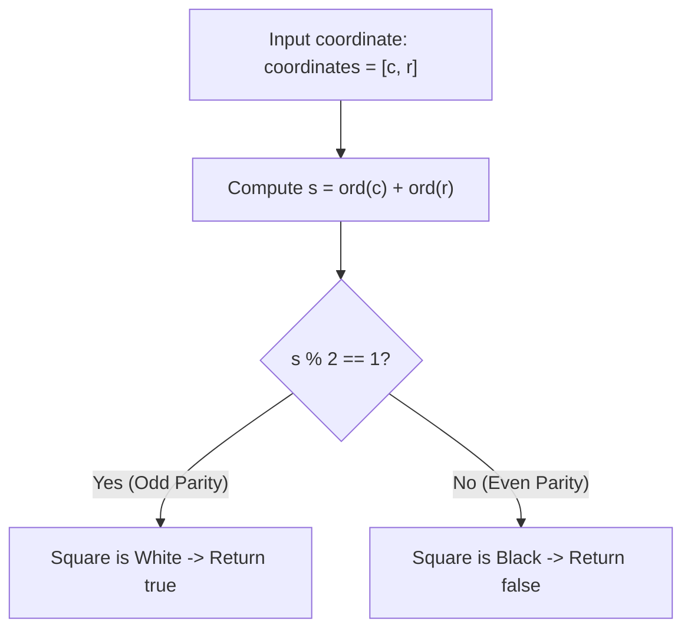

# Guided Example: Determine Color of a Chessboard Square

We trace the step-by-step arithmetic parity evaluation and bipartite chessboard coloring on a representative problem instance:

- **Input:** `coordinates = "a1"`
- **Required Output:** `false`

This instance features the canonical origin square of the standard chessboard, demonstrating how ASCII character code offsets preserve 2D grid parity and establish an exact constant-time decision rule.

---

## 1. Instance & Teaching Goal

We are given a string `coordinates` representing the 2-character coordinate of a square on a standard $8 \times 8$ chessboard (for example, `"a1"`).
- Columns (files) are labeled `'a'` through `'h'` from left to right.
- Rows (ranks) are labeled `'1'` through `'8'` from bottom to top.
- The square `"a1"` is colored **black**.
- Adjacent squares (horizontally or vertically) alternate between black and white.

We must return `true` if the square is **white**, and `false` if it is **black**.

A naive implementation might construct an $8 \times 8$ lookup grid or a pre-populated set of all $32$ white coordinates. The optimal approach uses the parity of the file and rank coordinates to evaluate square color in $\mathcal{O}(1)$ time without auxiliary structures.

---

## 2. Conceptual Foundation & Invariants

### Bipartite Grid Graph Parity

A standard chessboard is isomorphic to a 2D lattice graph where each cell is indexed by $(x, y) \in [0, 7] \times [0, 7]$:
- Let $x = \text{ord}(c) - \text{ord}(\text{'a'})$ be the 0-indexed column ($0$ for `'a'`, $1$ for `'b'`, ..., $7$ for `'h'`).
- Let $y = \text{ord}(r) - \text{ord}(\text{'1'})$ be the 0-indexed row ($0$ for `'1'`, $1$ for `'2'`, ..., $7$ for `'8'`).

At the bottom-left corner `"a1"`, $(x, y) = (0, 0)$ is colored black.
Every step of $1$ unit horizontally ($x \to x \pm 1$) or vertically ($y \to y \pm 1$) toggles the color. Therefore, the color of square $(x, y)$ is an invariant of the Manhattan parity $x + y \pmod 2$:
- If $x + y$ is even: color is **black** (`false`).
- If $x + y$ is odd: color is **white** (`true`).

### ASCII Parity Preservation Shortcut

> **Bipartite Chessboard Coloring & ASCII Parity Preservation Theorem.**
> Let $c$ be the column character and $r$ be the row character.
> The raw character codes in ASCII are:
> $$\text{ord}(c) = x + 97, \quad \text{ord}(r) = y + 49$$
> Summing the raw ASCII code points:
> $$\text{ord}(c) + \text{ord}(r) = x + y + (97 + 49) = x + y + 146$$
> Because $146$ is an even integer ($146 \equiv 0 \pmod 2$):
> $$(\text{ord}(c) + \text{ord}(r)) \equiv (x + y) \pmod 2$$
> The raw ASCII sum preserves the exact parity of the 0-indexed grid coordinates.
> Therefore, testing:
> $$(\text{ord}(c) + \text{ord}(r)) \pmod 2 == 1$$
> is necessary and sufficient to determine whether square $(c, r)$ is white.

---

## 3. Step-by-Step Worked Execution

We trace `coordinates = "a1"`.

---

### Step 1: Extract Characters
- File character: $c = \text{'a'}$.
- Rank character: $r = \text{'1'}$.

---

### Step 2: Retrieve ASCII Values
- ASCII value of `'a'`:
  $$\text{ord}(\text{'a'}) = 97$$
- ASCII value of `'1'`:
  $$\text{ord}(\text{'1'}) = 49$$

---

### Step 3: Compute Parity Sum
- Sum the ASCII values:
  $$\text{sum} = 97 + 49 = 146$$
- Evaluate modulo $2$:
  $$146 \pmod 2 = 0$$

---

### Step 4: Evaluate Whiteness Predicate
- Compare remainder with $1$:
  $$0 == 1 \implies \text{False}$$
- The square `"a1"` is black, so the return value is **`false`**.

---

## 4. Complete Execution Trace

| Coordinate Tested | Component Characters | ASCII Values | ASCII Sum | Parity ($\text{Sum} \pmod 2$) | Square Color | Emitted Result |
|:---:|:---:|:---:|:---:|:---:|:---:|:---:|
| `"a1"` | `'a'`, `'1'` | $97, 49$ | $146$ | $0$ (Even) | Black | **`false`** |
| `"h3"` (Contrast) | `'h'`, `'3'` | $104, 51$ | $155$ | $1$ (Odd) | White | `true` |
| `"c7"` (Contrast) | `'c'`, `'7'` | $99, 55$ | $154$ | $0$ (Even) | Black | `false` |

Final result for `"a1"`: **`false`**.

---

## 5. Algorithmic Correctness

**Soundness.** The chessboard coloring alternates on every single-step displacement. By mathematical induction, all squares with the same parity as `"a1"` share its color (black), and all squares with opposite parity are white. The parity sum strictly reflects this alternating checkerboard pattern.

**Completeness.** Every valid 2-character coordinate from `"a1"` to `"h8"` maps to an integer ASCII sum whose parity is well-defined. The parity check handles all $64$ squares uniformly without exception.

---

## 6. Traps This Instance Exposes

- **Flipping Parity Meaning:** Confusing which parity corresponds to black versus white. Checking `"a1"` as an anchor ($97 + 49 = 146$ is even $\to$ black $\to$ `false`) fixes the mapping unambiguously.
- **Manual Matrix Allocation:** Pre-allocating an $8 \times 8$ grid of booleans wastes code clarity and memory when a closed-form formula exists.
- **Diagonal Moves:** Moving diagonally changes both $x$ and $y$ by $1$, toggling the sum by $2$ and preserving parity (and thus preserving color), which correctly models same-color diagonals on a chessboard.

---

## 7. Complexity Derivation

- **Time Complexity:** $\mathcal{O}(1)$. Accesses two characters, performs two integer additions, one modulo, and one comparison. Execution time is strictly constant.
- **Auxiliary Space Complexity:** $\mathcal{O}(1)$. No auxiliary structures or heap allocations are created.
