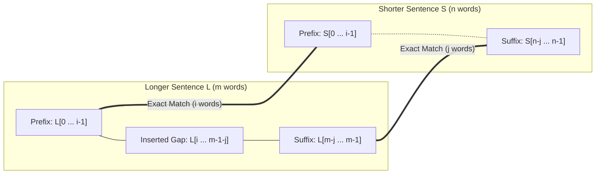

# Guided Example: Sentence Similarity III

We trace the step-by-step evaluation of sentence similarity via two-pointer affix alignment on a representative problem instance:

- **Input:** `sentence1 = "My name is Haley"`, `sentence2 = "My Haley"`
- **Required Output:** `true`

This instance demonstrates how inserting a contiguous block of words into a shorter sentence corresponds to partitioning the shorter sentence into a matching prefix and a matching suffix in the longer sentence.

---

## 1. Instance & Teaching Goal

We are given two strings `sentence1` and `sentence2`. Each string consists of words separated by single spaces without leading or trailing spaces.
A sentence $S_1$ is similar to a sentence $S_2$ if we can insert an arbitrary sentence (possibly empty) inside one of these sentences such that the two sentences become identical. The inserted sentence must be separated from existing words by spaces.

In our instance:
- `sentence1` has words: `["My", "name", "is", "Haley"]` ($m = 4$).
- `sentence2` has words: `["My", "Haley"]` ($n = 2$).

If we insert the sentence `"name is"` into `sentence2` between `"My"` and `"Haley"`, `sentence2` becomes identical to `sentence1`. Therefore, the required output is `true`.

The teaching goal is to recognize that an arbitrary insertion in the interior (or at either boundary) leaves the remaining words of the shorter sentence intact as an exact prefix and an exact suffix of the longer sentence. A simple greedy two-pointer scan over word tokens decides similarity in linear time without backtracking or edit-distance dynamic programming.

---

## 2. Conceptual Foundation & Invariants

### Tokenization & Length Normalization

First, tokenize both sentences by whitespace into lists of words:
- Let $W_1 = \text{words}(sentence1)$ and $W_2 = \text{words}(sentence2)$.
- Without loss of generality, let $L$ denote the longer word sequence of length $m$, and $S$ denote the shorter word sequence of length $n$, so that $m \ge n$. If $W_1$ is shorter than $W_2$, we swap their roles.

### Affix Coverage & Middle Gap Insertion Theorem

> **Affix Coverage & Middle Gap Insertion Theorem.**
> Let $S = [s_0, s_1, \dots, s_{n-1}]$ and $L = [l_0, l_1, \dots, l_{m-1}]$ with $n \le m$.
> A single sentence insertion can transform $S$ into $L$ if and only if there exist prefix length $i \ge 0$ and suffix length $j \ge 0$ such that:
> 1. Prefix equivalence: $s_k = l_k$ for all $0 \le k < i$.
> 2. Suffix equivalence: $s_{n-1-k} = l_{m-1-k}$ for all $0 \le k < j$.
> 3. Total affix coverage: $i + j \ge n$.
>
> When $i + j \ge n$, the words of $S$ are completely partitioned between the matching prefix and the matching suffix. The unmatched interval in $L$, namely $L[i \dots m - 1 - j]$, represents the single contiguous inserted sentence. If $i + j < n$, at least one word in $S$ cannot be accounted for by the prefix or suffix, requiring two or more disconnected modifications, which is impossible with a single insertion.

---

## 3. Step-by-Step Worked Execution

We trace the algorithm on `sentence1 = "My name is Haley"` and `sentence2 = "My Haley"`.

---

### Step 1: Tokenize and Normalize Roles

- Split `sentence1` into words:
  $$W_1 = [\text{"My"}, \text{"name"}, \text{"is"}, \text{"Haley"}], \quad |W_1| = 4$$
- Split `sentence2` into words:
  $$W_2 = [\text{"My"}, \text{"Haley"}], \quad |W_2| = 2$$
- Compare lengths: $|W_1| \ge |W_2|$, so:
  $$L = W_1, \quad m = 4$$
  $$S = W_2, \quad n = 2$$

---

### Step 2: Match Common Prefix Words

Initialize prefix index $i = 0$. While $i < n$ and $L[i] == S[i]$, increment $i$:
- Compare index $0$:
  $$L[0] = \text{"My"}, \quad S[0] = \text{"My"} \implies \text{Match! Increment } i \to 1$$
- Compare index $1$:
  $$L[1] = \text{"name"}, \quad S[1] = \text{"Haley"} \implies \text{Mismatch! Stop prefix scan.}$$

The maximal matching prefix has length $i = 1$. The matched word is `["My"]`.

---

### Step 3: Match Common Suffix Words

Initialize suffix index $j = 0$. While $j < n$ and $L[m - 1 - j] == S[n - 1 - j]$, increment $j$:
- Compare offset $j = 0$:
  $$L[4 - 1 - 0] = L[3] = \text{"Haley"}, \quad S[2 - 1 - 0] = S[1] = \text{"Haley"} \implies \text{Match! Increment } j \to 1$$
- Compare offset $j = 1$:
  $$L[4 - 1 - 1] = L[2] = \text{"is"}, \quad S[2 - 1 - 1] = S[0] = \text{"My"} \implies \text{Mismatch! Stop suffix scan.}$$

The maximal matching suffix has length $j = 1$. The matched word is `["Haley"]`.

---

### Step 4: Evaluate Affix Coverage

Check whether the combined prefix and suffix coverage spans the entire shorter sentence:
$$i + j = 1 + 1 = 2$$
$$n = 2$$
Because $i + j \ge n$ ($2 \ge 2$), all $2$ words of $S$ are covered by the prefix and suffix.
The middle slice of $L$ is from index $i = 1$ to $m - 1 - j = 4 - 1 - 1 = 2$, which contains words `["name", "is"]`.
Inserting `"name is"` into $S$ reproduces $L$ exactly.

Result: **`true`**.

---

## 4. Complete Execution Trace

| Phase / Pointer | Shorter Word Tested | Longer Word Tested | Comparison Outcome | Running Coverage |
|:---|:---|:---|:---|:---|
| Prefix ($i = 0$) | $S[0] = \text{"My"}$ | $L[0] = \text{"My"}$ | Match | $i = 1$ |
| Prefix ($i = 1$) | $S[1] = \text{"Haley"}$ | $L[1] = \text{"name"}$ | Mismatch (Stop Prefix) | $i = 1$ |
| Suffix ($j = 0$) | $S[1] = \text{"Haley"}$ | $L[3] = \text{"Haley"}$ | Match | $j = 1$ |
| Suffix ($j = 1$) | $S[0] = \text{"My"}$ | $L[2] = \text{"is"}$ | Mismatch (Stop Suffix) | $j = 1$ |
| **Coverage Test** | **Check: $i + j \ge n$** | **$1 + 1 = 2 \ge 2$** | **Condition Satisfied** | **Return `true`** |

---

## 5. Algorithmic Correctness

**Soundness.** Suppose $i + j \ge n$. If $i + j = n$, the first $i$ words of $S$ match $L[0 \dots i-1]$ and the remaining $n - i$ words of $S$ match $L[m - (n-i) \dots m-1]$. Inserting the contiguous slice $L[i \dots m - 1 - j]$ into $S$ yields $L$. If $i + j > n$, the matching prefix and suffix overlap in $S$, which means $S$ matches $L$ completely even if fewer than $j$ suffix words are taken (i.e., the inserted sentence in $L$ is empty or purely interior). Thus, the transformation is always valid.

**Completeness.** Suppose a single contiguous sentence insertion in $S$ produces $L$. Let the inserted words occupy indices $[p, q]$ in $L$. Then all words before $p$ in $L$ must match $S[0 \dots p-1]$ (so maximal prefix length $i \ge p$), and all words after $q$ in $L$ must match the trailing words of $S$ (so maximal suffix length $j \ge m - 1 - q$). Since the non-inserted words of $L$ account for all $n$ words of $S$, we have $p + (m - 1 - q) = n$. Because $i \ge p$ and $j \ge m - 1 - q$, we obtain $i + j \ge n$. No valid pair of similar sentences can fail this condition.

---

## 6. Traps This Instance Exposes

- **Character-Level vs. Word-Level Matching:** Matching prefixes and suffixes at the character level fails because an inserted sentence must be separated by whole words. For example, `"a"` and `"ab"` are not similar sentences because `"b"` is not a separate word.
- **Prefix and Suffix Overlap:** When $i + j > n$ (e.g. identical sentences where $i = n$ and $j = n$), the sum $i + j = 2n > n$. The condition must use $\ge n$ rather than $== n$ to avoid rejecting valid identical or partially overlapping affixes.
- **Role Symmetry:** The shorter sentence can be either `sentence1` or `sentence2`. Always normalizing so that $L$ is the longer sentence and $S$ is the shorter sentence eliminates redundant branches.
- **Disjoint Multiple Insertions:** If two separate words differ in the middle of $S$, both prefix and suffix will stop before covering $S$, correctly causing $i + j < n$ to return `false`.

---

## 7. Complexity Derivation

- **Time Complexity:** $\mathcal{O}(M + N)$, where $M$ is the character length of `sentence1` and $N$ is the character length of `sentence2`. Tokenizing takes $\mathcal{O}(M + N)$ time, and the two-pointer comparisons perform at most $\mathcal{O}(n)$ string equality checks, where each character of the words is compared at most twice.
- **Auxiliary Space Complexity:** $\mathcal{O}(M + N)$ to store the tokenized word lists $L$ and $S$.
